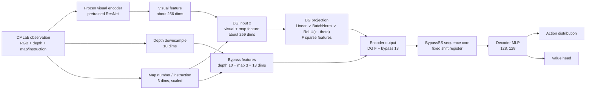
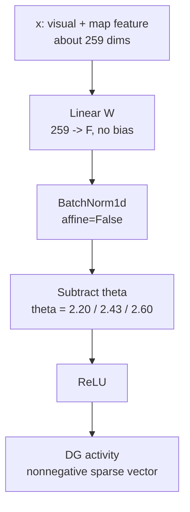
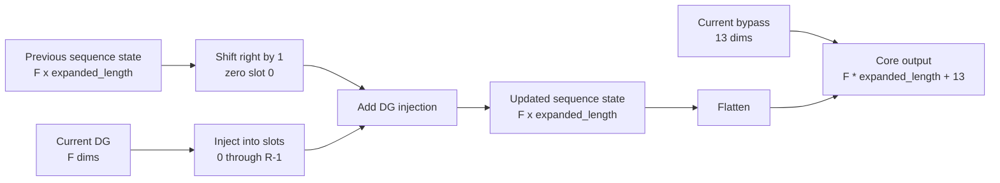
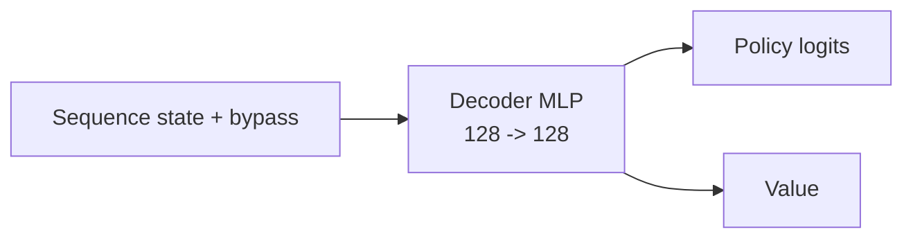
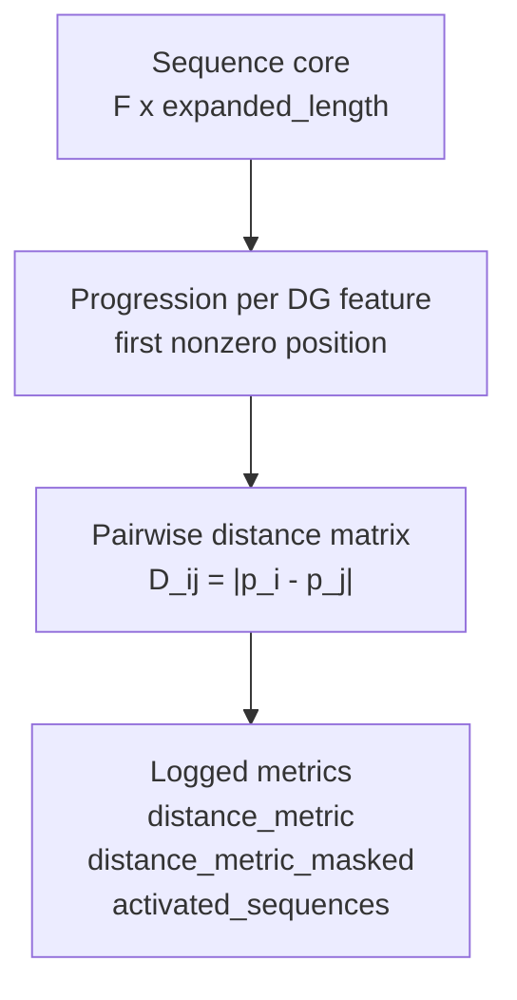
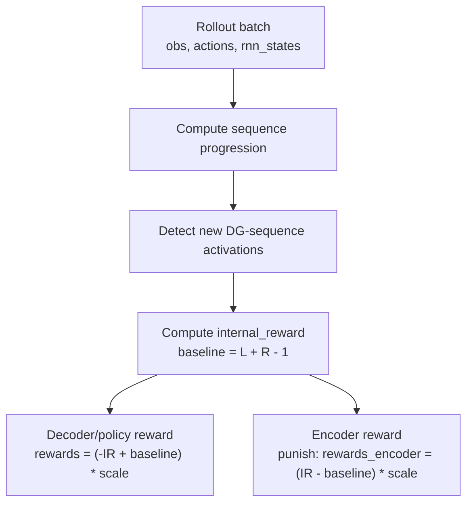
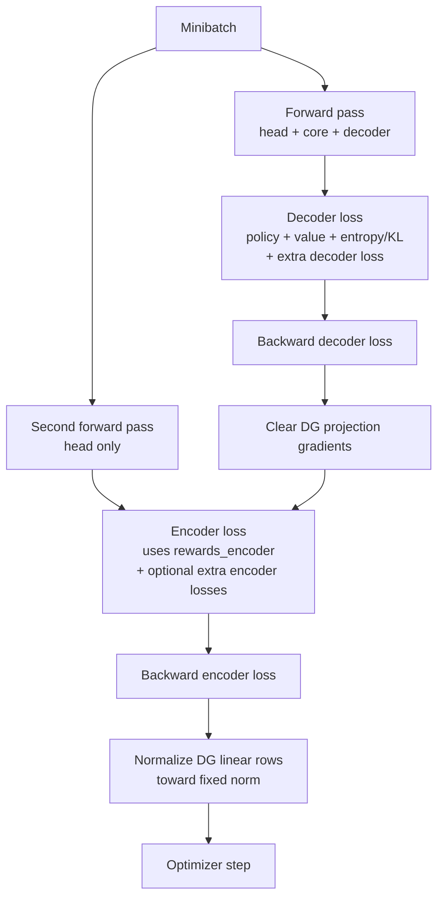

# Current HRL / HippoSLAM Architecture Summary

This note summarizes the HRL architecture used in the recent intrinsic-motivation architecture-search runs. It is based on the current Jannek/Sample Factory code path, especially:

- `sf_working_directories/jannek/dmlab/custom_encoder.py`
- `sf_working_directories/jannek/dmlab/custom_core.py`
- `sf_working_directories/jannek/dmlab/custom_decoder.py`
- `sf_working_directories/jannek/dmlab/custom_actor_critic.py`
- `sf_working_directories/jannek/dmlab/custom_learner.py`
- `sf_working_directories/jannek/dmlab/experiments/hrl_intrinsic_arch_search.py`

## Active Run Recipe

The current architecture-search runs use:

```text
Environment: openfield_map2_fixed_loc3_noreward
RL algorithm: APPO / PPO-style Sample Factory learner
Core: BypassSS
DG module: batchnorm_relu
Encoder reward method: punish
Distance learning: true
use_external: true
use_internal: false
extra_encoder_losses: true
Depth sensor: true
Visual encoder: pretrained ResNet, frozen
DG threshold theta: 2.20 / 2.43 / 2.60
DG features F: 8 / 16 / 32
Sequence length L: 32 / 64 / 128
R: default 8
```

The main candidate family currently being inspected is:

```text
F=16, L=128, theta=2.43
F=16, L=64, theta=2.60
F=16, L=64, theta=2.20
```

## High-Level Forward Pass



The core idea is that the encoder produces a sparse DG code, the sequence core converts sparse events into short temporal traces, and the policy/value decoder acts on the resulting sequence-reservoir state plus a small bypass vector.

## Encoder And DG Projection

The active DG module is `DGProjection_batchnorm_relu`.

For each observation:

```text
x = concat(frozen_visual_feature, map_number_feature)
z = Linear(x)                 # bias=False
z_bn = BatchNorm1d(z)         # affine=False
dg = ReLU(z_bn - theta)
```



Important implications:

- BatchNorm makes thresholding relative to each DG unit's batch-normalized projection.
- Higher `theta` makes DG events rarer.
- The visual encoder is frozen when loaded from the pretrained checkpoint, so DG learning mainly changes the projection directions over a fixed visual representation.
- The DG projection has no bias in the active module.
- The learned DG linear rows are explicitly renormalized toward fixed norm during training, so the main learned degree of freedom is rotation/direction rather than scale.

## Bypass Features

Because `core_name=BypassSS` and `depth_sensor=True`, the encoder appends bypass features after DG:

```text
bypass = concat(depth_downsample, map_number_feature)
depth_downsample: 10 dims
map_number_feature: 3 dims
bypass size: 13 dims
```

The sequence core processes only the first `F` DG dimensions recurrently. The bypass dimensions are carried through as current, non-sequence features.

## BypassSS Sequence Core

The active core is `SimpleSequenceWithBypassCore`, selected by `core_name=BypassSS`.

This is not a normal learned recurrent network. It is a fixed shift-register sequence memory. For each DG feature, it stores a temporal trace of length:

```text
expanded_length = R + L - 1
```

At each timestep:

```text
state = roll(state, +1)
state[:, 0] = 0
state[:, 0:R] += current_DG
```



Concrete dimensions:

```text
F=16, L=64, R=8:
expanded_length = 8 + 64 - 1 = 71
sequence core = 16 * 71 = 1136
bypass = 13
core output = 1149

F=16, L=128, R=8:
expanded_length = 8 + 128 - 1 = 135
sequence core = 16 * 135 = 2160
bypass = 13
core output = 2173
```

The current DG slice used for place-field plotting is:

```text
core[:, :hidden_len:expanded_length]
```

where:

```text
hidden_len = F * expanded_length
```

This extracts the first sequence slot for each DG feature.

## Decoder And Actor-Critic

The decoder is a small MLP:

```text
core_output -> MLP(128, 128) -> decoder_output
```

The standard shared-weight actor-critic is used for the current distance-learning runs because:

```text
distance_learning = true
double_value = false
actor_critic_share_weights = true
```



The double-value actor-critic exists in the code, but it is not active in the current architecture-search recipe.

## Sequence Distance Metric

The learner computes a progression value for each DG sequence feature from the sequence core:

```text
progression_i = first active position in the shift register
inactive_i = expanded_length
```

Then it builds a pairwise distance matrix:

```text
D_ij = |progression_i - progression_j|
```



The masked distance matrix only includes currently active sequences. Both full and masked metrics are logged.

## Internal Reward Construction

The active learner is `DistanceLearnerReward`.

During batch preparation, the learner reconstructs sequence progressions from stored recurrent states and detects new sequence activations:

```text
new_activation = progression == 0
previous progression for same feature was at least R
```

For each timestep, it computes an `internal_reward` from the minimum progression among active sequences, with a baseline:

```text
baseline = L + R - 1
```

The decoder/policy reward is:

```text
buff["rewards"] = (-internal_reward + baseline) * reward_scale
```

For the active encoder reward method:

```text
encoder_reward_method = punish
buff["rewards_encoder"] = (internal_reward - baseline) * reward_scale
```

This is the baseline-shifted "punishment" signal used to train the DG projection.



## Separate Decoder And Encoder Losses

`DistanceLearnerReward` uses two forward/backward paths:

1. A normal forward pass for policy/value/decoder learning.
2. A second head-only forward pass for encoder/DG projection learning.



The update order is important:

```text
decoder_loss.backward()
clear DG projection gradients
encoder_loss.backward()
normalize DG projection linear rows
optimizer.step()
```

So the policy/decoder and DG projection receive related but separated learning signals.

## Extra Encoder Losses

The current run uses:

```text
extra_encoder_losses = true
```

The code supports several auxiliary encoder losses:

```text
encoder_multi_activation_loss
encoder_unused_sequence_loss
encoder_batch_loss
```

In the current launch recipe, `extra_encoder_losses=True`, but the individual extra-loss flags are not explicitly enabled in the copied arch-search script. Therefore the main active encoder signal is the `rewards_encoder` punishment term unless defaults elsewhere enable those sub-losses.

## What Learns And What Is Fixed

Mostly fixed:

```text
Pretrained visual ResNet, because fix_encoder_when_load=True
BypassSS sequence dynamics
Depth downsampling path
Map-number encoding
```

Learned or updated:

```text
DG projection weights
DG BatchNorm running statistics
Decoder MLP
Policy head
Value head
Possibly other non-frozen actor-critic parameters
```

The DG linear rows are renormalized after encoder backpropagation:

```text
for each DG row w:
    w <- w / ||w||
```

Thus DG learning is closer to learning directions/rotations in the frozen encoder space than learning arbitrary scaling.

## Current Observed Failure Mode

Recent DG place-field analysis suggests that the current evaluated checkpoints have a severe sparse-activation problem.

For the partial 10k evaluation of:

```text
F=16, L=128, theta=2.43
```

we observed:

```text
10001 frames
318 / 361 spatial bins visited
only 1 current-DG event total across all 16 DG units
```

This implies:

- The policy can cover much of the map given enough rollout time.
- But current DG activity is nearly absent.
- Place-field maps are therefore not reliable place fields; most units simply never fire.
- Sparse or collapsed DG activity may also weaken the sequence-reservoir intrinsic signal.

## Interpretation

The current architecture is best understood as:

```text
Frozen visual representation
-> learnable fixed-norm DG projection with BatchNorm thresholding
-> fixed temporal sequence reservoir
-> policy/value decoder
-> separated decoder and DG-projection learning signals
```

The intended computation is landmark/sequence discovery through temporally separated sparse DG activations. The main practical issue in the current runs is that thresholded DG activity appears too rare or collapses during training/evaluation, so the sequence reservoir has very little current input to work with.

