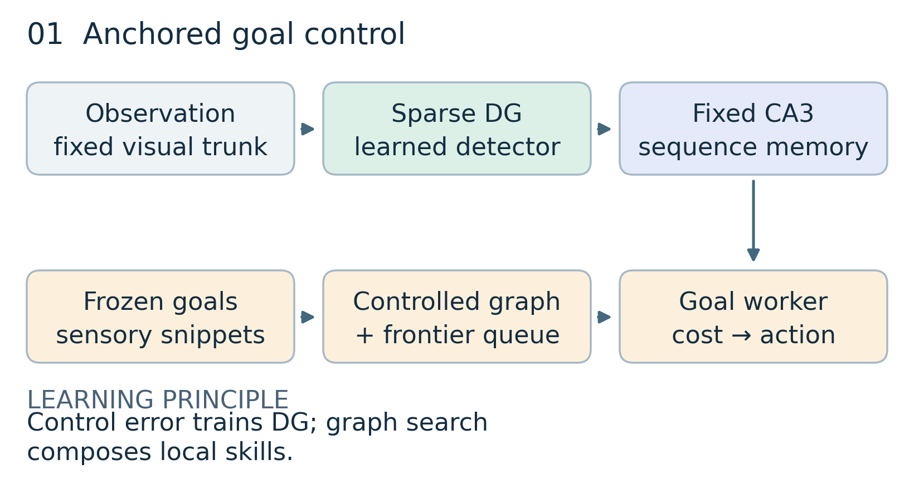
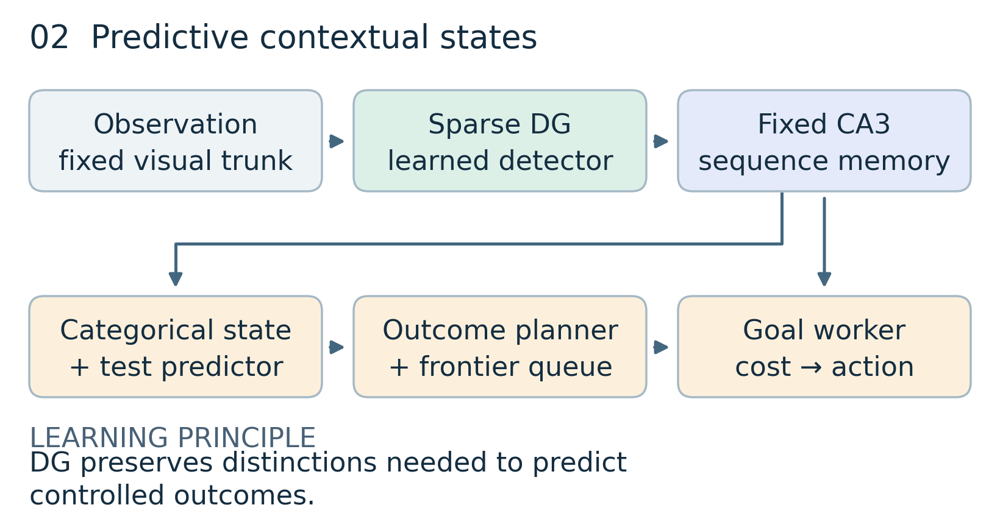
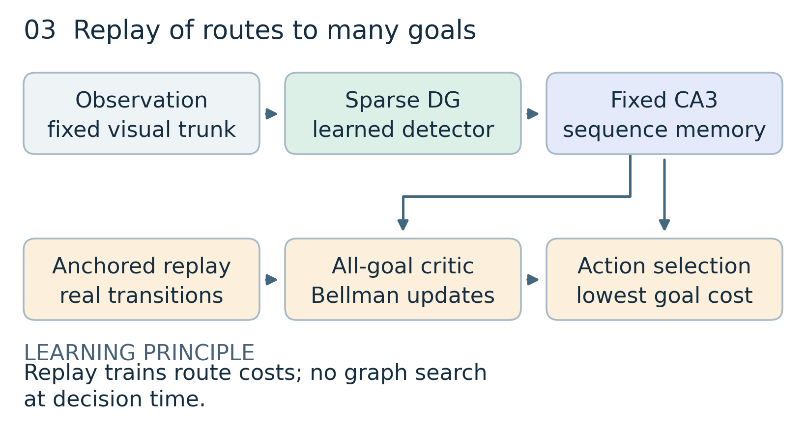
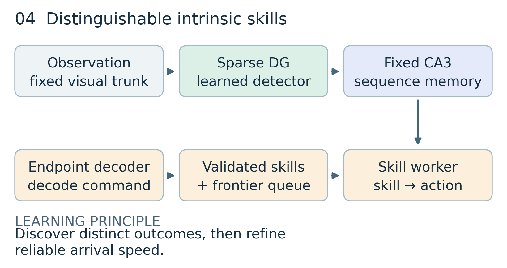
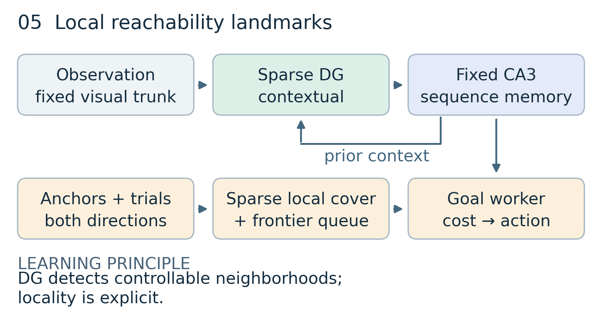

# Five designs for representation, control, and exploration

9 September 2026 · Literature-grounded proposals · No simulations performed

**Recommendation:** use **Plan 1** as the minimal reference and **Plan 2** as the leading general design. **Plan 3** tests a stronger replay account, **Plan 4** tests skill discovery, and **Plan 5** most directly encourages localized landmark fields. These are alternatives, not five modules to combine.

**Scope:** each plan specifies a complete route from sensory experience to representation, efficient goal control, and continued exploration. None has an established guarantee of producing mono-field DG units from pixels. Below, **evidence** means a published result; **proposal** means our adaptation; **prediction** means an untested consequence.

**Reading route:** scan the comparison table, then read the plan matching the suspected failure. Each diagram summarizes functional dependencies; learning gradients and reference-label boundaries are specified in the adjacent equations and text.

## The goal and its nontrivial meaning

> Learn a compact, reusable DG–CA3 representation that recognizes behaviorally distinct situations, supports reliable and efficient travel to independently specified destinations, and expands the agent's known reachable world through its own actions.

| Requirement            | What counts                                                                                                                             | What does not count                                                                                      |
| ---------------------- | --------------------------------------------------------------------------------------------------------------------------------------- | -------------------------------------------------------------------------------------------------------- |
| Spatial representation | Reproducible fields; high spatial information; broad collective support; little unnecessary duplication; sufficient population identity | Silence, rare spikes, many labels for one place, or localized maps caused solely by restricted occupancy |
| Controllability        | High arrival probability across starts and approaches, with low travel cost                                                             | Any-event activation, fastest successful trial alone, or an easy two-node loop                           |
| Exploration            | Discover new regions and connections; preserve opportunities to expand; learn to revisit where possible                                 | Repeated familiar tours, episode-reset novelty, or sensory noise                                         |
| Minimality             | Fixed budgets for DG units, memory, stored anchors, and computation                                                                     | One fresh state per frame or an ever-growing history lookup                                              |

Interpret “no nearby neighbors” as **no unnecessary local duplication**. Nearby junctions may need different codes; places across a wall can be close physically and distant behaviorally. Mono-fields are an explicit scientific target, especially when one unit means one destination, but not a universal definition of physiological validity. Multiple fields have been recorded across DG, CA3, and CA1 in larger environments. [Park et al., 2011](https://pmc.ncbi.nlm.nih.gov/articles/PMC3137630/)

No agent can disambiguate situations that produce identical evidence under all available experiments. A fixed finite CA3 trace also cannot preserve arbitrarily old context. The intended domain therefore has distinguishable, sufficiently recurrent situations and learnable actions; return is required only where dynamics permit it. A one-way transition remains directed.

## Shared contract: compare mechanisms, not changing definitions

### Sensory backbone and notation

For Plans 1–4:

$$
x_t=V(o_t),\qquad
z_t=\left[\operatorname{BN}(W_\theta x_t)-b\right]_+,
\qquad h_t=Ah_{t-1}+Bz_t.
$$

$V$ is the fixed ImageNet-pretrained ResNet-18 trunk through layer 2. DG projection weights and BatchNorm statistics adapt; $A,B$ are the fixed CA3 shift/injection operators. The threshold $b$ and number of DG units specify the baseline sparsity/capacity budget. The control state is **DG-derived memory $h_t$**, without a raw-visual bypass. Plan 5 explicitly changes the DG detector.

The agent observes $o_t$ and its own action $a_t$; it receives no coordinates, rotation, map, or simulator state. $g$ is a destination identifier, $u$ a commanded behavior, $H$ a decision horizon, and $\eta_t$ an observation–action history. Workers may also receive the remaining decision budget, suppressed in policy notation below; this is an internal clock, not privileged state. Neural activity and outcome-probability vectors are allowed; their Euclidean distances are never assumed to be global spatial distances.

This preserves the architectural lineage of sparse sensory input plus fixed sequences. Lin et al. demonstrate its utility and emergent spatial tuning for rewarded navigation; arbitrary endogenous goals and persistent exploration remain extensions. [Lin, Yiu & Leibold, v3](https://arxiv.org/html/2510.09951v3)

### Stable destinations and the bootstrap problem

Maintain a bounded archive of encountered sensory snippets. A goal has a **versioned recognition predicate** $\chi_g(\eta_t)\in\{0,1\}$, independent of the currently optimized DG encoder. Initially use frozen visual descriptors and snippet matching to propose encounters; never treat descriptor similarity as navigation distance. Mark an encounter ambiguous if revisits or controlled consequences conflict. Contextual snippets may distinguish aliased images.

Freeze the reference predicates during each learning interval. Keep a small permanent panel for longitudinal assessment. When references change, re-encode stored histories, relabel outcomes, and revalidate affected skills/edges; changing BatchNorm statistics also changes identity. A stopped gradient alone does not freeze labels across updates.

**Limitation:** this is a concrete bootstrap protocol, not a perfect place recognizer. View invariance and perceptual aliasing must be evaluated. Rejecting ambiguous anchors can leave coverage gaps; those gaps remain failures to explain, not grounds to remove difficult locations from evaluation. A task requiring more distinguishable destinations than the fixed archive can hold needs a stated coarser resolution or a larger budget.

### Reliable first arrival, then speed

Let $T_g$ be first verified arrival, $\bar T_g=\min(T_g,H)$, and $F_g=\mathbf1\{T_g>H\}$. The control objective, applied across a fixed broad distribution of start–goal pairs, is

$$
\min_\pi\;\mathbb E[\bar T_g]
\quad\text{subject to}\quad
\Pr(F_g=1)\leq\delta.
$$

A practical loss uses a nonnegative dual variable:

$$
J_\lambda=\mathbb E[\bar T_g+\lambda F_g]-\lambda\delta,
\qquad
\lambda\leftarrow[\lambda+\alpha_\lambda(\widehat{\Pr}(F_g)-\delta)]_+.
$$

Use a cost of one per decision and a terminal failure cost $\lambda$; arrival terminates the goal attempt. Enforce/report reliability by start–goal strata, since an aggregate can conceal hard destinations. Neural optimization need not solve this constrained problem exactly. An infeasible reliability target must be reported, not hidden by a large multiplier.

### Persistent exploration shared by all plans

Keep a persistent queue of recognized situations and insufficiently tested behaviors. Repeatedly **return → probe → recognize outcome → update archive**. Rotate access fairly among reachable entries instead of repeatedly choosing the cheapest goal. Start with primitive actions and sampled action sequences; include longer probes as the interaction budget grows. A fixed one-step vocabulary cannot discover every multi-step opportunity.

Define the operational expansion measure

$$
\mathcal R_t=\{g:\text{arrival and, where feasible, revisit are validated by time }t\},
\qquad G_t=|\mathcal R_{t+1}\setminus\mathcal R_t|.
$$

This is an internal bookkeeping measure; external regional coverage checks whether the archive is merely splitting familiar scenes. Keep transition discoveries as well as destination discoveries: a new shortcut matters even when both endpoints are familiar. Novelty does not reset each episode. Failed attempts remain evidence about feasibility and controller competence, not permanent proof that a frontier does not exist.

The return-and-explore principle has strong algorithmic precedent. Use policy-based return, not simulator restoration. Fair scheduling supports continued attempts under finite, recognizable, recurrent conditions; it supplies neither a finite-budget coverage guarantee nor an optimal exploration rate. [Ecoffet et al., 2021](https://arxiv.org/abs/2004.12919)

## At a glance

| Plan                                    | What shapes representation?              | How routes are selected            | Added machinery                      | Main scientific question                            |
| --------------------------------------- | ---------------------------------------- | ---------------------------------- | ------------------------------------ | --------------------------------------------------- |
| **1. Anchored goal control**            | Goal success and time cost               | Controlled transition graph        | Goal readout + sparse graph          | Is diverse intrinsic control enough?                |
| **2. Predictive contextual states**     | Consequences of the same intervention    | Outcome model on compressed states | Categorical abstraction + predictor  | Which ambiguities must be separated?                |
| **3. Replay of routes to many goals**   | Bellman errors across goals              | Cached all-goal action costs       | Replay + multi-goal critic           | Can experience teach unexecuted route combinations? |
| **4. Distinguishable intrinsic skills** | Command-to-outcome information           | Graph of learned options           | Skill head + outcome decoder         | Can diverse reliable outcomes bootstrap landmarks?  |
| **5. Local reachability landmarks**     | Membership in controllable neighborhoods | Anchor graph + local worker        | Reachability detector + sparse cover | Does action-defined locality produce better fields? |

All five use a global **relational memory**, not a global geometric embedding. None requires a local geometric embedding either. Plans 2 and 5 permit categorical/contextual locality; probability comparisons do not imply a Euclidean map.

## Plan 1 — Anchored goal control

**Core failure addressed:** maximizing transitions to any event rewards easy loops and lets the encoder redefine success.

**Architecture.** Preserve sensory DG and fixed CA3. Add a goal-conditioned worker $\pi_\phi(a\mid h,g)$ and critic. The manager stores directed option outcomes over stable anchors; a graph node includes arrival context when the outgoing worker is not approach-invariant. Goals condition the worker, not DG identity.

**Learning.** Train actor and critic on the shared first-arrival cost. In policy-gradient notation, with cost advantage $\widehat A_t^c$,

$$
\nabla_{\theta,\phi}J_\lambda
=\mathbb E\!\left[\sum_t\widehat A_t^c
\nabla_{\theta,\phi}\log\pi_\phi(a_t\mid h_t,g)\right].
$$

Use recurrent trajectory segments so gradients can reach earlier DG injections through the fixed dynamics. Goal predicates are detached/frozen. Value fitting is a training aid; neither a field-shape loss nor an event-spacing reward is required in this plan.

For controlled option $u$ from node $i$, store $\widehat P(j,\Delta\mid i,u)$ over termination context $j$ and duration $\Delta$, including failures. With $b$ decisions remaining, compute

$$
D_b(i,g)=\min_u\mathbb E_{\widehat P}
\left[\Delta+D_{b-\Delta}(j,g)\right],
\quad D_b(g,g)=0,\quad D_0(i\ne g,g)=\lambda.
$$

Cap each option by remaining budget; terminal failures enter the boundary cost. The backup assumes the node captures the context needed by outgoing options. A reliable near-deterministic graph reduces this to ordinary shortest-path search; raw observation adjacency is insufficient.

**Exploration.** Use the persistent return-and-probe queue. Its return phase uses $D_b$; its probe phase can try outcomes outside the existing goal vocabulary. A local hole is acceptable, but its unresolved queue entry is retained.

**Why the three goals could improve.** Diverse anchored goals create pressure to distinguish useful places; positive travel costs discourage detours; the persistent queue separates outward probing from navigation to known targets. Graph search can compose reliable local skills. This last principle is established in image-based navigation. [Eysenbach et al., 2019](https://arxiv.org/abs/1906.05253)

**Concrete development order:** establish reference predicates and broad goal sampling; train the worker; record all option outcomes; validate mixed-approach chains; enable graph routing and frontier return. Start with one DG unit per landmark only if independent recognition supports that interpretation.

**Falsifier and limitation.** If varied goals improve behavior while matched-exposure DG maps remain fragmented, direct control has not explained mono-fields. A contextual node may rescue control without rescuing individual DG localization. Reward-driven field reorganization has precedent, but a model starting with Gaussian fields does not establish emergence from images. [Kumar et al., 2025](https://proceedings.mlr.press/v267/kumar25a.html)

## Plan 2 — Predictive contextual states

**Core failure addressed:** visually similar events merge situations requiring different actions; adding more control reward cannot resolve an informational collision.

**Architecture.** Keep sensory DG and fixed CA3. Add a categorical code $q_\omega(c\mid h)$ with at most $K$ states and an intervention-conditioned outcome model $p_\psi(Y\mid c,u)$. The planner uses $c$; the local worker still receives $h$. Train $c$ to predict stable anchor identity and multi-step outcomes, including durations and timeout. Do not cluster by neural Euclidean distance.

**Learning.** In a learning interval, fix the intervention policies and external-to-the-encoder outcome vocabulary. For example, $Y$ can be the stable terminal anchor plus duration bin, or a sequence of such outcomes. Minimize

$$
\mathcal L_2
=\mathbb E_{h,u,Y}\mathbb E_{c\sim q_\omega}
[-\log p_\psi(Y\mid c,u)]
+\beta\,\mathbb E_h D_{\mathrm{KL}}
\left(q_\omega(c\mid h)\Vert\bar q(c)\right),
\quad \bar q(c)=\mathbb E_hq_\omega(c\mid h).
$$

The second term is $I(C;H)$ for the sampled finite-data distribution: compress contextual identity while retaining predictive accuracy. Include immediate anchor recognition as a zero-action test; otherwise reward-free transition structure can merge all states. Select compression subject to held-out recognition/control error, rather than rewarding low entropy by itself. Categorical expectations are enumerable for small $K$.

Both this objective and goal-control learning update DG; prediction and abstraction heads are learned, CA3 dynamics remain fixed. There is no loss gradient through reference labels. Sample interventions across matched reference contexts; if commands are confounded with hidden starts, an observed conditional distribution is not a causal effect.

An interpretable merge diagnostic is

$$
d_{\mathrm{test}}(h,h')
=\sum_u\rho(u)\operatorname{JS}
\left(P(Y\mid h,\operatorname{do}(u)),
P(Y\mid h',\operatorname{do}(u))\right).
$$

This compares action consequences without a global metric. Finite tests approximate predictive equivalence; they do not establish full bisimulation or optimal-control sufficiency.

**Control and exploration.** Fit a joint option model $p_\psi(c',Y,\Delta\mid c,u)$ for planning, freezing categorical assignments within each fitting interval and retaining the anchored-outcome loss above. Use the Plan 1 duration-aware backup on $c$, retaining conditional arrival distributions. For frontier probes, the predictor can replace count ordering with expected information gain about model parameters $\Psi$:

$$
\operatorname{IG}(c,u)=\mathbb E_Y
D_{\mathrm{KL}}\left[p(\Psi\mid\mathcal D,c,u,Y)\Vert p(\Psi\mid\mathcal D)\right].
$$

A categorical table with a Dirichlet prior is the minimal uncertainty model. Keep fair access to unresolved entries; information gain alone may spend the budget refining one stochastic region. Evaluate uncertainty with fixed codes and controller versions.

**Concrete development order:** fix a small test vocabulary; fit categorical states from CA3 histories; inspect conflicting consequences; increase test length only for demonstrated delayed ambiguity; validate route composition; then use predicted uncertainty to order probes.

**Evidence and boundary.** Predictive-state theory grounds state in action-conditional future observations. Information bottlenecks supply the compression principle. Our finite code and fixed CA3 are adaptations without their general guarantees. [Littman et al., 2001](https://proceedings.neurips.cc/paper/2001/file/1e4d36177d71bbb3558e43af9577d70e-Paper.pdf), [Pacelli & Majumdar, 2020](https://arxiv.org/abs/2002.01428)

**Falsifier and limitation.** If one categorical state hides different mixed-approach outcomes, the test vocabulary is insufficient. If the required distinction has already vanished from $h$, the abstraction cannot restore it. This plan may yield coherent population landmarks while DG units remain multi-field; that is functional progress, not full representational success.

## Plan 3 — Replay of routes to many goals

**Core failure addressed:** a policy's observed wandering time is mistaken for environmental distance, and each new goal requires relearning familiar route segments.

**Architecture.** Preserve DG–CA3 and add a shared critic $Q_\psi(h,a,g,b)$ predicting remaining first-arrival cost for each goal and time budget. Store actual observation/action snippets, reference successes, and sufficient burn-in history to reconstruct CA3. A controller chooses the lowest-cost primitive action; a policy head may be distilled later but is not necessary.

**Learning and control.** For $b\geq1$, use the finite-horizon Bellman target

$$
y_{g,b}=1+\left[1-\chi_g(\eta_{t+1})\right]
\min_{a'}Q_{\bar\psi}(h_{t+1},a',g,b-1),
\qquad Q(h,a,g,0)=\lambda\ \text{if not at }g.
$$

Already-achieved goals terminate before another action. $\bar\psi$ denotes a lagged target critic. Train

$$
\mathcal L_3=\mathbb E_{\mathcal D,g,b}
\left(Q_\psi(h_t,a_t,g,b)-\operatorname{sg}(y_{g,b})\right)^2,
\qquad
a_t\in\arg\min_aQ_\psi(h_t,a,g,b).
$$

Replay one real transition against multiple anchored goals. Backpropagate into the DG projection using reconstructed histories; do not invent unobserved transitions. Update $\lambda$ using measured failure as in the shared contract. Conservative action coverage is essential: a neural critic can assign unrealistically low cost to untried actions.

This learns routes by value propagation rather than running an explicit graph search at decision time. In a fully observed, finite, sufficiently sampled model, the finite-horizon recursion is dynamic programming. Its transfer to partially observed neural $h$ is a hypothesis, not a convergence theorem.

**Exploration.** The persistent queue chooses where to return; the multi-goal critic supplies return behavior. Replay spreads information about newly discovered shortcuts to other goals. It does not create experience beyond the frontier, so physical probes remain essential. Begin with balanced replay over goals and stored segments; introduce prioritized replay only if a measured computation bottleneck warrants it.

**Why this is distinct.** Plan 1 learns a worker and performs route search over controlled edges. Plan 3 learns the route costs directly in a CA3 readout and uses replay to propagate them across goals. A successor map under one fixed policy would instead reproduce that policy's occupancy and may preserve loops; maximization/minimization across actions is the crucial difference.

**Evidence.** Predictive hippocampal maps motivate successor-like readouts; replay theory links memory access to useful value updates. The closest precedent is the geodesic representation, a collection of goal-specific action values addressing possible future goals. Our finite-horizon cost form is an adaptation. [Stachenfeld et al., 2017](https://pubmed.ncbi.nlm.nih.gov/28967910/), [Mattar & Daw, 2018](https://pubmed.ncbi.nlm.nih.gov/30349103/), [Sagiv et al., 2025](https://pubmed.ncbi.nlm.nih.gov/41151586/)

**Concrete development order:** fix references; implement recurrent cost replay; verify analytic chain and fork backups; use balanced multi-goal updates; inspect goal switching and shortcut propagation; enable frontier return.

**Falsifier and limitation.** If shuffled or shortened CA3 histories leave control unchanged, the sequence backbone has not demonstrated a functional contribution. Broad goal costs may shape useful sensory distinctions, but do not uniquely specify mono-field DG units. Learned associative readouts and replay are additions; the fixed shift register itself is not a prospective planner.

## Plan 4 — Distinguishable intrinsic skills

**Core failure addressed:** named goals presuppose useful destinations, while random probing may fail to discover reproducible alternatives.

**Architecture.** Keep DG–CA3; replace the initial goal head with a discrete skill-conditioned worker $\pi_\phi(a\mid h,k)$, $k\in\{1,\ldots,K_s\}$. Add a decoder $q_\nu(k\mid Y,c)$, where $c$ is the recognized start context and $Y$ is an independently recognized endpoint. Skill codes are categorical, not coordinates.

**Discovery.** Sample skills from a fixed balanced prior $\rho(k\mid c)$. Maximize a variational lower bound on command-to-outcome information:

$$
J_{\mathrm{skill}}
=\mathbb E\left[
\log q_\nu(k\mid Y,c)-\log\rho(k\mid c)
\right]\leq I(K;Y\mid C).
$$

Give this score at a fixed discovery horizon. The decoder sees only the reference endpoint and start context—not the skill input or the command-carrying live hidden state. Otherwise it could decode a stored command without the world changing. Train DG through the skill policy gradient; train the decoder by classification. Keep $Y$ fixed during the interval.

With balanced interventions, random endpoints independent of $k$ and a universal endpoint both give zero mutual information. But rotations, switch toggles, or distinct nuisance outcomes can still yield high information. The outcome vocabulary and spatial evaluation determine whether discovery is useful for navigation.

**Efficient goal control.** Estimate the skill channel

$$
P(Y=j,\Delta\mid c,k).
$$

Map a requested destination to skills through this channel, not by equating skill number with destination number. After identifying a reliable endpoint for a skill, freeze that endpoint and refine the skill with the shared first-arrival/time objective. This separates skill discovery from time minimization and avoids adding competing rewards to every update. Skills without stable endpoints remain probes, not graph edges.

**Exploration.** Use learned skills as temporally extended probes in the persistent queue, retaining primitive probes for gaps between skills. Return uses the validated skill graph and Plan 1's cost backup. Empowerment is not the manager's sole reward: a highly controllable familiar room must not suppress investigation of its exit.

**Evidence.** Variational Intrinsic Control explicitly learns options distinguished by termination outcomes. Recent empowerment work provides a control-centered representation account. Neither establishes continued spatial coverage or DG mono-fields in this architecture. [Gregor et al., 2016](https://arxiv.org/abs/1611.07507), [Bastankhah et al., 2026](https://arxiv.org/abs/2605.30656)

**Concrete development order:** fixed reference outcomes and matched starts; discrete skill discovery; inspect the full command–endpoint confusion matrix; assign stable endpoints; refine arrival speed; validate chains; use skills to probe new contexts.

**Falsifier and limitation.** High skill information with no increase in independently measured reachable regions refutes the proposed exploration benefit. This plan addresses the behavioral bootstrap more directly than Plan 1, but adds a skill decoder and has the weakest direct pressure toward mono-field sensory units.

## Plan 5 — Local reachability landmarks

**Core failure addressed:** visual similarity does not ensure a coherent local place, while global repulsion can waste units or separate useful neighbors.

**Architecture.** Keep the fixed visual trunk and fixed CA3 register, but explicitly replace sensory-only DG projection with a competitive landmark detector. Each unit is tied to a stable anchor $e_i$. Its input is current visual features and prior CA3 context, $\xi_t=(x_t,h_{t-1})$. The policy still receives only the resulting $h_t$ and goal. This goal-independent feedback path is a substantive change from Lin's baseline.

**Locality from control.** Under a specified frozen local worker, learn directed first-hit probability

$$
R_\omega(\xi,e;H_\ell)
\approx\Pr(T_e\leq H_\ell\mid\xi,\pi_{\mathrm{local}}).
$$

Use both directions to define a local reversible neighborhood:

$$
w_i(\xi)=\min\{R_\omega(\xi,e_i;H_\ell),
R_\omega(e_i,\xi;H_\ell)\},
\qquad
z_i(\xi)=[w_i(\xi)-\tau]_+
\mathbf1\{i\in\operatorname{TopK}_{k_a}w(\xi)\}.
$$

The reverse probability requires an actual trial toward a stored snippet representing $\xi$, not reversing a video. If it is untested, label membership unknown rather than zero. One-way transitions remain directed graph edges between neighborhoods; reciprocal membership is not imposed on the whole environment. $H_\ell$ defines resolution, $\tau$ defines reliability, and $k_a$ defines activity capacity—three explicit meanings, not arbitrary field-shaping terms.

**Learning.** Fit $R_\omega$ with binary cross-entropy on all attempted local goals, including horizon failures. During detector fitting, freeze reference snippets, controller, and reference CA3 histories. Distill neighborhood memberships into the live contextual DG detector, then train its worker with the shared arrival cost. Recompute histories and recalibrate after each alternating update; do not simultaneously relabel membership to follow the live policy's failures.

Choose a sparse anchor cover on a bounded, episode-stratified archive $\mathcal D_{\mathrm{ref}}$:

$$
\min_{\mathcal A}|\mathcal A|
\quad\text{subject to}\quad
\frac{1}{|\mathcal D_{\mathrm{ref}}|}
\sum_{\xi\in\mathcal D_{\mathrm{ref}}}
\mathbf1\{\max_{i\in\mathcal A}w_i(\xi)\geq\tau\}
\geq1-\epsilon,\quad |\mathcal A|\leq K.
$$

Approximate by greedily adding the candidate covering the most uncovered archive encounters, then remove an anchor only if the same coverage bound survives. Report infeasibility at budget $K$. Preserve region/episode diversity in the archive; occupancy weighting alone would concentrate landmarks on familiar routes.

**Control and exploration.** Use anchor-targeted local workers and the duration-aware graph backup. Large uncovered neighborhoods propose new anchors; persistent frontier probes reach beyond existing neighborhoods. Controller failures must be separated from genuine new places before recruitment.

**Why fields could localize.** A short reliable reachability neighborhood is a control-defined region around an anchor. Sparse cover discourages duplicate neighborhoods while extending support. In an ordinary locally connected maze this is a stronger locality bias than generic control or prediction; headings, obstacles, portals, and arrival context can still produce fragmented physical maps. No mathematical mono-field guarantee follows.

**Evidence.** Reachability-based episodic curiosity grounds novelty in temporal accessibility; topological memory supports navigation through stored observations. Reciprocal controlled membership and sparse DG cover are our synthesis, not results established by these papers. [Savinov et al., 2019](https://arxiv.org/abs/1810.02274), [Savinov, Dosovitskiy & Koltun, 2018](https://arxiv.org/abs/1803.00653)

**Concrete development order:** bootstrap nearby snippet goals; freeze/calibrate a local worker; estimate reciprocal memberships; fit a bounded cover and contextual DG; validate cross-approach fields; alternate control refinement and cover updates.

**Falsifier and limitation.** If fields become cleaner only because locality is explicitly prescribed, the result is an engineered control basis rather than an explanation of spontaneous field emergence. If memberships change primarily with controller competence, they are not stable place identities. This plan is the strongest locality intervention and the largest departure from the original sensory DG.

## What can be established without simulation?

| Paper-and-pencil case | Required conclusion | Most directly challenges |
|---|---|---|
| Two-loop route, each edge costs one | Repeated turns increase fixed-goal cost; event-rate reward alone cannot exclude the loop | 1, 3 |
| Two identical views with distinct retained histories | A contextual model may separate them; sensory-only DG need not | 1, 2, 5 |
| Identical retained CA3 states requiring opposite actions | No readout can solve both; change evidence or memory | All |
| Doorway reached from opposite headings | Verify the output of one skill lies in the initiation conditions of the next | All |
| Goal detector expands around current behavior | Freeze outcome meaning; stopped gradient alone is insufficient | All |
| Familiar room with many controllable outcomes | Empowerment can remain high while outward exploration fails | 4 |
| Close anchors on opposite sides of a wall | Physical repulsion is inappropriate; transition cost should distinguish them | 2, 5 |
| Repeated activation of a goal | First-hit termination prevents collecting repeated success reward | 1, 3, 4 |
| Long hidden action sequence opens a passage | A fixed short-probe vocabulary is incomplete | All |

These deductions reject trivial solutions. They do not prove learning speed, field formation, or exploration efficiency.

## Decision and eventual evidence

**Start with Plan 1 to isolate the claim that diversified, stable control demands shape DG. Prefer Plan 2 if contextual ambiguity is the central causal failure.** Plan 3 is the clearest replay study; Plan 4 is useful if reproducible behaviors fail to bootstrap; Plan 5 is justified if locality itself must become an explicit experimental factor. Do not add all five losses to one encoder.

For every plan, eventual success requires the following joint evidence; this is an evaluation contract, not a new run matrix:

| Axis | Evidence needed |
|---|---|
| Representation | Common observation/action replay and memory initialization; mono-field fraction with eligible/silent counts; pre-threshold maps; spatial information; active-map overlap; coverage of field support |
| Goal control | Fixed independently recognized targets; varied starts/headings/histories; full success matrix; all-attempt cost; physical route efficiency assessed separately from information-limited efficiency |
| Composition | Multi-leg routes with arrival approaches withheld from local-skill training; false graph junctions counted as failures |
| Exploration | Coarse physical coverage over decisions; exit from an established known region; return to discoveries; new connections; unresolved local holes; persistent rather than episode-only progress |
| Physiology and causality | Compare DG and CA3 separately; perturb or shorten sequence memory; distinguish encoder change from changed trajectories; identify any artificial locality prior |
| Generality and budget | Repeated visual motifs, irreversible transitions, and an abstract nonspatial graph; matched interaction, archive, DG, replay, and computation budgets |

Ground-truth position/heading are assumed available **only to an external evaluator**. If unavailable even there, replace physical field/coverage claims with observable recognition and control claims; do not call the latter proof of spatial coverage. A geometric embedding is not currently proven necessary by any failure considered here.

## Evidence boundaries and reusable research notes

This report builds on [Control as a Principle for Representation](control_representation_principle.md), [Contextual Landmark State Design](contextual_landmark_state_design.md), and the [architecture reference](../04_implementation/architecture/README.md). They identify project intent; primary papers support literature claims. Existing experiments do not validate these five new formulations.

The inspected literature also cautions against equating a convenient information objective with control sufficiency, or importing reward-based bisimulation guarantees into an endogenous, reward-free code. [Rakelly et al., 2021](https://proceedings.neurips.cc/paper/2021/hash/dd45045f8c68db9f54e70c67048d32e8-Abstract.html), [Zhang et al., 2021](https://arxiv.org/abs/2006.10742)

**What worked:** existing canonical notes located the relevant lineage quickly; primary abstracts and accessible full texts distinguished established mechanisms from our combinations. Lin and predictive-state full text were inspected; several other entries support only the narrower claims visible in their abstracts/publisher records. No comprehensive theorem audit or novelty claim is made.

**What was slow or failed:** some Nature, PMC, and author-PDF opens hit access errors. Indexed primary records and arXiv versions supplied the claims used; a blocked full text was not treated as read. The current Sagiv record is PMID **41151586**; the mismatched PMID in the older literature map was corrected during this review. A diagram label overflow was caught and shortened before delivery; figures use a verified scalable font and were inspected at an 820-pixel report width.

**Next time:** begin with the common goal/identity contract, select the mechanism matching a demonstrated causal failure, and read that plan's primary sources in depth. Use `rg` on the linked notes rather than re-inventorying historical batches. If these designs become executable studies, follow the [standardized study workflow](../04_implementation/standardized_study_workflow.md); if field telemetry is added, use the [existing evaluator](../04_implementation/reusable_place_field_telemetry.md). No training settings, study specifications, or remote jobs were changed here.
