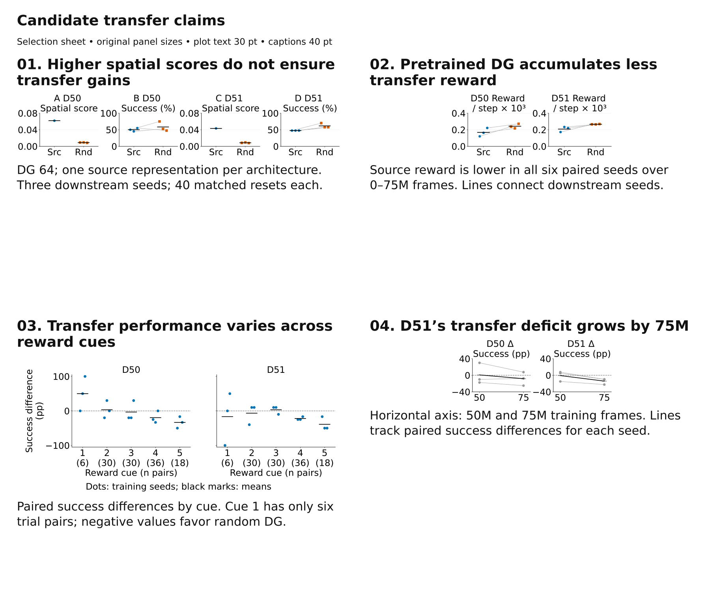
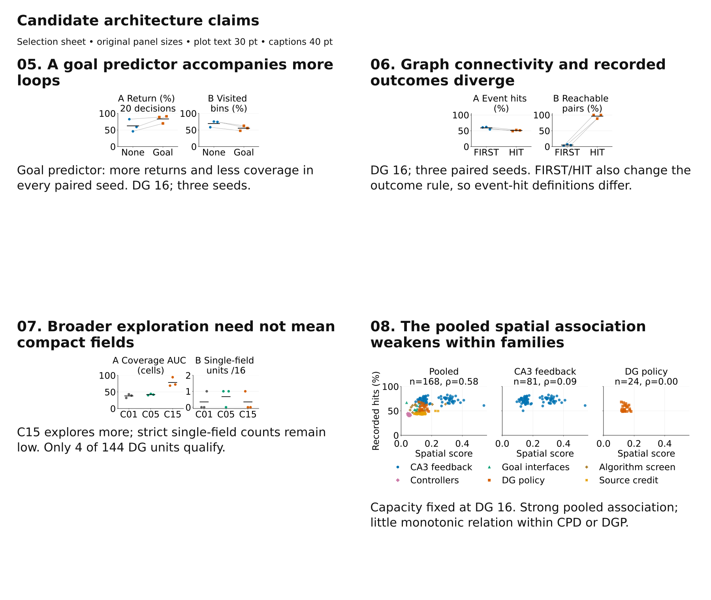

# Optional poster plot gallery

The current poster was not edited. Import individual SVGs into Inkscape at **100% physical size**: small pairs 191.5 × 76.2 mm, four-panel rows 383 × 76.2 mm, larger blocks 383 × 165.1 mm. Every plot label is 30 pt DejaVu Sans; seed markers are 56 pt² and scatter markers 65 pt², matching the latest poster additions. Selection-sheet explanations are 40 pt. SVG text is editable.

Start with **01**, or use **02** for a compact transfer result. **05** is the clearest additional architecture ablation. **07** connects to C01/C05/C15. **08** can replace the existing section-3 framing. **03/04** are optional transfer detail; **06** needs the definition caveat beside it.





| ID | Candidate | Physical size (mm) | Suggested use |
| --- | --- | --- | --- |
| [01](01_transfer_spatial_score_and_success.svg) | Higher spatial scores do not ensure transfer gains | 383 × 76.2 | First choice |
| [02](02_transfer_training_reward.svg) | Pretrained DG accumulates less transfer reward | 191.5 × 76.2 | Strong compact alternative |
| [03](03_transfer_by_reward_cue.svg) | Transfer performance varies across reward cues | 383 × 165.1 | Optional transfer detail |
| [04](04_transfer_development.svg) | D51’s transfer deficit grows by 75M | 191.5 × 76.2 | Optional learning dynamics |
| [05](05_predictor_loops_and_coverage.svg) | A goal predictor accompanies more loops | 191.5 × 76.2 | Good discussion candidate |
| [06](06_graph_and_recorded_outcomes.svg) | Graph connectivity and recorded outcomes diverge | 191.5 × 76.2 | Use with explicit definitions |
| [07](07_exploration_and_compact_fields.svg) | Broader exploration need not mean compact fields | 191.5 × 76.2 | Connects directly to the main story |
| [07b](07b_field_criterion_sensitivity.svg) | Field counts depend on the compactness criterion | 383 × 165.1 | Supplement to 07; not a new main claim |
| [08](08_architecture_conditioned_scatter.svg) | The pooled spatial association weakens within families | 383 × 165.1 | Alternative framing for section 3 |

## Comparison setup

Transfer keeps DG capacity at 64 and compares **frozen pretrained source DG** with a **frozen calibrated random DG**. Each architecture has one selected source checkpoint reused across three downstream seeds (42/1234/9999), not three independently pretrained DGs. Both arms start with a fresh worker, fresh reward manager and empty graph. The task has five invisible reward cells cued by a stable number instruction, within the original visual arena. D50 and D51 identify the two source architectures, not two goal locations in this five-cue task. Exact endpoints: D50 75,022,336 frames; D51 75,038,720. See [task and matched-control setup](../../../06_experiments/cued_reward5_transfer_20260925.md) and the [completed endpoint report](../../../06_experiments/results/A0_poster_analysis_20260926/batch_summary.md).

The architecture comparisons use DG 16. Capacity is not pooled across the transfer and architecture candidates. Gray lines join training-seed pairs; black short marks show means. No significance tests or confidence intervals are implied by these three-seed displays. Spatial score includes activation amplitude and is not labeled as normalized spatial information. In the point table, the fixed source-representation point has a blank downstream seed; its three identical replay rows are drawn once. Source-row inputs remain pinned in the manifest.

## 01. Higher spatial scores do not ensure transfer gains

[Editable SVG](01_transfer_spatial_score_and_success.svg) · [PNG preview](01_transfer_spatial_score_and_success.png)

**Suggested caption:** Frozen pretrained source DG versus calibrated random DG, with fresh downstream worker, reward manager, and empty graph in both arms. A/C: common five-cue replay spatial score, with one source point and three random representations. B/D: per-training-seed physical reward success over 40 exactly matched reset trials, 1800-decision horizon. Src/circles: pretrained source; Rnd/squares: calibrated random; black marks: means. Heldout success is 50.0% versus 58.3% in D50 and 47.5% versus 61.7% in D51.

**Claim limit:** One pretrained source checkpoint per architecture is reused across downstream seeds. D50 success differences are -25.0, -7.5, +7.5 percentage points; D51 differences are -22.5, -10.0, -10.0. Spatial score also depends on activation amplitude. This is transfer within the same visual geometry, not generalization to a new visual environment or a causal mediation test.

**Visitor question:** Which properties of a learned landmark code make it reusable for externally rewarded control?

## 02. Pretrained DG accumulates less transfer reward

[Editable SVG](02_transfer_training_reward.svg) · [PNG preview](02_transfer_training_reward.png)

**Suggested caption:** Mean reward per step from the canonical reward AUC divided by the 75M-frame horizon, displayed ×1000. Three paired downstream training seeds per architecture; points are seeds, connecting lines preserve seed pairing, and black marks show means. Src/circles: source; Rnd/squares: random. Source-minus-random differences average -0.074 × 10⁻³ in D50 and -0.058 × 10⁻³ in D51. Both arms freeze DG 64.

**Claim limit:** This measures reward collected during transfer training, not heldout trial success. Early reward differences are mixed; the claim concerns the full 0–75M history and the two selected fixed sources.

**Visitor question:** Could an intrinsic code favor familiar transitions that are unhelpful for the reward task?

## 03. Transfer performance varies across reward cues

[Editable SVG](03_transfer_by_reward_cue.svg) · [PNG preview](03_transfer_by_reward_cue.png)

**Suggested caption:** At the 75M endpoints, dots show each downstream training seed’s source-minus-random physical-success difference for each reward cue, in percentage points (pp). Black marks show means. The same resets and reward sites are paired between arms. Per architecture there are 6/30/30/36/18 trial pairs for cues 1–5, distributed equally over the three training seeds.

**Claim limit:** Cue sample sizes are unequal. Overall success in candidate 01 weights trials as recorded, not cues equally. Cue 1 is particularly uncertain; these cue differences do not identify a representation mechanism.

**Visitor question:** Does a useful landmark code need uniform goal coverage, or can a few poorly represented sites dominate failure?

## 04. D51’s transfer deficit grows by 75M

[Editable SVG](04_transfer_development.svg) · [PNG preview](04_transfer_development.png)

**Suggested caption:** Source-minus-random heldout success in percentage points at 50,003,968 frames and the 75M endpoints. Gray lines track the three downstream training seeds; black marks show means. D50 changes from +0.8 to -8.3 pp, D51 from -0.8 to -14.2 pp. In D51 the paired difference declines in every seed. Evaluations use the same 40-reset protocol and 1800-decision horizon.

**Claim limit:** Two checkpoints describe developmental change rather than a full learning curve. The 50M snapshot does not replace the completed 75M endpoint. D50 remains mixed across seeds.

**Visitor question:** When should we evaluate transfer: early adaptation, accumulated reward, or final heldout control?

## 05. A goal predictor accompanies more loops

[Editable SVG](05_predictor_loops_and_coverage.svg) · [PNG preview](05_predictor_loops_and_coverage.png)

**Suggested caption:** Matched CPD GATE ACT DIR designs without (None) and with (Goal) a goal predictor at 75,038,720 frames. Frozen 10k-decision probes; dots are seeds 8/99/123, lines join training-seed pairs, black marks show means. Mobile-window 20-decision returns increase from 62.4% to 83.2%; visited arena-bin fraction decreases from 69.3% to 55.3%. Both directions hold in all three seeds.

**Claim limit:** Probes match training age, environment and length, but not stochastic trajectories or starts. This predictor ablation is inside an already goal-conditioned controller; it is not an ablation of goal conditioning itself. Stabilizing familiar cycles is a hypothesis.

**Visitor question:** Can better prediction reinforce familiar cycles rather than discovery?

## 06. Graph connectivity and recorded outcomes diverge

[Editable SVG](06_graph_and_recorded_outcomes.svg) · [PNG preview](06_graph_and_recorded_outcomes.png)

**Suggested caption:** DGP FIRST versus HIT JOINT LEG at the shared 75,005,952-frame online snapshot. Three training seeds, paired by seed; black marks show means. Recorded prospective successes/attempts are 58.9% versus 50.8%, while stored reachable ordered node pairs are 4.7% versus 96.1%. Every seed shows opposite orderings. FIRST/HIT are declared worker-outcome rules.

**Claim limit:** FIRST/HIT change the success definition. This comparison illustrates different diagnostics, not improved physical control under one shared success rule. Graph counters are accumulated event summaries; connectivity alone does not establish executable edges.

**Visitor question:** Which stored edges correspond to actions the agent can actually execute?

## 07. Broader exploration need not mean compact fields

[Editable SVG](07_exploration_and_compact_fields.svg) · [PNG preview](07_exploration_and_compact_fields.png)

**Suggested caption:** Matched C01/C05/C15 seeds 8/99/123 at 100,040,704 frames. A: terminal online coverage AUC. B: strict mono-field count per 16 DG units from archived frozen policy probes. Dots: seeds; black marks: means. Across seeds the counts are 1/48, 2/48 and 1/48 units. The classifier requires ≥80% dominant-component mass at 30/50/70% peak thresholds, with occupancy-corrected smoothing and the saved activity eligibility checks.

**Claim limit:** The two diagnostics use different observation protocols. Sparse strict counts depend on the field criterion and policy sampling; they do not establish an absence of spatial coding or equivalence across conditions. See candidate 07b for criterion sensitivity.

**Visitor question:** Can broad or multifield landmark events still support navigation through sequence context?

## 07b. Field counts depend on the compactness criterion

[Editable SVG](07b_field_criterion_sensitivity.svg) · [PNG preview](07b_field_criterion_sensitivity.png)

**Suggested caption:** The same C01/C05/C15 frozen maps are classified at dominant-component mass cutoffs 20–90%, retaining the same three peak thresholds and activity eligibility. Dots: individual seed fractions; colored lines: seed means; denominator: all 16 DG units. At 50% mass, totals are 7/48, 16/48 and 7/48; at 80%, 1/48, 2/48 and 1/48.

**Claim limit:** These are repeated classifications of the same maps, not independent experiments. A relaxed cutoff does not imply a compact single field. The strict criterion remains the declared primary definition; this panel shows why that choice matters.

**Visitor question:** What field compactness would actually be necessary for a useful internal goal?

## 08. The pooled spatial association weakens within families

[Editable SVG](08_architecture_conditioned_scatter.svg) · [PNG preview](08_architecture_conditioned_scatter.png)

**Suggested caption:** Same 168-run cohort as the current poster: latest saved online windows, legacy arena, DG 16. Left: all 56 variants; middle: CA3-feedback family (CPD, 81 runs); right: DG-policy family (DGP, 24 runs). Dots: runs, with the same family color/shape mapping as the current poster. Spearman correlations are 0.583, 0.094 and -0.001. The pooled panel supplies context rather than an additional independent dataset. No regression or trend line is fitted.

**Claim limit:** Ages and success rules differ across families; target counters retain accumulated history while fields summarize recent policy observations. This is a descriptive survey, not independent replication of each architecture or evidence that spatial score has no within-family effect.

**Visitor question:** Is the pooled correlation driven by the representation metric or by the surrounding controller design?

## Regeneration and evidence

Run from the repository root:

```bash
/home/xiaoxiong/miniforge3/envs/SF_git/bin/python 06_experiments/render_poster_candidate_plots_20260929.py
```

[plotted_points.csv](plotted_points.csv) maps seed values to panels, units, protocols and input tables. [manifest.json](manifest.json) pins source hashes and includes claims/captions. [quality_checks.json](quality_checks.json) records physical sizes, editable fonts and SVG validity. Heldout summaries are regenerated from exact paired-reset trials; unmatched starts, wrong ages and duplicate trial keys fail the render.

**Reusable lesson:** Reuse the current poster’s style and physical canvas sizes. Pin completed 75M transfer inputs rather than older 50M illustrations. Inspect original trial structure before calling seed variation representation replication. Render the compact panels directly at final size; shrinking a large figure would also shrink its text.
