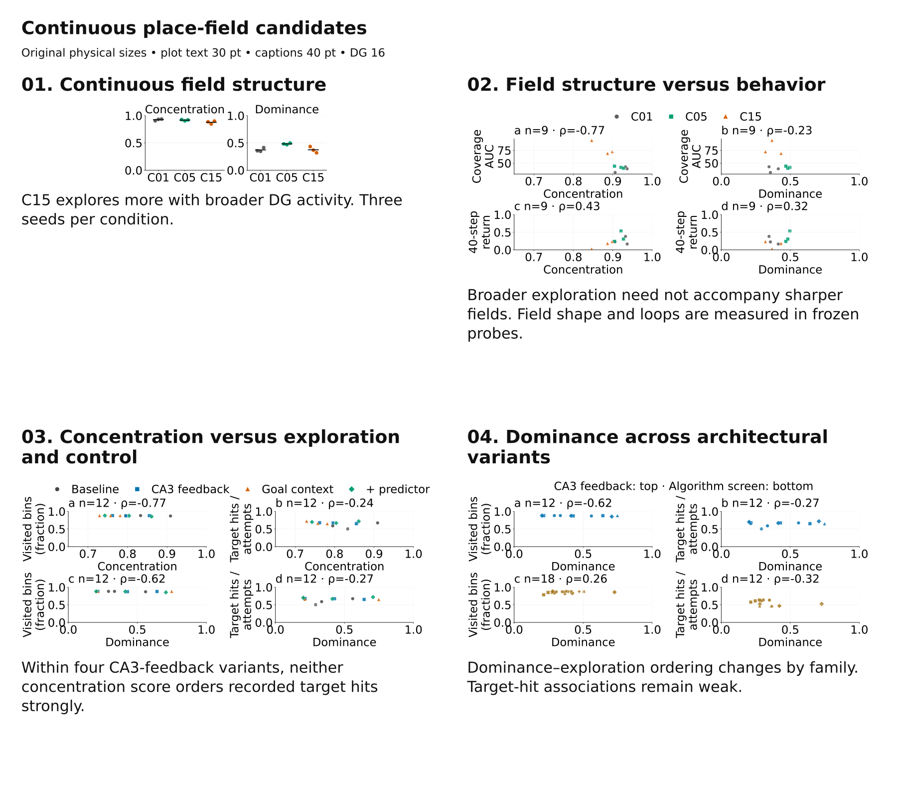
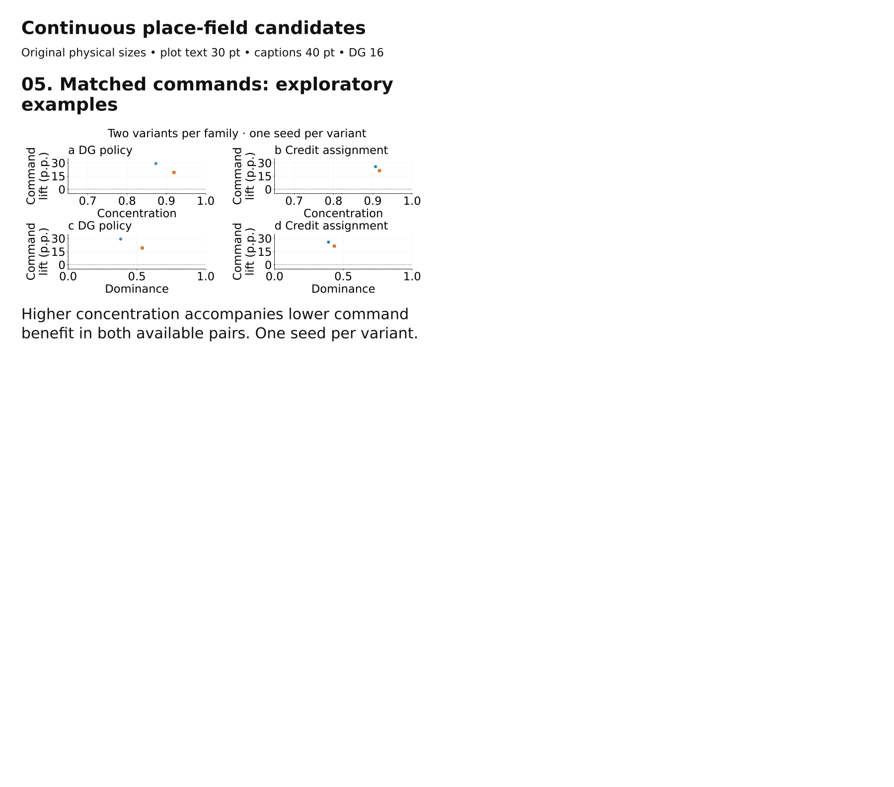

# Continuous place-field candidates

Use **01** to replace the binary mono-field count panel, and **03** for the
exploration/control scatter. **04** broadens the architectural comparison using
saved continuous component-dominance scores. **02** supplies C01/C05/C15 behavior
context. **05** is an exploratory command comparison with too few seeds for a
general trend claim. The existing posters have not been edited.

Plots use editable SVG text at **30 pt**, scatter markers **78 pt²**, and the
existing physical canvases: **191.5 × 76.2 mm** for the compact pair and
**383 × 165.1 mm** for four scatter panels. Selection-sheet captions are **40 pt**.
Import at 100% physical size; shrinking a panel also shrinks its text.



| Candidate | Editable figure | Use |
| --- | --- | --- |
| 01 Continuous field structure | [SVG](01_continuous_fields_core.svg) | Compact alternative to strict counts |
| 02 Core field structure and behavior | [SVG](02_core_concentration_and_behavior.svg) | Main-story discussion |
| 03 Concentration, exploration, control | [SVG](03_concentration_exploration_control.svg) | Preferred continuous scatter |
| 04 Dominance across variants | [SVG](04_dominance_across_variants.svg) | Wider available survey |
| 05 Matched command examples | [SVG](05_concentration_command_comparisons.svg) | Exploratory supplement |

## What the measures mean

**Spatial concentration, $C$:** normalize each unit’s unsmoothed,
occupancy-corrected rate map to equal-weight rate mass over sampled bins.
For $N$ sampled bins and $p_b=r_b/\sum_b r_b$,

$$
A_{\mathrm{eff}}=\frac{1}{\sum_b p_b^2},\qquad
C=\frac{N-A_{\mathrm{eff}}}{N-1}.
$$

Effective area, $A_{\mathrm{eff}}$, is the number of equally active bin equivalents.
$C=0$ means uniform activity across the sampled arena; $C=1$ means all mass in
one bin. Multiplying a unit’s activity by any positive gain leaves it unchanged.
This avoids the amplitude dependence of the existing spatial score.

**Single-field dominance, $D$:** the existing continuous `field_mono_score`,
before the $D\geq0.8$ classification. At 30%, 50%, and 70% of the smoothed peak,
find connected components; take the largest component’s share of superlevel
rate mass, then the minimum across the three thresholds. It distinguishes one
dominant component from several competing ones. It still uses peak thresholds,
but the output is continuous and needs no mono-field pass/fail cutoff.

Use the two together. A broad connected field can have high $D$; several small,
distant peaks can have high $C$. $C$ is spatial activity concentration, not a
geometric radius or a guarantee of one contiguous place field. Neither measure
captures diversity across DG units; keep peak diversity or map cosine as a
separate population diagnostic.

Entropy concentration and 80%-mass area are retained as alternative summaries
in the data tables. They answer related questions with different tail sensitivity.
They are not independent evidence for the same claim. The computation and
support rules are documented in the
[canonical telemetry guide](../../../04_implementation/reusable_place_field_telemetry.md#continuous-field-concentration-saved-map-analysis).

## What the data support

For C01/C05/C15, each number below first averages eligible DG units within a
run, then averages three training seeds. Models are at 100,040,704 frames and
maps are archived 10k frozen-policy probes. Probe histories differ by policy.

| Measure | C01 | C05 | C15 |
| --- | ---: | ---: | ---: |
| Spatial concentration $C$ | 0.925 | 0.918 | 0.877 |
| Effective area / sampled bins | 7.9% | 8.7% | 12.6% |
| Area containing 80% of rate mass / sampled bins | 6.8% | 7.6% | 11.2% |
| Single-field dominance $D$ | 0.372 | 0.482 | 0.373 |
| Final-window training coverage AUC | 37.97 | 42.03 | 78.57 |

C15 is less concentrated than both C01 and C05 in **all three seed comparisons**.
It does not improve mean dominance over C01. C05 has higher dominance than C15
in each of the three seeds. These statements concern the selected probe
measurements; they do not establish equivalence of representations.

The strongest poster wording is:

> **C15 broadens exploration without sharpening DG fields.**

The continuous measurements make this statement more informative than “only
four units pass a mono-field criterion.” They do not justify “localized fields
are unnecessary” across tasks or a causal claim that broader fields improve
exploration.

In the four locally available CA3-feedback variants (12 seeds, common
75,005,952-frame online age):

| Association | Concentration $C$ | Dominance $D$ |
| --- | ---: | ---: |
| Visited grid fraction | $\rho=-0.772$ | $\rho=-0.616$ |
| Recorded target-event hit fraction | $\rho=-0.238$ | $\rho=-0.266$ |

These are descriptive Spearman coefficients across seed-level run means.
Coverage is near the ceiling: **85.3–88.1%** of the total 19 × 19 grid, so the
coverage plot retains its full 0–1 y axis. $C$ axes use the disclosed 0.65–1
detail range. Maps describe a recent 100k training window; target counters
accumulate historical attempts. Internal DG target hits are not verified
physical arrival or downstream reward success.

The available algorithm screen has six variants and 18 seeds for dominance
versus coverage ($\rho=0.258$), and four goal variants / 12 seeds for dominance
versus target hits ($\rho=-0.322$). The two worker-reference variants have no
target-hit counters. Missing counters are omitted from that panel, not treated
as failed commands. Shapes identify variants within each family: CPD baseline
circle, CA3 feedback square, goal context triangle, predictor diamond; algorithm
screen CA3 circle, DG-policy square, arrival-credit triangle, source-credit
diamond, worker joint-gradient filled plus, worker stopped-gradient cross.

The defensible discussion point is **field shape does not strongly order the
recorded target-hit rates in these available subsets**. This is weaker than
“field shape does not matter.” Four CPD architecture means give a concentration
versus hit rank coefficient of −0.8, but only four points; dominance gives +0.4.
The seed-level coefficients and three-seed architecture means both remain in
[correlations.csv](correlations.csv). Grouping is part of the interpretation.

## Matched-command supplement



Candidate 05 keeps two comparisons separate. Both use DG 16, seed 99 and
75,038,720-frame checkpoints, with one common observation/action replay within
each pair. The pairs use different panels and are not pooled.

| Pair | Variant | Concentration $C$ | Dominance $D$ | Executed minus shuffled success |
| --- | --- | ---: | ---: | ---: |
| DG policy | First outcome | 0.873 | 0.382 | +29.4 p.p. |
| DG policy | Target hit | 0.919 | 0.539 | +19.1 p.p. |
| Credit assignment | Source | 0.907 | 0.392 | +25.7 p.p. |
| Credit assignment | Arrival | 0.917 | 0.435 | +21.2 p.p. |

Within both available pairs, the more concentrated representation accompanies
the smaller matched-command benefit. **One seed per variant is insufficient for
a general trend claim.** No fitted line, rank coefficient, or significance claim
is displayed. Success follows the saved intervention’s internal target-event
rule; this is not an independent physical-goal arrival measurement. A DG-16
CPU model at 300M also has concentration and command data in the tables, but
is omitted from these comparisons because its family and checkpoint age differ.

## Availability and sampling checks

There are **63 run/protocol means**: 30 online (12 CPD + 18 algorithm-screen),
28 frozen (15 corrected-core + 12 CPD + one CPU), and five common replay.
Raw maps support concentration for **45** of them; the additional 18 online
algorithm-screen means support continuous dominance only. Capacity is fixed at
DG 16. This is not the entire 168-run poster survey. The
[survey availability table](survey_availability.csv) also retains unavailable
DG-16 run/protocol rows, including excluded corridor geometries.

Unknown bins are excluded. Rate maps already divide activity by visits; map
mass gives equal weight to spatial bins rather than dwell time. Shapes of
silent units are undefined. Means use units with at least 20 active observations
and activity in at least three bins, preserving the existing eligibility rule;
they do not select units based on mono-field status. Eligibility and silence
counts are exported for every run.

Restricting support to bins with at least five observations preserves CPD’s
online concentration ordering closely ($\rho=0.993$ between scores), with a
maximum run-mean change of 0.0082. The coverage association remains negative
($\rho=-0.725$) and target-hit association remains weak ($\rho=-0.273$).
Entropy concentration gives −0.694 and −0.273, respectively. These checks
support the interpretation within this selected online subset.

Frozen CPD maps do **not** reproduce the online coverage association: $C$
versus frozen visited coverage is $\rho=0.151$; entropy concentration gives
−0.354. Shorter, policy-specific probe paths and the choice of tail weighting
matter. Do not combine frozen and online maps into one universal concentration
trend. There is no fixed-trajectory causal control for the main exploration
scatter. The common-replay command pairs provide better input comparability,
but lack independent seed replication.

## Sources, verification, and reuse

[per_unit.csv](per_unit.csv) retains unit values and raw-map or canonical-CSV
source identities. [per_run.csv](per_run.csv) retains checkpoint ages, protocols,
study fingerprints where available, eligibility counts, alternative measures,
and mean/median summaries. [plotted_points.csv](plotted_points.csv) maps exact
values to panels. [raw_map_availability.csv](raw_map_availability.csv) reports
duplicates, unavailable exact matches and capacity exclusions.
[manifest.json](manifest.json) fingerprints every selected source and records
formula, physical size, font, and package versions.
[quality_checks.json](quality_checks.json) verifies editable vectors, unique SVG
IDs, resolved references, typography, and that the poster remained unchanged.

Regenerate the figures from the repository root:

```bash
/home/xiaoxiong/miniforge3/envs/SF_git/bin/python 06_experiments/render_field_concentration_20260929.py
```

Six focused scientific-invariant tests cover uniform/peak endpoints, gain
invariance, silent units, unknown-bin handling, geometric fragmentation, and
invalid inputs. The canonical study suite plus these tests passed **43 checks**.

**Reusable experience:** saved per-unit scores are authoritative for continuous
dominance, while effective area requires raw maps. Join by run/model age/protocol
and explicit policy, deduplicate identical maps, keep capacity fixed, and audit
measurement availability before making a cross-run claim. Frozen summary rows
omit policy ID; selected checkpoint paths verify policy 0. Large rotated labels
can exceed a compact physical canvas at 30 pt: use short axis names, captioned
definitions and multiline panel statistics, then inspect the final SVG render.
