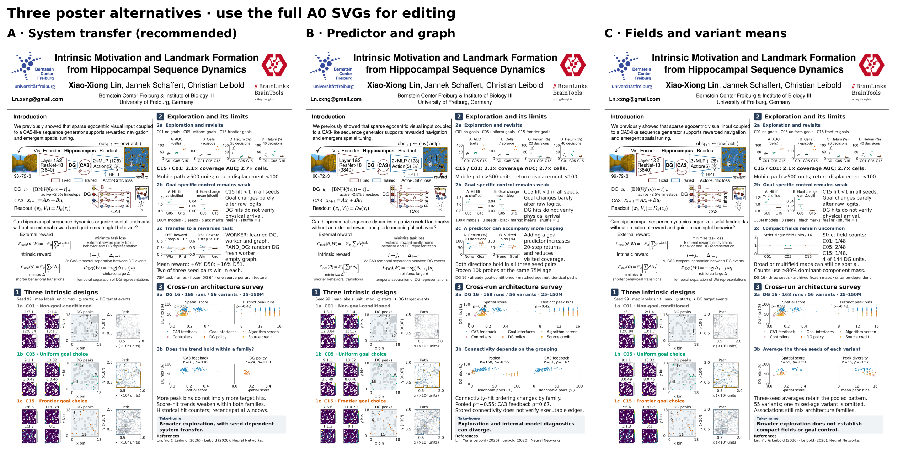

# Three revised A0 poster layouts

The new attachment is the source for all three versions. Each version has numbered section badges, lettered subsections, 48 pt section titles, 36 pt subsection titles, 40 pt explanations, and 30 pt plot text. The header and introduction are unchanged.



| Version | New section 2c | Additional section 3b | Suggested use |
| --- | --- | --- | --- |
| [A: System transfer](Bernstein2026_A_system_transfer.svg) | WORKER vs RAND_DG, full 0–75M reward | Spatial score vs DG hits within CA3-feedback and DG-policy families | Recommended: positive extension with a clear seed qualification |
| [B: Predictor and graph](Bernstein2026_B_predictor_and_graph.svg) | Predictor ablation: more short returns, less coverage | Pooled vs within-CA3 graph connectivity / DG hits | Strongest discussion of mismatched internal diagnostics |
| [C: Fields and variant means](Bernstein2026_C_fields_and_variant_means.svg) | Strict compact-field counts | Three-seed means of 55 variants | Representation-focused discussion; more criterion-dependent |

Each SVG is 841 × 1189 mm, suitable for Inkscape. Full-page PNGs are previews, and the overview is deliberately reduced for choosing versions. It does not define the print font sizes. The shared plot sources are in [plots](plots/). No new training or telemetry was run.

## Common visual revisions

- Sections 1–3 use the same badge/title system. Subsections 1a–1c identify the three designs; 2a–2c identify exploration, goal specificity, and the optional extension; 3a–3b distinguish the original survey from the added comparison.
- The bottom-left maps, peaks, axes and path labels now use 30 pt text. Redundant ticks and repeated captions were removed. All map images, color scales, peak markers, and complete trajectory vertices are retained. Every peak remains drawn; only the four displayed DG units are labeled. Shared peaks receive a combined label, such as `3,8`; short leaders connect displaced labels to their unchanged peak positions.
- Map labels now give **DG unit : activation maximum**, replacing small spatial-score titles and numeric colorbar ticks. The four units and their actual maps remain those already selected. Each map/colorbar still runs from zero to its own maximum; equal colors are not equal amplitudes across units. Field shape is relative to its individual scale.
- The original two cross-run panels retain all 168 runs and the same family colors/shapes. DG hits are shown in percent instead of fractions. Plot titles name the horizontal measures, avoiding duplicate axis labels and clearing space for the family key. Additional panels retain 30 pt labels and markers of 65 pt².

The row illustrations are seed-99 frozen probes. C01 uses its archived path; C05/C15 use the existing fresh option-event replays at the same 100M checkpoints. They are not matched starts or histories. Stars indicate any current DG option-target event, not verified physical arrival. The quantitative C01/C05/C15 summaries use all three training seeds; they are design-package contrasts, not a clean isolation of the goal-selection algorithm.

## A. System transfer

[Editable A0 SVG](Bernstein2026_A_system_transfer.svg) · [Full-page PNG](Bernstein2026_A_system_transfer.png)

**Supported claim:** Joint DG–worker–graph transfer improves average adaptation reward, with seed-dependent outcomes.

**Limit:** Reward gains are modest and heterogeneous. Two of three paired seeds favor WORKER in each architecture; there is no matched WORKER heldout evaluation. This tests a transferred package, not a DG-specific effect or equal total pretraining compute.

**Visitor question:** Which interactions make a learned code reusable by its worker and graph?

## B. Predictor and graph

[Editable A0 SVG](Bernstein2026_B_predictor_and_graph.svg) · [Full-page PNG](Bernstein2026_B_predictor_and_graph.png)

**Supported claim:** Adding a goal predictor accompanies more short returns and less visited coverage in a matched three-seed contrast.

**Limit:** The predictor result comes from one architectural background and stochastic frozen probes. Graph correlations are descriptive, with heterogeneous outcome rules and ages across families; they do not identify a causal failure of graph connectivity.

**Visitor question:** Can predicting familiar transitions stabilize cycles instead of discovery?

## C. Fields and variant means

[Editable A0 SVG](Bernstein2026_C_fields_and_variant_means.svg) · [Full-page PNG](Bernstein2026_C_fields_and_variant_means.png)

**Supported claim:** The coverage advantage does not coincide with more units passing the strict single-field criterion.

**Limit:** Very few units pass a stringent classification rule; the counts do not imply an absence of spatial coding or equivalence between designs. Averaging seeds repeats the same survey, rather than providing independent replication.

**Visitor question:** What field compactness is necessary for a useful internal goal?

## Critiques and selection reasoning

**A is the strongest general poster version.** It adds a new question—reuse for a rewarded task—to the exploration story. WORKER transfers frozen learned DG, a pretrained trainable worker, and a source graph; RAND_DG has calibrated frozen random DG, a fresh worker and an empty graph. Full-run mean reward gains are +6.1% (D50) and +15.8% (D51), but only two of three seed pairs win in each. Early mean reward favors RAND_DG. Do not claim an immediate learning head start, a DG-only gain, reliable heldout performance, or transfer to new visual geometry. One selected source checkpoint per architecture is reused. The within-family scatter is a useful guard against interpreting the pooled relationship as a general law.

**B has the strongest matched architectural contrast.** The predictor ablation has the same directional result in all three seeds: 20-decision mobile-window returns rise from 62.4% to 83.2%, and visited-bin fraction falls from 69.3% to 55.3%. Prediction stabilizing familiar cycles remains a hypothesis. The graph survey is a grouping illustration: pooled connectivity/hit $
ho=-0.554$ changes to $0.666$ within CA3 feedback. No causal connectivity effect or common success definition across all families is established.

**C is coherent with the left-column spatial maps, but scientifically narrower.** Only 4/144 units pass the declared strict single-field test, requiring at least 80% dominant-component mass at each of the 30/50/70% peak thresholds. These counts depend on sampling and the criterion. The three-seed-mean scatters give score/hit $
ho=0.587$ and peak/hit $
ho=-0.573$ over 55 variants. `CPU2048_DIRECT_F16_DDQN_HER` is omitted from this view because seed 8 is at 75M and the other two at 150M. All three remain in the original 168-run panel. Seed averaging repeats existing evidence and leaves family confounding; it should not be presented as a new independent result.

Across versions, **recorded DG target hits are not physical landmark success**. Historical counters and recent spatial windows measure different time spans. The pooled survey mixes ages (25–150M) and outcome rules; within-family subsets reduce, but do not eliminate, interpretation limits. Displayed $\rho$ values are descriptive Spearman correlations; no significance tests or confidence intervals are claimed. The main positive evidence remains the replicated C15 coverage gain.

## Evidence and regeneration

[manifest.json](manifest.json) records inputs, fonts, source SHA-256 values, and unchanged left-panel data. [quality_checks.json](quality_checks.json) records protected pixel equality and on-page text. [plots/plotted_points.csv](plots/plotted_points.csv), [cross-run statistics](plots/cross_run_statistics.json), and [variant exclusions](plots/variant_mean_exclusions.json) make all filters and sample units explicit. Original study fingerprints are retained in the plotted survey records.

```bash
/home/xiaoxiong/miniforge3/envs/SF_git/bin/python 06_experiments/revise_poster_layout_20260929.py --source 05_plans/poster_20260929/layout_versions/input_layout.svg
```

**Reusable experience:** Start from the latest edited attachment and query actual Inkscape object bounds. Preserve map rasters, path vertices, and event provenance while editing annotations. Use the pinned survey instead of rediscovering historical exports. The first compact render exposed legend collisions; duplicate axis labels were the removable information. Check age within each seed-averaged variant, and compare header/introduction pixels after rendering rather than relying on XML preservation alone.
