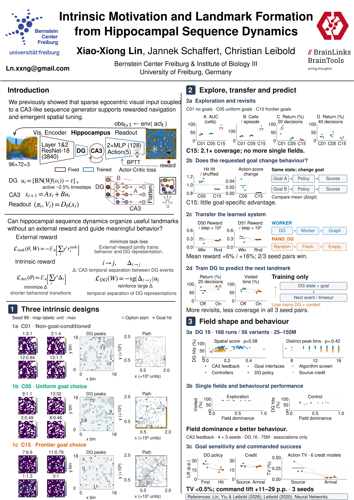

# Current poster: evolved B

The selected poster is **B**, now evolved with action-probability TV, executed-command lift, Helvetica figure labels, a trajectory-event key and boxed references. The former version 3 remains dropped.

[Editable A0 poster](evolved_B/Bernstein2026_B_evolved.svg) · [Evidence and limits](evolved_B/README.md) · [Quality checks](evolved_B/quality_checks.json)

The header and introduction are unchanged. Left-panel plotted data are unchanged; their labels use Helvetica and the shared circle/star key identifies option starts and internal DG goal hits. Generated plot labels are 30 pt, conclusions 40 pt. Helvetica is absent locally, so verified Nimbus Sans is used explicitly for rendering; SVG text declares `Helvetica,Nimbus Sans`.

The original B field-dominance comparison retains exploration and recorded target hits for 12 CA3-feedback models. The added command row shows all 12 available intervention models and TV for the six overlapping credit models. Different cohorts and score definitions stay separate. [Additional dominance-versus-command and TV scatters](evolved_B/README.md#field-dominance-versus-these-measures) are available as candidates.

Earlier alternatives remain for recovery: [former A/B comparison](revised/comparison_overview.png), [their notes](revised/README.md), and [the superseded three-version notes](previous_layout_notes.md). The current work continues from B.
