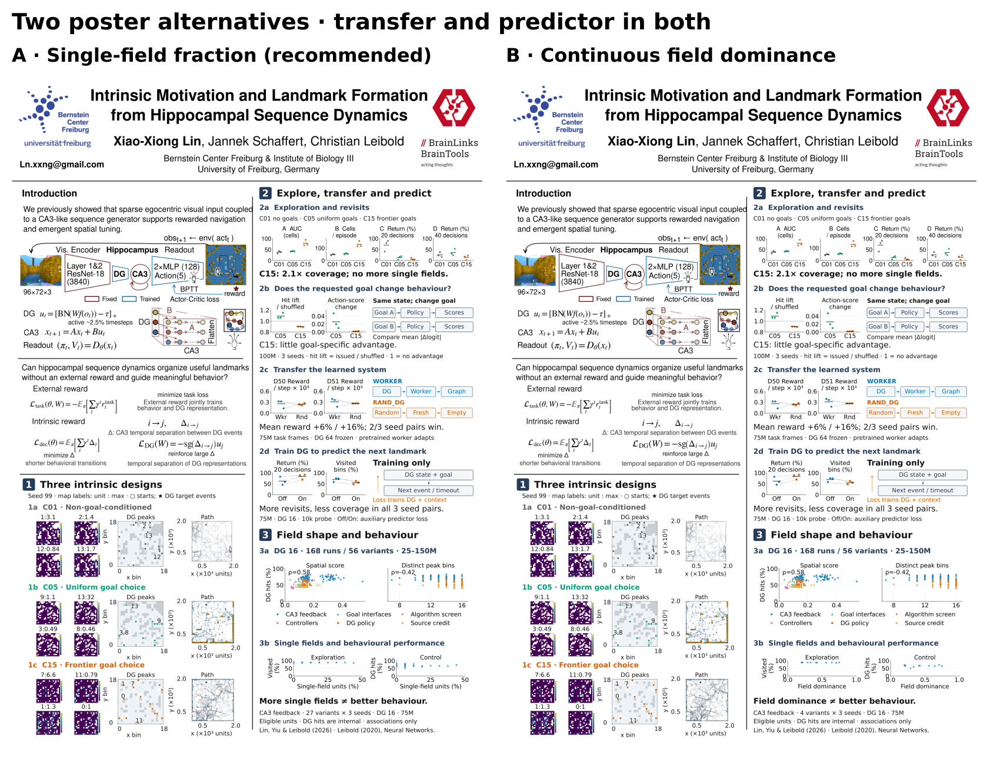

# Current poster versions

The current selection has **two versions**, both combining transfer and predictor results. The former version 3 is dropped from this selection.

| Version | Editable poster | Field-structure evidence |
| --- | --- | --- |
| A (recommended) | [Transfer, predictor and monofields](revised/Bernstein2026_A_transfer_predictor_monofields.svg) | Single-field fraction versus exploration and control across 81 CA3-feedback runs |
| B | [Transfer, predictor and continuous dominance](revised/Bernstein2026_B_transfer_predictor_dominance.svg) | Continuous field dominance versus both outcomes across 12 locally available runs |

Both preserve the full left column and header, shorten section 2 explanations, and add diagrams explaining goal swaps, system transfer, and the training-only predictor. Plot text is 30 pt and conclusion captions are 40 pt.

[Current evidence, limits and regeneration](revised/README.md) · [Quality checks](revised/quality_checks.json)

Earlier outputs are retained for recovery. Their [previous layout notes](previous_layout_notes.md) describe the superseded three-version selection; they are not the current recommendations.
