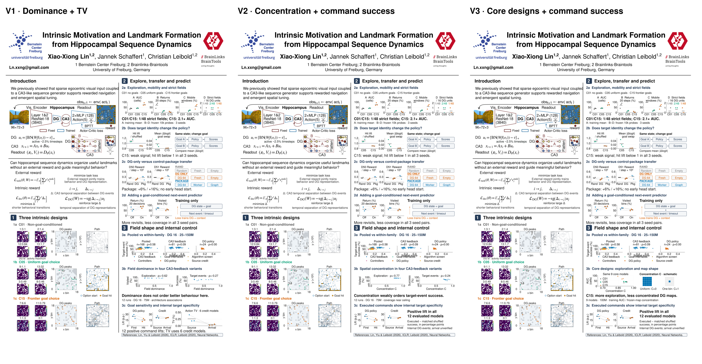

# Three critique-review versions from the attached B



| Version | Editable A0 poster | Main choice |
| --- | --- | --- |
| V1 | [Dominance + TV](Bernstein2026_V1_dominance_TV.svg) | Closest to B: literal dominance and the six-model TV diagnostic |
| V2 | [Concentration + command success](Bernstein2026_V2_concentration.svg) | Actual spatial concentration in 12 CPD models; positive commands without TV |
| V3 | [Core designs + command success](Bernstein2026_V3_core_concentration.svg) | Recommended: the main nine C01/C05/C15 models link exploration and concentration |

All versions start from [the attached edited SVG](input_poster.svg), preserving its author/affiliation edits, introduction, map images, peak locations and trajectory geometry. **Suggestion 1 is not implemented:** all C01/C05/C15 headings remain exactly as attached. The single left annotation correction is the map key: displayed values are activity maxima, not spatial-information scores. Source values and scores are in [the individual-scale table](../../../../06_experiments/results/A0_poster_analysis_20260926/flat_goal_comparison/place_field_individual_scales.csv). No map values are changed.

The versions retain Helvetica declarations, verified Nimbus Sans rendering, 30 pt plot labels, 40 pt result captions and boxed references. The schematic in V3 illustrates mathematical concentration endpoints and contains no fabricated observations. The core concentration x axis explicitly spans 0.65–1; all observations fit. Other scatter axes retain full 0–1 measures and 0–100% outcomes.

## Evaluation of the critique

| Suggestion | Assessment and implementation |
| --- | --- |
| 1: replace core labels | Rejected by the user; left untouched. Comparisons remain descriptive and captions do not attribute differences to a single factor. |
| 2: show strict-field counts | Agree. Four panels now show coverage AUC, 20-decision conditional returns, mobility and strict fields. The counts 1/48, 2/48 and 1/48 are visible. Mobility exposes C05's roughly 20% mobile-window fraction. Training AUC and frozen-probe measurements are explicitly separated. |
| 2b: distinguish policy diagnostics from reaching | Agree. Literal mean absolute logit change stays because TV is unavailable for these exact core models. The hit-lift reference is stronger and C15's below-one result is stated for all three seeds. |
| 3: compare DG-only and package transfer | Agree for these selected sources. All three arms are shown using logged reward over the same 75M horizon. The caption reports a modest package mean advantage and the absence of an early head start. |
| 4: rename prediction | Agree with neutral wording: adding a goal-conditioned next-event predictor. The observed result remains more revisits and less probe coverage in all three seed pairs. Familiar-cycle stabilization remains a hypothesis. |
| 5: show within-family associations | Strongly agree. The same 168-run cohort appears as pooled, CA3-feedback and DG-policy panels. Rank correlations are approximately 0.58, 0.09 and 0.00. No fitted line or new replication is implied. Target-event success is explicitly internal. |
| 6: dominance versus concentration | Agree. V1 correctly names dominance; V2 uses actual concentration; V3 ties actual concentration to the core designs. None manipulates field shape or establishes that fields cause worse control. |
| 7: foreground positive command lift | Agree. The existing 12-model seed-paired result remains; V2/V3 replace TV with a plain definition and the internal-event caveat. V1 keeps TV as a distinct six-model diagnostic. |

## Where the critique goes too far

“DG representations alone do not transfer useful control” is too general. The supported statement is **DG-only transfer collects less training reward than random DG in these six seed pairs, while the learned DG–worker–graph package has a modest, seed-dependent mean advantage**. Worker and graph contributions remain combined. Package physical heldout success is unavailable, source pretraining adds compute, and one selected source checkpoint per architecture is reused across downstream seeds.

`W_FULL` is already a distinct study arm with trainable DG. The plotted package is `W_WORKER`, whose DG remains frozen. Therefore its display name is **Package**, not a renamed `W_FULL`. Random and DG-only arms both have fresh workers and empty graphs; Package transfers worker and graph as well. All use DG 64 and a 75M downstream budget. The old TensorBoard DG-only export and newer W&B arms share the canonical interval integrator; the overlapping random controls agree within 0.12% in full-horizon reward. Exact backend differences are recorded, not discarded.

“Concentrated fields do not help” is also too strong as a causal conclusion. The 12-model CPD concentration rank associations are approximately $\rho=-0.77$ with coverage and $\rho=-0.24$ with recorded target-event success, but coverage is near its ceiling and target counters accumulate history. Frozen CPD probes do not reproduce the online coverage ordering. The core concentration means are C01 0.925, C05 0.918 and C15 0.877, from frozen maps; their training AUC is a separate protocol. The models show dissociation, not equivalence or an intervention on field shape.

The critique calls 2a/2d the strongest results; this is reasonable at poster scale, with the limits above. The predictor comparison matches age, environment and probe length, not identical stochastic trajectories or starts. No significance claim is added from three seeds.

## Evidence and verification

[Quality checks](quality_checks.json) compare renders against the supplied source, verify unchanged condition labels and all nine left-data fingerprints, and reject page clipping or text collisions. [Plot checks](plots/quality_checks.json), [plotted points](plots/plotted_points.csv), [three-arm transfer](plots/review_transfer_statistics.json), [within-family statistics](plots/review_survey_statistics.json), [field statistics](plots/review_field_statistics.json) and [manifest](manifest.json) retain exact definitions and source hashes. No training, SSH or new telemetry was used.

Regenerate with the pinned attachment and critique:

```bash
/home/xiaoxiong/miniforge3/envs/SF_git/bin/python 06_experiments/revise_poster_layout_20260929.py --review-critique --source 05_plans/poster_20260929/layout_versions/critique_variations/input_poster.svg --critique 05_plans/poster_20260929/layout_versions/critique_variations/input_critique.txt
```

**Reusable experience:** always preserve the latest attached author edits; distinguish a user-rejected suggestion from unrelated factual corrections. Compare exact matched cohorts and integrate all transfer histories with the canonical reward convention. Check existing study arm names before choosing display labels. Keep concentration, connected-component dominance, instantaneous policy sensitivity and long-horizon command specificity separate, and inspect actual glyph bounds after every compact layout change.
