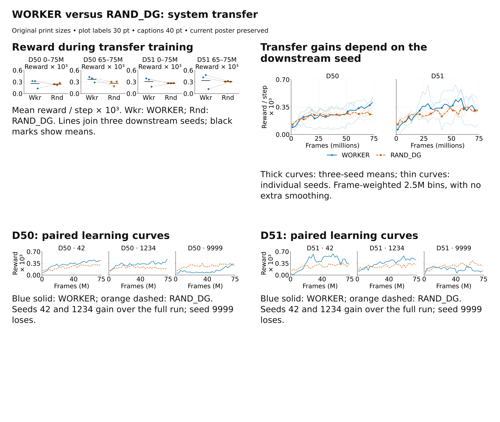

# WORKER versus RAND_DG: joint-system transfer



**Recommended poster claim:** Transferring the learned DG–worker–graph system raises mean reward during adaptation, with seed-dependent outcomes.

Use **01** for a compact result and **02** to show the temporal and seed variation. The two **03** figures are optional detail, using the same data. The current poster is unchanged. Import these editable SVGs at 100% physical size: 383 × 76.2 mm for scalar/seed rows and 383 × 165.1 mm for the main learning curves. Plot labels are 30 pt DejaVu Sans; paired markers are 56 pt²; curve mean markers are 7.5 pt. Sheet captions are 40 pt.

## What is compared

| Component | WORKER | RAND_DG |
| --- | --- | --- |
| DG 64 | Frozen pretrained projection | Frozen random projection, BN calibrated on an unlabeled minibatch |
| Worker | Pretrained, trainable during adaptation | Fresh, trainable |
| Initial graph | Source graph transferred; reward values reset | Empty |
| Reward manager | Fresh | Fresh |
| Visual trunk | Fixed ImageNet ResNet-18 through layer 2 | Same |

Task, downstream architecture, seeds (42, 1234, 9999), and 75M downstream budget are matched. The task has five invisible reward locations cued by a number instruction, in the source visual arena. The comparison tests whether a learned control package is reusable; it does not isolate a DG effect. WORKER includes source pretraining, so total lifetime compute is not equal. D50 and D51 use one selected pretrained source checkpoint each, reused across downstream seeds.

## Results

Values below are mean logged environment reward / step ×1000, not physical heldout success rates.

| Architecture | Window | WORKER | RAND_DG | Mean relative difference | Seed pairs won |
| --- | --- | ---: | ---: | ---: | ---: |
| D50 | 0–10M (early) | 0.1384 | 0.1689 | -18.0% | 1/3 |
| D50 | 0–75M (full) | 0.2571 | 0.2423 | +6.1% | 2/3 |
| D50 | 65–75M (late) | 0.3660 | 0.2661 | +37.5% | 2/3 |
| D51 | 0–10M (early) | 0.1239 | 0.1617 | -23.4% | 1/3 |
| D51 | 0–75M (full) | 0.3084 | 0.2662 | +15.8% | 2/3 |
| D51 | 65–75M (late) | 0.3354 | 0.3093 | +8.5% | 2/3 |

Seeds 42 and 1234 favor WORKER over the full and late windows in both architectures. Seed 9999 favors RAND_DG in both. Early arm means favor RAND_DG, so “immediate reward head start” or “consistently better transfer” would overstate these data. No significance or confidence interval is claimed from three seed pairs. The late window reflects reward during ongoing training, not an independent policy evaluation.

**Heldout success remains pending:** Existing local matched-reset trials compare SOURCE_DG with RAND_DG and cannot be relabeled WORKER. Matching WORKER heldout evaluations were not available locally, and remote SSH did not respond. No new evaluation was launched.

## Measurement and provenance

Both arms use unsampled `wandb.Api.scan_history` exports from the same backend. Frame progress is `train/env_steps`; W&B `_step` is a logging index. Values retain W&B frame precision rather than inventing exact checkpoint ages. Each logged reward mean is assigned to its preceding logging interval, matching the original AUC convention. Repeated frame values keep the last log. Full, early, late, and binned summaries share the same interval integrator. Curves use frame-weighted 2.5M bins, with no additional smoothing.

This is an approximation to reward accumulated during training from logged mean telemetry, not a sum of raw episode returns. The latest included value is carried to a window boundary. Two completed runs last log at 74,989,570 frames, requiring 10,430 carried frames (0.014% of the full horizon; 0.104% of the late window). The maximum logging gap is 65,540 frames. Every run passes the existing 99.5% horizon-coverage threshold and is marked finished.

[Raw histories and validated StudySpecs](../../../06_experiments/data/worker_random_transfer_20260929/) are pinned with collection configs and study fingerprints. [manifest.json](manifest.json) hashes every input. [reward_per_run.csv](reward_per_run.csv) and [paired_differences.csv](paired_differences.csv) retain all seed values; [reward_binned_curves.csv](reward_binned_curves.csv) maps bin locations to curves. The canonical study analysis engine computes paired contrasts. [quality_checks.json](quality_checks.json) verifies editable typography, unique IDs, native vectors, and preservation of the current poster.

## Reward during transfer training

[Editable SVG](01_paired_reward_summary.svg) · [PNG](01_paired_reward_summary.png)

**Caption:** WORKER transfers frozen learned DG, a trainable pretrained worker, and the source graph. RAND_DG uses calibrated frozen random DG, a fresh trainable worker, and an empty initial graph. Both receive 75M downstream frames. Panels show full-training (0–75M) and late-training (65–75M) mean logged environment reward per step, ×1000. Blue circles: WORKER; orange squares: RAND_DG. Points are seeds 42/1234/9999; gray lines join seeds; black marks are arm means.

**Claim limit:** WORKER has higher arm means, but wins in only two of three seed pairs per architecture in both windows. This tests transfer of the joint system. It does not identify a DG-specific benefit or establish statistical significance with three seeds.

**Discussion question:** Which interactions between landmark code, worker, and graph make transferred control useful?

## Transfer gains depend on the downstream seed

[Editable SVG](02_learning_curves.svg) · [PNG](02_learning_curves.png)

**Caption:** Logged environment reward per step, ×1000, averaged in 2.5M-frame bins. Each thin line is one downstream training seed; thick lines are means over the same three seeds. Blue solid circles: WORKER; orange dashed squares: RAND_DG. The curve integrals reproduce the paired 0–75M summary points. Shared axes preserve the architectural comparison.

**Claim limit:** The thin-line spread shows observed seed variation, not a confidence band. WORKER has lower mean reward in the first 10M frames in both architectures, so an immediate reward head start is not supported. One selected source checkpoint per architecture was reused across seeds.

**Discussion question:** What determines whether an exploration-trained controller adapts or remains tied to its source behavior?

## D50: paired learning curves

[Editable SVG](03_d50_paired_seed_curves.svg) · [PNG](03_d50_paired_seed_curves.png)

**Caption:** D50, the same three downstream seed pairs separated into panels. Reward / step ×1000, frame-weighted 2.5M bins. Blue solid is WORKER, orange dashed is RAND_DG. Panels preserve identical axes and use all observations rather than selecting successful runs.

**Claim limit:** These are the same data as the main curves, not an additional replication. Each architecture has one source checkpoint, so source-checkpoint robustness remains untested.

**Discussion question:** Can the initial graph or worker state predict the low-transfer seed before long training?

## D51: paired learning curves

[Editable SVG](03_d51_paired_seed_curves.svg) · [PNG](03_d51_paired_seed_curves.png)

**Caption:** D51, the same three downstream seed pairs separated into panels. Reward / step ×1000, frame-weighted 2.5M bins. Blue solid is WORKER, orange dashed is RAND_DG. Panels preserve identical axes and use all observations rather than selecting successful runs.

**Claim limit:** These are the same data as the main curves, not an additional replication. Each architecture has one source checkpoint, so source-checkpoint robustness remains untested.

**Discussion question:** Can the initial graph or worker state predict the low-transfer seed before long training?

## Regeneration

From the repository root:

```bash
/home/xiaoxiong/miniforge3/envs/SF_git/bin/python 06_experiments/render_worker_random_transfer_20260929.py
```

Recollection is optional; it requires the existing W&B login:

```bash
/home/xiaoxiong/miniforge3/envs/SF_git/bin/python 06_experiments/collect_worker_random_transfer_20260929.py --refresh
```

**Reusable lesson:** Validate run identity against the original StudySpec; use one logging backend and its frame field for both arms. Pin histories once, reuse final-size figure helpers, and make the curve integral agree with summary points. Avoid revisiting an unresponsive SSH connection when existing logs answer the requested training comparison.
