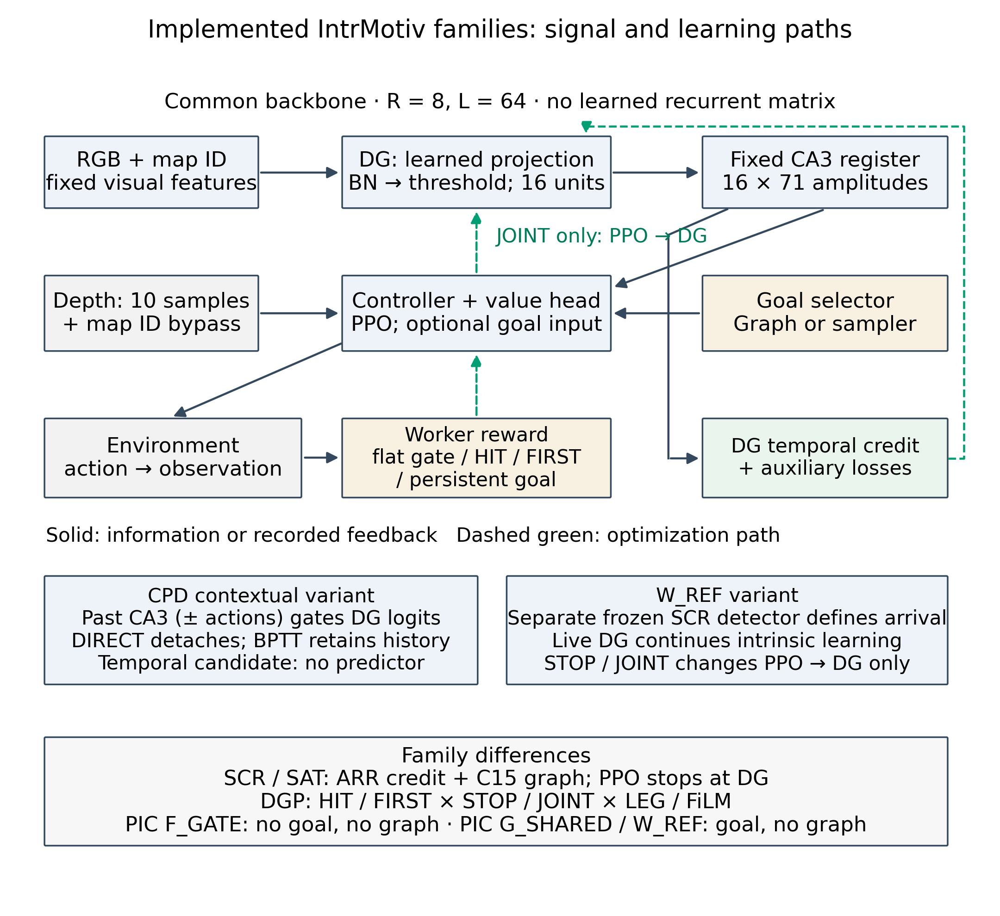
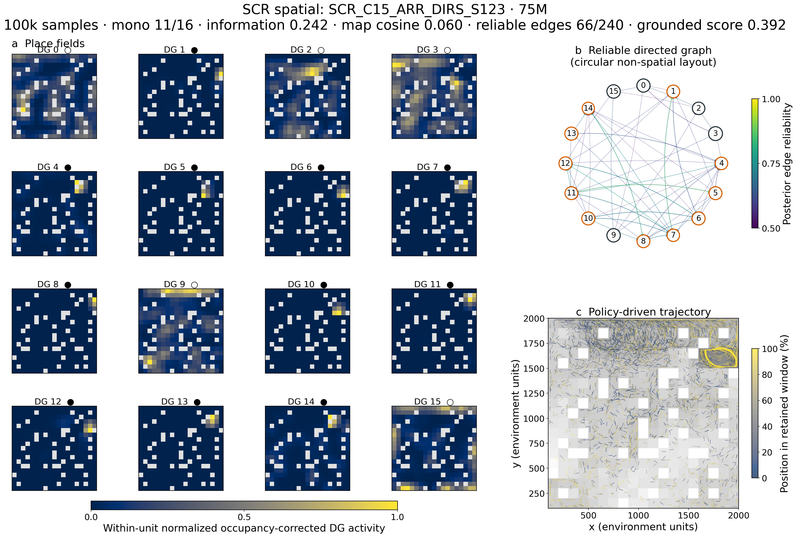
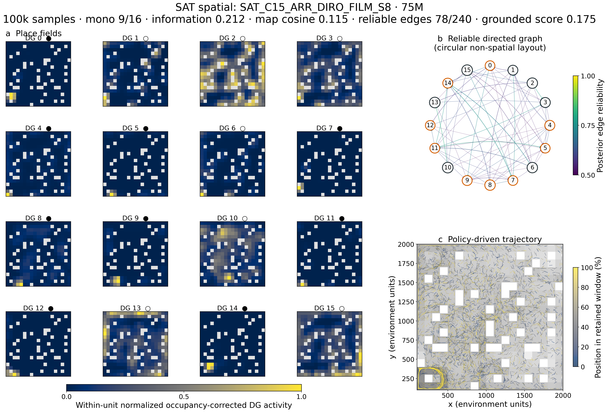
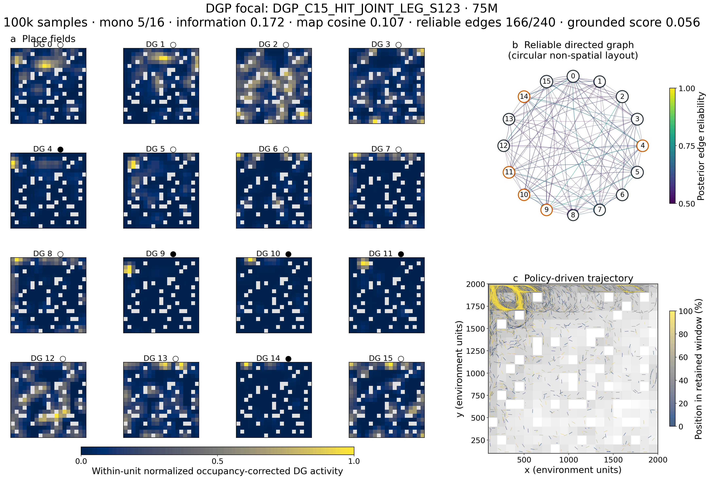
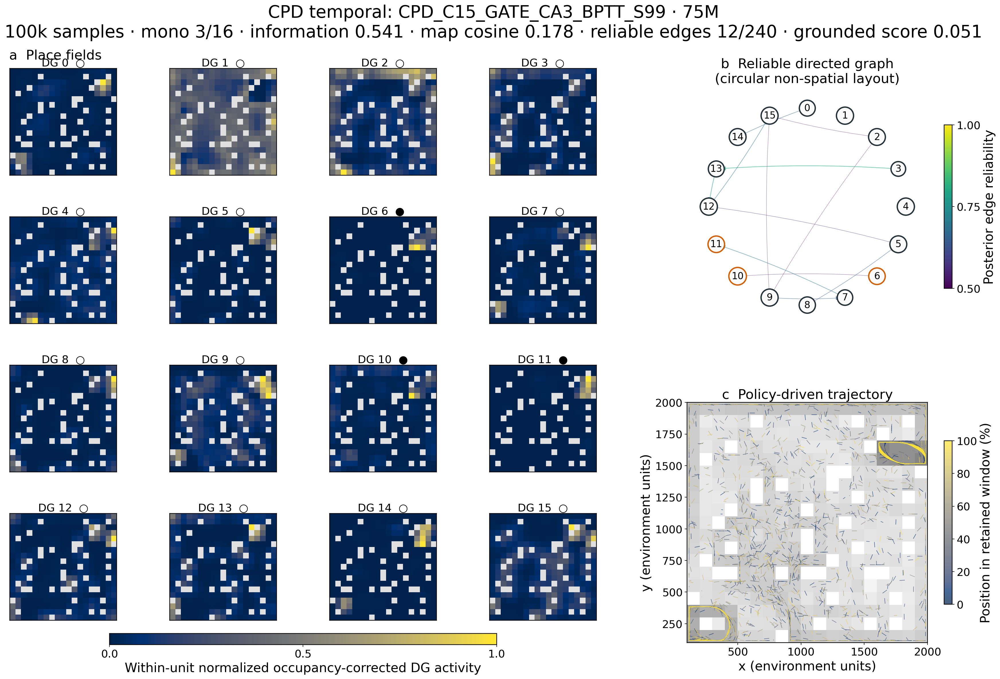
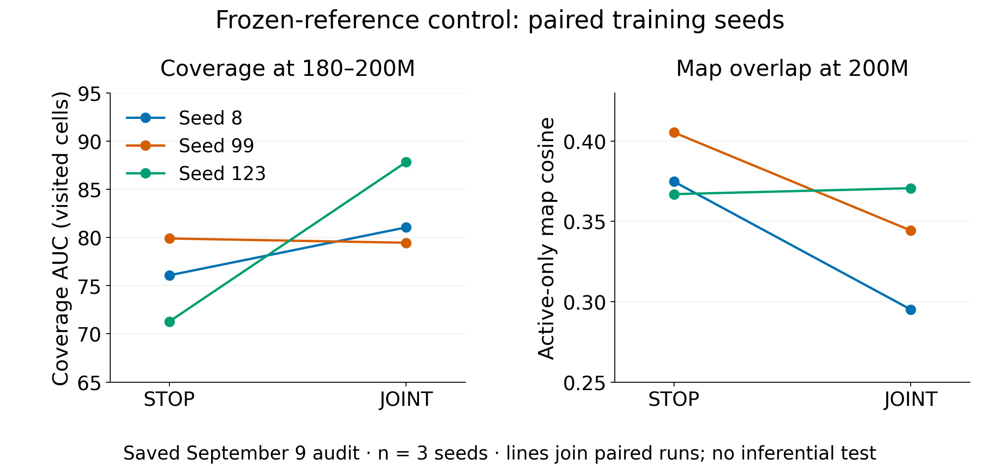

# 02 — Architectures and losses: place fields, trajectories, and graphs

Prepared 10 September 2026 for a technical discussion. Evidence is from retained reports, CSV/JSON summaries, and gallery artifacts through September 9, plus the September 10 transfer launch record. No fresh training audit or new rollout was performed. Architectural equations were checked against the sealed September 8 hotfix source and the relevant StudySpecs. New designs proposed on September 9 are not experimental results.

**Assessment.** The useful candidates fall into three groups: selected historical checkpoints with localized activity (SCR/SAT), controlled architectural contrasts that may explain representation learning (DGP/CPD and W_REF), and newer exploration/localization candidates (F_GATE/G_SHARED/C15 continuation). None demonstrates the joint target of stable distributed landmarks, command-caused destination arrival, and broad persistent exploration.

The six families already in the navigation8 screen are SCR ARR DIRS, SAT ARR DIRO FiLM, DGP HIT JOINT LEG, CPD GATE CA3 BPTT, and W_REF STOP/JOINT. This is a sensible shortlist; the present evidence below comes from their older five-action/repeat-8 lineages. The eight-action/repeat-4 screen is a new experiment, not a replication with identical physical timing.

**1. Architecture: what is actually computed**

[Vector diagram](../assets/architecture_briefing_20260910/architecture_paths.pdf). Solid arrows are schematic information/recorded-feedback dependencies; dashed green arrows are optimization paths. Family-specific context and reference-detector paths are specified below. The diagram does not imply that rewards are differentiated through environment dynamics.

Let $o_t$ be RGB input, $m_t$ the map-ID instruction, and $d_t^{obs}$ the depth channel. In these implementations:

$$
x_t=[V(o_t),\;9\operatorname{onehot}(m_t)],\qquad
v_{tj}=\frac{w_j^\top x_t-\mu_j}{\sqrt{\sigma_j^2+\epsilon}},\qquad
z_{tj}=[v_{tj}-b]_+,\qquad b=2.43.
$$

$V$ is the fixed ImageNet-pretrained ResNet-18 through layer 2. $F=16$ DG rows are learned; row norms are projected back to one after optimization. BatchNorm is **non-affine** (`affine=False`): there are no learned BN scale/shift parameters. Its running moments evolve, so changing normalization changes landmark identity even with identical weights. The selected newer studies use `legacy_batch`; that label does not establish identical actor/learner forward semantics. The map ID is task context, not physical position; in a single-map study it is constant. This is reward-free navigation learning with pretrained vision and a depth sensor, not unsupervised learning from RGB alone.

The CA3 state is $C_t\in\mathbb R_+^{F\times E}$, with $E=R+L-1=71$, $R=8$, and $L=64$:

$$
C_{t,j,k}=\mathbf1_{k>0}C_{t-1,j,k-1}
             +\mathbf1_{0\le k<R}z_{tj},\qquad k=0,\ldots,E-1.
$$

Every current DG amplitude is injected into the first eight slots. A shift discards the oldest slot; episode reset clears the state. This is a finite linear memory of the DG sequence, with overlapping injections, not a learned recurrent transition matrix or a prospective route simulator. In vector form $c_t=Ac_{t-1}+Bz_t$, with fixed $A,B$ and $\dim c_t=1136$. Contextual DG below makes the full system nonlinear even though this CA3 update remains linear.

An important historical implementation detail is the controller bypass:

$$
u_t=[\operatorname{vec}C_t,\;D(d_t^{obs}),\;9\operatorname{onehot}(m_t)],\qquad
a_t\sim\pi_\phi(\cdot\mid u_t,g_t).
$$

$D$ is a fixed downsampling of depth to ten values. The policy therefore has immediate depth information outside DG–CA3. A pure $\pi(a\mid C,g)$ diagram would incorrectly imply a stricter information bottleneck. Coordinates/yaw remain external telemetry; no pose input is needed for this bypass. Source-side map context is also concatenated into the DG input. Future conceptual notes that remove this bypass must be distinguished from these measured architectures.

**2. Encoder learning, policy learning, and the meaning of distance**

Define $p_{tj}$ as the first occupied CA3 slot for unit $j$, or $E$ when absent. A candidate onset is present now and was outside the recent $R$ slots on the previous decision. When several candidates begin together, the behavior-time largest activation is the dominant event, with the lowest index resolving ties. The temporal distance $\Delta_t$ is the nearest qualifying predecessor age after excluding simultaneous candidates; unknown history uses the sentinel $E$. It is measured in policy decisions, not meters or shortest-path length.

For the `encourage` objective, the event-aligned intrinsic streams are schematically

$$
r_t^{enc}=\beta\Delta_t,\qquad
r_t^{flat}=\beta(E-\Delta_t),\qquad\beta=0.1.
$$

The stored implementation uses different slices for action rewards (`[:,2:]`) and encoder credit (`[:,1:-1]`); these equations suppress only that indexing offset. They expose a real tension: the encoder reinforces temporally separated onsets, while the flat policy favors shorter event intervals. The event eligibility and empty-history conventions are essential; $E$ is not a measured long spatial distance.

For a retained event $e$ with arrival $j_e,t_e$ and predecessor $i_e,s_e$, ARR credits $(j_e,t_e)$ and SRC credits $(i_e,s_e)$:

$$
\mathcal L_{enc}=-\frac1{N_{valid}}\sum_{e\in\mathcal E_{matched}}
  \beta\Delta_e\,z_{\tau(e),\ell(e)}
  +\mathcal L_{unused}+\mathcal L_{multi}.
$$

The event labels, rewards, and source matches are behavior-time data, held fixed during the encoder update. Unresolved/cross-rollout matches are excluded from both matched ARR and SRC conditions. The denominator is valid replay entries rather than simply the number of events, so changing event frequency also changes effective update mass.

The enabled population terms, with valid-entry averages, are

$$
\mathcal L_{unused}=-\left\langle
\frac{\sum_j U_j T\log(1+e^{(v_{tj}-b)/T})}{\max(1,\sum_j U_j)}
\right\rangle_t,\quad T=0.5,
$$
$$
\mathcal L_{multi}=\left\langle\sum_j z_{tj}(Q_{tj}-D_{tj})\right\rangle_t.
$$

$U_j$ marks a unit absent from incoming CA3 and current activity across the valid minibatch; $Q$ marks candidate onsets; $D$ marks the dominant one. The first term can activate a silent unit through pre-threshold gradients. The second suppresses simultaneous non-dominant candidates. This gradient recruitment is distinct from **discrete row replacement**, controlled by MON/DIRS/DIRO. A condition with zero replacements can still have the unused-unit loss active.

PPO learns from the worker reward using

$$
\mathcal L_{\pi}=-\langle\min(\rho_t\widehat A_t,
\operatorname{clip}(\rho_t,l,u)\widehat A_t)\rangle,\qquad
\rho_t=\pi_\phi(a_t\mid u_t,g_t)/\pi_{old}(a_t\mid u_t,g_t).
$$

Value regression and entropy regularization are additional worker terms. STOP detaches the CA3 part of $u_t$; JOINT allows worker gradients through the fixed recurrence into DG. Both continue the separate encoder objective. Thus, schematically,

$$
\nabla_W\mathcal L=\nabla_W\mathcal L_{enc}
  +\mathbf1_{JOINT}\nabla_W\mathcal L_{worker}.
$$

JOINT does not unfreeze ResNet or learn $A$. It changes which objective shapes the sparse write signals into memory.

**3. Historical candidates with joint field/graph/trajectory artifacts**

The table uses the exact gallery's **75M-frame, retained 100k-sample** artifacts. All listed units are eligible in these snapshots. Values are selected checkpoints, not condition means. $J$ is the amplitude-weighted spatial score defined in section 6. Graph edges are operationally “reliable,” not verified physical skills.

| Candidate, seed                            | Mono / 16 | Active map cosine |  $J$ | Unique peak bins | Reliable edges / 240 | Reachable ordered-pair fraction | Grounded score |
| ------------------------------------------ | --------: | ----------------: | ---: | ---------------: | -------------------: | ------------------------------: | -------------: |
| SCR ARR DIRS, 123                          |        11 |             .0605 | .242 |               13 |                   66 |                            .883 |           .392 |
| SAT ARR DIRO FiLM, 8                       |         9 |             .1147 | .212 |               15 |                   78 |                           1.000 |           .175 |
| DGP HIT JOINT LEG, 123                     |         5 |             .1068 | .172 |               15 |                  166 |                           1.000 |           .056 |
| DGP FIRST JOINT LEG, 99                    |         4 |             .1136 | .166 |               11 |                    8 |                            .071 |           .232 |
| CPD GATE CA3 BPTT, 99                      |         3 |             .1781 | .541 |               13 |                   12 |                            .179 |           .051 |
| CPD GATE ACT DIR GOAL, 8                   |         7 |             .2492 | .410 |                8 |                   13 |                            .125 |           .111 |
| SAT SRC MON FiLM, 8: exploration reference |         0 |             .5004 | .061 |               15 |                   98 |                           1.000 |           .000 |

Gallery conventions: occupancy-corrected, smoothed maps are divided by each unit's own peak; light masked bins are unvisited. Orange graph-node outlines mark classified mono-fields; node size encodes visits. Circular graph layouts are **non-spatial**. Trajectory panels draw every tenth adjacent within-segment line over log occupancy, not a single continuous 100k-step tour. Roughly 1,700 retained segments per page reflect parallel rollouts/resets. Aggregate visited-bin fractions of about .85–.88 are not per-episode coverage or navigable-area percentages.

**SCR ARR DIRS, seed 123 — strongest selected localized-code checkpoint**

Mechanism: C15 frontier-direct graph manager, arrival-directed encoder credit, FiLM goal conditioning, STOP at DG, and directional retirement with a silent-endpoint gate. DIRS names an enabled replacement rule, not proof it produced the result. Preserve replacement counts before attributing a learning effect to it.

There are eleven sharply concentrated maps and very low mean overlap, but visual inspection shows many peaks grouped toward the right/upper-right region. The trajectory has repeated curved paths in that region, alongside broader sampled occupancy. This is a candidate local vocabulary, not eleven uniformly distributed destinations. Sixty-six retained edges and .883 graph reachability coexist with historical terminal activation lift near one (about 1.005 in the full-history audit). Graph connectivity therefore does not establish command specificity. This checkpoint is already used as the frozen reference for W_REF and as a source in the transfer study.

**SAT ARR DIRO FiLM, seed 8 — second useful transfer source**

Mechanism: arrival credit and C15 direct frontier selection, STOP at DG, FiLM, with the directional endpoint gate open. The recorded run has **zero replacements**, so its fields cannot be credited to successful DIRO interventions. FiLM applies a target-dependent scale/shift to a shared state representation:

$$
h_t=\operatorname{ReLU}(W_su_t+b_s),\qquad
\widetilde h_t=(1+\gamma(g_t))\odot h_t+\eta(g_t),
$$

followed by a shared output layer. The scale/shift table is zero-initialized; the target one-hot is removed from the shared state stream. LEG instead concatenates that one-hot to the ordinary decoder input.

The gallery has nine mono-fields, many near the lower-left region; the trajectory shows dense curved activity there. Fifteen unique peaks and a graph with all pairs topologically reachable do not remove that spatial concentration. Historical 65–75M coverage is about 63.3 in the late-window report (a different terminal-window extraction gives 64.57). Neither value is computed from the plotted spatial snapshot. This remains a useful selected transfer source, not replicated efficient navigation.

The older summary's “8/16, cosine .0649, information .246” came from W&B summary fields in `analyze_recent_batches_20260906.py`, whereas this page's “9/16, .1147, .212” comes from the 100k gallery. The short monitoring window and retained artifact are different measurement objects. The previous outlier report incorrectly described those older SAT values as 100k terminal measurements; use this table for these images.

**DGP JOINT + LEG — strongest existing mechanistic contrast**

This crosses HIT/FIRST outcomes, STOP/JOINT gradients, and LEG/FiLM input. Commands are balanced among observed directed passive successors, rather than selected by learned route cost. MON permits no row replacements. Let $K$ be the behavior-time number of available successors and $Y$ the first distinct exclusive outcome. FIRST uses

$$
r_{FIRST}=\begin{cases}
q(\Delta),&Y=g,\\
-q(\Delta)/\max(1,K-1),&Y\ne g\text{ is a distinct outcome},\\
0,&\text{timeout},
\end{cases}\quad
q(\Delta)=1+0.1\max\{0,\beta(E-\Delta)\}.
$$

For $K>1$, uniform outcomes give zero mean only if reward magnitude is outcome-independent; varying $q(\Delta)$ and nonuniform passive outcomes weaken the “chance-centered” interpretation. Wrong FIRST outcomes complete failed attempts. HIT instead waits for target occurrence, so success can rise simply through eventual encounters. Both retain exploration-mode reward behavior.

HIT JOINT LEG seed 123 develops 0 → 3 → 5 mono-fields at 25/50/75M, while its cosine drops to .107. Its five fields cluster at $x=150$–450, $y=1750$–1950. The trajectory has conspicuous upper-left repeated curves. At 65–75M, option completion is 55.5%, but pooled target/shuffled lift is .9973 and coverage AUC is 38.2. Its 166-edge graph is dense yet cannot be interpreted as 166 effective physical skills. The same configuration has only one and zero mono-fields in seeds 8 and 99.

The stronger evidence is the paired contrast: across both outcome definitions and three seeds, JOINT minus STOP under LEG gives +12.5 percentage points in mono-field fraction and −.0359 cosine at 75M; cosine improves in all six pairs. FiLM gives no corresponding mono-field gain and +.0289 cosine. Those are six comparisons but only three distinct seeds, not six independent replications. This supports testing a gradient/interface interaction, not declaring JOINT universally superior or attributing the effect to successful control.

**CPD GATE CA3 BPTT — temporal-context candidate, without a predictor**

The sensory logits are modulated by recent, goal-independent history:

$$
q_t=\operatorname{LN}\big[\operatorname{vec}(C_{t-1}^{recent}),
\operatorname{vec}(a_{t-R:t-1})\big],\qquad
z_t=[2\sigma(Mq_t+b_c)\odot v_t-b]_+.
$$

The CA3-only cell omits actions. $M=b_c=0$ gives an identity gate. DIRECT detaches history; BPTT retains gradients through the 64-step learner recurrence, not arbitrary past episodes. The leading temporal candidate uses JOINT/FiLM/FIRST and **no auxiliary prediction head**.

Its high $J=.541$ accompanies only three mono-fields and a twelve-edge graph. Several maps have more than one responsive region, with repeated curved trajectories near opposite boundary regions. FIRST lift is .877 at 65–75M. Temporal context changes selectivity, but neither a distributed unique-place code nor useful target choice follows from the large score.

The action-history + GOAL-predictor candidate has seven mono-fields, but only eight peak bins and cosine .249; the inspected maps concentrate multiple fields in one left-side region. Its auxiliary term is completed-option cross entropy,

$$
\mathcal L_{pred}=-0.1\langle\log p_\psi(Y\mid z_s,g)\rangle,
$$

with outcome classes for the first distinct landmark or timeout. The comparator is $p(Y\mid g)$; the source representation must add predictive information beyond the command. A lower prediction loss alone does not establish controllability. Its FIRST lift is .818. The feedback-only ACT DIRECT seed 99 has a .488 grounded score with just four edges and seven peaks—an example of a high composite score supported by a very small graph.

**4. Newer persistent-learning candidates**

These conditions have different training ages and mostly lack local field/graph/trajectory triplet exports. Report the retained numerical measurements; do not substitute old SCR images for the current live W_REF representation.

| Candidate | Actual change | Fields | Trajectory / exploration | Graph and control |
|---|---|---|---|---|
| F_GATE | Flat reward pays only for a dominant event absent from incoming CA3; STOP | Seed 123: 6/16 → 4/16 → 7/16 mono at 100/200/300M; cosine .094 at 300M | Recent AUC 47.53 versus 64.89 at 55–75M; segment straightness .214 at 300M | No graph and no commanded goal, by design |
| G_SHARED | One episode-persistent goal, shared controller, STOP | All three seeds: 0/16 at 200M; cosine .310–.391; seed 123 still zero at 300M | Recent AUC 90.95–92.29; 200M segment straightness .269–.437 | No graph; broad exploration does not prove the sampled command determines arrival |
| W_REF STOP/JOINT | SCR frozen goal detector plus adapting live DG; gradient routing is the factor | At 200M, JOINT mono counts 2,0,0; STOP 0,0,0 (seeds 8,99,123) | Paired coverage and overlap effects below | No graph; fixed detector prevents PPO redefining the reward, but cannot repair its inherited fragmented/localized identity |
| Original C15 continuation | Resume seed-matched corrected-core graph models | Seed 99: 3/16 at 200M → 2/16 at 300M; cosine .111 at 300M | Straightness .672 → .688; recent AUC 79.65 versus 39.58/40.78 in seeds 8/123 | Graph exists, but the saved September 9 summary contains no current adjacency/counts; current graph quality remains unassessed here |

F_GATE uses

$$
r_t^{F\_GATE}=\beta(E-\Delta_t)
\mathbf1\{\text{dominant arriving identity absent from incoming CA3}\}.
$$

This rewards finite-memory novelty; it does not penalize revisits after the trace clears, so a sufficiently long cycle can still pay. F_INHIB additionally subtracts previous same-unit trace strength from a non-continuing activation, but not from continuing activity. Its lack of mono-fields at 200M makes it a secondary candidate. F_SIGNED adds $r^{enc}=0.1(\Delta-R)$; replicated near-zero selectivity led to its intentional early termination, so it should remain a recorded negative result.

For G_SHARED and W_REF, a goal persists until the environment reset; one qualifying arrival at elapsed decision $\tau$ pays

$$
r_{goal}(\tau)=6.4\frac{901-\tau}{900}
\mathbf1\{\text{first qualifying target onset},\ 1\le\tau\le900\}.
$$

Wrong events do not cancel the goal; success is latched. G_SHARED samples uniformly among currently CA3-absent identities. W_REF instead samples uniformly over reference identities and detects a dominant reference rising edge. These selection/onset differences mean W_REF versus G_SHARED is not an equal-difficulty reward comparison. “Dominant” is the maximum qualifying onset, not a requirement that no other unit be active.

The default discount is .99, with horizon scale $1/(1-\gamma)=100$ decisions, much shorter than the 900-decision command. The G_LONG_DISCOUNT control uses .997 (scale about 333 decisions) and has no established control advantage. A long-lived instruction alone is insufficient if useful reward remains sparse or ambiguous.

At 180–200M, STOP → JOINT coverage is **76.07 → 81.04**, **79.89 → 79.45**, and **71.27 → 87.82** for seeds 8/99/123. Thus the saved data support two improved pairs, not the earlier prose's claim of all three. All three recent-window comparisons favor JOINT, but those windows are not matched in training age. Map cosine also improves in two of three pairs at 200M. This is a useful incomplete gradient contrast, not a replicated recovery of the original SCR fields. The frozen reference and live code are different objects.

**5. What the graph represents—and why composition can be spurious**

C15 separates passive observed landmark transitions from commanded attempts; its manager is deterministic code, not another trained RL policy. Its frontier selection and local-successor selection are distinct modes. $T_{ij}$ is an empirical successful-duration statistic used for deadlines/costs; the historical faster-only update can retain a best observed time. It is not an all-attempt expected hitting time. The Saturday deadline is $\lceil1.2T_{ij}\rceil+2$ decisions for a known edge.

The canonical gallery takes success/confidence mass $S_{ij}$ and attempt mass $N_{ij}$ and computes

$$
\widehat p_{ij}=\frac{S_{ij}+1}{N_{ij}+2},\qquad
A_{ij}=\mathbf1\{i\ne j,\ T_{ij}>0,\ S_{ij}\ge.5,
\ \widehat p_{ij}\ge.5\}.
$$

These masses may be exponentially decayed; the relevant studies commonly use a 5k-option half-life. The label “reliable” here means a threshold on a beta-posterior **mean**, not a lower credible bound or an independent statistical guarantee. With few observations, this is weak evidence. Graph reachability is computed from paths in $A$, not by executing every corresponding route.

The grounded score is explicitly

$$
G=\frac{\sum_{ij}S^{pros}_{ij}}{\sum_{ij}N^{pros}_{ij}}
\frac{\#\{(i,j):A_{ij}=1,\ i,j\text{ have eligible mono-fields}\}}
{\#\{(i,j):A_{ij}=1\}}.
$$

It has no shuffled-command correction, does not demand broad spatial support, and can be high on four edges. A dense graph over multi-field units can create false junctions: an incoming edge reaches one physical occurrence of unit $j$, while the outgoing edge was learned from another. Matrix multiplication or shortest-path search silently assumes those occurrences are interchangeable. Repeated approaches/headings and independent endpoint recognition are required before calling such paths compositional navigation.

**6. Measurement equations that affect the interpretation**

For physical bin $b$, occupancy $n_b$, activity $z_{tj}$, and $p_b=n_b/\sum_b n_b$:

$$
f_j(b)=\frac{\sum_{t:x_t^{pos}\in b}z_{tj}}{n_b},\quad
\bar f_j=\sum_bp_bf_j(b),\quad
J_j=\sum_bp_bf_j(b)\log_2\frac{f_j(b)}{\bar f_j}.
$$

**The implemented `spatial_information` is $J_j$, not $J_j/\bar f_j$.** Consequently $J_j[cf]=cJ_j[f]$: a gain change can increase it without sharpening the field. It has activity-amplitude × bits units; with artificial continuous activations it should not be called bits/spike or normalized bits/activation. The normalized selectivity is $I_j=J_j/\bar f_j$, where defined. It cannot be reconstructed from a population mean $J$ without unit-level activity means. This is particularly important when comparing contextual gates or inhibition. The present report preserves the existing values and labels them $J$; it changes no historical data or metric code.

Active map cosine is the mean pairwise cosine of **unsmoothed** occupancy-normalized active maps over visited bins. It is invariant to individual positive gain changes, but a low population average does not establish that every unit has one field or that the clean fields cover the environment.

The mono-field classifier smooths activity sums and occupancy separately with a separable $[1,2,1]/4$ kernel before division. A unit is eligible with at least 20 active observations in at least three bins. At relative thresholds $\alpha\in\{.3,.5,.7\}$, it finds connected components of the smoothed map and calculates

$$
M_{j,\alpha}=\frac{\max_k\sum_{b\in\mathcal C_{j,\alpha,k}}\widetilde f_j(b)}
{\sum_k\sum_{b\in\mathcal C_{j,\alpha,k}}\widetilde f_j(b)},\qquad
\operatorname{mono}_j=\operatorname{eligible}_j\mathbf1\{\min_\alpha M_{j,\alpha}\ge.8\}.
$$

This permits smaller secondary components; it is not literally exactly one connected component. It is an operational field-shape criterion, not a biological cell-type label. The public fraction divides by eligible units, so always show eligible and silent counts. Peak-bin counts use maxima, not uniquely recognized physical destinations.

Trajectory “path efficiency” in the saved summaries is segment straightness:

$$
\eta=\frac{\sum_s\|x^{pos}_{s,end}-x^{pos}_{s,start}\|}
{\sum_{\text{valid within-segment }t}\|x^{pos}_{t+1}-x^{pos}_t\|}.
$$

Segments break at rollout boundaries/reset/gaps. A large $\eta$ means relatively straight sampled segments, not short routes to the requested target; repeated large loops can look straight over short segments. Coverage AUC is the average cumulative visited-cell count through an episode. By contrast, pooled snapshot occupancy combines many workers and episodes. Neither proves persistent discovery or return competence.

Target lift must retain its own event definition. Legacy activation lift and newer first-outcome/hit counters are not interchangeable. Even a supported pooled ratio

$$
\ell=\frac{\sum n_{target}/\sum N_{target}}{\sum n_{shuffle}/\sum N_{shuffle}}
$$

is an observational diagnostic. A zero shuffled denominator is unsupported, not a huge finite improvement. The physically meaningful test is a matched-start command intervention measuring $P(X_{arrival}\in\mathcal R_g\mid do(g),\text{same start/history})$, first-arrival time including failures, and held-out approach robustness.

**7. Which candidates I would discuss first**

1. **SCR and SAT selected checkpoints:** strongest immediate material for showing actual fields, trajectories, and graphs; already useful sources for the pending downstream transfer test. Emphasize regional concentration and selection among many runs.
2. **DGP JOINT/LEG:** the most informative existing crossed representation effect. Its control failure does not erase its representation result, but prevents a control-causation claim.
3. **W_REF STOP/JOINT:** the cleanest current separation of reward identity from the adapting code; promising paired coverage effects, weak live mono-fields.
4. **CPD CA3-only gate/BPTT:** a focused temporal-context hypothesis. Keep it separate from the prediction-head variants and normalize the spatial score before interpreting “more information.”
5. **F_GATE, G_SHARED, and original C15 continuation:** valuable minimal/localization, exploration, and motion references respectively. Their strengths do not combine into a demonstrated complete solution.

For ICLR, these are supporting mechanistic candidates, not six established methods to sell together. The immediate empirical bridge is the [matched repeat-8 transfer study](fixed_reward_transfer_repeat8_launch_20260910.md). A promising pretrained checkpoint is evidence to test, not evidence that transfer already works.

**Retrospective: main design families across batches**

The progression is activity maintenance → representation diversity → graph-mediated exploration → explicit credit/control/identity tests. It is not a sequence of independently confirmed improvements.

| Family | Representative batches | Manipulation and supported lesson |
|---|---|---|
| Temporal feedback | HRL batch 1, iteration 2, flat controls | `encourage`, `punish`, and centered `mean`, with threshold/memory sweeps. Encourage most reliably maintained activity in the early HRL audits; sign, scale, and horizon confounds prevent attributing all differences to the teaching principle. |
| Population maintenance | Iteration 2, encourage regularizers | Unused-unit recruitment, usage balance, target density, collision/multi-onset terms. Activity maintenance is necessary but does not prove spatial uniqueness. Corrected pre-threshold recruitment can train inactive rows. |
| Structural regularization | Anti-collapse, structural diversity, corrected core | Global softplus suppression, row-angle repulsion, temporal exclusion. Global suppression did not generally cure collapse; benefits were configuration-dependent. The pre-September-3 activity-masked exclusion and later onset margin are different losses. |
| Orthogonal recruitment and separate retirement rules | Structural diversity, GSR, DPR, SCR, Saturday | Replace DG rows using orthogonal feature residuals; progress from one-time unused rows to graph isolation/duplication, directional sinks, and predecessor-dependent outcome inconsistency; silent/open endpoint gates. Early replacement could be destructive; later rules often barely fired. Enabled rules are not evidence of effective interventions. |
| HRL and exploration manager | HRL iterations, manager exploration, frontier isolation, topological planning, corrected core | Visit/frontier target choice, deliberate edge statistics, direct versus waypoint control, longer deadlines, timeout/random exploration; ancillary action integration/geometry/path-scatter comparisons. Coverage and completion gains did not establish command-specific navigation. |
| Optimization and credit | Iterative updates, update/normalization audits, SCR/Saturday | Alternating encoder/worker updates; single-forward BN/replay fixes; ARR versus SRC credit on matched events. SRC often increased exploration while worsening map overlap; retain ARR as the cleaner representation reference. Infrastructure fixes are not novel learning objectives. |
| Goal interface and control objective | DPR/Saturday, DGP | LEG versus FiLM; HIT versus first distinct outcome; STOP versus JOINT PPO-to-DG gradients. FiLM often increased action sensitivity without useful outcome choice. JOINT/LEG showed the most informative existing paired representation effect. |
| Prediction and contextual identity | Iteration-2 shadow predictor, DPR retirement evidence, CPD | Distinguish head-only diagnostic prediction, count-based predictive retirement, and learned outcome-prediction loss reaching DG. CPD additionally tests CA3/action context with ADD/GATE and DIRECT/BPTT. Its temporal spatial-score winner has no auxiliary predictor. |
| Finite memory and persistent goals | CA3-memory novelty, persistent intrinsic control | Novelty reward gate versus activity inhibition; signed onset margin; short 64-decision goals versus 900-decision persistent goals; shared/separate heads, longer discount, and frozen-reference STOP/JOINT. Broad exploration, field localization, and commanded control remain separate outcomes. |
| Utility and interface checks | Navigation8 screen, fixed-reward transfer | Eight actions/repeat 4 and matched five-action/repeat-8 transfer. These are interface/generalization and downstream utility tests, not new intrinsic losses. Transfer outcomes were pending in the inspected launch record. |

Empirical HER was also tested in corrected-core C09–C11, but a first-achievement labeling defect prevents using those runs as a general verdict on HER. Early PBT policies are not independent seed replications. Proposed anchored-control/predictive-state/replay/skill/reachability designs remain proposals rather than tested batch results.

Retrospective sources: [early HRL audit](hrl_batch1_results_and_next_iteration.md), [iteration 2](hrl_iteration2_implementation_and_batch.md), [anti-collapse results](dg_anti_collapse_results.md), [structural/manager results](dg_structural_and_manager_exploration_results.md), [corrected core](corrected_core_reevaluation_20260901.md), [cross-batch September 6 audit](recent_batches_design_audit_20260906.md), and [finite-memory contract](ca3_memory_novelty_goal_implementation.md). Reusable lesson: distinguish gradient losses, reward definitions, structural mutations, and sampling rules before aggregating conclusions; compare a loss only within the implementation semantics under which it ran.

**Provenance, verification, and reusable lessons**

- Field/graph table: [gallery CSV](assets/late_outlier_spatial_gallery_20260908/selected_outlier_spatial_summary.csv) and [exact NPZ paths and rendering transforms](assets/late_outlier_spatial_gallery_20260908/gallery_manifest.json). Full 100k raw snapshots remain on NEMO2; the original gallery renderer is retained locally.
- Current candidates: [September 9 JSON](results/persistent_intrinsic_control_submission_20260908/status_20260909.json). The new paired figure reads it directly; no W&B recollection was needed.
- Mechanisms: [DGP contract](../05_plans/joint_ppo_dg_first_outcome_batch.md), [CPD contract](../05_plans/ca3_feedback_predictive_dg_batch.md), [Saturday contract](../05_plans/saturday_batch.md), [persistent implementation](persistent_intrinsic_control_implementation.md), and each linked canonical StudySpec.
- Source archive: `hpc_runs/source_snapshots/persistent_intrinsic_control_hotfix_20260908.tar.gz`, SHA-256 `a55749e0467713b2447f3f5ccc1c402b910aab5cc59fc028c7ec22584dbbe16c`. Inspected `custom_encoder.py`, `custom_core.py`, `custom_actor_critic.py`, `custom_learner.py`, and `ca3_memory.py`. Historical behavior is interpreted with its dated study contract, not assumed identical to every later source branch.
- Metric formulas: current canonical `hpc_runs/intrmotiv_study/spatial_contract.py`, especially `_spatial_information`, `calculate_place_field_details`, `reliable_graph_adjacency`, and `calculate_spatial_metrics`.
- Study provenance remains unchanged: schema `intrmotiv/study/v1`; DGP/CPD declared workflow 1.4.1, collected by 1.5.0; current persistent workflow 1.5.0. DGP SHA `2e3104c975188e7cddeb71bce8816c0f4f0d6eb96688c44e0ea2b7560b5447b5`; CPD SHA `c11ca69dfbd8e0fdf662e3e01b918aa070e02b03e7aba6f4de198628fc1ee3b9`; persistent SHA `b03aeba21b2eaa6478c9a67f653b10cfab3cc4d0eaa615137f30e827480bb396`. Remaining study fingerprints are preserved in their original reports/manifests.
- [New plotting source](plot_architecture_briefing_20260910.py) and [data mapping/software/font manifest](../assets/architecture_briefing_20260910/figure_manifest.json). New PNG and embedded-font PDF exports were inspected at about 1080 pixels wide. Existing full gallery images were visually inspected and retained without alteration; open their PDFs at a larger size to inspect individual units.

What worked: reading saved arrays' summaries and sealed code exposed distinctions that prose obscured. What failed/was inefficient: wide file dumps truncated relevant text; the old Saturday W&B summaries had been mislabeled as 100k artifacts; an earlier prose assertion overstated the W_REF pair count. New diagram inspection caught overflowing labels and a crossing arrow, which were repaired. Next time join every displayed metric to its exact snapshot/window, inspect normalization and denominators before ranking candidates, and verify any “all seeds” statement from the paired table. A future compatible metric extension should add unit-normalized information alongside the existing amplitude-weighted score, with gain-scaling regression tests; it should not silently redefine old data. No training, remote jobs, or study definitions were changed.

**Clarification: orthogonal recruitment is independent of retirement**

Orthogonal recruitment chooses a new DG direction from a feature residual orthogonal to retained directions. Retirement decides whether to discard an existing landmark identity. Recruitment can fill an unused slot without retiring an established landmark; the present fixed 16-row DG still requires an available row. Neither mechanism is the differentiable unused-unit loss.

The promising historical SCR ARR DIRS S123 and SAT ARR DIRO FiLM S8 runs enabled orthogonal recruitment but executed zero replacements. The entire SCR study had zero; Saturday had one in a different condition, SRC-PREDO-LEG-S8. DGP was monitor-only with a zero replacement budget. CPD and the newer PIC F_GATE, G_SHARED, and W_REF families disabled discrete recruitment. Original C15 continuations retained legacy recruitment, with replacement events documented. Thus the promising SCR/SAT fields cannot be attributed to executed orthogonal recruitment. See the [historical batch audit](recent_batches_design_audit_20260906.md).

The [navigation8 StudySpec](../hpc_runs/studies/navigation8_algorithm_screen.study.json) enables recruitment in SCR/SAT, makes DGP monitor-only, and disables it in CPD and both W_REF branches. These are configuration facts; new navigation8 execution counts were not checked for this briefing. For future comparisons, inspect both configuration and event counters: an enabled flag does not establish an intervention.
