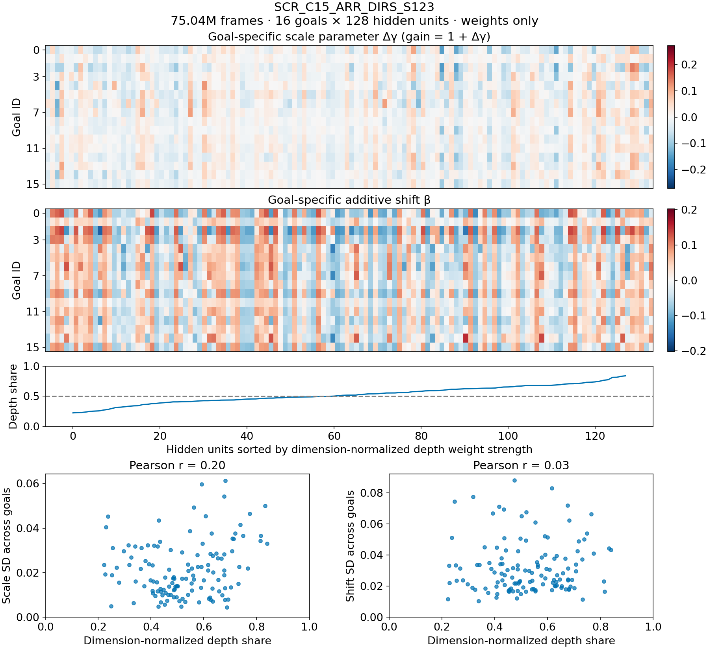
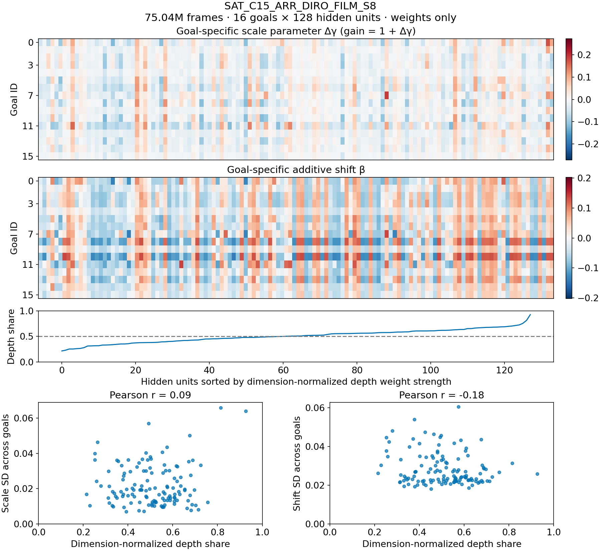
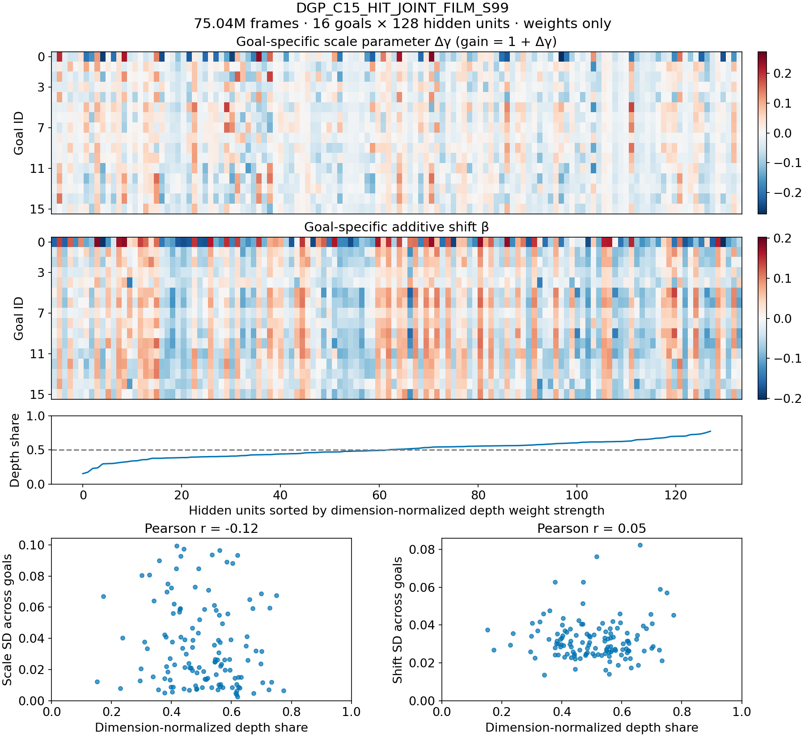

# 07 — Learned FiLM parameters crossed with CA3 and depth input weights

14 September 2026. Read-only checkpoint extraction on NEMO2, local parameter analysis. Three selected historical candidates, not random seeds or replicated conditions: SCR ARR DIRS S123 and SAT ARR DIRO FiLM S8 for spatial fields; DGP HIT JOINT FiLM S99 for highest saved terminal DGP option success. All checkpoints are 75,038,720 frames. Exact paths and SHA-256 hashes are in summary.json. No rollout or activation replay was run.

## Verified architecture

Each decoder state layer has128 outputs and1149 inputs:1136 CA3 values (16 identities ×71 positions),10 depth values,3 numerical-instruction values. No geometry/motion policy input. The target is removed from the ordinary state input and selects one row of a16×256 FiLM table. Each hidden unit mixes modalities; there is no architectural division into depth and CA3 neurons.

$$h_k=\mathrm{ReLU}(W_{C,k}C+W_{D,k}d+W_{I,k}i+b_k),\qquad h_{g,k}=(1+\Delta\gamma_{g,k})h_k+eta_{g,k}.$$

The instruction bypass is distinct from the commanded landmark goal and is retained separately in per_unit.csv. The next shared linear/ReLU layer feeds actor and critic. Therefore parameter differences need not survive as action differences.

## Cross-goal findings

Cross-goal spread is population SD over16 goals, summarized by RMS over128 hidden units. Scale spread is in multiplicative-gain units; shift spread is in hidden activation units and must not be compared numerically with scale spread as an effect size.

| Run | RMS cross-goal scale SD | RMS cross-goal shift SD | Goal-specific fraction of shift energy | Depth-weight versus scale-spread r | Depth-weight versus shift-spread r |
|---|---:|---:|---:|---:|---:|
| SCR_C15_ARR_DIRS_S123 | 0.0247 | 0.0363 | 34.6% | 0.196 | 0.032 |
| SAT_C15_ARR_DIRO_FILM_S8 | 0.0247 | 0.0294 | 22.7% | 0.089 | -0.180 |
| DGP_C15_HIT_JOINT_FILM_S99 | 0.0443 | 0.0341 | 30.7% | -0.122 | 0.051 |

FiLM has learned nonzero, goal-varying parameters. Goal-specific scale variation is modest (typical cross-goal SD2.5–4.4%). Most shift-table energy is common across goals:65–77%, calculated by decomposing each column into its goal mean and centered residual. This common shift can adjust the shared controller without distinguishing commands. It is not evidence that all goal rows are identical. No actual gain1+delta_gamma is negative.

There is no consistent association between dimension-normalized depth weight strength and cross-goal FiLM spread: descriptive correlations are small and change sign across runs. No significance test is justified by treating128 units as independent experimental replicates. Goal IDs and hidden units are not aligned across different runs.

## Input-weight attribution and its limits

For each hidden unit use

$$q_{D,k}=rac{\|W_{D,k}\|_2^2/10}{\|W_{D,k}\|_2^2/10+\|W_{C,k}\|_2^2/1136}.$$

This compares squared weight magnitude per input coordinate. Median q_D is0.518,0.507,0.508 for SCR,SAT,DGP. In contrast, depth's median share of total squared weight energy is only0.94%,0.90%,0.90%, because CA3 has113.6 times as many coordinates. Both summaries are weight diagnostics. Neither proves behavioral dominance, since CA3 is sparse and temporally correlated, depth has a different scale, and ReLU changes the active computation. The three instruction coordinates are excluded from this two-way ratio and recorded separately.

Actual contribution requires replayed inputs: compare W_C C_t and W_D d_t on the same states, including means, variances and covariance, then measure effects on action probabilities under each goal. Small weights can dominate with large inputs, while large correlated weights can cancel. This checkpoint-only audit therefore does not establish which modality dominates behavior.

## Figures

Each figure uses identical color limits across runs. Columns are independently sorted by q_D within a run; the depth-share curve identifies the order. Heatmaps show raw learned delta_gamma and beta, not centered or activation-weighted effects. Scatterplots show each hidden unit's cross-goal parameter SD against q_D. Numerical unit IDs are preserved in per_unit.csv and sort orders in NPZ files.

[Vector PDF](results/film_input_audit_20260914/SCR_C15_ARR_DIRS_S123.pdf).

[Vector PDF](results/film_input_audit_20260914/SAT_C15_ARR_DIRO_FILM_S8.pdf).

[Vector PDF](results/film_input_audit_20260914/DGP_C15_HIT_JOINT_FILM_S99.pdf).

## Interpretation for goal-specific control

The failure is not simply that FiLM stayed at initialization. The next diagnostic should test whether goal-dependent changes are expressed in active hidden units and survive the output layer as action differences. The current audit finds no consistent weight-level evidence that goal modulation preferentially controls depth-driven versus memory-driven units. It does not establish effective policy specialization or its absence from weights alone.

Artifacts: [summary and hashes](results/film_input_audit_20260914/summary.json), [per-unit measurements](results/film_input_audit_20260914/per_unit.csv), [per-goal measurements](results/film_input_audit_20260914/per_goal.csv), [plotting/analysis script](analyze_film_input_weights_20260914.py), [remote extraction script](export_film_checkpoint_weights_20260914.py). Extracted parameter tables and config snapshots are preserved in checkpoint_extract.json; all heavy checkpoints stayed on NEMO2.

Workflow lesson: verified input dimensions and ordering before assigning modalities; kept the instruction bypass separate; compared per-coordinate and total weight energy to expose dimensional bias. Exclude best-score checkpoint filenames before parsing frame counts. For future behavioral dominance claims, collect actual decoder inputs instead of inferring activity from weight norms. Figures use a verified scalable DejaVu Sans font and all three previews were visually inspected. No training, jobs, or checkpoint files were modified.
