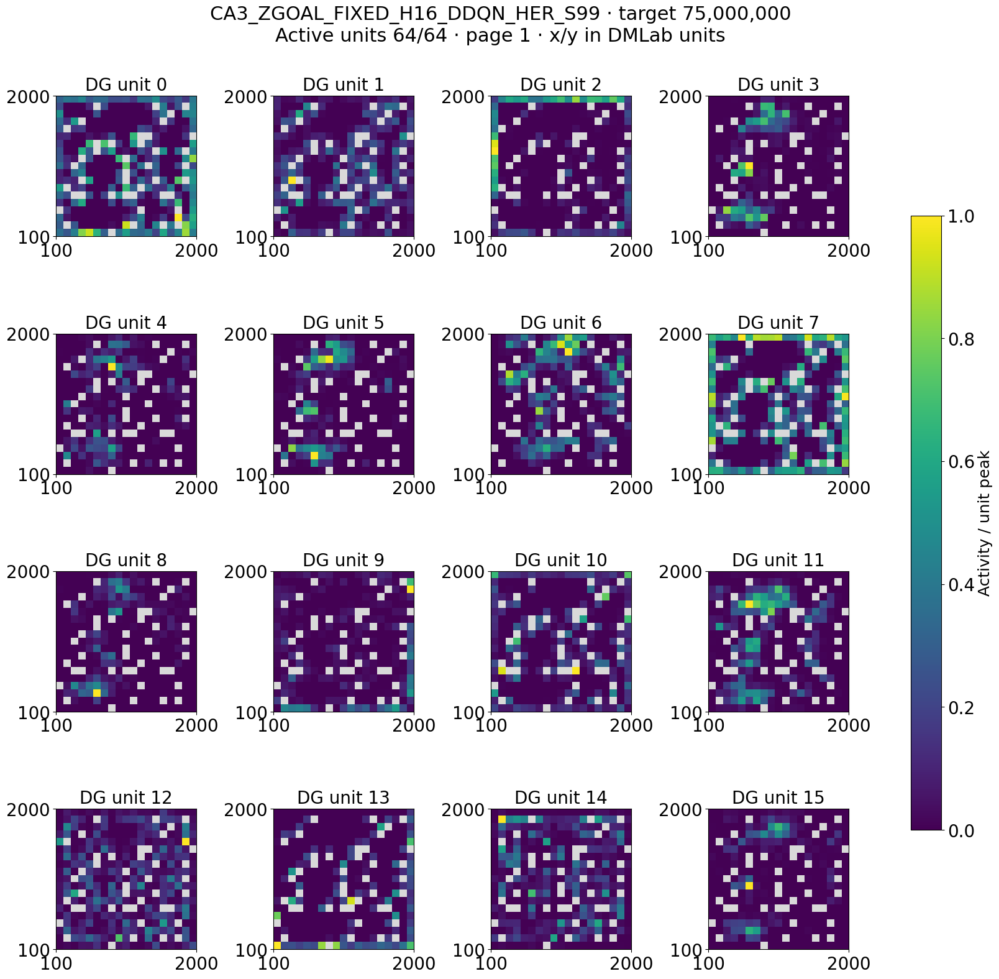
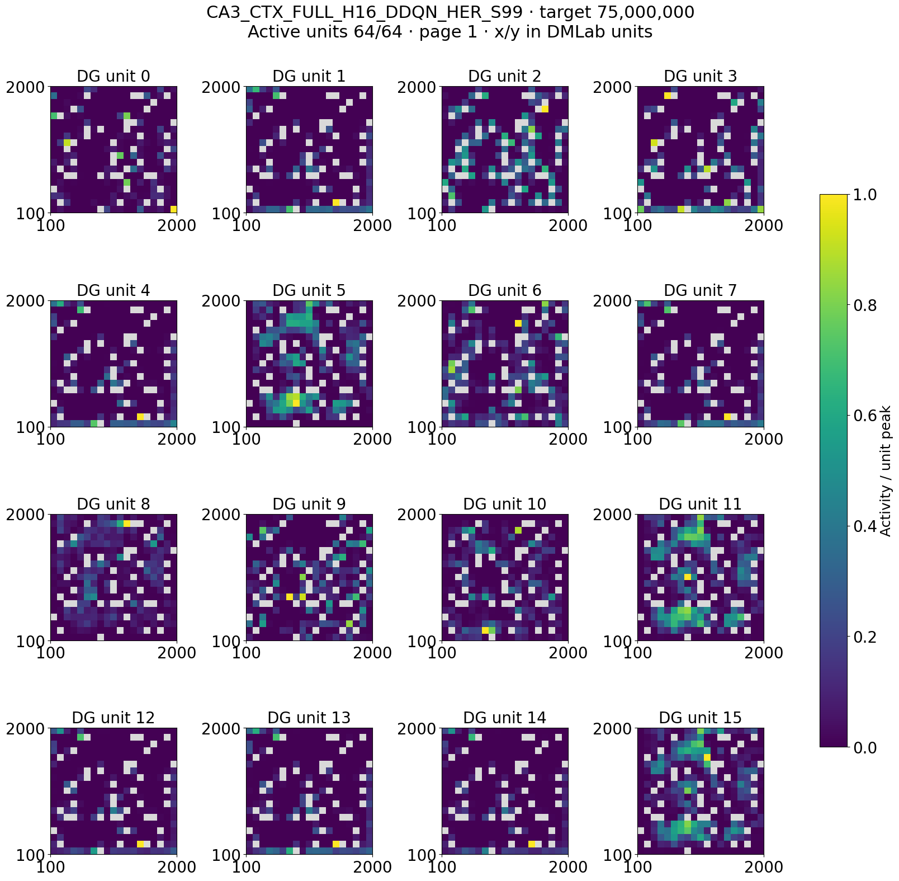
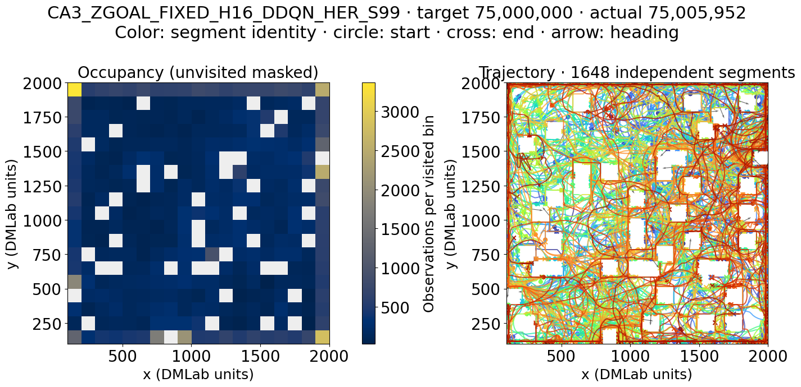
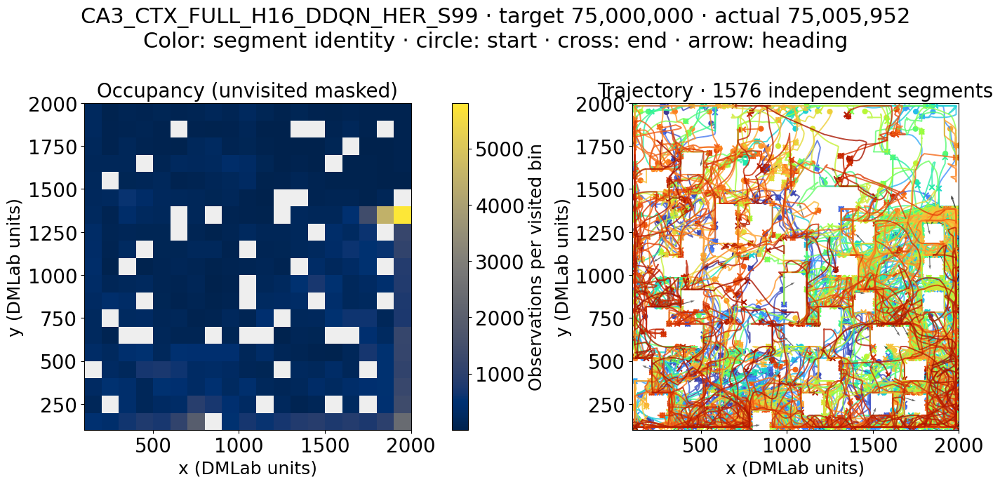
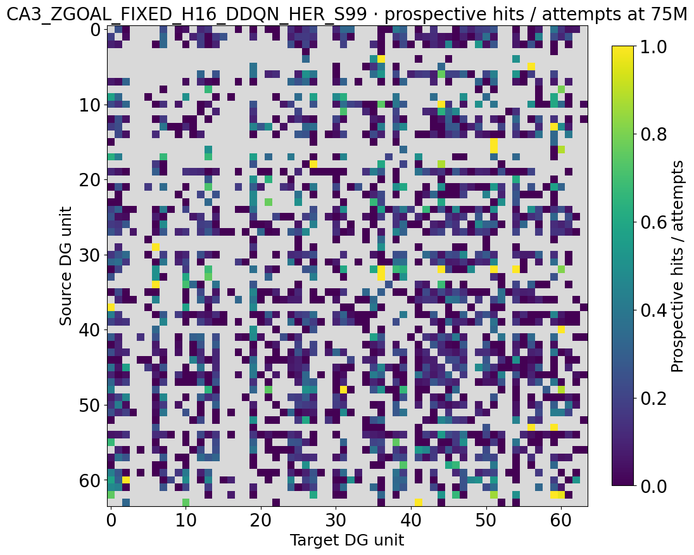
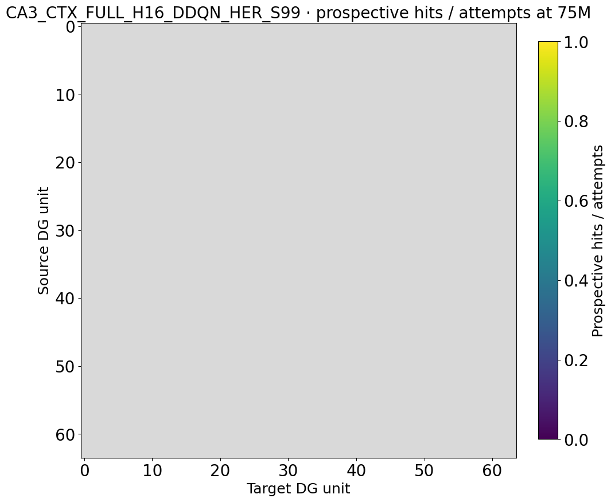

# CA3 predictive active goals: matched 75M interim analysis

## Architecture factorization

| Factor | Levels in the seven-cell matrix | What the factor asks |
| --- | --- | --- |
| DG / CA3 foundation | F64 DG + fixed CA3 shift register in every cell | Held fixed |
| Learned state readout | Off in BASE_ID; shadow in PRED_SHADOW; used as worker state in ZSTATE/ZGOAL/CTX | Does predictive CA3 compression provide useful state? |
| Goal representation | DG target ID versus continuous readout-state goal | Does temporal context define a better destination identity? |
| Context recognition | None/fixed comparator versus confirmed contextual anchors and hits | Does contextual recognition resolve DG aliasing? |
| Predictor action input | Full action-conditioned versus NOACTION | Does action history add predictive state information? |
| Prediction horizon | H16 versus H32 | How much temporal context is useful? |
| Controller / replay | Stored DDQN+HER + waypoint manager in all cells | Held fixed across the seven-way architecture matrix |

The primary clean contrast is CTX_FULL_H16 minus ZGOAL_FIXED_H16; the other rows diagnose components. Cross-report context: [[README|factorized experiment synthesis]].

**Analysis date:** 24 September 2026. **Status:** All 21 production runs are active and have online spatial snapshots at 5M, 25M, and 75M. Nine also have 150M snapshots; those nine do not form a complete seven-architecture, three-seed comparison. The declared horizon is 300M. This report uses the balanced 75M panel.

## The architecture in plain terms

The agent starts from fixed ImageNet visual features. A trainable DG projection creates sparse landmark events. CA3 holds recent, goal-independent DG history, so the raw CA3 vector $S_t$ describes more than the current image. A learned readout $z_t = W S_t$ compresses that memory into a 16-dimensional candidate state. An action-conditioned predictor learns whether $z_t$ contains information about future DG events over 16 or 32 decisions. This is an auxiliary representation objective: it owns $W$ and the predictor; worker RL and HER do not directly train $W$.

The worker uses stored action-time state and learns with DDQN plus HER under a fixed update budget. A goal can be an old DG target ID or a continuous readout state. A continuous goal is produced from a real CA3 endpoint under the current readout; a DG slot remains an address for graph bookkeeping. Contextual arms register confirmed anchor states, restrict online selection to active slots, and use context-sensitive recognition to decide whether a goal was reached. Coordinates are used only by offline telemetry.

## What the seven cells isolate

| Cell | Worker state | Goal | Anchor/recognition rule | Comparison purpose |
|---|---|---|---|---|
| `BASE_ID` | Parent memory | DG target ID | No contextual anchor | Existing ID-goal reference |
| `PRED_SHADOW_H16` | Parent memory | DG target ID | None; readout trains in shadow | Checks the auxiliary readout without putting it in the policy path |
| `ZSTATE_ID_H16` | Readout $z$ | DG target ID | None | Tests compressed worker state alone |
| `ZGOAL_FIXED_H16` | Readout $z$ | Continuous readout goal | Fixed anchor; no contextual hits | Continuous-goal comparator for the primary contrast |
| `CTX_FULL_H16` | Readout $z$ | Continuous readout goal | Confirmed contextual anchors and hits | Complete 16-decision mechanism |
| `CTX_NOACTION_H16` | Readout $z$ | Continuous readout goal | Same contextual mechanism, predictor omits action conditioning | Tests whether action information matters |
| `CTX_FULL_H32` | Readout $z$ | Continuous readout goal | Complete contextual mechanism | Tests a 32-decision prediction horizon |

All seven cells share F64 DG capacity, the navigation-eight action set, the fixed trunk, the waypoint manager, and stored DDQN+HER. The primary declared contrast is `CTX_FULL_H16 - ZGOAL_FIXED_H16`: it asks whether contextual registration and hit recognition add value beyond continuous readout goals. The other contrasts are diagnostic; the matrix does not separately vary every implementation detail.

## Matched 75M spatial results

Each table entry is the mean of seeds 8, 99, and 123 at its declared 75M online snapshot. `Mono` is the fraction of eligible units with one detected spatial field; `cosine` is the active-only overlap of spatial maps. Lower cosine is less overlap, but can coexist with multiple fields. `Reachable` measures connectivity of the reliable internal graph. Grounded controllability combines graph and observed command outcomes; it is 0 in every row here.

| Architecture | Cosine | Mono | Distinct DG peak bins | Reliable edges | Reachable pairs | Grounded control |
|---|---:|---:|---:|---:|---:|---:|
| BASE_ID | 0.272 | 0.094 | 43.7 | 13.0 | 0.004 | 0.000 |
| PRED_SHADOW_H16 | 0.242 | 0.102 | 38.7 | 12.3 | 0.004 | 0.000 |
| ZSTATE_ID_H16 | 0.230 | 0.177 | 40.7 | 39.7 | 0.016 | 0.000 |
| ZGOAL_FIXED_H16 | 0.227 | 0.120 | 46.7 | 43.3 | 0.031 | 0.000 |
| CTX_FULL_H16 | 0.259 | 0.017 | 46.0 | 2.0 | 0.001 | 0.000 |
| CTX_NOACTION_H16 | 0.220 | 0.083 | 45.3 | 1.7 | 0.000 | 0.000 |
| CTX_FULL_H32 | 0.207 | 0.053 | 47.7 | 0.3 | 0.000 | 0.000 |

The primary contextual-minus-fixed comparison is unfavorable for the internal graph at this age: `CTX_FULL_H16` has fewer reliable edges in all three paired seeds (46, 37, and 41 fewer), and fewer mono-field units in all three. Map overlap moves in different directions by seed. The H32 contextual variant lowers map overlap in all three seeds relative to H16, yet still has almost no reliable edges. Removing action conditioning also lowers map overlap in all three seeds, but that observation alone says nothing about the predictor's actual action sensitivity or useful control.

The individual edge counts are 0, 2, and 4 for contextual H16 versus 39, 41, and 50 for fixed readout goals. Thus the mean gap does not depend on one outlier seed. Mono-field fractions vary more widely, especially in the fixed arm; the per-seed direction is more informative than a precision estimate from only three seeds.

The graph gap is present throughout the matched schedule. Mean reliable edges for `ZGOAL_FIXED_H16` rise from 18.3 at 5M to 24.7 at 25M and 43.3 at 75M. `CTX_FULL_H16` remains at 0.3, 1.3, and 2.0 at those same checkpoints. Its mono-field fraction also falls from 0.146 at 5M to zero at 25M and 0.017 at 75M. These are changing-policy online snapshots; they do not establish fixed-trajectory representation drift, but they show that the 75M graph difference is not a one-checkpoint anomaly.

## Seed-99 place-field and trajectory atlas at 75M

The canonical `segmented-atlas/v1` figures render the retained *online training window* for fields and trajectories at the matched 75M target; the directed matrices render graph counters stored at that checkpoint, not counts restricted to the window. They are not frozen-policy rollouts. Each DG unit is scaled by its own peak, with a common 0–1 display scale; gray cells were unvisited. All 64 units were active in these selected windows, but active does not mean mono-field. Trajectory colors identify independent stored segments, not time or speed; starts are circles and ends are crosses. These panels help inspect the reported map and graph statistics without making a claim about commanded navigation.

The primary comparator is fixed readout goals versus full contextual registration. The examples below show units 0–15 and their visited paths; inspect all four unit pages through the index afterward.

Matrix rows are source DG units and columns target units; color is prospective hits / attempts on a fixed 0–1 scale, while gray means unattempted. These are not reliable-edge adjacency matrices and cannot establish command-caused arrival. [Fixed-goal segment examples](results/recent_architecture_batches_20260924/predictive/CA3_ZGOAL_FIXED_H16_DDQN_HER_S99/target_000075000000_policy_00_segments.png) · [contextual-goal segment examples](results/recent_architecture_batches_20260924/predictive/CA3_CTX_FULL_H16_DDQN_HER_S99/target_000075000000_policy_00_segments.png).

The graph-buffer totals make the visual gap precise across all three seeds: fixed readout goals have 281,140–298,106 prospective attempts at 75M, whereas full contextual H16 has 0–18. Seed 99's entirely gray contextual matrix means *no recorded prospective attempts*, not universal failure after an attempt. This locates much of the graph-density difference upstream of reliable-edge thresholding, but the current data still cannot separate low goal availability from over-selective context recognition or another upstream gate.

Full seven-cell atlas (each page contains 16 distinct DG units):

| Architecture | DG units 0–15 | 16–31 | 32–47 | 48–63 | Occupancy and trajectory |
|---|---|---|---|---|---|
| BASE_ID | [page 1](results/recent_architecture_batches_20260924/predictive/CA3_BASE_ID_DDQN_HER_S99/target_000075000000_policy_00_place_fields_page01.png) | [page 2](results/recent_architecture_batches_20260924/predictive/CA3_BASE_ID_DDQN_HER_S99/target_000075000000_policy_00_place_fields_page02.png) | [page 3](results/recent_architecture_batches_20260924/predictive/CA3_BASE_ID_DDQN_HER_S99/target_000075000000_policy_00_place_fields_page03.png) | [page 4](results/recent_architecture_batches_20260924/predictive/CA3_BASE_ID_DDQN_HER_S99/target_000075000000_policy_00_place_fields_page04.png) | [trajectory](results/recent_architecture_batches_20260924/predictive/CA3_BASE_ID_DDQN_HER_S99/target_000075000000_policy_00_trajectory.png) |
| PRED_SHADOW_H16 | [page 1](results/recent_architecture_batches_20260924/predictive/CA3_PRED_SHADOW_H16_DDQN_HER_S99/target_000075000000_policy_00_place_fields_page01.png) | [page 2](results/recent_architecture_batches_20260924/predictive/CA3_PRED_SHADOW_H16_DDQN_HER_S99/target_000075000000_policy_00_place_fields_page02.png) | [page 3](results/recent_architecture_batches_20260924/predictive/CA3_PRED_SHADOW_H16_DDQN_HER_S99/target_000075000000_policy_00_place_fields_page03.png) | [page 4](results/recent_architecture_batches_20260924/predictive/CA3_PRED_SHADOW_H16_DDQN_HER_S99/target_000075000000_policy_00_place_fields_page04.png) | [trajectory](results/recent_architecture_batches_20260924/predictive/CA3_PRED_SHADOW_H16_DDQN_HER_S99/target_000075000000_policy_00_trajectory.png) |
| ZSTATE_ID_H16 | [page 1](results/recent_architecture_batches_20260924/predictive/CA3_ZSTATE_ID_H16_DDQN_HER_S99/target_000075000000_policy_00_place_fields_page01.png) | [page 2](results/recent_architecture_batches_20260924/predictive/CA3_ZSTATE_ID_H16_DDQN_HER_S99/target_000075000000_policy_00_place_fields_page02.png) | [page 3](results/recent_architecture_batches_20260924/predictive/CA3_ZSTATE_ID_H16_DDQN_HER_S99/target_000075000000_policy_00_place_fields_page03.png) | [page 4](results/recent_architecture_batches_20260924/predictive/CA3_ZSTATE_ID_H16_DDQN_HER_S99/target_000075000000_policy_00_place_fields_page04.png) | [trajectory](results/recent_architecture_batches_20260924/predictive/CA3_ZSTATE_ID_H16_DDQN_HER_S99/target_000075000000_policy_00_trajectory.png) |
| ZGOAL_FIXED_H16 | [page 1](results/recent_architecture_batches_20260924/predictive/CA3_ZGOAL_FIXED_H16_DDQN_HER_S99/target_000075000000_policy_00_place_fields_page01.png) | [page 2](results/recent_architecture_batches_20260924/predictive/CA3_ZGOAL_FIXED_H16_DDQN_HER_S99/target_000075000000_policy_00_place_fields_page02.png) | [page 3](results/recent_architecture_batches_20260924/predictive/CA3_ZGOAL_FIXED_H16_DDQN_HER_S99/target_000075000000_policy_00_place_fields_page03.png) | [page 4](results/recent_architecture_batches_20260924/predictive/CA3_ZGOAL_FIXED_H16_DDQN_HER_S99/target_000075000000_policy_00_place_fields_page04.png) | [trajectory](results/recent_architecture_batches_20260924/predictive/CA3_ZGOAL_FIXED_H16_DDQN_HER_S99/target_000075000000_policy_00_trajectory.png) |
| CTX_FULL_H16 | [page 1](results/recent_architecture_batches_20260924/predictive/CA3_CTX_FULL_H16_DDQN_HER_S99/target_000075000000_policy_00_place_fields_page01.png) | [page 2](results/recent_architecture_batches_20260924/predictive/CA3_CTX_FULL_H16_DDQN_HER_S99/target_000075000000_policy_00_place_fields_page02.png) | [page 3](results/recent_architecture_batches_20260924/predictive/CA3_CTX_FULL_H16_DDQN_HER_S99/target_000075000000_policy_00_place_fields_page03.png) | [page 4](results/recent_architecture_batches_20260924/predictive/CA3_CTX_FULL_H16_DDQN_HER_S99/target_000075000000_policy_00_place_fields_page04.png) | [trajectory](results/recent_architecture_batches_20260924/predictive/CA3_CTX_FULL_H16_DDQN_HER_S99/target_000075000000_policy_00_trajectory.png) |
| CTX_NOACTION_H16 | [page 1](results/recent_architecture_batches_20260924/predictive/CA3_CTX_NOACTION_H16_DDQN_HER_S99/target_000075000000_policy_00_place_fields_page01.png) | [page 2](results/recent_architecture_batches_20260924/predictive/CA3_CTX_NOACTION_H16_DDQN_HER_S99/target_000075000000_policy_00_place_fields_page02.png) | [page 3](results/recent_architecture_batches_20260924/predictive/CA3_CTX_NOACTION_H16_DDQN_HER_S99/target_000075000000_policy_00_place_fields_page03.png) | [page 4](results/recent_architecture_batches_20260924/predictive/CA3_CTX_NOACTION_H16_DDQN_HER_S99/target_000075000000_policy_00_place_fields_page04.png) | [trajectory](results/recent_architecture_batches_20260924/predictive/CA3_CTX_NOACTION_H16_DDQN_HER_S99/target_000075000000_policy_00_trajectory.png) |
| CTX_FULL_H32 | [page 1](results/recent_architecture_batches_20260924/predictive/CA3_CTX_FULL_H32_DDQN_HER_S99/target_000075000000_policy_00_place_fields_page01.png) | [page 2](results/recent_architecture_batches_20260924/predictive/CA3_CTX_FULL_H32_DDQN_HER_S99/target_000075000000_policy_00_place_fields_page02.png) | [page 3](results/recent_architecture_batches_20260924/predictive/CA3_CTX_FULL_H32_DDQN_HER_S99/target_000075000000_policy_00_place_fields_page03.png) | [page 4](results/recent_architecture_batches_20260924/predictive/CA3_CTX_FULL_H32_DDQN_HER_S99/target_000075000000_policy_00_place_fields_page04.png) | [trajectory](results/recent_architecture_batches_20260924/predictive/CA3_CTX_FULL_H32_DDQN_HER_S99/target_000075000000_policy_00_trajectory.png) |

Additional segment/graph pairs: BASE_ID [segments](results/recent_architecture_batches_20260924/predictive/CA3_BASE_ID_DDQN_HER_S99/target_000075000000_policy_00_segments.png) / [graph](results/recent_architecture_batches_20260924/predictive/CA3_BASE_ID_DDQN_HER_S99/target_000075000000_policy_00_graph.png); PRED_SHADOW_H16 [segments](results/recent_architecture_batches_20260924/predictive/CA3_PRED_SHADOW_H16_DDQN_HER_S99/target_000075000000_policy_00_segments.png) / [graph](results/recent_architecture_batches_20260924/predictive/CA3_PRED_SHADOW_H16_DDQN_HER_S99/target_000075000000_policy_00_graph.png); ZSTATE_ID_H16 [segments](results/recent_architecture_batches_20260924/predictive/CA3_ZSTATE_ID_H16_DDQN_HER_S99/target_000075000000_policy_00_segments.png) / [graph](results/recent_architecture_batches_20260924/predictive/CA3_ZSTATE_ID_H16_DDQN_HER_S99/target_000075000000_policy_00_graph.png); CTX_NOACTION_H16 [segments](results/recent_architecture_batches_20260924/predictive/CA3_CTX_NOACTION_H16_DDQN_HER_S99/target_000075000000_policy_00_segments.png) / [graph](results/recent_architecture_batches_20260924/predictive/CA3_CTX_NOACTION_H16_DDQN_HER_S99/target_000075000000_policy_00_graph.png); CTX_FULL_H32 [segments](results/recent_architecture_batches_20260924/predictive/CA3_CTX_FULL_H32_DDQN_HER_S99/target_000075000000_policy_00_segments.png) / [graph](results/recent_architecture_batches_20260924/predictive/CA3_CTX_FULL_H32_DDQN_HER_S99/target_000075000000_policy_00_graph.png).

The atlas compares map shapes and visited paths at one seed; the numerical table remains the three-seed result. It cannot explain the contextual graph collapse without accepted-event and recognition diagnostics.

## Scientific reading

The early result does not support a claim that contextual goals have improved navigation. It points to a narrower failure location: adding contextual registration/hit recognition to continuous readout goals coincides with a much sparser reliable graph, despite a similar number of distinct DG peak bins. The internal graph may be starved by strict recognition, poor calibration, weak repeatability, or another interaction. These are hypotheses; the online map table alone cannot identify which mechanism causes the loss.

The shadow and z-state rows matter because they preserve a progression from unused auxiliary representation to worker-facing representation and then to continuous goals. At 75M, `ZSTATE_ID_H16` has the highest mono-field fraction and a more populated graph than the baseline; `ZGOAL_FIXED_H16` has the largest mean reliable-edge count. Neither has nonzero grounded control, so these are representation/graph observations rather than successful goal-conditioning results.

## Required next evidence

At the next complete matched checkpoint, examine the canonical coverage AUC and option outcomes together with readout prediction/shuffle diagnostics, active-goal count, calibration readiness, recognition ambiguity, and HER positive/wrong-context events. A standardized 70M–75M TensorBoard scan was attempted, but selected resumed runs have stale event files in the collector's discovered `.summary/0` path despite later spatial snapshots; the full scalar comparison is not validated here. Verify complete per-run scalar histories or use an explicitly documented alternate source before calculating this panel. Use the manifest-driven frozen evaluator to inspect place fields and contextual aliasing, then controlled matched-command interventions for causal goal choice. Do not interpret the partial 150M inventory as a seven-cell comparison.

## Provenance and reusable lesson

- Study schema `intrmotiv/study/v1`; declared workflow 1.10.1; StudySpec SHA-256 `74346c29bb7e065082e1cf6682943f0b0f366924c17fb11d5d55ac16da2467f5`.
- Canonical definition: [ca3_predictive_active_goals_production.study.json](../hpc_runs/studies/ca3_predictive_active_goals_production.study.json). Release and qualification record: [CA3 predictive active goals](ca3_predictive_active_goals_20260922.md).
- Authoritative interim output: `/work/classic/fr_xl1014-corridor-geometry/IntrMotiv/SF_hipposlam/train_dir/analysis/ca3_predictive_active_goals_20260924_interim_spatial/` (`per_snapshot.csv`, `snapshot_inventory.csv`, `analysis_manifest.json`); atlas source: adjacent `ca3_predictive_active_goals_20260924_interim_atlas/figures/`. Its collector used workflow 1.10.1 and found 21 snapshots at each of 5M, 25M, and 75M plus nine at 150M. The report copies only PNGs; the workspace retains scalable PDFs.

The canonical collector provided a balanced comparison without parsing condition names or rereading raw NPZ fields by hand. It reports `complete=false` because later declared targets remain pending; that is expected for a live 300M study. A workflow-version check before collection prevents misreading a loader failure as missing science data.
