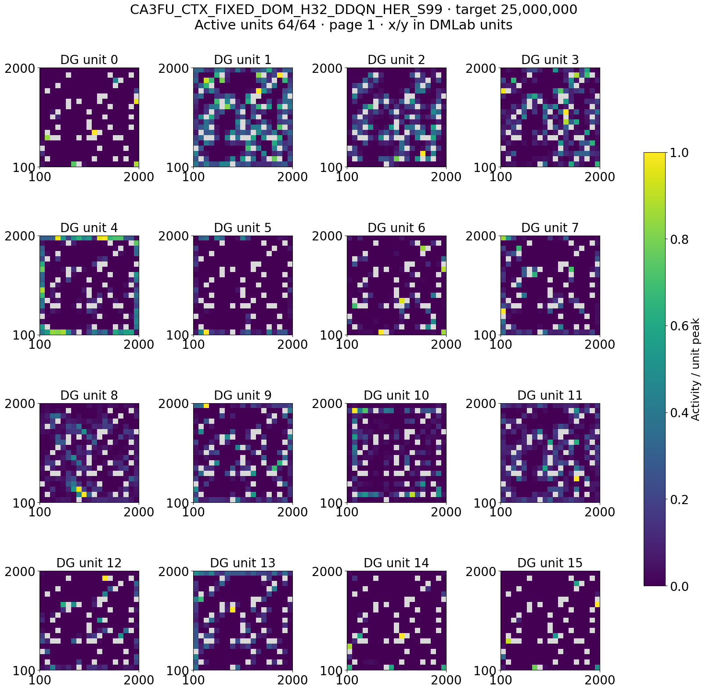
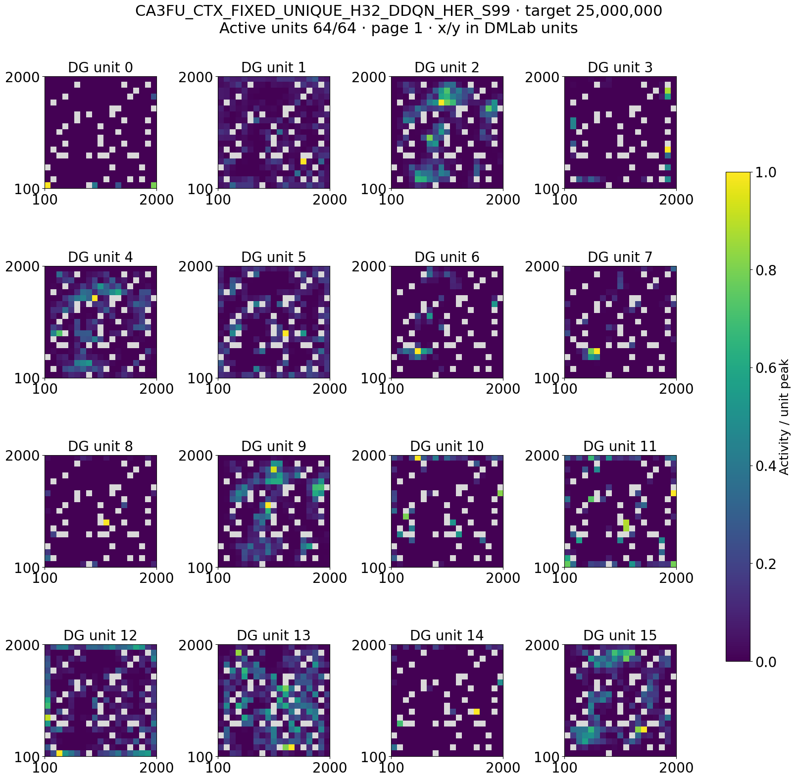
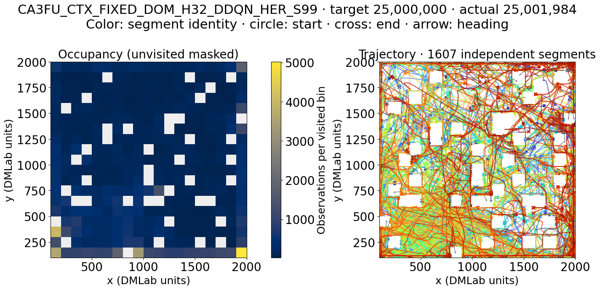
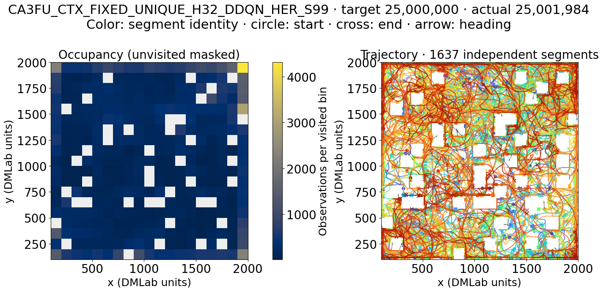
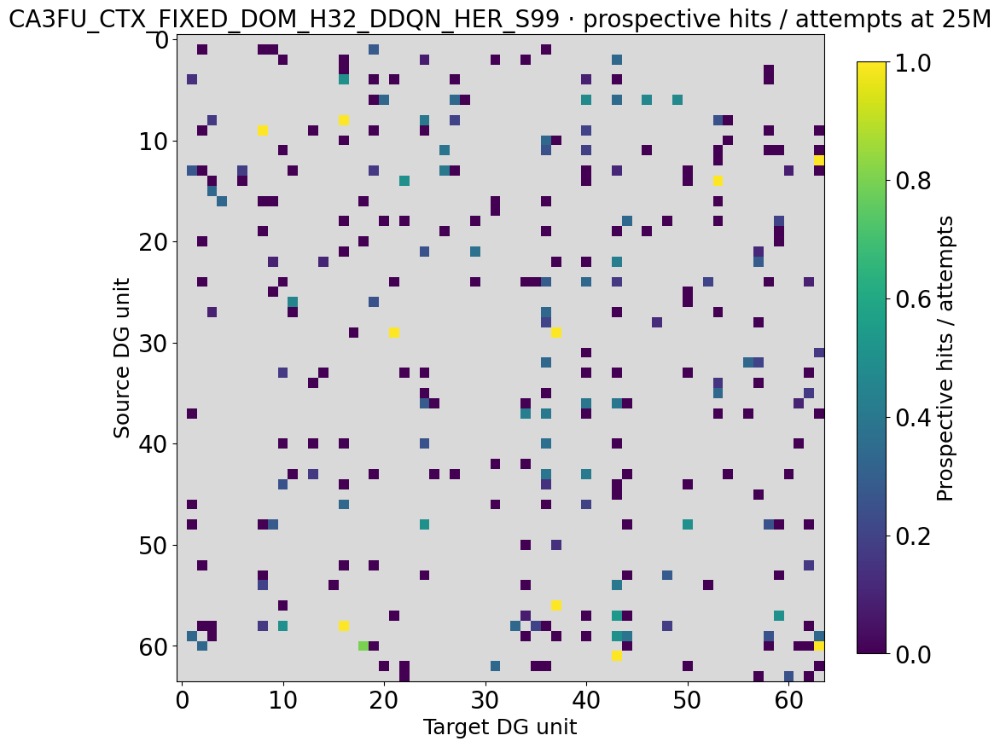
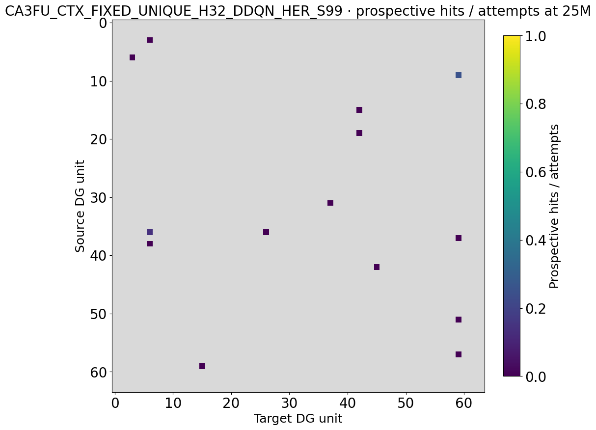
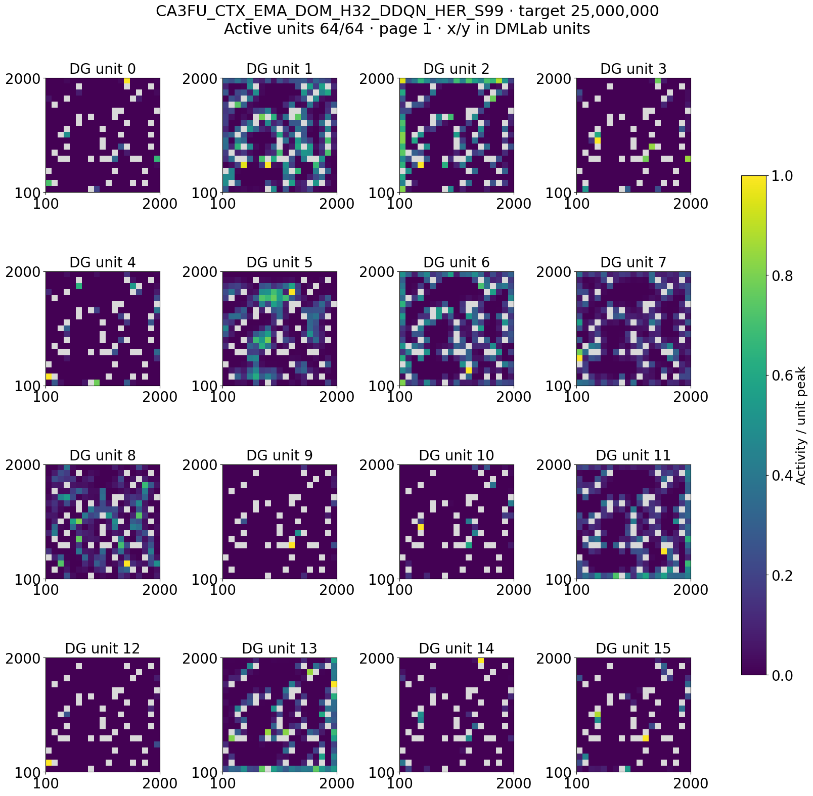
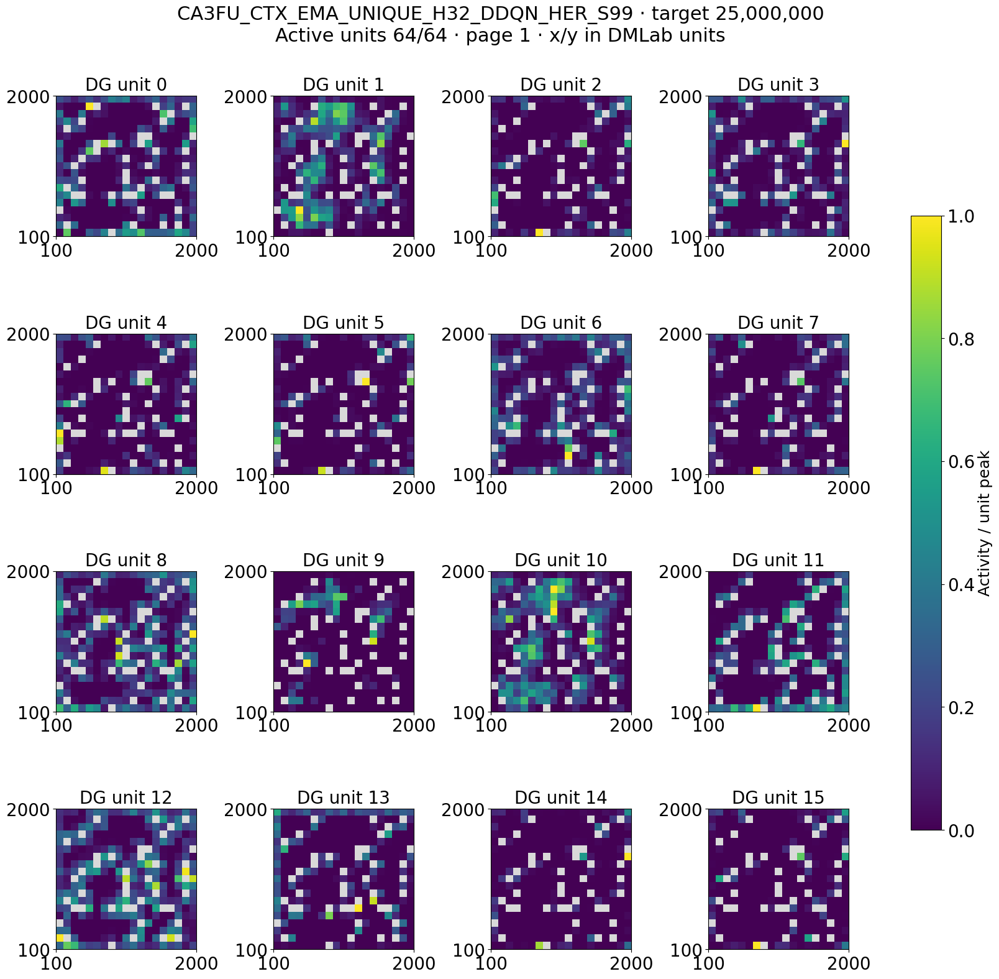

# CA3 state-goal follow-up: matched 25M interim analysis

## Architecture factorization

| Factor | Levels | Held fixed |
| --- | --- | --- |
| State / goal representation | Predictive CA3 readout z; continuous z-goal; H32 | Fixed across all four cells |
| Controller / replay | Stored DDQN+HER, waypoint/context graph | Fixed |
| Anchor maintenance | FIXED first confirmed anchor versus EMA prototype-guided representative refinement | First factorial factor |
| Candidate admission | DOM strongest raw DG event versus UNIQUE exactly-one contextual anchor match | Second factorial factor |
| Context hit rule | Contextual recognition enabled | Fixed |
| DG capacity / environment | F64, established reward-free open field | Fixed |
| Declared contrasts | EMA main effect, UNIQUE main effect, interaction, UNIQUE-DOM within anchor mode | These are the appropriate causal comparisons |

Cross-report context: [[README|factorized experiment synthesis]].

**Analysis date:** 24 September 2026. **Scope:** NEMO2 CPU production StudySpec `ca3_state_goal_followup_20260922_production`, twelve 300M-frame runs. All twelve have 5M and 25M online spatial snapshots; ten have 75M. The two missing 75M rows are the fixed-anchor seed-8 conditions, so the 25M checkpoint is the balanced comparison. The separate G500 production release is documented in [its release record](ca3_state_goal_followup_20260922.md) and is not pooled here.

**Later restricted comparison:** the ten 75M rows contain both seeds 99 and 123 in all four factorial cells, so they support a complete two-seed 2×2 comparison. The two additional rows are EMA seed 8 and can support a separate EMA-only comparison. The fixed-anchor seed-8 rows are missing, so no full three-seed factorial is available at 75M. The canonical 75M table has now been copied into the screening artifact bundle and the two-seed matched factorial is summarized below. Do not fold the two extra EMA seed-8 rows into this factorial.

## What changed from the predictive batch

This follow-up holds the readout-goal architecture fixed: the worker receives a 16-dimensional state readout of raw CA3 memory; the prediction horizon is 32 decisions; the predictor receives actions; goals are continuous readout states; active graph slots and contextual hit checks are enabled. The learned readout receives prediction loss and variance/covariance anti-collapse terms. Stored DDQN+HER remains the worker learner. The change under test is how an accepted contextual identity is maintained and which candidate event is allowed to update the graph.

An **anchor** is a stored CA3 state associated with one active graph slot. `FIXED` keeps the first confirmed anchor. `EMA` maintains a moving prototype of confirmed predictive signatures and may replace the stored anchor with a more representative confirmed occurrence, preserving the slot's semantic identity and graph edges. This is a same-identity refinement, not a new goal slot.

`DOM` takes the strongest raw DG candidate. `UNIQUE` evaluates contextual recognition over selectable active anchors and accepts an event when exactly one anchor matches. It can rescue a valid landmark when several DG units fire, but it can also abstain when zero or several contextual anchors match. The factorial is:

| Cell | Anchor maintenance | Candidate admission |
|---|---|---|
| `CTX_FIXED_DOM_H32` | Fixed first anchor | Dominant DG event |
| `CTX_FIXED_UNIQUE_H32` | Fixed first anchor | Exactly one contextual match |
| `CTX_EMA_DOM_H32` | EMA signature refinement | Dominant DG event |
| `CTX_EMA_UNIQUE_H32` | EMA signature refinement | Exactly one contextual match |

Each cell has seeds 8, 99, and 123. The declared contrasts are the EMA main effect, unique-candidate main effect, their interaction, and unique-versus-dominant within each anchor mode. Those paired contrasts are the correct way to judge the two factors.

## Matched 25M online spatial results

Values are three-seed means at the declared 25M snapshot. `Mono` is the fraction of eligible DG units with one field. `Cosine` is active-only map overlap. `Reliable edges` and `reachable pairs` describe the internal graph; neither by itself proves command-caused travel.

| Anchor / candidate | Cosine | Mono | Distinct DG peak bins | Reliable edges | Reachable pairs | Grounded control |
|---|---:|---:|---:|---:|---:|---:|
| Fixed / dominant | 0.186 | 0.047 | 42.3 | 23.0 | 0.007 | 0.000 |
| Fixed / unique | 0.209 | 0.102 | 45.0 | 0.3 | 0.000 | 0.000 |
| EMA / dominant | 0.276 | 0.052 | 40.0 | 28.0 | 0.008 | 0.000 |
| EMA / unique | 0.280 | 0.188 | 38.0 | 1.0 | 0.000 | 0.000 |

Within fixed anchors, unique contextual admission raises mono-field fraction in all three paired seeds but removes 36, 17, and 15 reliable edges relative to dominant admission. Within EMA anchors, it removes 32, 21, and 28 edges; mono-field fraction improves in two seeds and is effectively unchanged in one. This is a strong early graph-density association with the candidate rule. Because the graph construction depends on accepted events, the result is consistent with frequent `UNIQUE` abstention, but the table alone does not measure abstention.

At the per-run level, unique arms have only 0–2 reliable edges, whereas dominant arms have 15–36. The graph gap is consistent across both anchor modes and all three paired seeds; the mono-field advantage is less consistent.

Fixed anchors have lower mean map overlap than EMA in both candidate-rule strata, but the fixed-minus-EMA difference is not consistent in all three seeds for the dominant rule. The EMA mechanism needs its actual refinement counts and recognition-calibration diagnostics before it can be credited with any representation effect. All four cells have zero mean grounded controllability at 25M.

The candidate-rule graph gap grows across the first two complete checkpoints. Under fixed anchors, dominant/unique mean reliable edges are 1.3/0 at 5M and 23.0/0.3 at 25M. Under EMA, they are 16.0/4.3 at 5M and 28.0/1.0 at 25M. Thus the unique rule is already graph-sparse early, and the dominant arms add edges while unique arms do not. The 75M full three-seed factorial remains incomplete. A two-seed 75M factorial is a valid restricted follow-up, but its numeric rows are not included in the checked-in bundle and are therefore not summarized here.

## Seed-99 place-field and trajectory atlas at 25M

These canonical `segmented-atlas/v1` panels show the retained *online training windows* for fields and trajectories at the matched 25M target; directed matrices show graph counters stored at that checkpoint, not counts limited to the window. They are not frozen-policy rollouts. Each of the 64 DG units is normalized to its own peak (common 0–1 color scale), and gray cells were not visited. The selected seed-99 windows have 64/64 active units, but most do not meet the stricter mono-field criterion. The shared visitation pattern permits visual comparison of maps within a seed; it does not prove that either anchor rule improved control.

### Fixed anchor: dominant versus unique candidate

Matrix rows are source DG units, columns target units, and color is prospective hits / attempts; gray means unattempted. This matrix includes attempts that did *not* become reliable graph edges. Fixed-anchor [dominant segment examples](results/recent_architecture_batches_20260924/followup/CA3FU_CTX_FIXED_DOM_H32_DDQN_HER_S99/target_000025000000_policy_00_segments.png) · [unique segment examples](results/recent_architecture_batches_20260924/followup/CA3FU_CTX_FIXED_UNIQUE_H32_DDQN_HER_S99/target_000025000000_policy_00_segments.png).

The accumulated graph buffers corroborate sparse prospective evidence, not just a strict reliable-edge threshold: across seeds, fixed/dominant records 2,758–4,404 attempts versus 17–82 for fixed/unique; EMA/dominant records 4,136–9,911 versus 543–710 for EMA/unique. These counts are not per-decision attempt rates, and they do not by themselves identify which recognition gate suppressed opportunities.

### EMA anchor: dominant versus unique candidate

Full 64-unit sheets and occupancy/segmented trajectories:

| Anchor / candidate | DG units 16–31 | 32–47 | 48–63 | Occupancy and trajectory |
|---|---|---|---|---|
| Fixed / dominant | [page 2](results/recent_architecture_batches_20260924/followup/CA3FU_CTX_FIXED_DOM_H32_DDQN_HER_S99/target_000025000000_policy_00_place_fields_page02.png) | [page 3](results/recent_architecture_batches_20260924/followup/CA3FU_CTX_FIXED_DOM_H32_DDQN_HER_S99/target_000025000000_policy_00_place_fields_page03.png) | [page 4](results/recent_architecture_batches_20260924/followup/CA3FU_CTX_FIXED_DOM_H32_DDQN_HER_S99/target_000025000000_policy_00_place_fields_page04.png) | [trajectory](results/recent_architecture_batches_20260924/followup/CA3FU_CTX_FIXED_DOM_H32_DDQN_HER_S99/target_000025000000_policy_00_trajectory.png) |
| Fixed / unique | [page 2](results/recent_architecture_batches_20260924/followup/CA3FU_CTX_FIXED_UNIQUE_H32_DDQN_HER_S99/target_000025000000_policy_00_place_fields_page02.png) | [page 3](results/recent_architecture_batches_20260924/followup/CA3FU_CTX_FIXED_UNIQUE_H32_DDQN_HER_S99/target_000025000000_policy_00_place_fields_page03.png) | [page 4](results/recent_architecture_batches_20260924/followup/CA3FU_CTX_FIXED_UNIQUE_H32_DDQN_HER_S99/target_000025000000_policy_00_place_fields_page04.png) | [trajectory](results/recent_architecture_batches_20260924/followup/CA3FU_CTX_FIXED_UNIQUE_H32_DDQN_HER_S99/target_000025000000_policy_00_trajectory.png) |
| EMA / dominant | [page 2](results/recent_architecture_batches_20260924/followup/CA3FU_CTX_EMA_DOM_H32_DDQN_HER_S99/target_000025000000_policy_00_place_fields_page02.png) | [page 3](results/recent_architecture_batches_20260924/followup/CA3FU_CTX_EMA_DOM_H32_DDQN_HER_S99/target_000025000000_policy_00_place_fields_page03.png) | [page 4](results/recent_architecture_batches_20260924/followup/CA3FU_CTX_EMA_DOM_H32_DDQN_HER_S99/target_000025000000_policy_00_place_fields_page04.png) | [trajectory](results/recent_architecture_batches_20260924/followup/CA3FU_CTX_EMA_DOM_H32_DDQN_HER_S99/target_000025000000_policy_00_trajectory.png) |
| EMA / unique | [page 2](results/recent_architecture_batches_20260924/followup/CA3FU_CTX_EMA_UNIQUE_H32_DDQN_HER_S99/target_000025000000_policy_00_place_fields_page02.png) | [page 3](results/recent_architecture_batches_20260924/followup/CA3FU_CTX_EMA_UNIQUE_H32_DDQN_HER_S99/target_000025000000_policy_00_place_fields_page03.png) | [page 4](results/recent_architecture_batches_20260924/followup/CA3FU_CTX_EMA_UNIQUE_H32_DDQN_HER_S99/target_000025000000_policy_00_place_fields_page04.png) | [trajectory](results/recent_architecture_batches_20260924/followup/CA3FU_CTX_EMA_UNIQUE_H32_DDQN_HER_S99/target_000025000000_policy_00_trajectory.png) |

EMA extras: dominant [segment examples](results/recent_architecture_batches_20260924/followup/CA3FU_CTX_EMA_DOM_H32_DDQN_HER_S99/target_000025000000_policy_00_segments.png) and [graph matrix](results/recent_architecture_batches_20260924/followup/CA3FU_CTX_EMA_DOM_H32_DDQN_HER_S99/target_000025000000_policy_00_graph.png); unique [segments](results/recent_architecture_batches_20260924/followup/CA3FU_CTX_EMA_UNIQUE_H32_DDQN_HER_S99/target_000025000000_policy_00_segments.png) and [graph](results/recent_architecture_batches_20260924/followup/CA3FU_CTX_EMA_UNIQUE_H32_DDQN_HER_S99/target_000025000000_policy_00_graph.png).

Trajectory colors mark independent retained segments, not time or speed; starts are circles, ends crosses. These seed-99 pictures complement, but cannot replace, the paired three-seed graph and mono-field comparisons above.

## Restricted matched 75M factorial (seeds 99 and 123)

The canonical 75M snapshot table contains a complete 2×2 factorial for seeds 99
and 123. Cell summaries below use only those matched two seeds; each cell has
100,000 retained behavior samples per run. The prospective counts are pooled
over the two seed runs, while map, movement, graph-size, and reachability
columns are means of per-run summaries. These are descriptive two-seed results,
not confirmatory estimates. The source collector manifest records 34 of 60
expected snapshots overall and `include_details: false`; the 75M numeric table
is therefore reusable, while the 75M per-unit/per-field/edge details and atlas
were not produced in this bundle. The existing visual atlas remains the
complete matched 25M atlas.

| Anchor / candidate | N | Map cosine | Mono-field | Distinct peak bins | Visited grid | Stationary | Path efficiency | Reliable edges | Reachable pairs | Prospective hits / attempts | Grounded control |
|---|---:|---:|---:|---:|---:|---:|---:|---:|---:|---:|---:|
| Fixed / dominant | 2 | 0.187 | 6.8% | 47.5 | 88.1% | 13.7% | 0.512 | 19.0 | 0.632% | 7,727 / 36,475 (21.2%) | 0 |
| Fixed / unique | 2 | 0.217 | 7.0% | 50.0 | 88.1% | 10.6% | 0.388 | 1.0 | 0.025% | 25 / 291 (8.6%) | 0 |
| EMA / dominant | 2 | 0.361 | 2.3% | 38.0 | 88.1% | 18.1% | 0.476 | 25.5 | 0.744% | 45,146 / 138,355 (32.6%) | 0 |
| EMA / unique | 2 | 0.276 | 18.0% | 39.0 | 88.1% | 23.4% | 0.493 | 1.5 | 0.037% | 225 / 2,134 (10.5%) | 0 |

Averaged over the two anchor rules within each seed, UNIQUE minus DOM has a
mean mono-field increase of 7.9 percentage points and a mean cosine reduction
of 0.028, alongside 21 fewer reliable edges per run, 0.66 percentage points
less reachable-pair fraction, and a 16.2-point reduction in the mean per-run
prospective success fraction. The raw attempt count also contracts sharply
under UNIQUE. These paired descriptive contrasts are consistent across seeds
for edge count and reachable-pair fraction; the sample contains only two seeds.
All four cells remain at zero grounded controllability. High visited-grid
coverage (88.1% in every row) does not distinguish command control.

The two additional EMA seed-8 observations allow a separate three-seed EMA
subset: EMA/DOM averages 24.7 reliable edges and 34.9% prospective success,
whereas EMA/UNIQUE averages 1.7 edges and 10.5% success. Do not combine these
three-seed EMA means with the two-seed full-factorial contrasts.

[Canonical ten-row 75M snapshot subset](data/recent_architecture_batches_20260924/ca3_state_goal_75m_restricted/per_snapshot.csv) · [two-seed cell summaries](data/recent_architecture_batches_20260924/ca3_state_goal_75m_restricted/restricted_factorial_cell_summary.csv) · [seed-paired contrasts](data/recent_architecture_batches_20260924/ca3_state_goal_75m_restricted/paired_seed_contrasts.csv) · [source canonical analysis manifest](data/recent_architecture_batches_20260924/ca3_state_goal_75m_restricted/source_analysis_manifest.json).

## Interpretation and next test

The unique-context rule may be too selective for graph-building at this early training age. It is also plausible that its accepted events are fewer but cleaner; the current online graph output cannot decide between those explanations. Compare `context_zero_match`, `context_multi_match`, `context_unique_rescues`, accepted events, anchor refinements, calibration thresholds, and contextual HER positive/wrong-context rates at the same matched age. Then use frozen place fields and matched-command evaluation to test whether the accepted graph edges correspond to reproducible destinations.

At 75M, ten snapshots are available. Seeds 99 and 123 form the complete restricted 2×2 factorial reported above; the two additional EMA seed-8 rows support a separate EMA-only three-seed comparison. Both fixed-anchor seed-8 rows are absent, so the full 3-seed factorial is unavailable. Canonical 25M–30M and 5M–10M TensorBoard scalar scans both failed because the discovered step history for fixed/dominant seed 99 ends at 5,865,472 while its later spatial snapshots exist. No matched online-scalar contrast is inferred from this report. Production remains active toward 300M.

## Provenance and reusable lesson

- Study schema `intrmotiv/study/v1`; declared workflow 1.11.0; StudySpec SHA-256 `68a0911fbc4719cc20eca4cf4145ffe0405b570d2ac7bf5a49a84643ab9f8437`.
- Canonical definition: [ca3_state_goal_followup_20260922_production.study.json](../hpc_runs/studies/ca3_state_goal_followup_20260922_production.study.json). The scientific rationale and semantics are in [the follow-up plan](../05_plans/ca3_state_goal_followup_20260922.md).
- Authoritative interim output: `/work/classic/fr_xl1014-corridor-geometry/IntrMotiv/SF_hipposlam/train_dir/analysis/ca3_state_goal_followup_20260924_interim_spatial/` (`per_snapshot.csv`, `snapshot_inventory.csv`, `analysis_manifest.json`); atlas source: adjacent `ca3_state_goal_followup_20260924_interim_atlas/figures/`. The already verified workflow 1.12.0 checkout read this 1.11.0 study. The report copies only PNGs; the workspace retains scalable PDFs.

The main NEMO2 checkout was only workflow 1.10.1 and could not load this study; the verified 1.12.0 checkout avoided a redundant collector implementation. A lightweight copy of the exact StudySpec was staged under the allocated corridor workspace for analysis. Future repeated collection should use that checked version pairing and the canonical CSV outputs.
