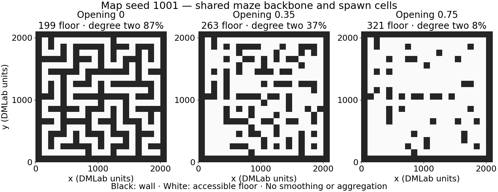

# Corridor geometry: implementation and qualification record

## Status

The 27-run study and nine-run 2M qualification are implemented and source-staged
on NEMO2. **Qualification is in progress; production is not yet submitted.** At the user's
request, a dedicated workspace was allocated on September 19:
`/work/classic/fr_xl1014-corridor-geometry`, expiring December 28, 2026.
It reports 4.6T available; a 1 MiB write and fsync succeeded. The earlier
ENOSPC and zero-capacity reading applied to the old `train` allocation, not all
NEMO2 storage. Both StudySpecs and the Slurm template now target the new
allocation, including online telemetry's explicit workspace root. Existing jobs
and historical outputs were not modified. Native binding, pretrained Torch cache,
and release runfiles are staged in the new allocation. Both revised studies validate
and all 37 focused workflow tests pass on NEMO2. Native gate 8109095 passed all seven tests. The first nine training attempts
(8109100–8109108) hit a shared-memory socket error before learning; they were
stopped and preserved under `train_dir/analysis/failed_preflights/`. The corrected
Slurm template uses short workspace TMPDIRs and a fail-fast shared-memory check.
The clean retry uses `preflight_r2`, jobs **8109119–8109127**. Early frozen
evaluation probes are **8109139–8109141**, one per architecture at Q=0.35.
Early Waypoint evaluation passed. PPO probes exposed one missing terminal pose
per episode: telemetry used the legacy reader even though the certified binding
retains terminal observations. The shared terminal-pose reader now uses that
binding; this changes telemetry only. PPO checkpoints were saved and stopped
intentionally at about 600k frames, then resumed as **8109154–8109159** under `preflight_r3`.
Failed early evaluation artifacts are retained; renewed probes **8109152/8109153 passed**, completing all three early frozen
evaluation gates with no invalid poses.
Production remains gated on complete 2M training and final checkpoint evidence.

Schema: `intrmotiv/study/v1`; workflow: `1.10.0`.

| Specification | SHA-256 |
|---|---|
| [Production](../hpc_runs/studies/corridor_geometry.study.json) | `dac5ace2475d2ea60d25530ef6acf3f70f7d45d00951933124486f282137e5aa` |
| [Qualification](../hpc_runs/studies/corridor_geometry_preflight.study.json) | `6d65e28c24d2e837f7dfc2fc9eea9da0da86807a26585a740e5c59915b956ecc` |

Reviewed argument expansions: [27 production runs](results/corridor_geometry_20260919/production_runs.json)
and [nine qualification runs](results/corridor_geometry_20260919/preflight_runs.json).
These are rendered plans, not scheduler submission evidence.

## Scientific design and provenance

SAT arrival/open-gate FiLM, DGP hit/joint/legacy, and Waypoint F64 DDQN+HER are
crossed with wall-removal probabilities 0, 0.35, 0.75 and map seeds 1001–1003.
Training seed is 99 throughout; navigation8/repeat 4; zero external reward;
120-second episodes; fresh DG/controller/optimizer/graph with fixed ImageNet
trunk. Total production budget is 2.7B environment frames.

Complete architecture arguments are resolved from the Navigation8 and CPU F64
HER parent StudySpecs. Each base records the parent's study fingerprint and its
exact override dictionary. Explicit `dg_goal_input=none` matches the verified
parent parser default. PPO remains CPU for SAT/DGP, as in their parents; HER
retains CPU, decoder-only conditioning, stored replay and cadence 2048. Option
horizons and learning objectives are unchanged. Disabling SF's unrecorded
startup walks aligns initial policy history with physical resets.

The study uses layout replication, not independent learner-seed replication.
The generated open condition is a new matched control, not the historical fixed
open-field map. Primary comparisons are paired within architecture and layout;
`corridor_minus_open` and `intermediate_minus_open` are explicit StudySpec
contrasts. Algorithm success cannot be inferred from graph connectivity alone.

## Generated geometry

The Lua helper preserves depth-first connected maze carving. Each original
interior wall receives one fixed random draw. The generator retains only the
backbone-connected component after opening walls; this excludes isolated opened
wall pockets while preserving nested layouts. For the nine declared maps, the
connectivity correction does not change their exported floor masks.

The [archive](../hpc_runs/studies/assets/corridor_geometry/maps.json) contains
actual native-Lua entity maps, generator-source and map hashes, floor masks,
100 shared spawn candidates, coordinate mapping, degree statistics and all-pair
shortest-path histograms. No independent Python maze generator is used.

| Map seed | Accessible cells: q=0 / .35 / .75 | Degree-two fraction: q=0 / .35 / .75 |
|---|---|---|
| 1001 | 199 / 263 / 321 | 86.9% / 37.3% / 8.4% |
| 1002 | 199 / 269 / 327 | 89.9% / 36.1% / 9.5% |
| 1003 | 199 / 260 / 322 | 89.9% / 46.5% / 9.6% |



Additional previews: [seed 1002](results/corridor_geometry_20260919/maps/map_seed_1002.png),
[seed 1003](results/corridor_geometry_20260919/maps/map_seed_1003.png).
PDFs and plotting metadata accompany each PNG. All three pages were visually
checked; black denotes walls, white accessible floor, without smoothing.

## Runtime, telemetry and evaluation changes

- A parameterized Lua level uses map seeds independently of reset seeds,
  retains constant instruction 3 and the TETRIS theme, and contains no pickups.
- Full map hashes are checked on reset; geometry observations are stripped
  before model normalization. Pose remains privileged telemetry. Isolated
  release runfiles avoid editing installed assets used by existing jobs.
- Accessible-area coverage fraction and episode-average AUC supplement raw
  coverage. Missing terminal poses hold coverage; invalid-pose counts are
  reported. Walls and out-of-bounds positions cannot add accessible cells.
- Optional `geometry_*` NPZ fields carry identity, mask and coordinate mapping.
  Geometry validation rejects missing or inconsistent fields. Existing artifacts
  remain valid. New unsmoothed half-peak field components use four-neighbor
  traversability, separately from historical smoothed field metrics.
- Canonical atlas figures overlay walls in black; unvisited floor remains gray.
  Online `[y,x,unit]` and offline `[x,y,unit]` conventions are converted explicitly.
- The existing place-field worker accepts complete-episode coverage and optional
  uniform-random controls. It recreates the engine per episode, preserves model
  and graph state, records curves and uses reset seeds 51000–51099 and action
  seeds 61000–61099. Tests cover seed matching and rejection of mutated models.

The production telemetry expansion contains **135 place-field rows** (five
checkpoints for every run) and **54 matched-command rows** (25M and 100M).
At 100M, request 100 complete episodes for all 27 policies. Select the nine SAT
terminal rows for `--random-coverage`; select the other 18 for policy-only
coverage. Selection comes from manifest family/target fields, not run-name
parsing. Runtime qualification must verify this new episode path on real models;
mock tests alone do not establish native evaluator qualification.

## Verification and source locations

- Desktop runtime/workflow regression: **461 passed, 11 skipped**.
- Separate native DMLab test: **3 passed**, including nine maps, common spawn
  poses, full hashes, fresh-engine prefix equality, zero reward and timeout.
- Final focused runtime/evaluation tests after telemetry/worker changes:
  **10 passed, 1 native test skipped**; native behavior was tested separately.
- Final desktop canonical workflow/geometry suite: **37 passed**.
- NEMO2's final synchronized canonical suite: **37 passed**; final qualification
  StudySpec validation also passed with the fingerprint recorded above.
- All nine qualification configurations parsed successfully with their expected
  controller, CPU device and DG capacity. New Python modules pass Ruff checks.

[Machine-readable evidence and per-file hashes](results/corridor_geometry_20260919/implementation_evidence.json).
The runtime is an isolated worktree on branch `codex/corridor-geometry`, based
on `c002faff`; no changes were applied to the shared runtime checkout:

- Desktop: `/home/xiaoxiong/SFgit/SF_hipposlam_corridor_20260919`
- NEMO2: `/home/fr/fr_xl1014/SF_git_XXL/SF_hipposlam_corridor_20260919`

The vault remains authoritative for `hpc_runs/intrmotiv_study/` and StudySpecs.
Runtime adapters and Lua changes live in those worktrees. Source staging does
not establish NEMO2 runtime qualification or successful training.

## Qualification and execution

1. Check free space and quotas before creating caches or submitting jobs. No
   existing output is authorized for deletion by this implementation request.
2. In the isolated runtime, prepare release runfiles with the actual terminal
   binding on `PYTHONPATH`:

   ```bash
   python -m hpc_runs.intrmotiv_study.runfiles \
     --source /home/fr/fr_xl1014/SF_git_XXL/SF_hipposlam_corridor_20260919 \
     --output /work/classic/fr_xl1014-corridor-geometry/IntrMotiv/SF_hipposlam/runtime/corridor_20260919/runfiles
   ```

3. Use an ordinary CPU Slurm preflight to run `test_corridor_runtime.py` with
   `CORRIDOR_DMLAB_RUNFILES` pointing to that directory, `TMPDIR`, XDG/Torch
   caches and pytest temporary outputs in the workspace. Do not compile maps
   or execute DMLab on the login node. Recheck terminal binding compatibility.
4. Generate the nine training scripts with the existing SF launcher:

   ```bash
   python -m sample_factory.launcher.run \
     --run=hpc_runs.corridor_geometry_preflight --backend=slurm \
     --train_dir=/work/classic/fr_xl1014-corridor-geometry/IntrMotiv/SF_hipposlam/train_dir \
     --slurm_workdir=/work/classic/fr_xl1014-corridor-geometry/IntrMotiv/SF_hipposlam/train_dir/_slurm/corridor_geometry_20260919/preflight \
     --slurm_log_dir=/work/classic/fr_xl1014-corridor-geometry/IntrMotiv/SF_hipposlam/train_dir/_slurm/corridor_geometry_20260919/preflight/logs \
     --slurm_sbatch_template=hpc_runs/corridor_geometry_nemo.sh \
     --slurm_partition=cpu --slurm_gpus_per_job=0 \
     --slurm_cpus_per_job=40 --slurm_memory=128G \
     --slurm_timeout=12:00:00 --slurm_separate_stderr=True \
     --slurm_print_only=True
   ```

5. Run canonical `audit-submission` against its real `jobs.tsv`, inspect all
   generated paths and source bindings, then rerun the launcher with
   `--slurm_print_only=False`. Save the submitted audit and numeric job IDs.
6. At 2M, reuse the full-system controller audit for finite learning, DG/trunk,
   replay and optimizer ownership. Require checkpoint-bound exact learner reload
   evidence, complete 1M/2M geometry snapshots, real frozen evaluator/episode
   probes and exact-prefix interventions for all architectures. Poor control or
   missing eligible scientific trials are reported, not disguised as software
   failures. No production launch before the correctness gates pass.
7. After qualification, render/review production anew, preserve all nine full
   checkpoints and original run identities, then resume those runs and start the
   other 18. Use canonical submission audits and manifest-driven ordinary jobs.
   Do not infer approval to bypass gates from this prepared specification.

Standard online artifacts use the canonical
`train_dir/analysis/online_spatial/<batch>/<run>/policy_00/` hierarchy. This keeps
batch identity compatible with the collector and existing preflight audits.

## Reusable experience

Actual native compilation caught a Q3Map filename-buffer limit that static map
checks could not: short map names plus full-hash runtime verification resolved
it. Reusing the causal evaluator's fresh-engine construction resolved reset RGB
history differences without weakening exact matching. Shared geometry helpers,
explicit axis conversion, parent StudySpec hashes, and canonical manifests kept
this study from becoming a separate launch/analysis workflow. The next session
should start with storage availability and this record, not repeat historical
batch inventory or map-generation discovery.
