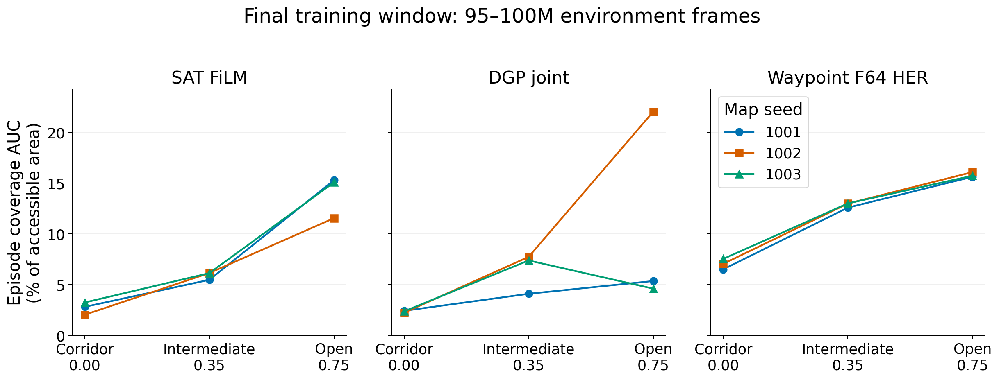
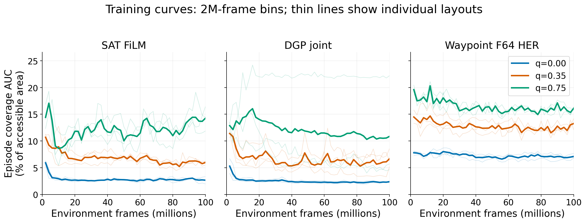
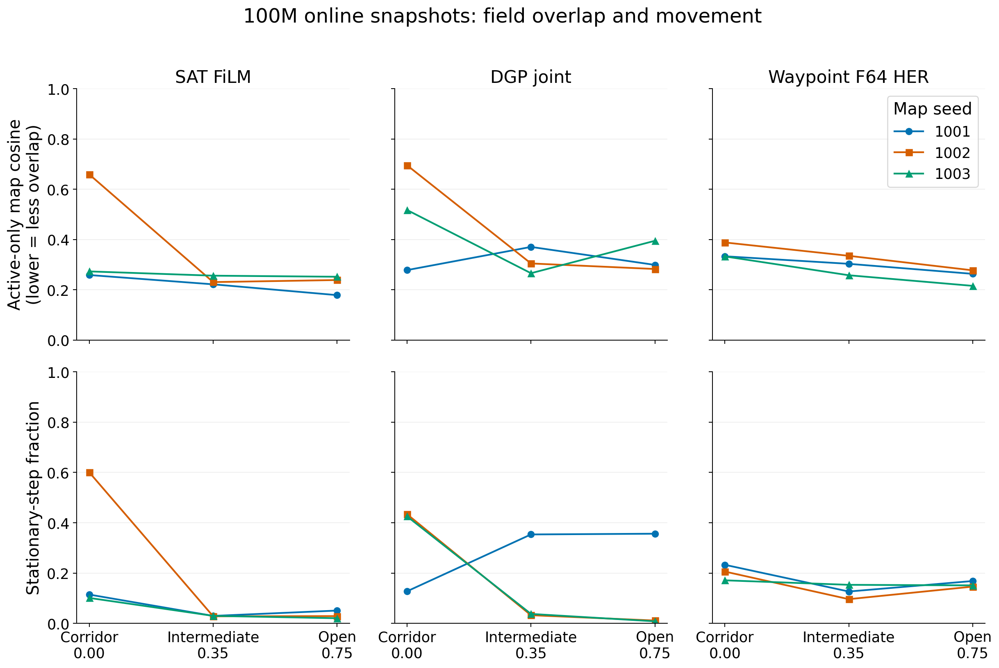

# Corridor geometry: completed-training analysis, September 21, 2026

## Finding and evaluation status

**Corridor geometry did not improve training-time exploration in this screen.**
Accessible-area-normalized episode coverage AUC was lower in corridors than in
open layouts for **all nine paired architecture–map-seed comparisons**. The mean
reductions were 80.7% for SAT, 78.1% for DGP and 55.5% for Waypoint HER. Waypoint
was the strongest architecture on average in each geometry, although DGP's open
map seed 1002 exceeded it individually.

All 27 training jobs completed with exit code 0 and reached at least 100M frames.
All 135 declared online spatial snapshots passed canonical collection and
completeness checks. This report analyzes those snapshots and the logged training
metrics, **not completed frozen-policy evaluations**.

At the user's request, **189 production evaluation jobs were submitted**:
135 standard 10k-decision place-field evaluations, with 100 complete policy
episodes attached to each of the 27 terminal rows and 100 uniform-random episodes
attached to nine geometry-matched terminal rows, plus 54 command-control jobs at
25M and 100M. This is 2,700 policy episodes and 900 random episodes. All 189 jobs
were running at the submission audit. Superiority over random navigation and
command-specific target control remain unresolved until those results arrive.

## Exploration at the end of training

The table uses the same **95M–100M frame window** for all runs. Each entry is an
equal-weight mean over the three layout seeds, using each run's mean logged
episode statistic. These are not three independent training seeds or 100 matched
frozen evaluation episodes. Each run contributes 513–674 logged observations.

Accessible coverage AUC is $T^{-1}\sum_{t=1}^{T} U_t/A$, where $U_t$ is cumulative
visited accessible cells and $A$ is that map's accessible floor area. It rewards
covering floor early in the episode. It is different from final episode coverage.

| Architecture | Corridor q=0 | Intermediate q=.35 | Open q=.75 | Corridor − open | Relative change |
| --- | --- | --- | --- | --- | --- |
| SAT FiLM | 2.70% | 5.92% | 13.97% | -11.27 pp | -80.7% |
| DGP joint | 2.34% | 6.40% | 10.67% | -8.33 pp | -78.1% |
| Waypoint F64 HER | 7.03% | 12.86% | 15.81% | -8.77 pp | -55.5% |



Each line joins the same map seed across geometries. The full axis range includes
DGP's stronger open-layout seed 1002; no runs are excluded. See the
[PDF](results/corridor_geometry_20260919/analysis_20260921/figures/final_coverage.pdf).

### Every layout replicate

| Architecture | Map seed | Corridor AUC | Intermediate AUC | Open AUC | Corridor − open |
| --- | --- | --- | --- | --- | --- |
| SAT FiLM | 1001 | 2.81% | 5.48% | 15.28% | -12.47 pp |
| SAT FiLM | 1002 | 2.04% | 6.14% | 11.54% | -9.51 pp |
| SAT FiLM | 1003 | 3.24% | 6.13% | 15.07% | -11.83 pp |
| DGP joint | 1001 | 2.42% | 4.10% | 5.36% | -2.93 pp |
| DGP joint | 1002 | 2.23% | 7.73% | 22.03% | -19.80 pp |
| DGP joint | 1003 | 2.37% | 7.38% | 4.61% | -2.24 pp |
| Waypoint F64 HER | 1001 | 6.51% | 12.58% | 15.62% | -9.11 pp |
| Waypoint F64 HER | 1002 | 7.05% | 12.99% | 16.08% | -9.03 pp |
| Waypoint F64 HER | 1003 | 7.54% | 13.00% | 15.72% | -8.19 pp |

All corridor–open differences are negative. Intermediate layouts also underperform
open layouts in eight of nine pairs; DGP seed 1003 is the exception.
DGP's large variability in the open condition means its three-layout mean should
not be treated as a consistent outcome across maps. No significance tests or
training-seed robustness claims are made from these three layouts.

### Absolute exploration and endpoint coverage

The raw AUC retains its historical definition: the episode-time average number
of visited 100-unit grid cells, without dividing by accessible area. Endpoint
accessible cell counts below are derived per run as endpoint coverage fraction
multiplied by that map's floor area, then averaged across layouts. They are
labelled as derived rather than substituted for a separately collected raw tag.

| Architecture | q | Raw coverage AUC (cells) | Endpoint accessible coverage | Endpoint cells visited (derived) |
| --- | --- | --- | --- | --- |
| SAT FiLM | 0.00 | 5.36 | 3.00% | 6.0 |
| SAT FiLM | 0.35 | 15.62 | 7.04% | 18.6 |
| SAT FiLM | 0.75 | 45.11 | 18.66% | 60.2 |
| DGP joint | 0.00 | 4.65 | 2.58% | 5.1 |
| DGP joint | 0.35 | 16.93 | 7.59% | 20.0 |
| DGP joint | 0.75 | 34.69 | 13.09% | 42.6 |
| Waypoint F64 HER | 0.00 | 14.00 | 10.64% | 21.2 |
| Waypoint F64 HER | 0.35 | 33.94 | 22.03% | 58.2 |
| Waypoint F64 HER | 0.75 | 51.11 | 27.86% | 90.1 |

Every corridor map has 199 accessible cells. SAT and DGP finish episodes having
visited roughly 6 and 5 cells, respectively; Waypoint visits about 21. Their
corresponding open-layout counts are about 60, 43 and 90. Thus the poor corridor
result is present in both normalized and absolute measures; it is not explained
by the corridor having fewer floor cells.

## Learning dynamics



Curves use 2M-frame bins of all selected scalar events. Thin lines are individual
layouts; thick lines average the three per-layout bin means. No confidence band
is implied. The initial bin includes early training and is not a random-policy
baseline. [PDF](results/corridor_geometry_20260919/analysis_20260921/figures/learning_curves.pdf).

SAT and DGP lose much of their initial corridor coverage in the first several
million frames, then remain low. Mean corridor AUC in the initial 0–2M bin is
5.91% for SAT and 5.29% for DGP, versus 2.70% and 2.34% in the final 95–100M
window. Waypoint starts at 7.79% and finishes at 7.03%, with much less decline.
Longer training therefore does not rescue corridor exploration in these runs.
This is descriptive learning-curve evidence; it does not identify the causal
learning mechanism responsible for the decline.

## Field quality and graph structure

The following are **100M training-trajectory snapshots**, each using its existing
bounded online sample window. They are not fixed-trajectory drift tests or the
new frozen place-field evaluations. Different trajectories and visited cells
can change the field statistics. SCC is the largest strongly connected component
of the thresholded reliable graph; SAT/DGP have 16 units and Waypoint has 64.

| Architecture | q | Active cosine | Silent units | Distinct active peak bins | Active SI (bits) | Stationary steps | Largest SCC |
| --- | --- | --- | --- | --- | --- | --- | --- |
| SAT FiLM | 0.00 | 0.397 | 0.0% | 14.7 | 0.084 | 27.2% | 15.3 |
| SAT FiLM | 0.35 | 0.236 | 0.0% | 14.3 | 0.097 | 2.9% | 15.7 |
| SAT FiLM | 0.75 | 0.223 | 0.0% | 13.3 | 0.112 | 3.3% | 16.0 |
| DGP joint | 0.00 | 0.497 | 0.0% | 12.7 | 0.056 | 32.9% | 16.0 |
| DGP joint | 0.35 | 0.314 | 0.0% | 15.0 | 0.070 | 14.1% | 16.0 |
| DGP joint | 0.75 | 0.326 | 0.0% | 15.3 | 0.079 | 12.5% | 16.0 |
| Waypoint F64 HER | 0.00 | 0.351 | 0.0% | 43.0 | 0.033 | 20.3% | 2.0 |
| Waypoint F64 HER | 0.35 | 0.299 | 0.0% | 42.0 | 0.029 | 12.5% | 1.3 |
| Waypoint F64 HER | 0.75 | 0.252 | 2.1% | 44.3 | 0.032 | 15.5% | 1.3 |



Higher cosine means more overlap. Stationary means physical displacement at most
one world unit between eligible consecutive samples; turning can still occur.
All map seeds are shown. [PDF](results/corridor_geometry_20260919/analysis_20260921/figures/spatial_diagnostics.pdf).

- Corridor overlap is higher on average in all three architectures, and in eight
  of nine paired layouts. SAT seed 1002 rises from 0.239 in open geometry to 0.659
  in corridors; DGP seed 1002 rises from 0.283 to 0.695. DGP seed 1001 is the one
  paired exception. Silent units do not explain the broad corridor effect.
- The same SAT corridor seed 1002 is stationary on 60.1% of sampled steps; DGP's
  corridor seeds 1002/1003 are stationary on 43.4%/42.5%. DGP seed 1001 is instead
  more stationary in intermediate/open layouts, so a universal stagnation
  explanation would overstate the evidence.
- SAT and DGP retain almost fully connected reliable graphs despite weak
  corridor exploration. Waypoint's largest SCC averages only about 1–2 of 64
  units. Neither connectivity nor online prospective success establishes
  command-conditioned control; the alternative-command comparison is required.
- Wall-aware, unsmoothed half-peak components remain separate from historical
  smoothed field metrics. Active SAT units average 15.31 components in corridors
  versus 10.13 in open maps; DGP averages 15.50 versus 10.92. Waypoint averages
  8.29 versus 8.42. Walls can themselves split components, so these counts are
  descriptive geometry-aware diagnostics, not a directly comparable quality score.
  [Per-run component summary](results/corridor_geometry_20260919/analysis_20260921/traversable_field_summary.csv).

## Interpretation and outstanding evidence

The proposed exploration benefit of corridors is not supported by the completed
training data. The stronger retained behavior of Waypoint makes it the most
promising of these three on average, but it does not establish an advantage over
random navigation. Learned control remains a separate question. The newly launched
interventions retain the full up-to-16-source, four-target, five-repeat protocol,
with exact reset/prefix matching; missing sources, ambiguity, censoring and trial
eligibility must be reported before interpreting target-hit lift. The old bounded
2M qualification probes are not used as production control results.

This is a three-layout screen with training seed 99. It does not establish
robustness across learner seeds or generalization to unseen maps. Geometry also
changes wall-surface exposure and the available decal locations. Decoration
frequency remains the inherited 0.1 with decoration RNG seed 1; identical seed
does not make decals on shared walls perfectly matched across different geometries.
The current comparison therefore concerns the generated environments as a whole.

## Provenance, files and reproducibility

- Study schema: `intrmotiv/study/v1`; original StudySpec workflow: `1.10.0`.
- Study SHA-256: `dac5ace2475d2ea60d25530ef6acf3f70f7d45d00951933124486f282137e5aa`.
- Training/configuration record: [implementation and qualification](corridor_geometry_20260919.md).
- [Canonical online collection](results/corridor_geometry_20260919/analysis_20260921/online/analysis_manifest.json)
  uses workflow 1.10.1, a process executor, all selected scalar events and the
  fixed 95–100M window. Original training arguments and study fingerprint are unchanged.
- [Canonical spatial collection](results/corridor_geometry_20260919/analysis_20260921/spatial/analysis_manifest.json):
  135/135 snapshots; detailed per-unit collection uses compatible workflow 1.10.1.
- [All 27 run results](results/corridor_geometry_20260919/analysis_20260921/layout_results.csv),
  [paired layout effects](results/corridor_geometry_20260919/analysis_20260921/paired_layout_effects.csv),
  [curve bins](results/corridor_geometry_20260919/analysis_20260921/learning_curve_bins.csv).
- [Evaluation submission audit](results/corridor_geometry_20260919/analysis_20260921/evaluation_submission_audit.json)
  and [189-job manifest](results/corridor_geometry_20260919/analysis_20260921/evaluation_jobs.tsv).
- [Plotting source](../hpc_runs/plot_corridor_geometry_analysis.py) and
  [figure metadata](results/corridor_geometry_20260919/analysis_20260921/figures/figure_metadata.json).
  PNG/PDF previews were inspected; a shared-axis clipping issue was corrected
  before delivery so every layout and curve remains visible.

Bulk evaluation outputs remain under
`/work/classic/fr_xl1014-corridor-geometry/IntrMotiv/SF_hipposlam/train_dir/analysis/corridor_analysis_20260921/`.
Field-only jobs request 4 CPUs/24G/2 hours; terminal coverage and command jobs use
4 CPUs/24G/24 hours. The full command worker now honors the isolated source,
terminal binding, allocated workspace, fixed pretrained cache and short TMPDIR.

To regenerate the plots from the saved canonical exports, run from the vault:

```bash
MPLCONFIGDIR=/tmp/intrmotiv_mpl /home/xiaoxiong/miniforge3/envs/SF_git/bin/python \
  -m hpc_runs.plot_corridor_geometry_analysis \
  hpc_runs/studies/corridor_geometry.study.json \
  06_experiments/results/corridor_geometry_20260919/analysis_20260921
```

## Reusable experience

The canonical spatial collector completed all 135 snapshots without missing
milestones. Exporting selected scalar histories during the 6.8 GB TensorBoard
scan avoided repeated reads for learning curves and the final comparison. The
process-based scan finished in 10m22s, with visible per-run progress; 38 focused
tests passed locally and on NEMO2. These exports are not yet an automatic
resumable cache. Future analyses should start from the saved manifests and
histories, request detailed spatial tables in the first collection when needed,
and validate isolated-source paths in both evaluation shell workers before
launching. See [infra.md](../infra.md) and the canonical workflow guide.
