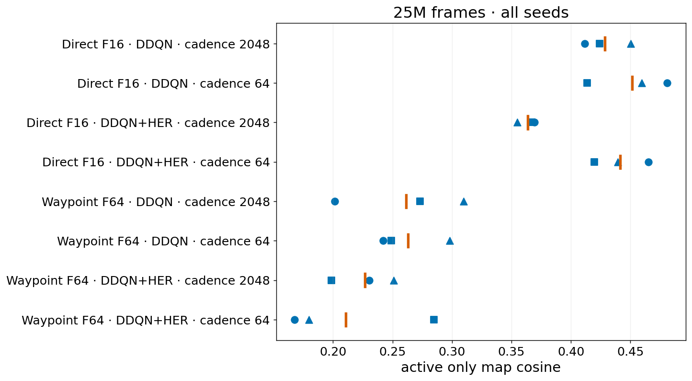
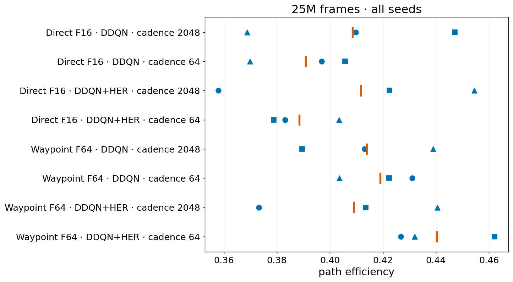
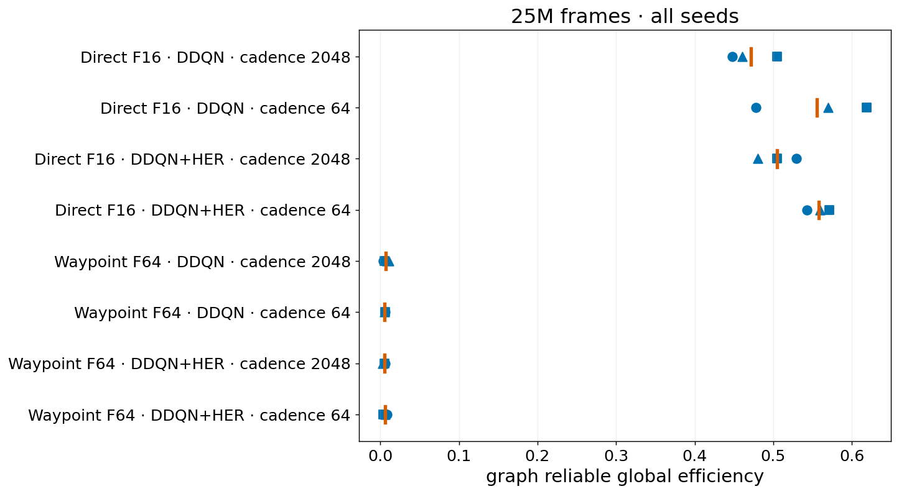

# CPU2048: place fields, movement, and control graphs

Analysis date: 2026-09-17. Source: [SF_IntrMotiv_CPU2048 on W&B](https://wandb.ai/xiaoxionglin-bernstein-center-freiburg/SF_IntrMotiv_CPU2048). This is an **interim spatial analysis**, not a final ranking of completed training runs.

## 1. Main findings

At the latest saved milestone shared by all 24 runs, **25M environment frames**:

- **Waypoint F64 has less-overlapping maps, but not a well-connected reliable control graph.** Mean active-only map cosine is 0.211–0.263, versus 0.364–0.451 for Direct F16. However, only 0.6–0.9% of ordered node pairs are reachable in its reliable graph, versus 81.8–91.8% for Direct F16.
- **Direct F16 connectivity is not evidence of distinct spatial landmarks.** Its single-field fraction is 0–2.1% of eligible units, versus 6.8–9.5% for F64. Neither architecture yet combines convincing place-field separation and broad reliable graph connectivity. The existing spatially grounded graph score is zero for every run at this checkpoint.
- **Updating every 64 decisions is not a consistent improvement over every 2048.** It increases replay exposure 32-fold, but map overlap and movement do not improve consistently. In Direct F16+HER, overlap is higher at cadence 64 in all three seed-matched comparisons.
- **There is curved movement and local backtracking, but no measured sustained-circling rate.** Mean segment displacement/path length is only 0.388–0.440 across conditions. The saved segments are too short to equate this with complete-episode circling or poor goal-directed navigation.

These are descriptive comparisons of three seeds per condition, not significance-tested causal claims. Architecture, capacity, manager, and exploration behavior change together between the two architecture families.

## 2. What was compared

| Factor | Levels |
|---|---|
| Architecture family | Direct F16; Waypoint decoder F64 |
| Controller | DDQN; DDQN+HER |
| Update cadence | Every 64 or 2048 accepted decisions |
| Seeds in every cell | 8, 99, 123 |
| Total | 8 conditions × 3 seeds = 24 runs |

The launch design is documented in [[controller_cpu_selected_20260914]]. These runs use fresh DG/controller/optimizer/graph state with the fixed ImageNet trunk retained. The waypoint worker memory is goal-independent; goal conditioning is in the decoder. This is not a pure F16-versus-F64 capacity experiment.

Each DDQN update uses 2048 main examples. HER uses 1024 main examples and up to 1024 auxiliary examples: total replay is capped comparably, but main-data exposure is not matched. Cadence 64 therefore has a nominal total replay ratio up to 32, versus up to 1 at cadence 2048. Target refresh is matched to 6144 accepted decisions (96 versus 3 updates).

All 24 jobs were running during inspection. Saved latest training checkpoints ranged from about 50–76M frames at cadence 64 and 126–152M at cadence 2048; these are checkpoint progress observations, not a controlled wall-clock throughput benchmark. Comparing each run's latest snapshot would confound training age with condition.

### Snapshot coverage

| Milestone | Cadence 64 | Cadence 2048 | Use here |
|---|---:|---:|---|
| 5M | 12/12 | 12/12 | Earlier common reference |
| 25M | 12/12 | 12/12 | Main comparison and complete visual atlas |
| 75M | 3/12 | 12/12 | Later, restricted comparisons |
| 150M | 0/12 | 5/12 | Inventory only; incomplete cells |

There are 68 collected snapshots, each retaining 100,000 observations. Recorded actual frame counts exceed nominal milestones by 1,984–13,504 frames. Absence of a snapshot is not evidence that a run stopped at the preceding milestone.

## 3. Place-field quality at 25M

Values below are unweighted means across seeds 8, 99, 123. “Single-field” is the canonical fraction among eligible units, not among all allocated units. Lower map cosine means less overlap; it does not alone establish useful place fields.

| Architecture / learner | Cadence | Map cosine | Silent units | Distinct peak bins | Single-field |
|---|---:|---:|---:|---:|---:|
| Direct F16 / DDQN | 64 | 0.451 | 0% | 16.0 | 0% |
| Direct F16 / DDQN | 2048 | 0.429 | 0% | 15.0 | 0% |
| Direct F16 / DDQN+HER | 64 | 0.441 | 0% | 15.3 | 2.1% |
| Direct F16 / DDQN+HER | 2048 | 0.364 | 0% | 15.0 | 0% |
| Waypoint F64 / DDQN | 64 | 0.263 | 0% | 40.7 | 6.8% |
| Waypoint F64 / DDQN | 2048 | 0.261 | 6.3% | 44.0 | 7.1% |
| Waypoint F64 / DDQN+HER | 64 | 0.211 | 3.6% | 44.3 | 7.2% |
| Waypoint F64 / DDQN+HER | 2048 | 0.227 | 0% | 45.0 | 9.5% |

In every summary figure, blue circle = seed 8, square = seed 99, triangle = seed 123; orange tick = arithmetic mean. No confidence intervals or significance tests are implied. All three seeds are retained even when their marks overlap.

Direct fields commonly have dispersed or multiple activity regions. Nearly unique peak bins in F16 do not contradict this: an argmax identifies one bin even when a unit responds in many other places. F64 separates maps better, but has both multi-region maps and occasional silent units. For example, F64/DDQN/cadence 2048/seed 8 has 12 silent units out of 64. Silence is reported separately and excluded from active-only cosine.

The canonical activity-weighted spatial-information score averages approximately 0.051–0.055 for Direct and 0.031–0.039 for Waypoint. It includes response amplitude and is **not bits per spike**; it should not override the map-shape and silence diagnostics. [Spatial-information figure](data/cpu2048_analysis_20260917/figures/active_unit_mean_spatial_information.png), [silence](data/cpu2048_analysis_20260917/figures/silent_unit_fraction.png), [peak diversity](data/cpu2048_analysis_20260917/figures/unique_active_peak_bins.png), [single-field fraction](data/cpu2048_analysis_20260917/figures/mono_field_unit_fraction.png).

The [complete atlas](data/cpu2048_analysis_20260917/atlas.md) shows **every DG unit in every run**: one 16-unit page for each Direct run, four for each Waypoint run. Map colors are normalized to each unit's own peak; they show shape rather than comparable absolute amplitudes. Gray is unvisited space, not zero activity. The atlas uses recorded DG activity; pre-threshold activation maps are not supplied by this analysis, so it cannot distinguish threshold-induced silence from absent upstream selectivity.

## 4. Movement and the circling question

| Architecture / learner | Cadence | Stationary transitions | Segment displacement/path length |
|---|---:|---:|---:|
| Direct F16 / DDQN | 64 | 12.4% | 0.391 |
| Direct F16 / DDQN | 2048 | 9.0% | 0.408 |
| Direct F16 / DDQN+HER | 64 | 15.4% | 0.388 |
| Direct F16 / DDQN+HER | 2048 | 15.8% | 0.412 |
| Waypoint F64 / DDQN | 64 | 15.1% | 0.419 |
| Waypoint F64 / DDQN | 2048 | 11.7% | 0.414 |
| Waypoint F64 / DDQN+HER | 64 | 16.5% | 0.440 |
| Waypoint F64 / DDQN+HER | 2048 | 13.3% | 0.409 |

Stationary means displacement ≤1 DMLab coordinate unit between valid within-segment observations. Segment displacement/path length is the sum of endpoint displacements divided by total within-segment path length; it is not task success or goal-path optimality. Turning in place, collision, and waiting can all contribute to stationary observations.

Every run has an occupancy map, all-segment trajectory overlay, and four individual segments in the atlas. Paths are split at recorded segment boundaries rather than joining unrelated rollout streams. The examples use evenly spaced segment indices, not hand-picked successful or circular behavior. Axes are DMLab world coordinates; the common arena bounds are maintained.

The inspected segments contain curves, reversals, and local revisiting, including near boundaries. This is consistent with inefficient movement, but **does not establish persistent circling across episodes**. The dense all-segment overlay superimposes roughly 1,600 short fragments and must not be read as one continuous trajectory. Green dots mark starts and orange crosses ends in the individual examples.

All 24 runs visit 318 of the 361 grid cells (88.1%) in the pooled snapshot. This saturated pooled statistic does not distinguish exploration quality, accessible-space coverage, or single-episode behavior. High coverage can coexist with extensive repeated movement. Seed variation also matters: Direct/HER/cadence 2048/seed 99 has 24.2% stationary transitions, much higher than that condition's mean.

To test sustained circling directly would require longer per-environment episode traces with aligned actions, heading, and target changes. No new evaluation jobs were launched, and no circle detector was inferred from these overlays.

## 5. Control graphs: connected does not mean spatially grounded

| Architecture / learner  | Cadence | Reliable edges | Reachable ordered pairs | Prospective success |
| ----------------------- | ------: | -------------: | ----------------------: | ------------------: |
| Direct F16 / DDQN       |      64 |           71.3 |                   87.6% |               43.4% |
| Direct F16 / DDQN       |    2048 |           54.3 |                   81.8% |               40.8% |
| Direct F16 / DDQN+HER   |      64 |           65.3 |                   91.8% |               43.4% |
| Direct F16 / DDQN+HER   |    2048 |           61.0 |                   83.6% |               40.5% |
| Waypoint F64 / DDQN     |      64 |           20.0 |                    0.6% |               39.4% |
| Waypoint F64 / DDQN     |    2048 |           19.7 |                    0.9% |               44.5% |
| Waypoint F64 / DDQN+HER |      64 |           20.3 |                    0.7% |               40.6% |
| Waypoint F64 / DDQN+HER |    2048 |           16.3 |                    0.6% |               40.8% |

These are means of per-run statistics, not counts pooled across seeds. Reliable-edge and reachability diagnostics apply the canonical graph thresholds. Prospective success uses recorded cumulative prospective successes/attempts; it is not held-out navigation success. The larger F64 node set also changes the number of possible ordered pairs.

Direct's graph connects most ordered pairs, while Waypoint's reliable graph is extremely sparse. Nevertheless, the cumulative prospective success rates overlap substantially. Local target hits therefore do not guarantee broad connectivity or spatially meaningful transitions.

The canonical grounded-controllability score multiplies prospective success by the fraction of reliable edges with qualified single-field spatial endpoints. It is **zero in all 24 runs at 25M**. This is a failed spatial-grounding diagnostic, not proof that the controller cannot move or hit any target.

Each atlas entry includes a directed source-by-target matrix of prospective success fractions. Gray means unattempted; purple means attempted with zero success. All attempted edges are shown, including edges that do not pass the reliable-graph threshold. A bright cell with few attempts is not strong evidence. Matrices are preferable here to placing graph nodes at field peaks, because most units do not have a qualified single spatial field.

## 6. Learning progression and comparisons that are justified

From 5M to 25M, map overlap increases in seven of the eight condition means (Direct/HER/2048 is essentially unchanged). This does not support a simple narrative of progressively separating place fields. Waypoint prospective success improves substantially, while its reliable reachable-pair fraction remains below 1%.

At cadence 2048, all four conditions have all three seeds at 75M:

| Condition | Map cosine, 25M → 75M | Single-field, 25M → 75M | Reachable pairs, 25M → 75M |
|---|---:|---:|---:|
| Direct / DDQN | 0.429 → 0.419 | 0% → 0% | 81.8% → 91.7% |
| Direct / DDQN+HER | 0.364 → 0.395 | 0% → 0% | 83.6% → 93.8% |
| Waypoint / DDQN | 0.261 → 0.272 | 7.1% → 11.5% | 0.9% → 0.8% |
| Waypoint / DDQN+HER | 0.227 → 0.238 | 9.5% → 17.7% | 0.6% → 1.0% |

There is later single-field improvement in Waypoint, especially HER, without broad reliable connectivity. These are changing-policy snapshots, not a fixed-trajectory representation-drift test. Cadence 64 has only Direct/DDQN at 75M, so it cannot support a complete eight-condition comparison there. The five available 150M snapshots are retained in the data inventory but not promoted to a balanced comparison.

Seed-matched contrasts at 25M reinforce the caution about cadence: Direct/HER map cosine increases by 0.096, 0.053, and 0.084 for seeds 8, 99, and 123 when moving from cadence 2048 to 64. The corresponding cadence effects for the other three architecture/controller combinations are mixed across seeds. Conversely, HER lowers Direct's map overlap relative to DDQN at cadence 2048 in all three seeds, but does not produce qualified single-field maps there.

**Working conclusion:** retain both representation and graph diagnostics as separate gates. No condition can currently be selected as a clear joint solution from these snapshots. More replay is not a demonstrated remedy, and weaker map overlap alone is not a sufficient success criterion.

## 7. Files, provenance, and limitations

- [Complete 24-run visual atlas](data/cpu2048_analysis_20260917/atlas.md): all units, occupancy, trajectories, individual segments, and directed graph outcomes at 25M.
- [Matched per-run measurements](data/cpu2048_analysis_20260917/matched_per_run.csv) and [mean/standard-deviation table](data/cpu2048_analysis_20260917/matched_summary.csv).
- [All 68 snapshot measurements](data/cpu2048_analysis_20260917/all_snapshots.csv), [declared run matrix](data/cpu2048_analysis_20260917/declared_runs.csv), and [observed checkpoint status](data/cpu2048_analysis_20260917/run_status.json).
- [Provenance](data/cpu2048_analysis_20260917/provenance.json) preserves all nine StudySpec SHA-256 values, schema `intrmotiv/study/v1`, declared workflow version 1.8.1, and collector version 1.8.2. Exact study copies are in the adjacent `specs/` directory.
- Raw snapshots and detailed collector outputs remain under `/work/classic/fr_xl1014-train/IntrMotiv/SF_hipposlam/train_dir/analysis/` on NEMO2; this report's remote output directory is `cpu2048_analysis_20260917`. No training state was changed.

Some inherited StudySpec descriptive metadata still names `SF_IntrMotiv_FullSystemController` and six design cells. Those fields are stale: actual saved run configurations were checked against `SF_IntrMotiv_CPU2048`, and the comparison is constructed from expanded StudySpecs and actual cadence arguments, giving the 24 runs/eight conditions above. Do not group this batch using those inherited fields.

This report covers saved online spatial/graph telemetry, not a full W&B scalar-history audit, controlled throughput benchmark, or held-out navigation evaluation. It does not contain pre-threshold maps or long episode trajectories. Findings remain conditional on the online visitation distribution and canonical field/edge qualification rules.

## 8. Reusable workflow lessons

The canonical collector previously restricted milestones to an older 5M–100M list, rejecting this batch's 150M snapshots. Version 1.8.2 now honors declared online targets, falling back to the study's telemetry targets. The fix passed 33 desktop tests and three focused tests in the isolated NEMO2 analysis environment. Shared training/runtime deployment remains separate; see [[../infra]] and [[../04_implementation/standardized_study_workflow]]. Earlier absence-of-later-snapshots claims must not be based on that old collector.

What worked: using validated StudySpecs, saved run configs, canonical map/graph recomputation, and an all-seed common milestone. What was slow or misleading: stale inherited metadata, the hard-coded target filter, and dense trajectory overlays without individual segments. Next time, check target compatibility and coverage first, then render the same matched milestone for every run. Efficient line collections make pooled trajectories practical; the atlas keeps all seeds visible without shrinking the main report into an unreadable montage.
