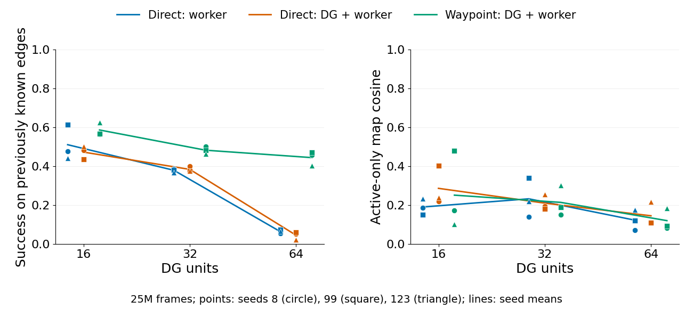
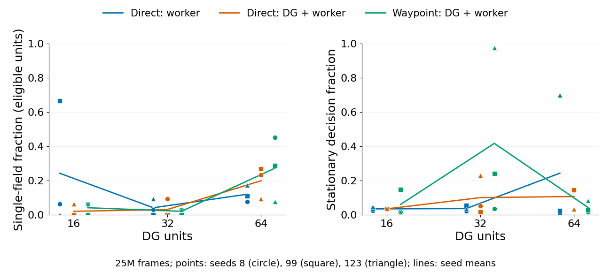

# DG capacity × goal conditioning: interim analysis, 11 September 2026

For the objective of reliably reaching **a small set of distinct landmarks**,
the most promising existing local-control checkpoint is **DIRECT_WORKER F16
seed 99 at 25M**. **WAYPOINT_DG F64 seeds 8 and 99** remain representation
candidates, but their individual edge-success evidence is weaker. Global
all-pairs reachability is context, not a pass/fail requirement: a small useful
set of goals can suffice. None is yet a demonstrated transferable
command-conditioned controller.

All 27 production jobs were RUNNING at inspection. No job was stopped,
restarted, or reconfigured for this analysis. The separately staged planner
speed optimization remains unapplied to their active runtime source.

## Comparison and data scope

The complete spatial comparison uses each run's **25M-frame snapshot**, actually
written at 25,001,984 frames, retaining 100,000 behavior samples. All 27 runs
supply it. The inventory also contains all 27 snapshots at 5M and 19 at 75M
(all 18 direct runs and WAYPOINT_DG F16 seed 8); a complete nine-cell 75M
comparison is not yet available in this collection.

All runs use frameskip 4, navigation8, the same environment and APPO settings,
three seeds (8, 99, 123), and a 300M-frame target. Each design cell below is an
unweighted mean across its three seeds. Individual seeds are shown in the
figures and saved CSVs. There are no significance claims from this small sample.

The supplementary online collection status is recorded separately below. Snapshot
spatial metrics describe retained policy-driven behavior, not a common visual
trajectory. They are not directly comparable to the shorter latest-10k online
spatial windows.

## Matched spatial and graph observations at 25M

| Arm | DG | Known-edge success | Map cosine | Single-field fraction | Stationary |
|---|---:|---:|---:|---:|---:|
| DIRECT_DG | 16 | 47.3% | 0.286 | 2.1% | 3.5% |
| DIRECT_DG | 32 | 38.4% | 0.211 | 3.1% | 10.1% |
| DIRECT_DG | 64 | 4.6% | 0.145 | 19.9% | 10.7% |
| DIRECT_WORKER | 16 | 51.1% | 0.190 | 24.3% | 3.5% |
| DIRECT_WORKER | 32 | 37.9% | 0.233 | 4.2% | 3.7% |
| DIRECT_WORKER | 64 | 6.5% | 0.123 | 12.0% | 24.3% |
| WAYPOINT_DG | 16 | 58.6% | 0.251 | 4.2% | 6.1% |
| WAYPOINT_DG | 32 | 48.2% | 0.214 | 2.1% | 41.7% |
| WAYPOINT_DG | 64 | 44.4% | 0.121 | 27.3% | 4.3% |

“Known-edge success” is the cumulative prospective hit/attempt ratio on edges
that were already known before updating the graph. It is **not all-option
success, a fixed-goal intervention, or downstream transfer success**. The arms
select different tasks, so these rates do not isolate controller quality on
matched goals. “Single-field fraction” uses the established diagnostic's
eligible-unit denominator; it does not imply one unique place per DG unit.
Lower active-only map cosine means less overlap, not necessarily useful fields.

### DG64 waypoint: representation candidates; local reliability still limited

At 25M, WAYPOINT_DG F64 seed 8 has map cosine **0.083**, 45.3% single-field
eligible units, all 64 units active, and 1.8% stationary decisions. Seed 99 has
cosine **0.094**, 28.8% single-field eligible units, 58/64 active units, and
2.9% stationary decisions. Both have 32 distinct raw peak bins. Their known-edge
success rates are 45.8% and 47.2%, respectively, versus 5.2% and 6.1% in
DIRECT_DG F64 at the paired seeds.

However, these waypoint graphs contain only **21 and 35 reliable directed
edges**, with **0.62% and 2.18% of ordered allocated-node pairs reachable**.
Both largest strongly connected components have size one. This allows some
one-way chains. Limited global connectivity does not disqualify a useful small
subset; reliability and spatial meaning of that subset are the relevant tests.
Only 14.3% and 5.7% of reliable edges have two endpoints passing the spatial
single-field qualification. The grounded-controllability summaries are
therefore only 0.065 and 0.027.

Visual inspection of all 64 maps for each candidate finds localized responses
mixed with broad, scattered, and repeated nearby responses. The three most
populated exact peak bins contain 15/64 active units for seed 8 and 16/58 for
seed 99; spatial redundancy is more extensive than exact-bin coincidence alone.
Per-unit peak normalization in the contact sheets reveals shape but deliberately
removes amplitude differences. The raw summaries retain the original scale.

Seed 123 is weaker on representation: cosine 0.185 and only 7.8% single-field
eligible units, though known-edge success is still 40.3%. DG64 waypoint is thus
a plausible direction, not a three-seed representation success.

### Smaller-DG references and weaker candidates

WAYPOINT_DG F16 seed 123 combines cosine 0.102, 14 distinct peak bins, 1.6%
stationary decisions, and 62.5% known-edge success. But only one of 16 eligible
units passes the single-field criterion, and only 7.5% of ordered pairs are
reachable. Keep it as a useful small-capacity control, not a spatially organized
solution. WAYPOINT_DG F32 seed 8 is the healthier seed in its arm; the F32 arm
as a whole is inconsistent. At 25M, F32 seed 123 is stationary on **97.5%** of
retained decisions (little translational movement; rotation can still occur) and visits only 40.4% of the fixed spatial grid; seed 99 is
stationary on 24.2%. These are behavior observations at that checkpoint, not
claims that their compute jobs stalled or remain in that state now.

DIRECT_DG F64 and DIRECT_WORKER F64 are weak control candidates: all three seeds
have very low known-edge success and essentially no reliable connected graph
at 25M. The same qualitative weakness persists in their available 75M snapshots.
Simply adding DG units has not solved controllability.

Adding DG conditioning to direct control shows no consistent spatial benefit:
DIRECT_DG F16 has higher overlap than DIRECT_WORKER F16 in all three paired
seeds; at F32 and F64 it has higher overlap in two of three seeds. Some aggregate
means improve because of a single seed. Do not interpret a pooled mean as
replicated improvement from DG conditioning.

### DG16 worker-only: promising local-control checkpoint, not a whole-run success

DIRECT_WORKER F16 seed 99 at 25M looks strong numerically: 61.3% known-edge
success, complete ordered-pair reachability, and grounded controllability 0.318.
But it has only nine distinct peak bins for 16 active units, and nine units peak
in the three most populated exact bins. The contact sheet shows repeated
responses near the same location. Thus a high single-field fraction (66.7% of
eligible units) overstates the diversity of useful landmarks.

By its 75M snapshot, single-field fraction is 6.25%, grounded controllability
is zero, and map cosine rises from 0.150 to 0.190. These differing behavior
windows do not prove fixed-trajectory representation drift, but they do show
that the attractive 25M summary is not a persistent checkpoint-level advantage.
Retain that 25M checkpoint for local-control interventions, rather than promoting
the whole ongoing run or its later checkpoint as a successful representation.

## Small reliable subsets, rather than all-pairs coverage

Using **at least 20 prospective attempts and at least 80% observed success**
as transparent screening thresholds on edges still reliable at the snapshot,
DIRECT_WORKER F16 seed 99 at 25M has five pairs reaching five DG target IDs
(four distinct diagnostic target peaks). Three target IDs pass the single-field
criterion. Four of the five pairs also have current decayed posterior
reliability at least 0.8. These are screening counts, not statistical guarantees
or independent frozen-policy trials; 80% and 20 are reporting choices, not new
training parameters.

| Pair | Recorded hits / attempts | Observed success | Current graph posterior | Endpoint interpretation |
|---|---:|---:|---:|---|
| 0 → 1 | 225 / 241 | 93.4% | 89.6% | Both single-field; peaks 100 units apart |
| 2 → 4 | 252 / 292 | 86.3% | 76.9% | Both single-field; peaks 400 units apart |
| 6 → 11 | 36 / 43 | 83.7% | 80.9% | Both single-field; peaks 200 units apart |
| 0 → 4 | 183 / 229 | 79.9% | 86.9% | Near the illustrative 80% cutoff; both single-field |

The target peaks for units 1, 4, and 11 are (250, 550), (150, 550), and
(550, 550): a distinct but geographically local set. This supports testing
small local reaching skills, not claiming control from arbitrary starts.
The 0→4 near-cutoff result also shows why the raw counts matter more than a
binary threshold. A 30/30 edge to unit 3 exists, but that target is not
single-field and should not receive the same spatial interpretation.

For WAYPOINT_DG F64 seed 8, the best sufficiently tested currently reliable
pair is 22→5 at **18/26 (69.2%)**. Seed 99 has one pair above 80%, 41→32 at
**27/33 (81.8%)**, but its current posterior is 62.0% and the target is not
single-field. The better-qualified target 12 has **618/913 (67.7%)** from
source 9 and **107/170 (62.9%)** from source 34. Thus the low global graph
coverage was not the decisive weakness: robust success on a small spatially
meaningful target subset is itself not yet established in these DG64 snapshots.

Across all 73 collected snapshots (5M, 25M, and available 75M), this is the
only checkpoint with any single-field target passing that ≥80%, ≥20-attempt
screen on currently reliable edges. This is a post-hoc screen, not an independent
validation result.

At the available 75M snapshots, the attractive five-pair ≥80% subset in
DIRECT_WORKER F16 seed 99 no longer appears under the same screen. That is
another reason to test the saved 25M checkpoint rather than assume the current
policy retains the skill.

[All-run subset counts](data/dgc_interim_20260911/subsets/reliable_subset_summary.csv)
and [top tested edges with exact denominators](data/dgc_interim_20260911/subsets/top_tested_edges.csv)
are generated by the [thin canonical-table adapter](analyze_dgc_reliable_subset_20260911.py).

## Online common-window diagnostics

The full-history, aligned TensorBoard collection did not complete: after about
30 minutes it was still consuming one CPU without producing the final tables.
That supplementary analysis process was stopped; training was untouched. No
aligned online action-sensitivity, hit-lift, or PPO diagnostics are claimed
in this report. The conclusions above use the completed 73 spatial/graph
snapshots and their per-edge counts, including the available 75M snapshots.

**Why emphasize 25M?** It is the latest spatial checkpoint represented in all
27 runs, and the DIRECT_WORKER F16 seed-99 candidate has its strongest screened
local-control evidence there. At 75M that run has no currently reliable pair
passing the same ≥20 prospective-attempt and ≥80% success screen. Its eligible
single-field fraction also falls from 66.7% to 6.25%. These are changing,
policy-driven samples, so this is not a controlled demonstration of forgetting.
It does mean the recommendation concerns the saved 25M checkpoint, rather than
assuming the latest checkpoint is better. DG64 waypoint 75M maps were not yet
available in the collected inventory; their later behavior remains unresolved.

## What would qualify these runs as working

The next decisive evidence is the already planned **75M matched-command
intervention**: exact shared physical and recurrent starts, frozen checkpoint
and graph, alternative commands forced before DG writes, and a reproducible
advantage in arrival at the commanded landmark. For local-control screening, the saved DIRECT_WORKER F16 seed-99 25M
checkpoint deserves an earlier targeted test of goals 1, 4, and 11 from
multiple source states. At the planned 75M milestone, compare both DG64
waypoint candidates with small-DG references and their matched direct controls.
Include seed 123 in the formal all-seed analysis rather than dropping it after
screening. The current task did not launch this evaluation.

The successful direction must combine command-dependent arrivals and usable,
spatially distinct fields for the small target set of interest. Global
all-pairs connectivity is not required. Ultimately, faster learning on the three-randomized-reward
transfer task versus a matched scratch baseline is the success criterion. No
new downstream transfer evidence is provided by this intrinsic-training batch.

## Artifacts, provenance, and interpretation limits

- [Matched 25M per-run table](data/dgc_interim_20260911/matched25m_per_run.csv), [seed summaries](data/dgc_interim_20260911/matched25m_summary.csv).
- [All spatial snapshots](data/dgc_interim_20260911/spatial/per_snapshot.csv), [per-unit diagnostics](data/dgc_interim_20260911/spatial/per_unit.csv), and [inventory](data/dgc_interim_20260911/spatial/snapshot_inventory.csv).
- [Reproducible figure/summary adapter](analyze_dgc_interim_20260911.py), [figure metadata](data/dgc_interim_20260911/figure_metadata.json), and [peak-cluster audit](data/dgc_interim_20260911/selected_peak_clusters.csv).
- [DG64 waypoint seed 8 maps, page 1](data/dgc_interim_20260911/figures/DGC_WAYPOINT_DG_F64_S8_fields_1.png), [page 2](data/dgc_interim_20260911/figures/DGC_WAYPOINT_DG_F64_S8_fields_2.png), [page 3](data/dgc_interim_20260911/figures/DGC_WAYPOINT_DG_F64_S8_fields_3.png), [page 4](data/dgc_interim_20260911/figures/DGC_WAYPOINT_DG_F64_S8_fields_4.png).
- [DG64 waypoint seed 99 maps, page 1](data/dgc_interim_20260911/figures/DGC_WAYPOINT_DG_F64_S99_fields_1.png), [page 2](data/dgc_interim_20260911/figures/DGC_WAYPOINT_DG_F64_S99_fields_2.png), [page 3](data/dgc_interim_20260911/figures/DGC_WAYPOINT_DG_F64_S99_fields_3.png), [page 4](data/dgc_interim_20260911/figures/DGC_WAYPOINT_DG_F64_S99_fields_4.png).
- [DG16 worker-only seed 99 maps](data/dgc_interim_20260911/figures/DGC_DIRECT_WORKER_F16_S99_fields_1.png).

Maps contain thresholded canonical-detector activity; pre-threshold maps and
fixed-observation-panel stability are unavailable in these compact snapshots.
The existing “spatial information” score is amplitude weighted, so it was not
used as a normalized bits-per-activation ranking. Silence and peak diversity
are reported alongside active-only cosine. No reward or representation metric
alone is treated as proof of intentional control.

The study schema is `intrmotiv/study/v1`, declared study workflow 1.6.0.
The production launch fingerprint was
`eeb8bafd190ceb15da1fa6066532cb5f44b20c742cc4c1b9fb56b698fe01f47e`.
The original spatial collection retains that fingerprint and collector version
1.7.0 in its manifest. The incomplete online collection used collector 1.7.1 and the corrected
analysis-only study fingerprint
`d09a11d735806584c3bc68f91b24d19e9cf5349d3d900bf4a981cda2cd06c780`.
The corrected study was re-rendered and [audited against the submitted jobs](data/dgc_interim_20260911/study_audit.json): all 27 training commands are unchanged.

The analysis correction maps graph summaries to their actual
`intrmotiv/hrl/summary/…` tags, uses the stored-behavior replay mismatch shared
by every arm instead of a memory-only tag missing in worker-only runs, and
keeps base arm separate from capacity when aggregating. Launch artifacts and
historical fingerprints were not rewritten.

Raw NPZs and large field/edge tables remain under the NEMO2 workspace;
only lightweight tables and selected figures were copied into the vault.
Current-run event files continue to grow, so this is an explicitly dated
collection rather than a live dashboard.

## Reusable workflow lesson

Use the StudySpec and canonical collectors. The nested `RUN_/00_RUN` layout
exposed a discovery bug; workflow 1.7.1 now excludes empty containers while
still rejecting real duplicates (41 tests passed locally and on NEMO2).
Before another large strict common-window scan, check tag availability past
initial warm-up: initial events can lack episode and spatial summaries, and
some memory diagnostics do not exist in every arm. Failed threaded scans
currently discard loaded histories and can wait for remaining loads, making
late failures expensive. A general selected-history cache and early schema
check would improve repeated analysis; no independent event-reader workflow
was introduced here. Figure and scientific analysis consume standardized CSVs.

An optional process loader and per-run progress reporting are staged locally
in workflow 1.8.0 to address Python thread contention. Thread loading remains
the default. All 43 focused canonical/common-window/study tests pass locally,
including real TensorBoard fixtures checking process/thread equivalence,
row order, progress, and missing-metric errors. This version has not been
synchronized to NEMO2 or benchmarked on the full batch. Before a future scan,
synchronize it and run the focused tests there; do not assume a speedup from
fixture correctness alone.
