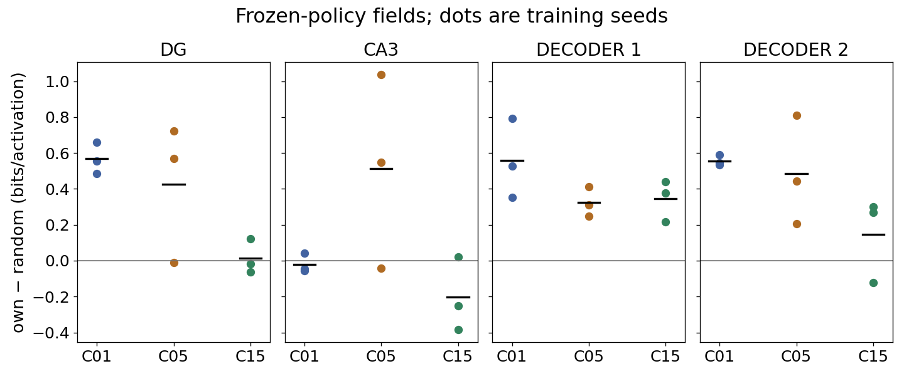

# Frozen-policy behavior and field expression — 7 October 2026

## Question and interpretation

For the same final checkpoint, do the agent's own actions expose more spatially
informative DG, CA3, and decoder activity than random actions? The actor,
encoder, decoder, and BatchNorm statistics are frozen. The action replacement
is an evaluation-time intervention; it cannot establish how policy sampling
changed the weights during training.

## Pinned cohort and protocol

The cohort is the Bernstein poster's corrected-core C01, C05, and C15 models,
each with training seeds 8, 99, and 123. Every checkpoint is the exact
100,040,704-frame final checkpoint already named in the
[poster terminal table](../results/A0_poster_analysis_20260926/flat_goal_comparison/matched_terminal_per_run.csv).
The [54-row evaluation manifest](../../hpc_runs/studies/behavior_field_expression_20261007.tsv)
has SHA-256 `db5797830cca1ec4f8366fa5e429d226488d735347f8f936bba32fdd9f44900b`.
It crosses nine models, two independent evaluation seeds (51,000 and 52,000),
and three action policies. Each row requests exactly 50,000 agent decisions.
Both evaluation seeds are repeat measurements, not extra training seeds.

The primary contrast replaces each independently sampled stochastic policy
action with an independent uniform draw from that checkpoint's allowed action
set. The secondary control holds each random draw for eight decisions. In both
arms the frozen model still processes every observation and updates its
recurrent/controller state; only the motor action sent to DMLab changes.
Environment starts use the same seed within each model/evaluation-seed pair.
Recurrent state resets at episode boundaries. All new checkpoint copies,
rollout arrays, Slurm logs, temporary data, and caches are under
`/work/classic/fr_xl1014-corridor-geometry/IntrMotiv/SF_hipposlam/train_dir/analysis/behavior_field_expression_20261007/`.
The former `fr_xl1014-train` allocation is read-only input provenance.

## Measurements and decision rule

The [probe](../../hpc_runs/behavior_field_probe.py) saves aligned pose,
episode boundaries, post-threshold DG, continuous DG logits, full CA3 trace,
decoder hidden layers 1 and 2, predicted value, action logits/probabilities,
proposed action, and executed action. Full arrays remain in the active
workspace. The [postprocessor](../../hpc_runs/behavior_field_analysis.py)
calculates 19-by-19 occupancy-corrected maps. Signed downstream activities are
rectified for rate/field measurements; their original signed traces are saved.

The primary score is the canonical amplitude-weighted spatial score divided
by that unit's mean activation, yielding bits per activation. Each paired
comparison uses equal weight on bins with at least ten visits in **both**
policies and the intersection of canonically eligible units. A comparison is
undefined below 20 shared bins or without a jointly eligible active unit.
This shared-support score is distinct from the historical native-occupancy
score, which remains in the per-run table for continuity. The postprocessor
also saves 10k/20k/30k/40k/50k paired prefixes, split-half reliability,
silence, mono-fields, components, dominant mass, distinct peaks, active-only
cosine, occupancy, headings, movement, and actions. Value and action outputs
are archived exploratory traces, with no field claim predeclared for them.
The deployed probe schema is `intrmotiv/behavior-field-probe/v1` and its
source SHA-256 is `df1f52f624cbf26a27503d764013ef38e4e7f4fb073e7b346310f672d9254efa`;
the deployed postprocessor source SHA-256 is
`5a3595171a26edc738c2d5f843a7f57eff1cbb7fc500f4d57865b407c4214424`.

A favorable result requires a consistent positive own-minus-uniform difference
across the three training seeds of a condition, stable direction late in the
rollout, and adequate common spatial support. The two evaluation seeds assess
measurement stability and are averaged within each training seed. The
eight-decision random control tests sensitivity to random-action persistence.
Mixed or unsupported layers are reported as such. The old 10k probes provide
context and are not pooled with these 50k measurements.

## Results: own policy versus uniform random

All 54 probes and all 36 own-versus-random pairs completed. Analysis job
`8296216` exited 0, and [status.json](../results/behavior_field_expression_20261007/status.json)
records a complete matrix. At 50k, every comparison is supported: 207–316
of 361 spatial bins have at least ten visits under both policies. Jointly
eligible units range from 14–16 in DG, 1,129–1,136 in CA3, 116–128 in
decoder 1, and 111–124 in decoder 2. The [paired-prefix table](../results/behavior_field_expression_20261007/paired_prefixes.csv)
records these counts beside every score. Even at 10k all contrasts meet the
formal support rule, with 57–145 common bins for the uniform comparison.

The table shows mean own-minus-uniform bits per activation at 50k. Each mean
first averages the two evaluation probes within a training seed, then averages
three training seeds. `+` means all three training seeds were positive at
40k and 50k; `mixed` means the planned direction criterion failed.

| Layer | C01 | C05 | C15 |
| --- | ---: | ---: | ---: |
| DG | +0.567 + | +0.428 mixed | +0.013 mixed |
| CA3 | −0.020 mixed | +0.513 mixed | −0.204 mixed |
| Decoder 1 | +0.557 + | +0.324 + | +0.344 + |
| Decoder 2 | +0.555 + | +0.486 + | +0.148 mixed |

The [seed-level figure](../results/behavior_field_expression_20261007/paired_layer_summary.png)
shows the nine independent training checkpoints. Decoder 1 meets the planned
direction and late-stability rule in all three conditions; decoder 2 does so
in C01 and C05. DG meets it only in C01. CA3 meets it in none. The [condition
summary](../results/behavior_field_expression_20261007/condition_summary.csv)
and [paired-prefix table](../results/behavior_field_expression_20261007/paired_prefixes.csv)
give the exact values, probe repeats, and support counts. The two evaluation
seeds are repeat measurements, not extra training seeds.

The cumulative comparison supports these distinctions. Decoder 1 is positive
in all three conditions at every 10k increment through 50k. C01 DG becomes
positive in all seeds by 20k and rises to +0.567 at 50k. C05 DG and CA3 each
retain one negative training seed at 50k. C15 DG stays near zero and C15 CA3
is negative in two seeds at 50k. Decoder 2 remains positive in all seeds of
C01 and C05, but one C15 seed is negative.

The [per-run table](../results/behavior_field_expression_20261007/per_run.csv)
retains the historical amplitude-weighted score and the requested unit and
field diagnostics. Across the 18 probes in each policy arm, mean split-half
map correlation is higher under the own policy than uniform random for DG
(0.598 versus 0.395), CA3 (0.483 versus 0.220), decoder 1 (0.415 versus
0.222), and decoder 2 (0.487 versus 0.243). This is a descriptive stability
readout, not a new independent training-seed test. The same table reports
silent/eligible units, component counts, dominant mass, distinct peak bins,
and active-only map cosine alongside the full pre-threshold DG plots.

## Behavior and random-protocol control

The own-policy probes occupy 291–318 bins (mean 315.3); both random arms touch
all 318 reachable bins in every probe. Own actions are concentrated in actions
3 and 4 (84.7% combined), while uniform random is nearly 20% per action.
Mean movement per decision is 27.6 under own policy, 23.7 under uniform
random, and 33.6 under persistent random. The stationary fractions are 6.6%,
3.8%, and 3.6%, respectively. The per-run table gives action and heading
histograms, movement, coverage, and episode counts. The random policies have
broader occupancy and more uniform headings; the own-policy occupancy is
spatially concentrated even where its occupied-bin count is high. Equal bin
weight and a common-bin mask reduce that sampling mismatch, but do not erase
all temporal or finite-visit effects.

The eight-decision persistent-random control yields an own-policy advantage
in all three training seeds at 40k and 50k for **every** layer and condition.
Its mean difference exceeds the uniform-random difference in most contrasts,
including CA3 and DG cases that fail the primary criterion. Persistent random
also moves farther and covers the same 318 reachable bins, so the extra
contrast is not explained by being stuck in a small region. The magnitude of
the difference depends on the random action protocol; the uniform arm remains
the predeclared primary test.

The full per-run maps and occupancy panels remain in the active NEMO2
workspace `summary/` directory. A representative C01 seed-8 pair is copied
here: [own occupancy](../results/behavior_field_expression_20261007/C01_S8_E51000_own_occupancy.png),
[uniform occupancy](../results/behavior_field_expression_20261007/C01_S8_E51000_uniform_occupancy.png),
[own DG maps](../results/behavior_field_expression_20261007/C01_S8_E51000_own_dg.png),
[uniform DG maps](../results/behavior_field_expression_20261007/C01_S8_E51000_uniform_dg.png),
[own decoder-1 maps](../results/behavior_field_expression_20261007/C01_S8_E51000_own_decoder_1.png),
and [uniform decoder-1 maps](../results/behavior_field_expression_20261007/C01_S8_E51000_uniform_decoder_1.png).

## Execution and verification status

- The nine historical `config.json` files and final checkpoints were copied
  into the active workspace with SHA-256 verification. The input inventory is
  `staged_inputs.json` beside the workspace `inputs/` folder.
- Two 256-decision compute-node preflights completed successfully: own-policy
  Slurm job `8294306` and uniform-random job `8294307`, both exit 0. Their
  first poses and neural readouts match. All layer/value/action arrays have
  exactly 256 aligned finite rows; action probabilities sum to one within
  $1.2\times10^{-7}$. Uniform random replaced 213 of 256 proposed actions.
  The checkpoint's learned parameters and BatchNorm running statistics had
  identical hashes before and after each probe.
- On that trace, the new DG occupancy matches the established evaluator
  exactly; rate maps differ by at most $9.6\times10^{-8}$ and the canonical
  spatial score by at most $3.1\times10^{-8}$. The eight focused tests pass
  locally and in the NEMO2 runtime.
- Print-only review validated 18 own-policy and 18 uniform-random independent
  50k-decision jobs against the pinned manifest and active-workspace paths.
  The first submissions were cancelled before producing any 50k trace:
  inspecting the archived C01 config revealed restored `train_dir`, DMLab
  cache, and W&B paths under the retired allocation. The adapter now overrides
  those three paths before the canonical loader constructs DMLab, disables
  W&B, and records the resolved paths in every probe's metadata. A second
  short preflight completed (jobs `8294361`/`8294362`, exit 0), and its
  metadata records only active-workspace runtime paths. The 36 primary jobs
  were resubmitted; their authoritative job IDs are in
  `probes/submission_20261007T160713Z.tsv` and
  `probes/submission_20261007T160743Z.tsv`.
  The cancelled submission records are
  `probes/submission_20261007T155751Z.tsv` and
  `probes/submission_20261007T155828Z.tsv`; their 36 jobs were explicitly
  cancelled, without affecting other studies. All corrected primary jobs
  completed with exit code 0, and all 36 raw artifacts passed the exact-length,
  finite-trace, episode-boundary, and workspace-path audit. One C01 seed-8
  pair has 265 bins with at least ten visits in both policies and jointly
  eligible units in every layer, demonstrating that the paired metric is
  estimable. The 18 persistent-random jobs were print-reviewed and submitted
  in `probes/submission_20261007T162128Z.tsv`; all completed with exit code
  0 and exact 50k metadata. Compute-node analysis job `8296216` completed
  with exit code 0 and produced the complete tables and plots linked above.

## Reusable workflow note

The canonical checkpoint loader and map contract allowed the new policy
contrast to stay a thin evaluator adapter. The critical validation was a
paired short rollout: it caught layer-hook, action-override, and alignment
errors before the large matrix. Future behavior-sampling probes should reuse
the same staged checkpoint identities and matched-support normalization,
then change only the declared action controller. Inspecting the archived
config's *resolved* paths before submission was essential: the initial
print-only review could not see paths restored inside the evaluator. The
completed map cache permits cheap support-threshold sensitivity checks
without re-running DMLab or the full postprocessor.
