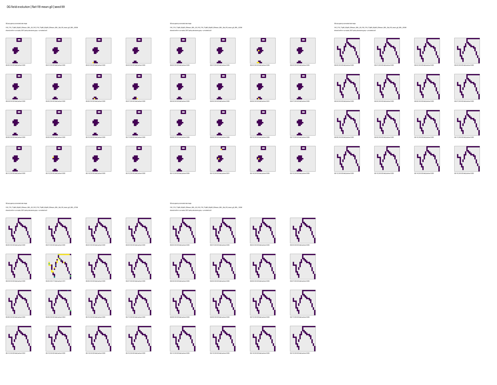
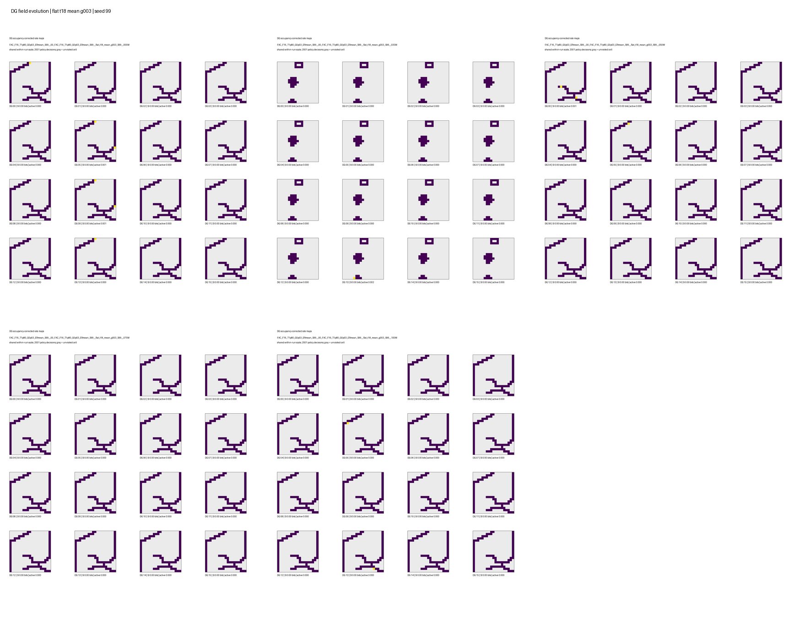
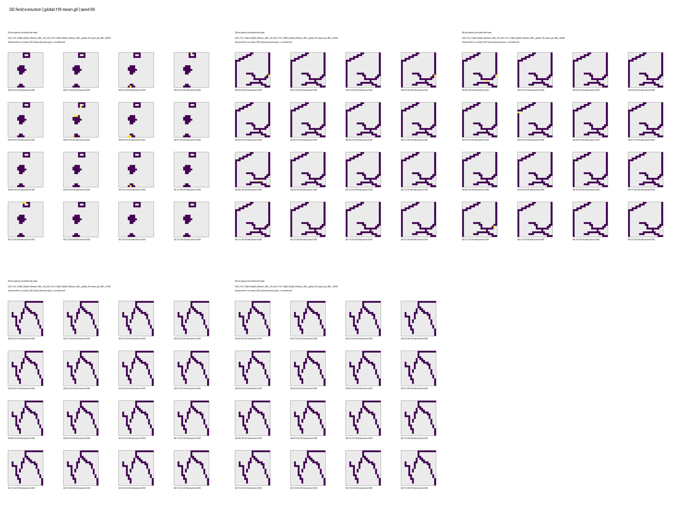
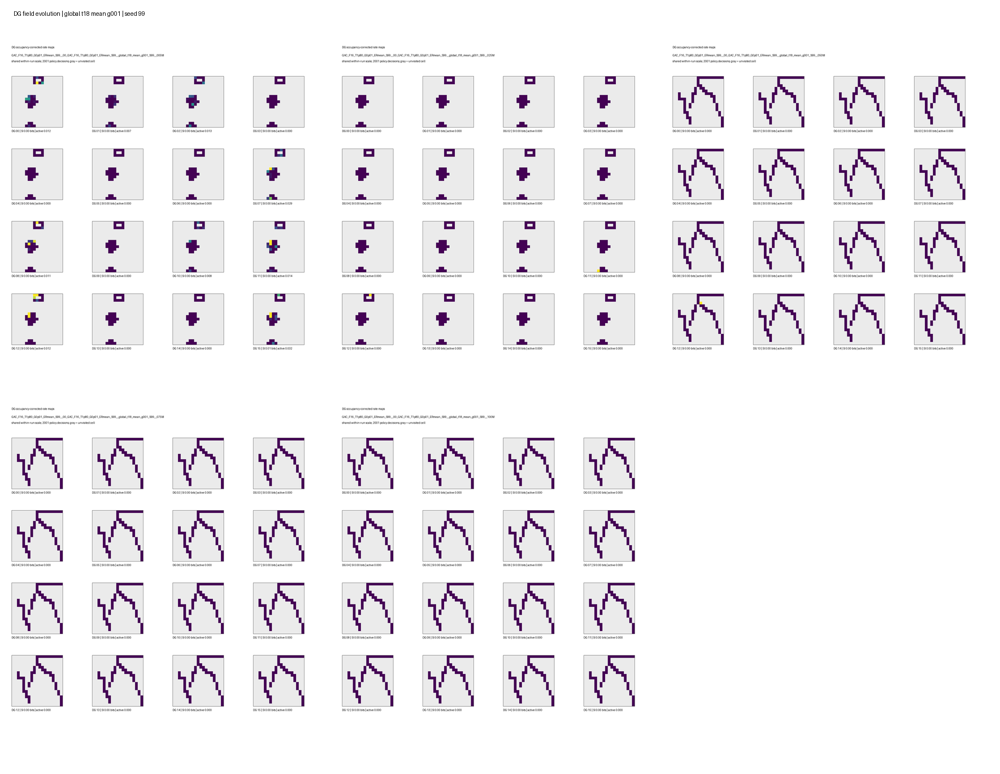
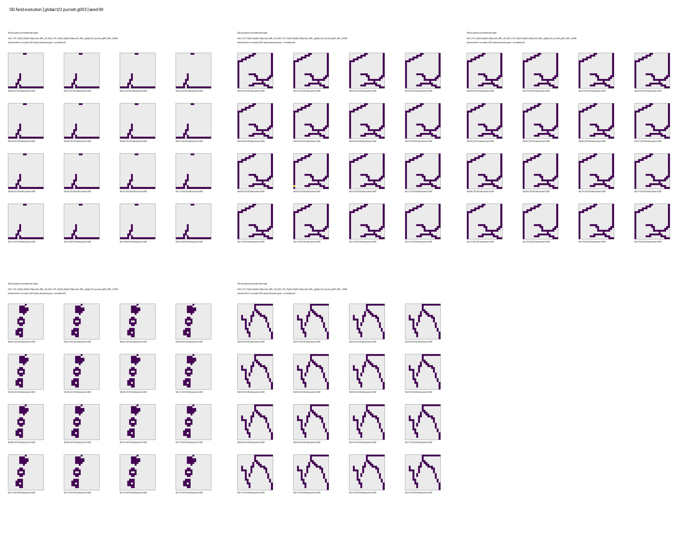
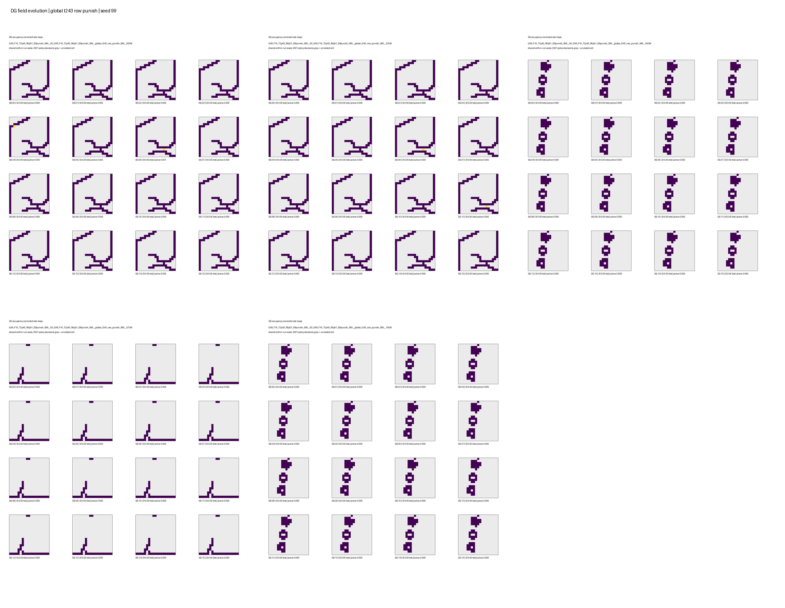

# DG anti-collapse: online activity and place-field results

Batch: `intrmotiv_dg_anti_collapse_20260824`.
All 120 one-policy jobs completed at about 80M environment frames. Terminal
metrics use the last 10M frames. The TensorBoard evaluation artifacts live at:

```text
/work/classic/fr_xl1014-train/IntrMotiv/SF_hipposlam/train_dir/analysis/dg_anti_collapse_20260825
```

## Conclusion

The global pre-threshold punishment does **not** solve DG activity collapse.
It has no consistent paired benefit over coefficient zero and commonly makes
the silent-unit fraction and exploration worse. The row-repulsion arm also
does not establish a solution: its terminal DG activity remains sparse and it
does not show a controlled stability advantage.

The batch does not support a claim that the methods solve receptive-field
drift. Checkpoint DG-row drift indicates that stronger global punishment can
increase total parameter rotation, while most conditions already change little
over their final approximately 5M frames. Parameter stability is not a
place-field stability measurement.

## Collapse Evidence

The best terminal activity in the main factorial was the flat,
`threshold=1.8`, `mean`, coefficient-zero control:

| Condition | DG density | Silent-unit fraction | Coverage AUC |
| --- | ---: | ---: | ---: |
| Flat, T=1.8, mean, global coeff 0 | 0.00106 | 0.827 | 62.7 |
| Flat, T=1.8, mean, global coeff 0.01 | 0.00117 | 0.855 | 63.4 |
| Flat, T=1.8, mean, global coeff 0.03 | 0.00144 | 0.884 | 48.1 |

Thus lowering the threshold helps relative to high-threshold cells, but still
leaves roughly 13 of 16 DG units silent in the terminal learner windows.

Across the replicated global-penalty factorial, only 3 of 24
architecture x threshold x feedback x coefficient comparisons had a lower
mean silent-unit fraction than their same-seed coefficient-zero controls. This
is not a credible correction of collapse. The clearest failure is `punish`:
the penalty usually reduces density and coverage further.

High coverage is not evidence of healthy DG activity. For example, fixed/global
HRL with T=2.0, `punish`, and coefficient zero reached coverage AUC 74.9 but
had DG density 0.000130 and silent fraction 0.932. The global-HRL
row-repulsion `punish` condition reached coverage AUC 75.8 with silent fraction
0.954. These are exploration outcomes with substantially collapsed DG events.

## Drift Evidence

The ResNet layer-2 trunk is ImageNet-pretrained and fixed. Drift below is the
corresponding cosine similarity of DG-projection rows from the first retained
checkpoint (about 3-4M frames) to the final checkpoint (about 80M frames).
Late-to-final compares the checkpoint nearest 75M with the final checkpoint.

| Replicated condition | Initial-to-final cosine | Mean angle | Late-to-final cosine |
| --- | ---: | ---: | ---: |
| Global HRL, T=1.8, mean, coeff 0 | 0.962 | 10.9 deg | 0.99994 |
| Global HRL, T=1.8, mean, coeff 0.01 | 0.878 | 25.4 deg | 0.99893 |
| Flat, T=1.8, mean, coeff 0 | 0.928 | 16.9 deg | 0.99485 |
| Flat, T=1.8, mean, coeff 0.03 | 0.884 | 24.9 deg | 0.99808 |
| Global HRL, T=2.2, punish, coeff 0.03 | 0.701 | 43.9 deg | 0.99653 |

The penalty therefore does not stabilize DG rows; in these representative
matched cases, stronger punishment increases total rotation. Most rows are
nearly stationary near the end of training regardless of arm, so late drift
was not the dominant problem to begin with.

## Limits and Next Decision

The online activity metrics establish collapse. Weight cosine does not establish
whether DG spatial fields are stable or useful. The selected
2,001-decision place-field follow-up below finds mostly silent DG maps. A fixed-trajectory evaluation is still needed to test true field
stability.

Do not continue the global-pre-threshold punishment sweep as the primary
anti-collapse mechanism. Retain low-threshold `mean` as the activity baseline,
and redesign the unexplored-location objective so it creates or preserves DG
events instead of directly suppressing every DG logit.

## Spatial place-field follow-up — 25 August 2026

The online 120-run analysis above and the selected six-condition spatial
follow-up use different observation protocols. The latter confirms that the
evaluated DG maps are mostly silent; it does not isolate the regularizer from
the missing encoder batch-loss control. The source note was
`dg_anti_collapse_place_fields.md`.

**Batch:** `intrmotiv_dg_anti_collapse_20260824`
**Analysis date:** 2026-08-25
**Evaluation artifacts:** `/work/classic/fr_xl1014-train/IntrMotiv/SF_hipposlam/train_dir/analysis/dg_anti_collapse_20260825/place_fields`

### Question and result

The question was whether lower DG thresholds plus global pre-threshold punishment or angular row repulsion produce a distributed, spatially meaningful DG code rather than silent/collapsed units.

**They do not in the evaluated combined anti-collapse settings.** In deterministic 2,001-decision rollouts, all six representative conditions finish with 13--16 silent units out of 16. Four global-HRL conditions are completely silent in all three final-seed evaluations. The few nonzero cases have mean DG activity below 0.1% of unit-time samples and no unit with spatial information above 0.5 bits. Thus there are no reliable place fields whose drift could be assessed in this batch: the observable failure is absence/intermittence of DG events, not movement of established fields.

**Causal limitation:** this batch did not retain the prior successful global-HRL configuration as an exact control. The earlier `GHRL_F16_L64_T243_HL5000_sim` run had `encoder_batch_loss=True`, `encoder_reward_method=encourage`, and 100M training frames; it showed 0.037--0.128 mean DG activity and 0.35--0.42 mean spatial information over the same 2,001-decision protocol. The current anti-collapse slice has batch loss disabled, uses `mean` or `punish`, and ends at 80M. It therefore cannot isolate global punishment or row repulsion from removal of the previously useful encoder learning signal.

### Scope

This is a focused spatial analysis of six meaningful simultaneous-update conditions from the completed 120-run sweep:

| Label | Architecture and intervention | Why included |
| --- | --- | --- |
| `flat_t18_mean_g0` | Flat, threshold 1.80, `mean`, no global penalty | Best flat activity/coverage reference in the scalar logs |
| `flat_t18_mean_g003` | Flat, threshold 1.80, `mean`, global penalty 0.03 | Strongest flat global-punishment contrast |
| `global_t18_mean_g0` | Fixed/global HRL, threshold 1.80, `mean`, no penalty | Best global-HRL activity reference |
| `global_t18_mean_g001` | Fixed/global HRL, threshold 1.80, `mean`, global penalty 0.01 | Modest global-punishment contrast |
| `global_t22_punish_g003` | Fixed/global HRL, threshold 2.20, `punish`, global penalty 0.03 | Lower-threshold punishment test |
| `global_t243_row_punish` | Fixed/global HRL, threshold 2.43, `punish`, row repulsion 0.01 | Best-performing prior global-HRL family plus lightweight repulsion |

The visual trunk is the intended fixed ImageNet-pretrained ResNet-18 through layer 2. The trainable DG projection and its BatchNorm statistics determine the evaluated landmarks. Unlike the earlier positive global-HRL representative, this batch intentionally has `encoder_batch_loss=False`.

For each condition, seed 99 was evaluated at approximately 5M, 25M, 50M, 75M, and the final 80M environment frames. Final checkpoints of seeds 8, 99, and 123 provide three-replica terminal statistics. Each checkpoint was evaluated for 2,001 deterministic policy decisions in DMLab openfield.

### Final-replica statistics

`active` is the mean DG activation fraction over all 16 units and all decisions; `silent` is the number of units without a single activation; SI is the occupancy-corrected mean spatial information in bits per unit. Values below are mean across final seeds 8, 99, and 123.

| Condition                                    |  Active | Silent / 16 | Mean SI (bits) | Units SI > 0.5 |
| -------------------------------------------- | ------: | ----------: | -------------: | -------------: |
| Flat T1.80, mean, G=0                        | 0.0115% |        14.7 |       0.000017 |              0 |
| Flat T1.80, mean, G=0.03                     | 0.0271% |        14.0 |       0.000155 |              0 |
| Global HRL T1.80, mean, G=0                  | 0.0000% |        16.0 |       0.000000 |              0 |
| Global HRL T1.80, mean, G=0.01               | 0.0000% |        16.0 |       0.000000 |              0 |
| Global HRL T2.20, punish, G=0.03             | 0.0000% |        16.0 |       0.000000 |              0 |
| Global HRL T2.43, punish, row repulsion=0.01 | 0.0312% |        15.7 |       0.000473 |              0 |

The small nonzero means are not evidence of fields. For example, the row-repulsion condition's only nonzero final replica had 0.0937% active unit-time and a mean SI of 0.00142 bits; the other two replicas were completely silent. The G=0.03 flat condition slightly increases activation relative to its control, but still leaves 13--15 units silent and has zero high-information units.

### How maps and SI are calculated

Agent positions are binned into a fixed 19 x 19 grid. For unit $u$ and visited bin $b$, the occupancy-corrected rate map is

$$
r_u(b) = \frac{\sum_{t: b_t=b} a_u(t)}{n(b)},
$$

where $a_u(t)$ is DG activity and $n(b)$ is dwell count. Spatial information is

$$
I_u = \sum_b p(b)\frac{r_u(b)}{\bar r_u}
\log_2\!\left(\frac{r_u(b)}{\bar r_u}\right),
$$

with $p(b)=n(b)/\sum_b n(b)$ and $\bar r_u=\sum_b p(b)r_u(b)$. A unit with no activations is assigned SI 0 and is counted as silent. This makes an all-zero map correctly distinguishable from a broad, low-information field.

### Checkpoint trajectories

The five-checkpoint sheets are below. They show that occasional, isolated activations appear and disappear rather than developing into a population of stable fields.

**Figure key:** gray cells were unvisited; dark purple is a visited cell with zero rate. Consequently, a repeated dark-purple maze trace in every DG panel denotes complete DG silence, not a common field.

| Condition | Seed-99 map evolution |
| --- | --- |
| Flat T1.80, mean, G=0 |  |
| Flat T1.80, mean, G=0.03 |  |
| Global HRL T1.80, mean, G=0 |  |
| Global HRL T1.80, mean, G=0.01 |  |
| Global HRL T2.20, punish, G=0.03 |  |
| Global HRL T2.43, punish, row repulsion |  |

The trajectory-stability calculation is correspondingly underpowered: for five of six seed-99 trajectories, no unit was nonzero at both the reference and later checkpoint, so map correlations and peak shifts are undefined. The sole exceptions involve one or two units in `flat_t18_mean_g003`, with correlations near zero at intermediate checkpoints. This is not field drift; it is sparse activity changing support.

### Interpretation

1. With batch loss disabled and `mean`/`punish` feedback, neither global pre-threshold punishment nor row repulsion restores an exploration-covering DG representation. It is not valid to attribute the collapse specifically to either new regularizer because the matched `encourage` plus batch-loss control is absent.
2. The observed row-repulsion condition is insufficient as a complete replacement for the earlier encoder learning signal. It changes projection directions without yielding reproducible active fields.
3. Lowering the threshold to 1.80 is not sufficient in this altered learning setting. Even the better flat condition has no unit above the conservative 0.5-bit SI threshold.
4. The earlier weight-drift result should not be over-interpreted as receptive-field stability. Weight cosine similarity only says that projection rows stopped rotating late in training. Here, the observable code is mostly zero, so a stable weight vector can still yield no usable landmark/place field.

### Important limits

- These are policy-driven deterministic rollouts, not a fixed replayed trajectory. A policy can visit different cells at different checkpoints, so map correlation is only interpretable on shared occupancy and only for units active at both checkpoints.
- Two thousand decisions cover 9--63% of the grid in these runs. This is adequate to identify total silence but not to rule out a field outside the visited portion of the environment.
- The maps measure thresholded DG events used by HRL. They do not diagnose whether pre-threshold logits retain a spatial signal. The next diagnostic should record the full pre-threshold logit map and its distribution, alongside thresholded events.

Future checkpoint sweeps use 10,000 policy decisions by default. This gives substantially better spatial coverage while retaining a practical array-job cost; the 2,001-decision artifacts above remain an intentionally short initial diagnostic.

### Consequence for the next design

First restore the previously successful `T=2.43`, `encourage`, `encoder_batch_loss=True`, 100M global-HRL configuration as an exact control. Then add only one intervention at a time: global pre-threshold punishment or row repulsion. Required telemetry should include per-unit pre-threshold logit quantiles, above-threshold duty cycle, spatial selectivity of logits and events, and a fixed-trajectory/probe evaluation for genuine across-checkpoint field stability.

### Reproducibility

- Raw per-checkpoint arrays: `.../place_fields/raw/*/place_fields.npz`
- Aggregate CSV/Markdown and per-checkpoint map grids: `.../place_fields/summary/`
- Seed-99 stability CSVs: `.../place_fields/stability/`
- Scripts: `evaluation/place_fields.py`, `evaluation/summarize_place_fields.py`, `evaluation/map_stability.py`, and `evaluation/plot_place_field_trajectories.py`
