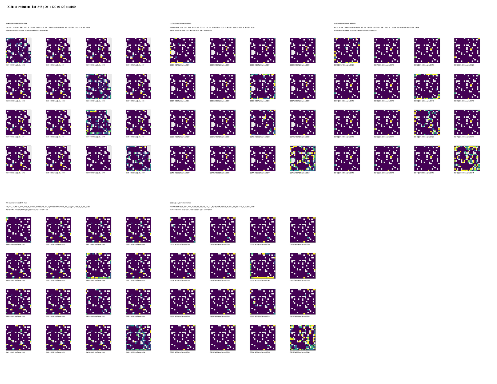
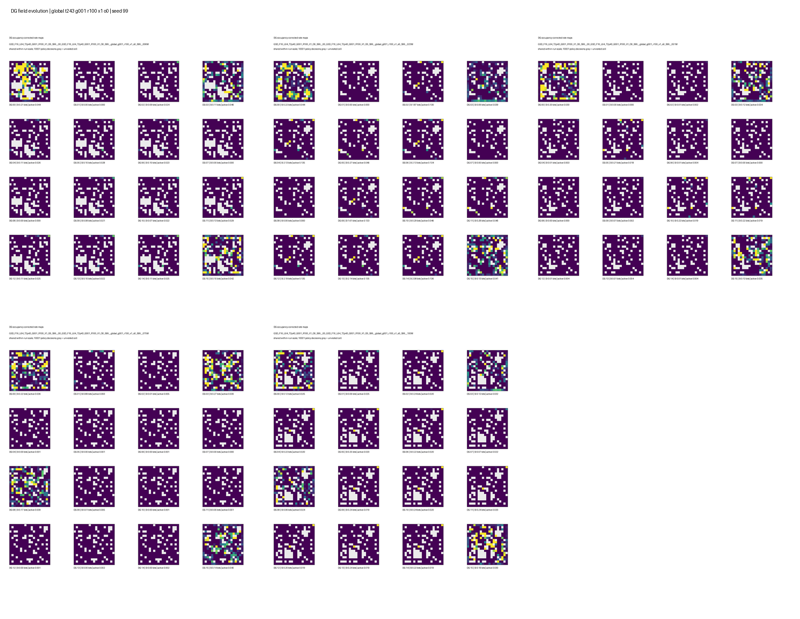
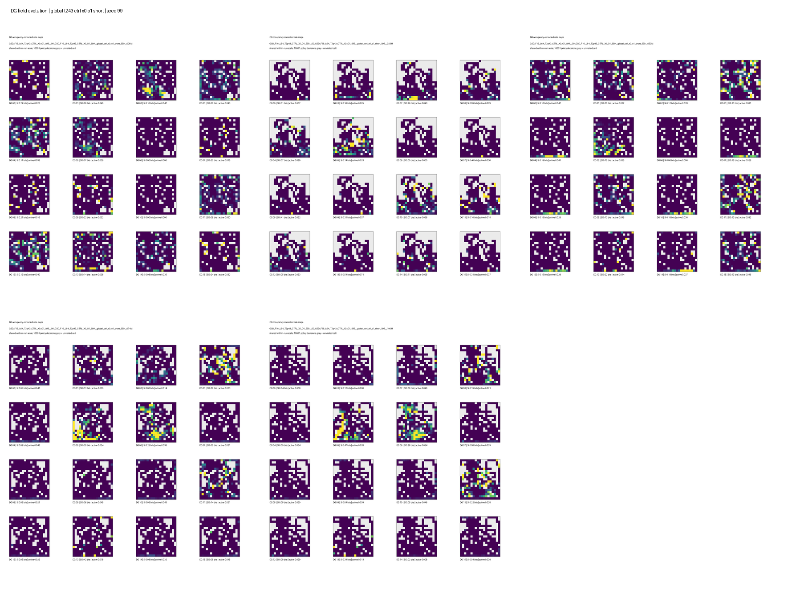
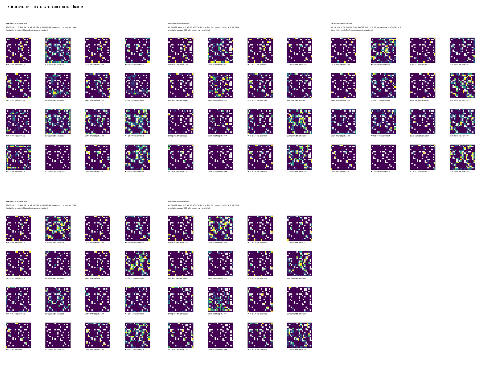

# Structural diversity and manager exploration: online and spatial results

**Analysis date:** 2026-08-27  
**Run horizon:** 100M environment frames per run  
**Replicates:** seeds 8, 99, and 123 in every condition

## Analysis Status

| Batch | W&B project | Production runs | Status |
| --- | --- | ---: | --- |
| DG structural diversity | `SF_IntrMotiv_DGStructuralDiversity` | 48/48 | Complete and analyzed |
| HRL manager exploration | `SF_IntrMotiv_HRLManagerExploration` | 24/24 | Complete and analyzed |

All 72 runs finished at approximately 100M environment frames. Results below
are means of each run's final 10% of W&B history, followed by a mean and sample
standard deviation across the three seeds. Coverage statistics are directly
comparable because both batches use the same fixed-length no-reward DMLab
environment and telemetry scope.

`coverage_auc` is the time-average cumulative number of unique spatial cells:

```text
U_t = number of unique cells observed through decision t
coverage_auc = (1 / T) * sum_t U_t
```

It rewards both spatial extent and early discovery. `unique cells` is final
extent and occupancy entropy measures how evenly the visited cells are used.

## Main Conclusions

1. The strongest flat exploration result is `FSD G001_R100 X0 O0`: coverage
   AUC `71.6 +/- 15.4` and `116.8 +/- 31.7` unique cells. It remains the best
   mean in these batches.
2. The strongest HRL coverage result is `GSD G001_R100 X1 O0`: AUC
   `66.4 +/- 9.2` and `112.7 +/- 17.8` cells. However, option success is only
   `1.22 +/- 0.29%` and the target-hit rate is `0.11 +/- 0.05%`. Its behavior
   is therefore not evidence that HRL learned reliable target navigation.
3. The best structural condition for the intended HRL mechanism remains
   `GSD CTRL X0 O1`: AUC `58.8 +/- 6.4`, option success
   `20.1 +/- 16.3%`, and hit rate `2.31 +/- 1.84%`. It is much less stable in
   option success than in coverage, so it is a candidate rather than a solved
   architecture.
4. `CTRL_X1_O1 P010` is the best manager condition by external behavior:
   AUC `65.5 +/- 7.1`, `108.6 +/- 11.8` cells, and entropy `3.86 +/- 0.23`.
   Its paired AUC gain over its deadline-only control is
   `+9.2 +/- 21.6`, which is not robust with three seeds.
5. Forced exploration is too dominant. Even `p=0` spends 37-40% of transitions
   in exploration because every target timeout triggers it. At `p=0.10`,
   87% of exploration selections are still timeout-forced. This reduces known
   graph edges from about 15% to 6-9% and does not improve target success.
6. The longer deadline reduces timeouts and raises completed-option success,
   but does not reliably improve exploration. The old-to-new timeout reduction
   is `-6.39 +/- 3.37` percentage points for `X0` and
   `-6.90 +/- 2.09` for `X1`. The `X0` coverage AUC falls by
   `8.08 +/- 1.90` in all matched seeds.
7. Online DG activity does not show severe population collapse: late density
   is generally 2.2-4.4%, usage entropy is 0.95-0.99, and minibatch silent-unit
   fractions are 0-6.25%. The subsequent matched 10k-decision telemetry shows
   that recruitment-enabled HRL has substantially more diverse spatial fields;
   see the selected place-field telemetry below.

## Structural Diversity Batch

`X1` enables CA3 temporal exclusion and `O1` enables orthogonal recruitment.
`G001_R100` combines global pre-threshold punishment coefficient 0.01 with DG
row-repulsion coefficient 1.0.

### Flat policy

| Background | Exclusion | Recruitment | Coverage AUC | Unique cells | Late minus midpoint AUC |
| --- | --- | --- | ---: | ---: | ---: |
| CTRL | X0 | O0 | 50.8 +/- 27.9 | 78.9 +/- 43.5 | +2.6 +/- 3.9 |
| CTRL | X0 | O1 | 55.0 +/- 13.6 | 88.3 +/- 26.4 | -6.2 +/- 6.5 |
| CTRL | X1 | O0 | 54.6 +/- 36.4 | 87.7 +/- 62.0 | +3.1 +/- 3.1 |
| CTRL | X1 | O1 | 64.6 +/- 15.5 | 104.8 +/- 29.7 | -2.9 +/- 7.3 |
| G001_R100 | X0 | O0 | **71.6 +/- 15.4** | **116.8 +/- 31.7** | +0.7 +/- 12.7 |
| G001_R100 | X0 | O1 | 56.8 +/- 11.6 | 84.3 +/- 23.7 | +1.8 +/- 18.0 |
| G001_R100 | X1 | O0 | 52.8 +/- 8.4 | 84.0 +/- 13.6 | -15.9 +/- 16.7 |
| G001_R100 | X1 | O1 | 57.0 +/- 16.6 | 85.9 +/- 31.0 | -0.7 +/- 10.1 |

The established regularizers help only in their simple `X0 O0` combination.
Adding either structural mechanism removes that advantage. Averaged over the
full flat factorial, recruitment changes AUC by only `+0.9`, exclusion by
`-1.3`, and `G001_R100` by `+3.3`; these averages hide strong interactions.

### Fixed/global HRL

| Background | Exclusion | Recruitment | Coverage AUC | Unique cells | Option success | Hit rate |
| --- | --- | --- | ---: | ---: | ---: | ---: |
| CTRL | X0 | O0 | 55.3 +/- 2.7 | 91.5 +/- 5.4 | 2.19 +/- 0.10% | 0.23 +/- 0.04% |
| CTRL | X0 | O1 | 58.8 +/- 6.4 | 89.5 +/- 14.2 | **20.10 +/- 16.26%** | **2.31 +/- 1.84%** |
| CTRL | X1 | O0 | 58.7 +/- 3.1 | 97.7 +/- 4.4 | 1.18 +/- 0.56% | 0.14 +/- 0.08% |
| CTRL | X1 | O1 | 53.1 +/- 9.0 | 84.3 +/- 15.3 | 11.33 +/- 17.97% | 1.69 +/- 2.82% |
| G001_R100 | X0 | O0 | 59.0 +/- 2.4 | 99.6 +/- 3.6 | 1.26 +/- 0.50% | 0.15 +/- 0.07% |
| G001_R100 | X0 | O1 | 41.1 +/- 5.3 | 60.9 +/- 10.3 | 11.68 +/- 7.45% | 1.50 +/- 1.14% |
| G001_R100 | X1 | O0 | **66.4 +/- 9.2** | **112.7 +/- 17.8** | 1.22 +/- 0.29% | 0.11 +/- 0.05% |
| G001_R100 | X1 | O1 | 56.2 +/- 9.6 | 89.4 +/- 16.9 | 7.65 +/- 10.90% | 1.04 +/- 1.58% |

Orthogonal recruitment replaces all 16 DG rows in every enabled run, but its
HRL main effect is `-7.6` AUC. In particular, it destroys the coverage gain of
`G001_R100 X1 O0`. Recruitment is therefore too aggressive in its current
form, despite the one-per-rollout rate limit.

CA3 exclusion has a positive HRL main effect of `+5.1` AUC, driven chiefly by
`G001_R100 X1 O0`; it is not consistently beneficial in the other cells. The
new manager batch directly logs actual conflicting activations and shows
approximately 79% for both `X0` and `X1` controls. Coefficient 1 therefore does
not measurably reduce the behavior it was intended to suppress.

## Manager Exploration Batch

All manager runs use the longer target deadline. `DCTRL` disables manager
exploration, `FORCED` explores only after a target timeout, and `P010`/`P025`
also make random exploration selections with the stated probability.

| Structure | Mode | Coverage AUC | Unique cells | Option success | Hit rate | Known edges | Exploration occupancy |
| --- | --- | ---: | ---: | ---: | ---: | ---: | ---: |
| CTRL_X0_O1 | DCTRL | 50.7 +/- 6.7 | 78.8 +/- 13.9 | **36.9 +/- 16.9%** | **1.17 +/- 0.75%** | **14.9 +/- 1.6%** | 0% |
| CTRL_X0_O1 | FORCED | 56.5 +/- 17.3 | 90.2 +/- 36.3 | 15.3 +/- 11.2% | 0.14 +/- 0.12% | 8.8 +/- 3.2% | 40.2 +/- 2.3% |
| CTRL_X0_O1 | P010 | 51.6 +/- 16.2 | 78.4 +/- 31.5 | 18.4 +/- 12.2% | 0.16 +/- 0.11% | 7.3 +/- 1.3% | 45.6 +/- 3.4% |
| CTRL_X0_O1 | P025 | 55.3 +/- 14.8 | 84.9 +/- 28.0 | 17.2 +/- 10.3% | 0.14 +/- 0.09% | 8.6 +/- 3.4% | 50.0 +/- 9.1% |
| CTRL_X1_O1 | DCTRL | 56.2 +/- 27.3 | 91.5 +/- 51.9 | 19.1 +/- 11.9% | 0.21 +/- 0.11% | **15.6 +/- 2.1%** | 0% |
| CTRL_X1_O1 | FORCED | 54.9 +/- 3.3 | 85.2 +/- 7.4 | 15.6 +/- 4.5% | 0.12 +/- 0.04% | 8.0 +/- 2.2% | 37.0 +/- 3.2% |
| CTRL_X1_O1 | P010 | **65.5 +/- 7.1** | **108.6 +/- 11.8** | 17.8 +/- 7.4% | 0.14 +/- 0.07% | 6.4 +/- 0.2% | 41.4 +/- 5.1% |
| CTRL_X1_O1 | P025 | 54.6 +/- 7.8 | 81.5 +/- 11.9 | **33.5 +/- 22.6%** | **0.33 +/- 0.28%** | 8.3 +/- 2.9% | 51.8 +/- 5.1% |

Manager exploration provides a much denser worker signal than target hitting:
15-19% of exploration transitions receive nonzero flat distance reward, while
target-hit rates remain 0.12-0.33% in exploration-enabled conditions. Any
coverage gain can therefore arise from the flat exploration branch without an
improvement in DG-target control.

The manager also starves the graph of target data. Compared with deadline-only
controls, all exploration settings reduce known-edge coverage by 6-9
percentage points. `P010` is the only promising behavioral setting, and only
for `X1`; it does not improve option success or graph completeness. The current
forced-after-every-timeout rule should not be treated as a successful manager.

## Deadline Effect

Relative to the matching short-deadline structural runs:

| Structure | Target deadline, new | Coverage AUC change | Option-success change | Timeout-rate change |
| --- | ---: | ---: | ---: | ---: |
| CTRL_X0_O1 | 45.0 +/- 7.5 | **-8.1 +/- 1.9** | +16.8 +/- 29.2 pp | -6.39 +/- 3.37 pp |
| CTRL_X1_O1 | 99.4 +/- 12.4 | +3.1 +/- 36.1 | +7.8 +/- 11.1 pp | -6.90 +/- 2.09 pp |

The deadlines now behave as intended mechanically: options get more time and
timeout much less often. They also complete less frequently, and the target-hit
rate per transition does not improve. For `X0`, every seed loses coverage.
Deadline calibration should therefore optimize useful target attempts per unit
experience, not completed-option success alone.

## Architecture Selection

There is no single winner across objectives:

- **Flat exploration benchmark:** `FSD G001_R100 X0 O0`.
- **Highest HRL external coverage:** `GSD G001_R100 X1 O0`, but it is not
  navigating reliably to designated DG targets.
- **Best evidence of the intended target mechanism:** short-deadline
  `GSD CTRL X0 O1`, with high uncertainty across seeds.
- **Manager candidate worth one focused follow-up:** `CTRL_X1_O1 P010`, after
  reducing forced exploration occupancy and preserving target/graph samples.

The flat benchmark still exceeds every HRL condition's mean AUC. The present
results support continued mechanism work, not a claim that HRL outperforms the
Jannek-compatible flat architecture.

## Remaining Analysis

- **Completed:** matched 10k-decision place-field telemetry at five seed-99
  checkpoints and the terminal checkpoints of all three seeds for the four
  selected architectures. Recruitment improves DG field diversity despite its
  negative behavioral main effect.
- Measure chance-corrected and target-shuffled hit baselines to separate
  deliberate navigation from incidental DG activation.
- Measure target attempts, hits, timeouts, and graph updates per unit target
  occupancy. Per-transition event rates are confounded when exploration takes
  40-50% of policy decisions.
- Calibrate predicted deadline against realized hit and timeout times by edge.
- Repeat any selected manager comparison with more seeds; the current paired
  manager effects have standard deviations larger than their means.

## Selected place-field telemetry — 27 August 2026

This follow-up evaluates four selected architectures at five checkpoints
for seed 99 and terminal checkpoints for seeds 8 and 123. Its spatial
measurements complement the online coverage and option metrics above. The
source note was `dg_structural_manager_place_field_telemetry.md`.

**Date:** 2026-08-27
**Slurm:** `7881719`, 28/28 tasks completed
**Protocol:** 10,000-decision stochastic DMLab rollout per checkpoint

### Scope

This evaluation follows up the structural-diversity and manager-exploration
batches with spatial DG telemetry for the four architectures selected in the
scalar analysis:

| Short name       | Architecture                     | Selection reason                           |
| ---------------- | -------------------------------- | ------------------------------------------ |
| Flat regularized | `FSD G001_R100 X0 O0`            | Best flat coverage                         |
| HRL coverage     | `GSD G001_R100 X1 O0`            | Best HRL coverage, but poor target success |
| HRL target       | `GSD CTRL X0 O1`, short deadline | Best evidence of target-conditioned HRL    |
| HRL manager      | `CTRL_X1_O1 P010`                | Best manager coverage                      |

For each architecture, seed 99 was evaluated near 5M, 25M, 50M, 75M, and
100M environment frames. Seeds 8 and 123 were evaluated at 100M, giving a
three-seed terminal comparison. The evaluator's inclusive endpoint produces
10,001 recorded occupancy samples per task. All raw arrays, thresholded maps,
pre-threshold maps, summaries, stability tables, manifests, and Slurm logs are
in:

```text
/work/classic/fr_xl1014-train/IntrMotiv/SF_hipposlam/train_dir/analysis/
dg_structural_manager_selected_telemetry_20260827/
```

### Metrics

Positions are assigned to the established 19 x 19 grid. For DG unit `u` and
visited cell `b`, the occupancy-corrected thresholded rate map is:

```text
r_u(b) = sum_{t: b_t=b} a_u(t) / occupancy(b)
```

The analysis reports:

- mean spatial information over all 16 DG units;
- active fraction over unit-decision entries and units with no event;
- mean pairwise cosine between maps of active units, where lower means less
  redundant spatial responses;
- distinct peak cells among active units;
- normalized entropy of unit counts over those peak cells;
- mean pairwise Euclidean distance between peak cells, in 100-unit grid bins;
- the corresponding diversity measures on continuous pre-threshold logit maps.

The active-only metrics avoid making a silent zero map look usefully
orthogonal. Peak entropy is normalized by `log(number of active units)`, so one
means each active unit has a distinct peak and zero means all peaks coincide.

### Terminal Results

Values are mean +/- sample standard deviation over seeds 8, 99, and 123.

| Architecture     |  Visited cells |   Mean SI, bits |   Active fraction |   Silent / 16 |   Active-map cosine | Active peak bins |        Peak entropy |    Peak distance |
| ---------------- | -------------: | --------------: | ----------------: | ------------: | ------------------: | ---------------: | ------------------: | ---------------: |
| Flat regularized | 306.0 +/- 11.3 | 0.185 +/- 0.153 | 0.0172 +/- 0.0043 | 0.67 +/- 1.15 |     0.629 +/- 0.204 |      3.3 +/- 1.2 |     0.266 +/- 0.169 |      5.5 +/- 3.2 |
| HRL coverage     | 301.7 +/- 20.5 | 0.115 +/- 0.073 | 0.0172 +/- 0.0059 | 0.00 +/- 0.00 |     0.735 +/- 0.235 |      3.7 +/- 2.9 |     0.217 +/- 0.229 |      3.3 +/- 2.8 |
| HRL target       | 272.0 +/- 33.4 | 0.164 +/- 0.040 | 0.0352 +/- 0.0069 | 0.33 +/- 0.58 | **0.161 +/- 0.021** | **10.7 +/- 2.3** | **0.788 +/- 0.084** | **12.6 +/- 1.4** |
| HRL manager      | 295.3 +/- 13.1 | 0.186 +/- 0.075 | 0.0260 +/- 0.0044 | 0.67 +/- 0.58 |     0.229 +/- 0.078 |      9.7 +/- 2.1 |     0.717 +/- 0.155 |     10.5 +/- 3.3 |

The terminal result is robust at the individual-seed level. `HRL target` has
8, 12, and 12 distinct active peak bins; `HRL manager` has 8, 9, and 12. By
contrast, the two non-recruitment conditions usually have only two to four
peaks; seed 99 of `HRL coverage` is the favorable exception with seven.

Pre-threshold maps give the same conclusion:

| Architecture | Pre-threshold cosine | Pre-threshold peak bins | Peak entropy | Peak distance |
| --- | ---: | ---: | ---: | ---: |
| Flat regularized | 0.530 +/- 0.298 | 4.7 +/- 3.1 | 0.338 +/- 0.277 | 5.9 +/- 3.7 |
| HRL coverage | 0.649 +/- 0.291 | 3.7 +/- 2.1 | 0.234 +/- 0.192 | 3.5 +/- 2.2 |
| HRL target | **0.128 +/- 0.074** | **11.3 +/- 1.5** | **0.822 +/- 0.053** | **11.8 +/- 1.4** |
| HRL manager | 0.205 +/- 0.109 | 9.3 +/- 1.5 | 0.685 +/- 0.119 | 10.3 +/- 3.1 |

Therefore the diversity of the recruitment-enabled conditions is not an
artifact of the hard threshold. It is already present in the continuous DG
response geometry.

### Checkpoint Trajectories

The seed-99 trajectory shows no progressive population collapse. The two
recruitment-enabled runs sustain 10-13 active peak bins across all five
checkpoints. The non-recruitment runs sustain activity but remain spatially
redundant.

| Architecture | Active peaks, early to final | Silent units, early to final | Final-map correlation at early / 50M / 75M |
| --- | --- | --- | --- |
| Flat regularized | 5, 5, 5, 4, 4 | 1, 0, 0, 0, 0 | 0.704 / 0.692 / 0.730 |
| HRL coverage | 4, 5, 5, 5, 7 | 3, 3, 3, 1, 0 | 0.794 / 0.774 / 0.792 |
| HRL target | 11, 10, 11, 11, 12 | 2, 1, 1, 0, 0 | 0.003 / 0.410 / 0.527 |
| HRL manager | 13, 11, 12, 11, 12 | 1, 1, 1, 1, 1 | 0.132 / 0.445 / 0.608 |

Recruitment-enabled map identities reorganize substantially early and become
more correlated with the final maps later in training. They are not fully
stable: the mean peak shift from the 75M rollout to the final rollout remains
9.25 bins for `HRL target` and 8.22 bins for `HRL manager`. The non-recruitment
maps have high correlations from early training, but this reflects broad,
redundant response patterns and does not imply good place-field allocation.

These are stochastic policy-driven trajectories. Correlations use only shared
visited cells and occupancy weighting, but different paths still limit causal
drift claims. A fixed observation probe or scripted trajectory is required to
measure exact receptive-field drift.

### Place-Field Plots

Each sheet shows the 16 thresholded DG rate maps at five seed-99 checkpoints.
Gray/white cells are unvisited; dark purple visited cells have zero activity.
Each checkpoint uses a shared within-checkpoint color scale.

#### Flat regularized



#### HRL coverage



#### HRL target



#### HRL manager



### Revised Interpretation

1. The orthogonal-recruitment configurations **do not exhibit spatial
   representational collapse**. They have about ten or eleven distributed
   peaks instead of the three or four clustered peaks in the selected
   non-recruitment conditions, with much lower map redundancy.
2. The structural batch's negative recruitment effect on behavioral AUC is not
   caused by failed DG diversity. Representation quality and policy learning
   have separated: the worker/manager does not exploit the improved landmarks
   effectively, and replacing all 16 rows may disrupt graph and policy state.
3. The highest-coverage HRL condition without recruitment is not the best HRL
   representation. Its 1.22% option success, high map cosine, and low peak
   diversity are mutually consistent with exploration that is not deliberate
   DG-target navigation.
4. `CTRL_X0_O1` is the strongest representation and target-mechanism condition,
   but its external coverage is weaker. It should be the mechanistic HRL
   reference, not the behavioral winner.
5. The manager candidate preserves most of the recruitment diversity while
   obtaining the best manager-batch coverage. Its remaining failure is the
   manager schedule: forced exploration consumes too much experience and
   starves target options and graph updates.

The next algorithmic change should preserve the recruited DG code while making
recruitment less disruptive and reducing forced exploration occupancy. More DG
losses are not the immediate bottleneck demonstrated by these runs.

This selected-candidate evaluation is not an exact one-factor `O0` versus `O1`
contrast: background losses, exclusion, and manager mode also differ across the
four architectures. It establishes that recruitment-enabled configurations can
sustain a distributed code, not the isolated causal effect size of recruitment.
A terminal telemetry pass over the matched `O0/O1` structural pairs would be
required for that attribution.

### Reproducibility

The reusable end-to-end workflow and extension contract are documented in
[[../../04_implementation/reusable_place_field_telemetry|Reusable DG Place-Field Telemetry]].

- Raw checkpoint artifacts: `.../raw/*/place_fields.npz`
- Full manifest: `.../analysis_manifest.tsv`
- Seed-99 trajectory manifest: `.../trajectory_manifest.tsv`
- Standard summaries and maps: `.../summary/`
- Active-only derived metrics: `.../summary/derived_place_field_metrics.csv`
- Derived-metric script: `evaluation/analyze_place_field_manifest.py` on NEMO2
  and `analyze_place_field_manifest.py` beside this report
- Stability tables: `.../stability/<condition>/`
- Five-checkpoint sheets: `.../trajectories/`
- Local lightweight CSVs and figures:
  `../assets/dg_structural_manager_place_fields_20260827/`
