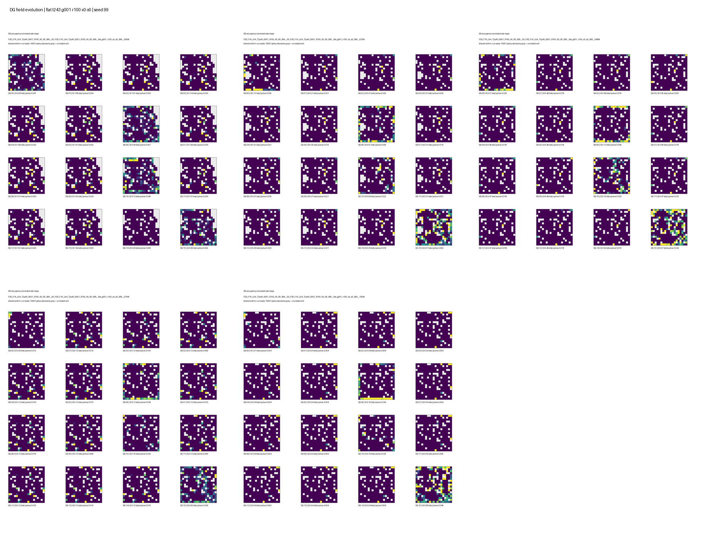
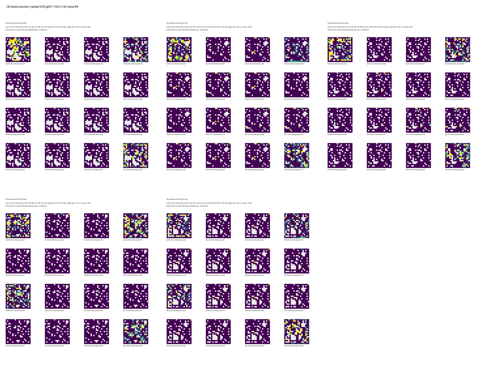
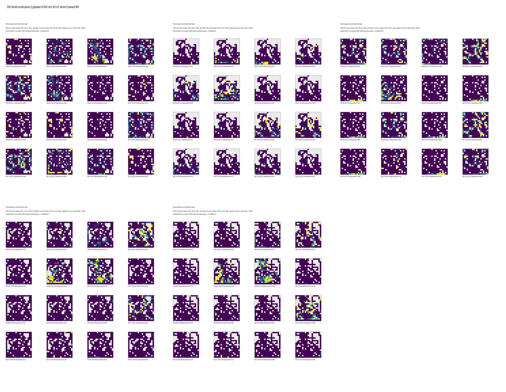
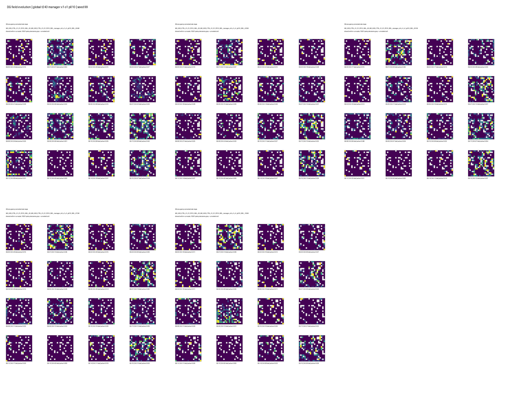

# Structural And Manager Place-Field Telemetry

**Date:** 2026-08-27  
**Slurm:** `7881719`, 28/28 tasks completed  
**Protocol:** 10,000-decision stochastic DMLab rollout per checkpoint

## Scope

This evaluation follows up the structural-diversity and manager-exploration
batches with spatial DG telemetry for the four architectures selected in the
scalar analysis:

| Short name       | Architecture                     | Selection reason                           |
| ---------------- | -------------------------------- | ------------------------------------------ |
| Flat regularized | `FSD G001_R100 X0 O0`            | Best flat coverage                         |
| HRL coverage     | `GSD G001_R100 X1 O0`            | Best HRL coverage, but poor target success |
| HRL target       | `GSD CTRL X0 O1`, short deadline | Best evidence of target-conditioned HRL    |
| HRL manager      | `CTRL_X1_O1 P010`                | Best manager coverage                      |

For each architecture, seed 99 was evaluated near 5M, 25M, 50M, 75M, and
100M environment frames. Seeds 8 and 123 were evaluated at 100M, giving a
three-seed terminal comparison. The evaluator's inclusive endpoint produces
10,001 recorded occupancy samples per task. All raw arrays, thresholded maps,
pre-threshold maps, summaries, stability tables, manifests, and Slurm logs are
in:

```text
/work/classic/fr_xl1014-train/IntrMotiv/SF_hipposlam/train_dir/analysis/
dg_structural_manager_selected_telemetry_20260827/
```

## Metrics

Positions are assigned to the established 19 x 19 grid. For DG unit `u` and
visited cell `b`, the occupancy-corrected thresholded rate map is:

```text
r_u(b) = sum_{t: b_t=b} a_u(t) / occupancy(b)
```

The analysis reports:

- mean spatial information over all 16 DG units;
- active fraction over unit-decision entries and units with no event;
- mean pairwise cosine between maps of active units, where lower means less
  redundant spatial responses;
- distinct peak cells among active units;
- normalized entropy of unit counts over those peak cells;
- mean pairwise Euclidean distance between peak cells, in 100-unit grid bins;
- the corresponding diversity measures on continuous pre-threshold logit maps.

The active-only metrics avoid making a silent zero map look usefully
orthogonal. Peak entropy is normalized by `log(number of active units)`, so one
means each active unit has a distinct peak and zero means all peaks coincide.

## Terminal Results

Values are mean +/- sample standard deviation over seeds 8, 99, and 123.

| Architecture | Visited cells | Mean SI, bits | Active fraction | Silent / 16 | Active-map cosine | Active peak bins | Peak entropy | Peak distance |
| --- | ---: | ---: | ---: | ---: | ---: | ---: | ---: | ---: |
| Flat regularized | 306.0 +/- 11.3 | 0.185 +/- 0.153 | 0.0172 +/- 0.0043 | 0.67 +/- 1.15 | 0.629 +/- 0.204 | 3.3 +/- 1.2 | 0.266 +/- 0.169 | 5.5 +/- 3.2 |
| HRL coverage | 301.7 +/- 20.5 | 0.115 +/- 0.073 | 0.0172 +/- 0.0059 | 0.00 +/- 0.00 | 0.735 +/- 0.235 | 3.7 +/- 2.9 | 0.217 +/- 0.229 | 3.3 +/- 2.8 |
| HRL target | 272.0 +/- 33.4 | 0.164 +/- 0.040 | 0.0352 +/- 0.0069 | 0.33 +/- 0.58 | **0.161 +/- 0.021** | **10.7 +/- 2.3** | **0.788 +/- 0.084** | **12.6 +/- 1.4** |
| HRL manager | 295.3 +/- 13.1 | 0.186 +/- 0.075 | 0.0260 +/- 0.0044 | 0.67 +/- 0.58 | 0.229 +/- 0.078 | 9.7 +/- 2.1 | 0.717 +/- 0.155 | 10.5 +/- 3.3 |

The terminal result is robust at the individual-seed level. `HRL target` has
8, 12, and 12 distinct active peak bins; `HRL manager` has 8, 9, and 12. By
contrast, the two non-recruitment conditions usually have only two to four
peaks; seed 99 of `HRL coverage` is the favorable exception with seven.

Pre-threshold maps give the same conclusion:

| Architecture | Pre-threshold cosine | Pre-threshold peak bins | Peak entropy | Peak distance |
| --- | ---: | ---: | ---: | ---: |
| Flat regularized | 0.530 +/- 0.298 | 4.7 +/- 3.1 | 0.338 +/- 0.277 | 5.9 +/- 3.7 |
| HRL coverage | 0.649 +/- 0.291 | 3.7 +/- 2.1 | 0.234 +/- 0.192 | 3.5 +/- 2.2 |
| HRL target | **0.128 +/- 0.074** | **11.3 +/- 1.5** | **0.822 +/- 0.053** | **11.8 +/- 1.4** |
| HRL manager | 0.205 +/- 0.109 | 9.3 +/- 1.5 | 0.685 +/- 0.119 | 10.3 +/- 3.1 |

Therefore the diversity of the recruitment-enabled conditions is not an
artifact of the hard threshold. It is already present in the continuous DG
response geometry.

## Checkpoint Trajectories

The seed-99 trajectory shows no progressive population collapse. The two
recruitment-enabled runs sustain 10-13 active peak bins across all five
checkpoints. The non-recruitment runs sustain activity but remain spatially
redundant.

| Architecture | Active peaks, early to final | Silent units, early to final | Final-map correlation at early / 50M / 75M |
| --- | --- | --- | --- |
| Flat regularized | 5, 5, 5, 4, 4 | 1, 0, 0, 0, 0 | 0.704 / 0.692 / 0.730 |
| HRL coverage | 4, 5, 5, 5, 7 | 3, 3, 3, 1, 0 | 0.794 / 0.774 / 0.792 |
| HRL target | 11, 10, 11, 11, 12 | 2, 1, 1, 0, 0 | 0.003 / 0.410 / 0.527 |
| HRL manager | 13, 11, 12, 11, 12 | 1, 1, 1, 1, 1 | 0.132 / 0.445 / 0.608 |

Recruitment-enabled map identities reorganize substantially early and become
more correlated with the final maps later in training. They are not fully
stable: the mean peak shift from the 75M rollout to the final rollout remains
9.25 bins for `HRL target` and 8.22 bins for `HRL manager`. The non-recruitment
maps have high correlations from early training, but this reflects broad,
redundant response patterns and does not imply good place-field allocation.

These are stochastic policy-driven trajectories. Correlations use only shared
visited cells and occupancy weighting, but different paths still limit causal
drift claims. A fixed observation probe or scripted trajectory is required to
measure exact receptive-field drift.

## Place-Field Plots

Each sheet shows the 16 thresholded DG rate maps at five seed-99 checkpoints.
Gray/white cells are unvisited; dark purple visited cells have zero activity.
Each checkpoint uses a shared within-checkpoint color scale.

### Flat regularized



### HRL coverage



### HRL target



### HRL manager



## Revised Interpretation

1. The orthogonal-recruitment configurations **do not exhibit spatial
   representational collapse**. They have about ten or eleven distributed
   peaks instead of the three or four clustered peaks in the selected
   non-recruitment conditions, with much lower map redundancy.
2. The structural batch's negative recruitment effect on behavioral AUC is not
   caused by failed DG diversity. Representation quality and policy learning
   have separated: the worker/manager does not exploit the improved landmarks
   effectively, and replacing all 16 rows may disrupt graph and policy state.
3. The highest-coverage HRL condition without recruitment is not the best HRL
   representation. Its 1.22% option success, high map cosine, and low peak
   diversity are mutually consistent with exploration that is not deliberate
   DG-target navigation.
4. `CTRL_X0_O1` is the strongest representation and target-mechanism condition,
   but its external coverage is weaker. It should be the mechanistic HRL
   reference, not the behavioral winner.
5. The manager candidate preserves most of the recruitment diversity while
   obtaining the best manager-batch coverage. Its remaining failure is the
   manager schedule: forced exploration consumes too much experience and
   starves target options and graph updates.

The next algorithmic change should preserve the recruited DG code while making
recruitment less disruptive and reducing forced exploration occupancy. More DG
losses are not the immediate bottleneck demonstrated by these runs.

This selected-candidate evaluation is not an exact one-factor `O0` versus `O1`
contrast: background losses, exclusion, and manager mode also differ across the
four architectures. It establishes that recruitment-enabled configurations can
sustain a distributed code, not the isolated causal effect size of recruitment.
A terminal telemetry pass over the matched `O0/O1` structural pairs would be
required for that attribution.

## Reproducibility

The reusable end-to-end workflow and extension contract are documented in
[[../04_implementation/reusable_place_field_telemetry|Reusable DG Place-Field Telemetry]].

- Raw checkpoint artifacts: `.../raw/*/place_fields.npz`
- Full manifest: `.../analysis_manifest.tsv`
- Seed-99 trajectory manifest: `.../trajectory_manifest.tsv`
- Standard summaries and maps: `.../summary/`
- Active-only derived metrics: `.../summary/derived_place_field_metrics.csv`
- Derived-metric script: `evaluation/analyze_place_field_manifest.py` on NEMO2
  and `analyze_place_field_manifest.py` beside this report
- Stability tables: `.../stability/<condition>/`
- Five-checkpoint sheets: `.../trajectories/`
- Local lightweight CSVs and figures:
  `assets/dg_structural_manager_place_fields_20260827/`
