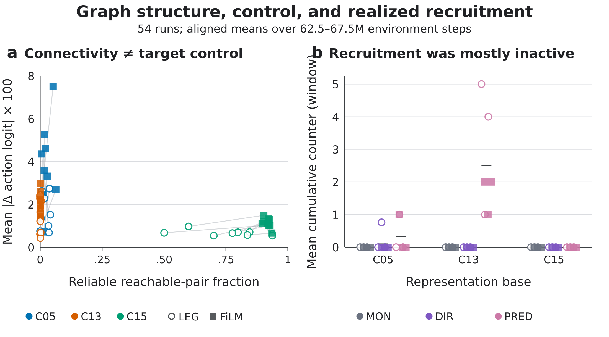
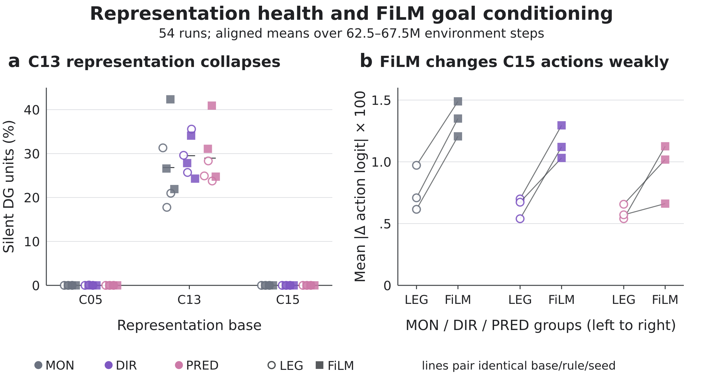

# Directional and predictive recruitment: interim diagnosis

## Scope and provenance

- Batch: `intrmotiv_directional_predictive_recruitment_20260904`
- Project: `SF_IntrMotiv_DirectionalPredictiveRecruitment`
- Study schema: `intrmotiv/study/v1`
- Study workflow declared by the spec: `1.2.0`
- Collector workflow: `1.3.0`
- Validated StudySpec SHA-256: `72b0ac2d04ad7a297a674f96d4f32c85d48dcf89a9fc62abb7243adb22ea53aa`
- Analysis window: 62.5–67.5M environment steps, chosen because every one of the 54 runs had passed 67.5M.
- Slurm state at 2026-09-04 17:17 CEST: 33 completed, 21 running, no failed production jobs.

The canonical collector read all 54 StudySpec rows. Results are in
[`results/directional_predictive_recruitment_interim_20260904/`](results/directional_predictive_recruitment_interim_20260904/).
This is an interim descriptive analysis with three seeds per cell, not a final inferential report.

## Main diagnosis

The batch exposes a more basic problem than the choice between DIR and PRED:
**the learned graph is not yet a validated controllability graph**. C15 builds a large,
well-connected graph, but changing the commanded target changes the action logits only
slightly. Meanwhile, the recruitment treatments are mostly inactive because replacement
requires two events to coincide: an eligible victim and a silent rollout endpoint.

Execution integrity looks sound at this stage: all 54 runs supplied the common window,
behavior-target replay mismatch is exactly zero throughout the collected data, and Slurm
shows no failed production job.



Vector master:
[`interim_graph_control_62p5m_67p5m.svg`](assets/directional_predictive_recruitment_interim_20260904/interim_graph_control_62p5m_67p5m.svg).

### 1. C15 has topology without strong target control

Across all C15 cells:

- reliable reachable-pair fraction: **0.844**;
- largest reliable SCC: **13.39/16**;
- mean reliable out-degree: **4.59**;
- top-three incoming-confidence share: **0.488**;
- option success: **0.159**;
- target action sensitivity: **0.0090 mean absolute logit units** under the implemented alternate-target test.

FiLM improves the C15 graph and policy response. Averaged across recruitment rules, its
reachable-pair fraction is 0.917 versus 0.770 for LEG, its largest SCC is 14.68 versus
12.10, and its action sensitivity is 0.0114 versus 0.0066 logit units. The paired sensitivity increase
is positive in all nine seed-by-rule comparisons:

| Rule | Mean FiLM − LEG sensitivity (logit units) | SD across seeds |
|---|---:|---:|
| MON | +0.00583 | 0.00062 |
| DIR | +0.00512 | 0.00133 |
| PRED | +0.00346 | 0.00248 |

This establishes that FiLM is doing something real. It does **not** establish useful
target-dependent control: even the FiLM values remain below 0.015 mean absolute logit units
in every C15 run.

The likely explanation is that a “successful” edge currently measures whether the target
landmark appeared during an intentional option, not whether commanding that target caused
the hit. Frequently active or spatially scattered landmarks can therefore accumulate
reliable-looking incoming and outgoing edges. A large SCC can be an opportunity graph
rather than a causal controllability graph.

### 2. C13 is a representation/support failure

Across all C13 cells:

- silent DG fraction: **0.284**;
- DG usage entropy: **0.729**;
- option success: **0.024**;
- reliable reachable-pair fraction: **0.0006**;
- largest reliable SCC: **1.00**;
- fully tested sources: **0**.

PRED made 15 cumulative replacements across the six C13 PRED runs, but it did not rescue
the representation. Relative to matched MON cells, PRED changed the silent fraction by
+2.32 percentage points under LEG and +1.96 under FiLM; usage entropy fell by 0.009 and
0.011; option success fell by 1.31 and 4.46 percentage points. These are descriptive
three-seed differences, but they are in the wrong direction and the graph remains empty.

Late-window PRED eligibility is almost absent (mean eligible count 0.010), despite earlier
replacements. The minimum two-attempt-per-context criterion can therefore fire on an early,
small, transient batch and disappear later. C13 does not provide enough successful
goal-directed evidence for contextual unpredictability to be a meaningful victim signal.

### 3. C05 has usable DG activity but insufficient graph testing

Across all C05 cells:

- silent DG fraction is essentially **0** and usage entropy is **0.965**;
- option success is **0.245**, the best of the three bases;
- target action sensitivity is **0.0271 logit units**, also the strongest overall;
- attempt coverage is only **0.189**;
- fully tested sources: **0**;
- mean reliable out-degree: **0.298**;
- reachable-pair fraction: **0.0228**;
- top-three incoming-confidence share: **0.877**.

Thus C05 is not failing because all landmark units are silent. Its graph is sparse and
destination-concentrated because the manager has not collected balanced intentional
attempts. DIR correctly protects all zero-outdegree nodes: all are still untested. This
means DIR cannot answer the recruitment question in C05 under the current manager data
distribution.

PRED diagnoses many contextual inconsistencies in C05 (mean 3.48 eligible sources, gap
0.388), but only two of the six C05 PRED runs show a cumulative replacement. Eligibility
usually does not coincide with a silent endpoint.



Vector master:
[`interim_representation_film_62p5m_67p5m.svg`](assets/directional_predictive_recruitment_interim_20260904/interim_representation_film_62p5m_67p5m.svg).

## Why the recruitment comparison is not yet causal

The study labels 18 runs each as MON, DIR, or PRED, but the realized manipulation is much
smaller:

- MON: zero replacements by design;
- DIR: no replacements in C13 or C15; one late C05-LEG run shows the cumulative counter
  rising during this window through the mutual-close duplicate criterion;
- PRED: replacements in C13, rare replacements in C05, none in C15.

For C15-DIR-LEG, a bad source is occasionally present (window mean 0.070), but recruitment
remains zero because C15 has no silent endpoints. C05 has abundant PRED eligibility and the
same problem. The victim rules are therefore coupled to a trigger that measures a different
failure mode:

- a silent endpoint means the current observation is not covered by any DG unit;
- DIR/PRED say an existing DG unit is structurally or contextually poor.

There is no reason these should occur at the same time. Consequently, a zero treatment
effect does not mean the victim rule is ineffective; in most cells the victim rule was not
actually applied.

This also changes how the paired contrast table should be read. In C15, where every
recruitment counter is zero, differences among MON, DIR, and PRED are a direct estimate of
independent-training variability, not a recruitment effect. For example, C15 PRED–MON under
FiLM is −0.0041 logit units in action sensitivity and −2.0 percentage points in option
success despite no replacement in either cell. Such differences must not be attributed to
the victim rule.

## Metric shortcomings exposed by the batch

1. **Target-hit lift is unstable and can be misleading.** The implementation is
   `actual_rate / max(shuffled_rate, 1e-6)`, where the shuffled target is a one-position
   minibatch roll. C13 consequently reports mean lift 23.7, including values up to 77,
   while option success is 2.4% and the graph is empty. The numerator, denominator, event
   counts, and confidence/support must be logged separately. This ratio must not be used as
   control evidence when the shuffled denominator is near zero.

2. **Action sensitivity is only a logit perturbation diagnostic.** It is the mean absolute
   logit difference between the behavior target and a batch-rolled alternate target. It
   shows that FiLM affects the decoder, but not that actions are usefully different or that
   target hits are caused. Action-probability total variation or Jensen–Shannon divergence,
   with balanced alternate targets, would be easier to interpret.

3. **`recruitment_total` is declared as a window metric even though it is cumulative.** The
   collector therefore averages the cumulative counter through the window and can produce
   fractional values such as 0.763. It should be a `cumulative_metrics` entry, collected as
   the latest value at the window end. Per-rollout assignment metrics should remain window
   means.

4. **No online spatial snapshots are available for this batch.** DG silence, usage entropy,
   and graph topology cannot determine whether landmarks are unimodal or spatially
   scattered. The planned manifest-driven 75M place-field telemetry remains necessary,
   especially for high-incoming-confidence C05 nodes and highly connected C15 nodes.

## Minimal next decisions

### Urgent before interpreting this batch as controllability

1. Run the frozen 75M intervention evaluator on every completed run: balance commanded
   targets, match source and context, compare against shuffled targets, and measure
   counterfactual action distributions. This is the decisive test of whether a reliable
   edge is causal rather than merely coincident with passive reachability.
2. Report edge validity as a commanded-target advantage, with explicit attempt counts and
   uncertainty. Do not change the edge-training rule yet; first learn how poorly the
   current reliability criterion is calibrated against interventions.
3. Correct the three telemetry issues above before the next batch: cumulative collection,
   supported hit-rate components, and probability-space action sensitivity.

### Recruitment conclusion

Do not tune the DIR `Tctrl` threshold or the PRED context threshold from this batch. The
dominant limitation is lack of realized interventions, not evidence that either threshold
is wrong. If the next experiment is meant to compare victim rules, replacement opportunity
must be separated from victim selection in a minimal, explicit way. For example, evaluate
victim rules at a small fixed replacement budget or at predetermined checkpoints, rather
than waiting for an unrelated silent endpoint. That would test DIR versus PRED without
adding another collection of interacting heuristics.

### Architectural conclusion

Keep the three concepts separate:

1. **representation coverage/locality** — whether DG units define useful, compact events;
2. **opportunity graph** — which landmarks tend to follow others under behavior;
3. **causal controllability** — whether commanding a target increases its probability and
   produces target-specific actions.

C05 currently has the best policy response but a poorly sampled graph. C13 loses the
representation. C15 builds the best opportunity graph but has weak causal evidence. The
next principled step is to calibrate the graph against frozen interventions, not to add
another recruitment patch.

## Reproduction

Run:

```bash
/home/xiaoxiong/.cache/codex-runtimes/codex-primary-runtime/dependencies/python/bin/python3 \
  /home/xiaoxiong/Desktop/Projects/IntrMotiv/06_experiments/plot_directional_predictive_interim.py
```

The script verifies the explicit DejaVu Sans TTF path, reads the canonical per-run CSV,
requires all 54 rows, and emits SVG plus 2200-pixel PNG versions. Both rendered PNGs were
visually inspected at realistic report size for label clipping, overlap, and font fallback.
