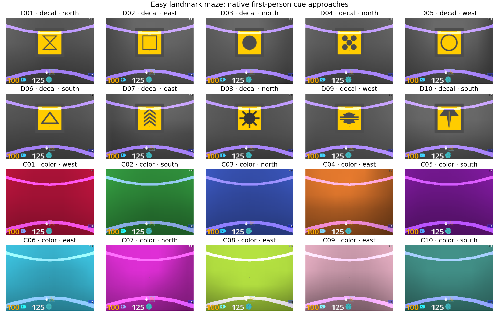
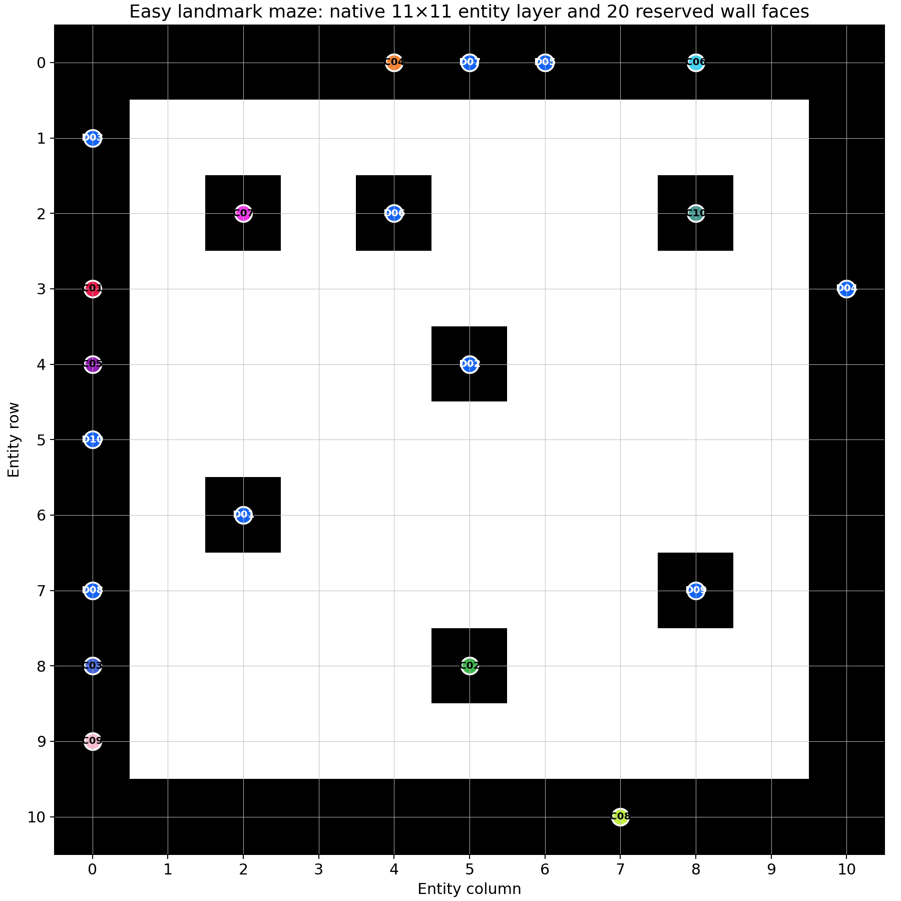

# Easy Landmark-Maze Architecture Screen — Implementation Record

## Status

Local implementation and native qualification tooling are complete. Production
is **not released or submitted**. NEMO2 synchronization, focused tests, the six
2M qualification runs, frozen evaluation, checkpoint reload certificates, and
the canonical submission audit remain hard gates.

Workflow: `1.12.0`; study schema: `intrmotiv/study/v1`; map geometry schemas:
backward-compatible `intrmotiv/map-geometry/v1` and cue-aware
`intrmotiv/map-geometry/v2`.

## Reviewed identities

| Artifact | Count | SHA-256 |
|---|---:|---|
| Rich production StudySpec | 9 runs | `d368514edefe1b1ab319d5614792db4e5e6756f485df1e22528ba04635d931cb` |
| No-cue control StudySpec | 3 runs | `6fd0b056103103d3f29c9c1880a74d93c4d23cf44b1c2b1e227730ba8d275153` |
| Qualification StudySpec | 6 runs | `b31f0041e93f3d7350cd0cda91fbd42d4ddfd7f3c8db25fc426e20e616e37497` |
| Geometry archive file | 2 modes | `54b10f1600f1409eea5ffb7f30c9fb6150b229b4b9dcc90fbe3046e7907f1441` |
| Entity layer | rich and none | `f940d8ddeb0a754120aed4a7563aae752ecc02d11b18776a2f71e09e88a89a4e` |
| Rich cue layout | 20 rendered sites | `fe7c9bf29514685417ba9cd45ef5e5cb01fe19dd41e497931d7ea736dcf7e1f7` |
| Control cue layout | same 20 unrendered sites | `da0dca8099ea403f55cbeddc51908c1ae3954860ae9cb44d0562e8a3c1b88d1d` |
| Rendered qualification plan | 6 rows | `23efe5c5d336c197f7452065ed921c136023b28226c2e10b4838d0c89df2cd01` |
| Rendered rich-production plan | 9 rows | `9d300f43fa7af9a71b00684a3726514b88f30a981a94e341b0245eaa3fdc9f46` |
| Rendered control-production plan | 3 rows | `b2c2b945710a4fb493b115d007abb87f163301d07acb318c8b255c3aa26b988e` |

The runtime is isolated at
`/home/xiaoxiong/SFgit/SF_hipposlam_easy_landmark_20260923` on
`codex/easy-landmark-maze-20260923`, based on commit
`c002faff2c6832f9b0ce63bc6401f95e9cb4718d`. Exact source-tree and dirty-state
hashes are in [runtime_source_provenance.json](easy_landmark_maze_20260923/runtime_source_provenance.json).
The qualified corridor checkout was copied, not edited.

## Implemented contracts

- `easy_landmark_maze_noreward` fixes geometry seed 1001, wall-removal
  probability 0.85, layout seed 20260923, 120-second episodes, zero external
  reward, frameskip 4, and navigation8 actions.
- The geometry module preserves the random-number call order, depth-first
  carving, removal loop, anchor selection, and flood-fill spawn rule from
  DMLab's original `levels/demos/random_maze.lua`. It emits a literal 11-row by
  11-column entity layer, not a logical maze expanded to 21 by 21.
- The resulting 9-by-9 interior has 74 accessible cells and 31 spawn cells at
  flood distance greater than 5 from the seeded anchor. The final layer has no
  goal or apple entities. Its world bounds are `[100, 1000)` on both axes.
- A portable LCG/Fisher-Yates selector shared by Python and Lua samples 20
  distinct physical wall cells without replacement and also requires 20
  distinct adjacent accessible cells. Perimeter walls and interior obstacles
  are both eligible, with one selected orientation per wall. D01–D10 use fixed
  existing decals; C01–C10 use a fixed saturated palette. Other walls use one
  neutral gray texture.
- Rich and none modes share entity geometry, spawn behavior, timing, and site
  order. None keeps every reserved site in privileged telemetry but renders it
  neutral.
- Native entity and cue manifests are verified against the archive on reset.
  Entity, cue manifest, and debug pose are removed before policy observation
  normalization. The policy receives no position or cue identity.
- Map geometry v2 adds optional cue arrays while the v1 reader remains valid.
  Online/offline NPZ schema v1 accepts the optional additions.
- Spatial analysis adds cue visitation, traversable-geodesic nearest-cue
  distance, minimum-cost one-to-one cue/peak assignments with unmatched rows,
  raw and capacity-normalized coverage, decal/color subsets, CSV export, and
  cue overlays on occupancy, trajectory, and field figures.
- Standard 10k field rows are kept separate from intervention-only inventory:
  21 rich rows and 15 control rows. Production intervention inventory contains
  18 rich rows; control contains 6.
- SCR ARR DIRS and DGP HIT JOINT LEG preserve their parent arguments. Waypoint
  uses F64, DDQN+HER, stored replay, cadence 2048, and the existing 1024 TD plus
  1024 HER split. Every run stores its exact parent fingerprint and a
  machine-readable override set.

## Local verification

- 52 canonical geometry/workflow tests pass after replacing the remaining
  fixed-19 grid validator with the entity-derived 9-by-9 spatial contract.
- Six isolated runtime tests pass with the real DMLab check enabled. They cover
  the native entity/cue manifests, dynamic online snapshot shapes, policy-input
  stripping, all six parser rows, rich/control reset equality, zero reward,
  frameskip-4 stepping, and the 1800-decision timeout.
- Native Lua assertions require exactly 10 decal placements and exactly 10
  colored faces in rich mode; none mode uses the same reservations but exposes
  no rendered cue variations.
- The DMLab software renderer changes pixels on its first reset while warming
  texture state. Two subsequent same-seed resets are byte-identical, and the
  stabilized rich and none frames differ. The native test deliberately excludes
  that one-time renderer initialization from the level-determinism assertion.
- All six qualification commands parse through `parse_dmlab_args`; the Waypoint
  rows resolve to stored DDQN+HER with cadence 2048 and the 1024/1024 split.
- The local Sample Factory launcher rendered all six Slurm scripts in print-only
  mode. Their commands and workspace output paths are correct. The canonical
  submission audit intentionally rejects the local `/tmp` script/log paths;
  regenerate the manifest under the active NEMO2 workspace before auditing.
- Native rendering compiled all 20 review approaches. Visual inspection found
  10 unique, centered, unclipped decals; 10 visibly distinct colored wall
  faces; neutral-gray non-cue walls; consistent lighting; and no cue-face
  clipping. The review renderer is isolated from the production level.

## Release gates

1. Recompute runtime provenance hashes, synchronize workflow, StudySpecs,
   runtime source, DMLab patch, and isolated runfiles to the active
   `/work/classic/fr_xl1014-corridor-geometry` allocation.
2. Run the focused workflow and runtime tests on NEMO2, then render and inspect
   all three plans. Keep all cache, W&B, checkpoint, log, temporary, and
   analysis paths under the active allocation.
3. Run the six 2M qualification rows. Require finite learning, correct
   DG/controller ownership, snapshots at 1M and 2M, exact reload certificates,
   frozen-state evaluation, and finite cue-aware metrics.
4. Run the canonical qualification audit. Archive the StudySpec hashes,
   rendered plan, runtime/source hashes, jobs manifest, and audit output.
5. Only after all rows pass, use the print-only production launcher and
   canonical submission audit. Do not submit either production StudySpec on a
   partial qualification.

## Analysis guardrails

Report localization, exploration, and connectivity/control independently;
retain per-seed results and avoid significance claims from three seeds. The
seed-99 rich-minus-none comparison is a paired single-seed causal check, not
replicated evidence. Twenty cues exceed SCR/DGP F16 capacity, so the relevant
question is how their code partitions the maze, not whether every cue receives
one DG unit. No composite score is defined.

## Reusable experience

The authoritative checks were the native Lua manifest, the actual DMLab reset,
and the authoritative training parser. They exposed three issues invisible to
pure Python tests: corridor-only settings passed to the new level, a shared
wrapper that assumed every archived map had cue metadata, and a validator that
still required a 19-by-19 spatial grid. The efficient future path is to extend
the canonical geometry artifact first, derive grid dimensions and bounds from
that artifact, test both schema versions, parse every rendered qualification
row, then compile one rich and one neutral native map before rendering the full
visual review set.
