# Easy landmark maze: completed 2M qualification analysis

**Analysis date:** 24 September 2026. **Status:** Six seed-99 qualification runs completed and passed the canonical audit. Six corrected frozen evaluations passed. Rich three-seed and seed-99 neutral production, twelve jobs total, is running; this report analyzes the completed qualification only.

## Question and architecture

The environment is the same fixed 11-by-11 entity maze in both cue modes. Its 9-by-9 interior contains 74 traversable cells. The rich condition renders ten distinct decals and ten colored wall faces. The neutral condition reserves the same 20 sites but renders them neutral. Geometry, spawn behavior, episode timing, action set, and physical reward are shared. This isolates visible cue content within each architecture at seed 99.

The visual pipeline uses fixed ImageNet ResNet-18 features and a learned DG landmark projection. The three agent designs differ downstream:

| Design | What the name means | Intended route to useful behavior |
|---|---|---|
| `SCR_ARR_DIRS` | Arrival credit and direction-sensitive DG row recruitment with a silent-endpoint gate | Keep DG identities distinct while exploration encounters new landmarks; its earlier graph/goal controller uses those identities as destinations. The recruitment setting alone does not prove rows were actually replaced. |
| `DGP_HIT_JOINT_LEG` | A hit-triggered target reward; PPO credit can reach DG (`JOINT`); the target identity is appended to the worker input (`LEG`) | Couple landmark learning to target-conditioned action learning. A target can still be hit by chance, so success counters need a shuffled-target or intervention comparator. |
| `WAYPOINT_F64_DDQN_HER` | 64 DG units, a waypoint manager and decoder, stored-state DDQN worker, and HER | Learn action values for selected DG goals using replay; HER relabels compatible stored experience. This line changes capacity and controller family as well as training objective, so cross-family differences are descriptive. |

The qualification StudySpec is a six-cell Cartesian comparison (three designs by two cue modes, seed 99). Each run had snapshots at 1M and 2M and a terminal checkpoint slightly above 2M. The production StudySpecs expand the rich cells to seeds 8, 99, and 123 and retain neutral seed-99 controls.

## Qualification and frozen behavior

All six training rows passed the canonical audit, including geometry and training-health checks. The corrected frozen evaluator used the final checkpoint, two matched reset seeds (51000 and 51001), two complete policy episodes and two uniform-random episodes per row. Its exact-start prefix, frozen policy/graph, and privileged-input checks all passed. The earlier failed evaluator attempts are superseded by this corrected `evaluation_preflight_r3` result. I did not find separate exact learner-reload certificates in the qualification analysis tree; the frozen evaluator proves checkpoint usability for evaluation, not exact training-state restoration. The original implementation record listed that certificate as a release gate, so its status should be checked separately.

| Architecture | Frozen accessible-coverage AUC: neutral | Rich | Rich minus neutral | Uniform-random AUC |
|---|---:|---:|---:|---:|
| SCR | 0.326 | 0.461 | +0.134 | 0.386 |
| DGP | 0.437 | 0.410 | -0.027 | 0.386 |
| Waypoint | 0.349 | 0.577 | +0.228 | 0.386 |

This is two frozen episodes for one training seed per architecture. The rich Waypoint policy explored most in this small panel; the direction of the cue effect differs by architecture. The synchronized 1M–2M training-scalar window is not identical to this frozen evaluation: its rich-minus-neutral coverage AUC differences are -0.018 for SCR, +0.092 for DGP, and -0.006 for Waypoint. Episode sampling and training policy state explain why these are different measurements; neither panel establishes a replicated cue benefit.

## Representation and graph at 2M

The online snapshot table below uses 100,000 retained behavior samples per run. `Mono` is the fraction of eligible DG units classified as having one field; `cosine` is active-only map overlap, lower meaning less overlap. `Cue peaks` counts reserved cue sites assigned a DG peak. In neutral mode these sites are physical reservations, **not visible cues**. `Reachable` is the fraction of ordered node pairs connected in the reliable internal graph.

| Architecture / cue | Cosine | Mono | Distinct DG peak bins | Reserved cue peaks | Reliable edges | Reachable |
|---|---:|---:|---:|---:|---:|---:|
| SCR / neutral | 0.449 | 0.188 | 13 | 5 | 17 | 0.092 |
| SCR / rich | 0.341 | 0.125 | 14 | 11 | 20 | 0.204 |
| DGP / neutral | 0.440 | 0.188 | 15 | 10 | 56 | 0.688 |
| DGP / rich | 0.261 | 0.188 | 15 | 11 | 3 | 0.013 |
| Waypoint / neutral | 0.309 | 0.234 | 35 | 18 | 16 | 0.004 |
| Waypoint / rich | 0.270 | 0.266 | 31 | 17 | 30 | 0.008 |

All six maps have zero silent-unit fraction in the 2M snapshot. Rich rendering reduces average map overlap in every architecture, yet the mono-field result is mixed. DGP's rich graph has only three reliable edges versus 56 in neutral, so its cleaner map overlap does not translate into a better connected graph here. Waypoint has more distinct peak bins because it has 64 DG units rather than 16; this is not an equal-capacity localization comparison. The online grounded-controllability values are at most 0.016 across these six snapshots and do not establish reliable command-caused arrival.

## Place-field and trajectory atlas at 2M

These are canonical `segmented-atlas/v1` views, not new frozen-policy rollouts. Fields and trajectories use the same retained 100,000-sample online windows as the table; directed outcome matrices use the graph counters stored at the checkpoint and are not restricted to that window. Each DG field panel is divided by that unit's own peak (fixed 0–1 scale); gray denotes unvisited cells. Rich maps mark ten decals and ten colored wall faces. A bright peak near a cue is proximity, not proof of cue causation. Trajectory colors distinguish stored fragments, not elapsed time; circles mark starts and crosses mark ends.

### SCR: arrival credit and direction-sensitive recruitment

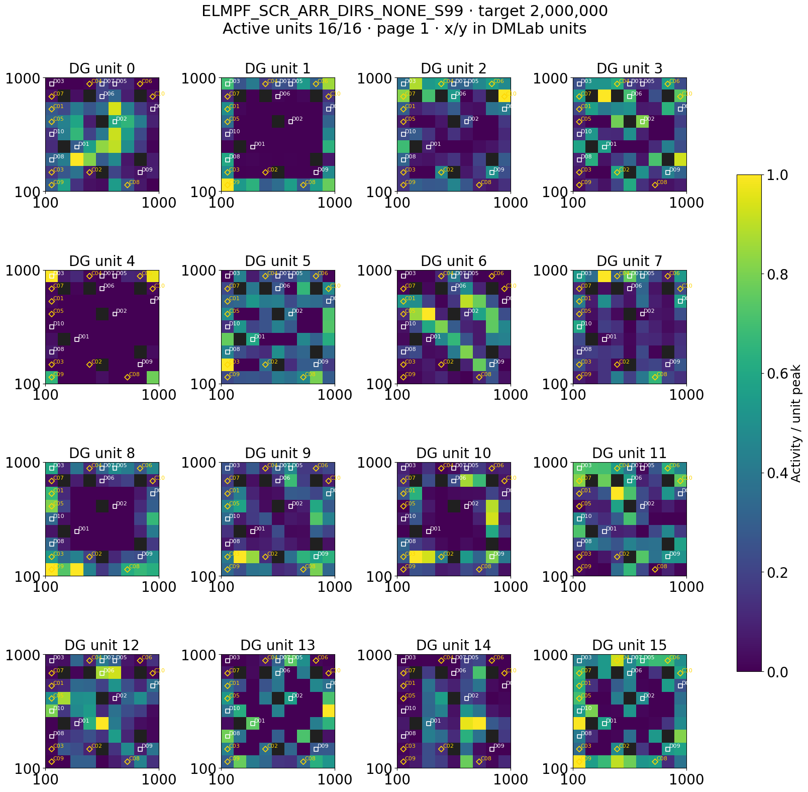

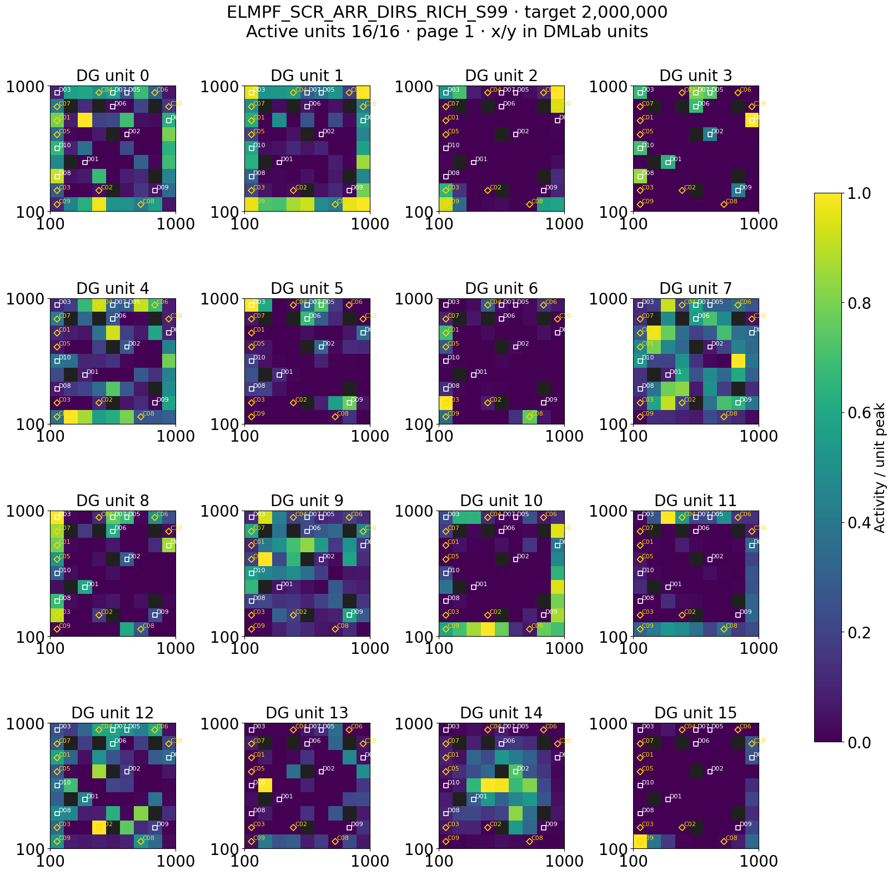

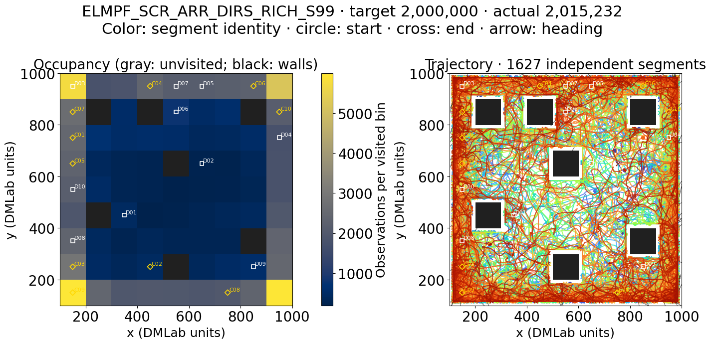

[Neutral trajectory](results/recent_architecture_batches_20260924/landmark/ELMPF_SCR_ARR_DIRS_NONE_S99/target_000002000000_policy_00_trajectory.png).

SCR extras: neutral [four segment examples](results/recent_architecture_batches_20260924/landmark/ELMPF_SCR_ARR_DIRS_NONE_S99/target_000002000000_policy_00_segments.png) and [directed outcome matrix](results/recent_architecture_batches_20260924/landmark/ELMPF_SCR_ARR_DIRS_NONE_S99/target_000002000000_policy_00_graph.png); rich [segments](results/recent_architecture_batches_20260924/landmark/ELMPF_SCR_ARR_DIRS_RICH_S99/target_000002000000_policy_00_segments.png) and [graph](results/recent_architecture_batches_20260924/landmark/ELMPF_SCR_ARR_DIRS_RICH_S99/target_000002000000_policy_00_graph.png).

### DGP: target-hit credit with joint DG/worker learning

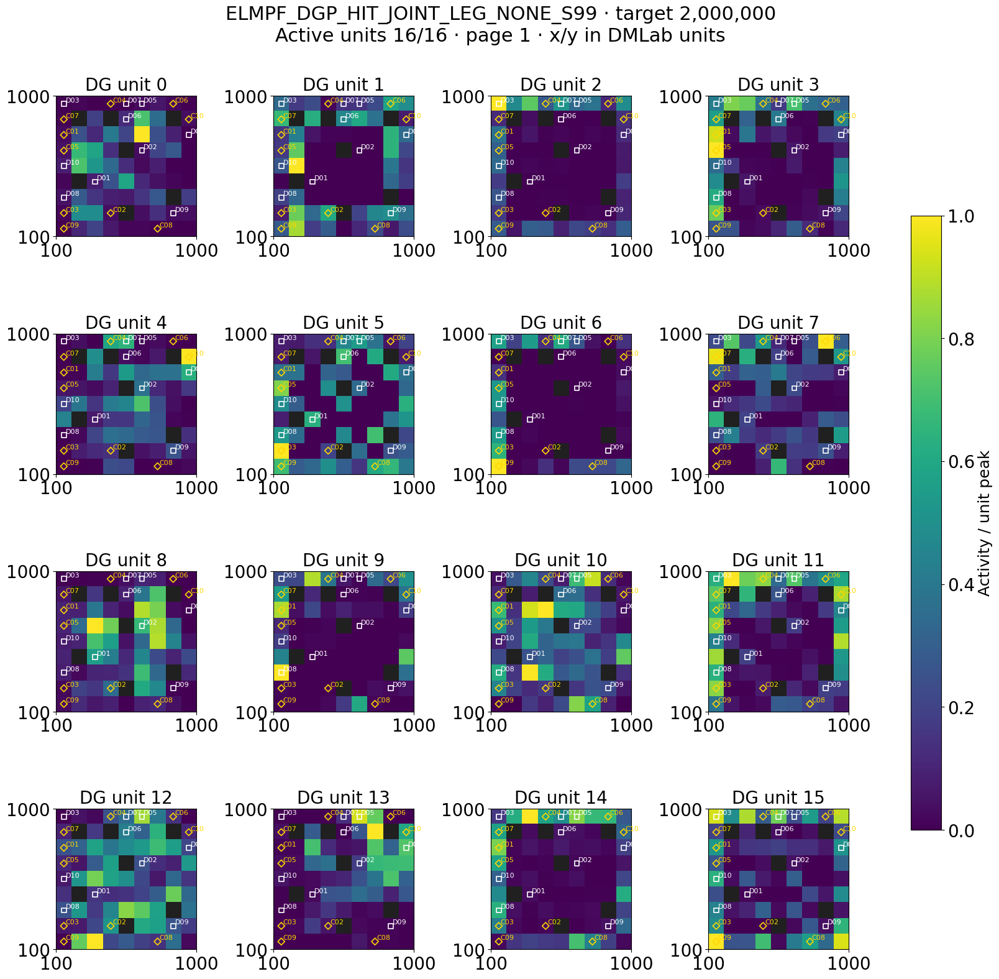

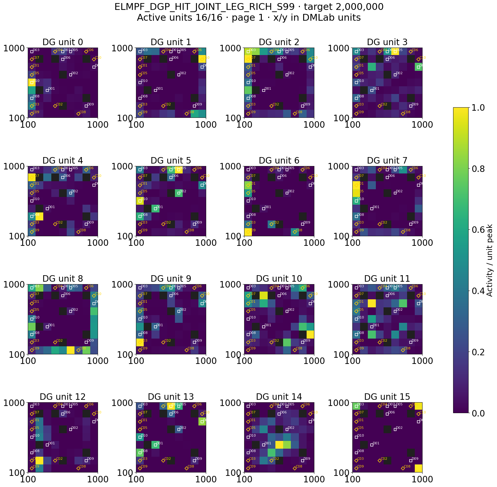

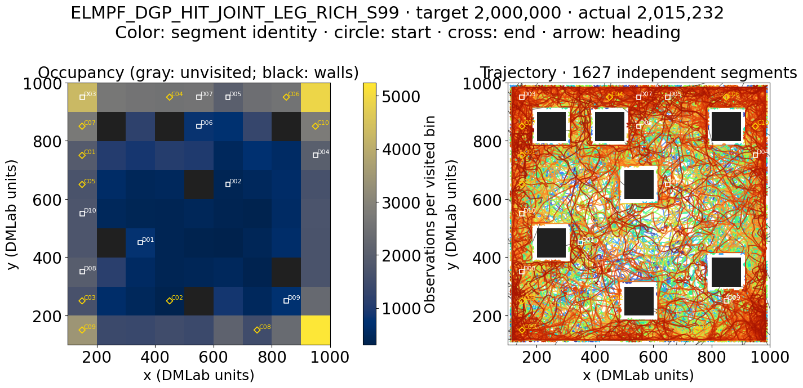

[Neutral trajectory](results/recent_architecture_batches_20260924/landmark/ELMPF_DGP_HIT_JOINT_LEG_NONE_S99/target_000002000000_policy_00_trajectory.png). Rich DGP has less map overlap but only three reliable graph edges; the field image does not establish connected destinations.

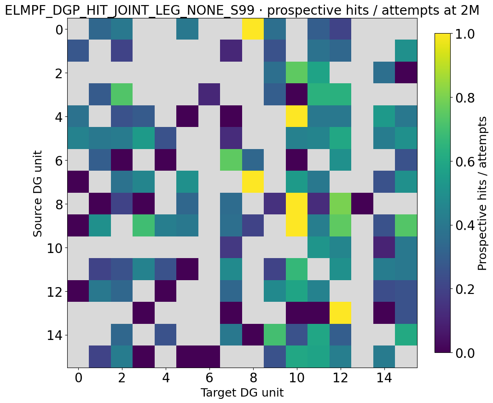

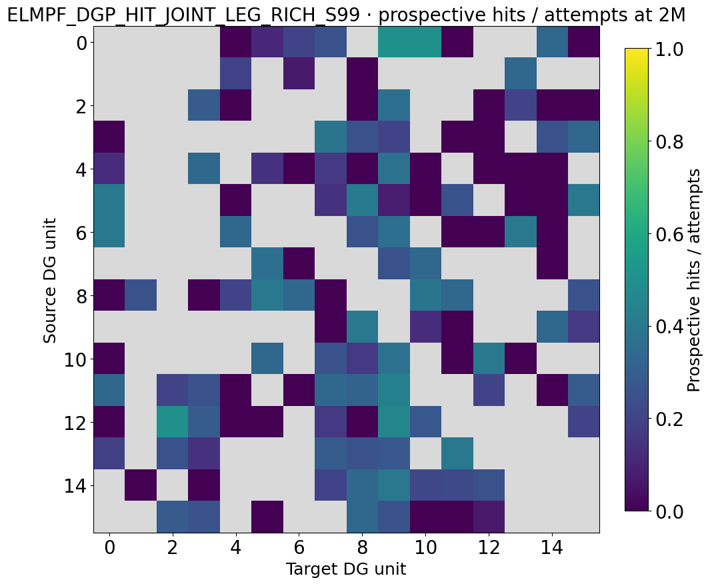

These matrices show prospective hits divided by attempts for source-row/target-column pairs; gray means unattempted. They are *not* the thresholded reliable graph used for `Reachable`, which explains why non-gray cells can coexist with only three reliable rich edges. DGP [neutral segment examples](results/recent_architecture_batches_20260924/landmark/ELMPF_DGP_HIT_JOINT_LEG_NONE_S99/target_000002000000_policy_00_segments.png) · [rich segment examples](results/recent_architecture_batches_20260924/landmark/ELMPF_DGP_HIT_JOINT_LEG_RICH_S99/target_000002000000_policy_00_segments.png).

### Waypoint: F64 decoder and stored DDQN+HER worker

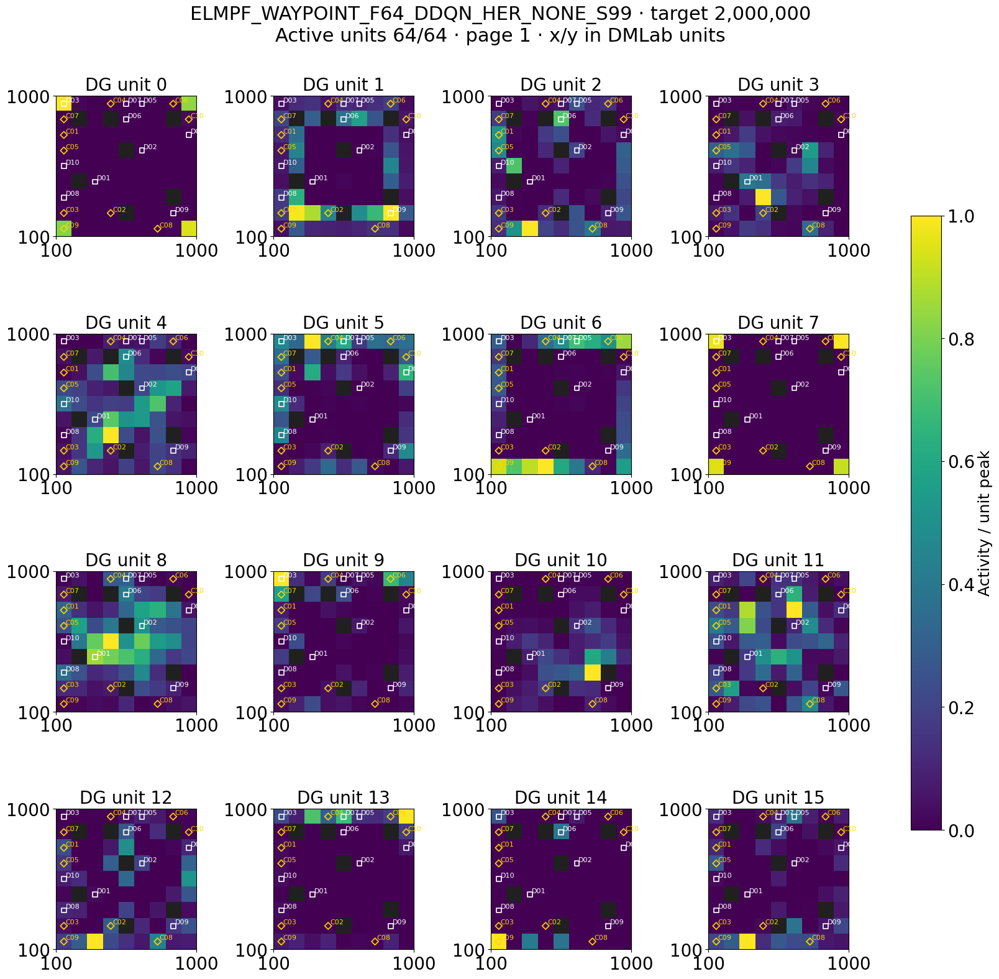

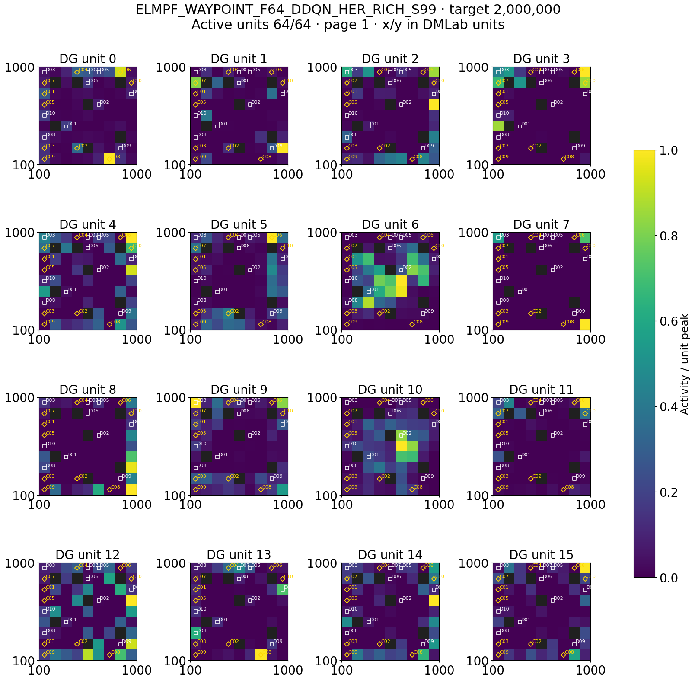

The remaining units are essential to the F64 comparison: neutral [16–31](results/recent_architecture_batches_20260924/landmark/ELMPF_WAYPOINT_F64_DDQN_HER_NONE_S99/target_000002000000_policy_00_place_fields_page02.png), [32–47](results/recent_architecture_batches_20260924/landmark/ELMPF_WAYPOINT_F64_DDQN_HER_NONE_S99/target_000002000000_policy_00_place_fields_page03.png), [48–63](results/recent_architecture_batches_20260924/landmark/ELMPF_WAYPOINT_F64_DDQN_HER_NONE_S99/target_000002000000_policy_00_place_fields_page04.png); rich [16–31](results/recent_architecture_batches_20260924/landmark/ELMPF_WAYPOINT_F64_DDQN_HER_RICH_S99/target_000002000000_policy_00_place_fields_page02.png), [32–47](results/recent_architecture_batches_20260924/landmark/ELMPF_WAYPOINT_F64_DDQN_HER_RICH_S99/target_000002000000_policy_00_place_fields_page03.png), [48–63](results/recent_architecture_batches_20260924/landmark/ELMPF_WAYPOINT_F64_DDQN_HER_RICH_S99/target_000002000000_policy_00_place_fields_page04.png).

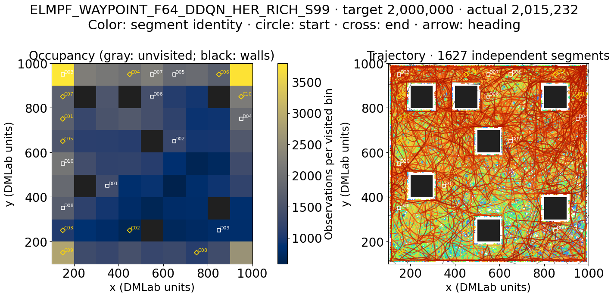

[Neutral trajectory](results/recent_architecture_batches_20260924/landmark/ELMPF_WAYPOINT_F64_DDQN_HER_NONE_S99/target_000002000000_policy_00_trajectory.png).

Waypoint extras: neutral [four segment examples](results/recent_architecture_batches_20260924/landmark/ELMPF_WAYPOINT_F64_DDQN_HER_NONE_S99/target_000002000000_policy_00_segments.png) and [directed outcome matrix](results/recent_architecture_batches_20260924/landmark/ELMPF_WAYPOINT_F64_DDQN_HER_NONE_S99/target_000002000000_policy_00_graph.png); rich [segments](results/recent_architecture_batches_20260924/landmark/ELMPF_WAYPOINT_F64_DDQN_HER_RICH_S99/target_000002000000_policy_00_segments.png) and [graph](results/recent_architecture_batches_20260924/landmark/ELMPF_WAYPOINT_F64_DDQN_HER_RICH_S99/target_000002000000_policy_00_graph.png).

The offline 10k-decision frozen-checkpoint evaluator is not represented by these images. Its one-row 500-decision preflight, Slurm job `8185734`, loaded the checkpoint but failed before writing an NPZ because the evaluator's default 19-by-19 corridor grid disagreed with the landmark geometry's 9-by-9 mask. A full sweep was not submitted; changing only `--grain` would still leave corridor coordinate bounds wrong. This is an evaluator correctness gate, not a negative place-field result.

## Interpretation and next checkpoint

The qualification demonstrates that the level, cue contract, learning loop, frozen evaluation, and cue-aware analysis work. Its scientific result is an early architecture-by-cue interaction: the same visible landmarks change representation, graph structure, and frozen exploration differently across designs. A mechanism claim requires the rich production seeds and seed-99 neutral controls at matched training ages; a control claim additionally requires the declared matched-command intervention panel.

## Provenance and reusable lesson

- Study schema `intrmotiv/study/v1`, workflow 1.12.0, qualification StudySpec SHA-256 `546c8aa71462861681537efb5d9a597ebf6ecd3ecc2e8c8700ab038bc5199bc0`.
- Canonical local definition: [easy_landmark_maze_preflight.study.json](../hpc_runs/studies/easy_landmark_maze_preflight.study.json). Architecture and geometry contract: [implementation record](easy_landmark_maze_implementation_20260923.md).
- Authoritative workspace artifacts: `/work/classic/fr_xl1014-easy-landmark-maze/IntrMotiv/SF_hipposlam/train_dir/analysis/easy_landmark_maze_preflight_20260923/` (`qualification_audit.json`, `spatial/per_snapshot.csv`, `online/per_run.csv`, `evaluation_preflight_r3/*`, `atlas_20260924/figures/`, and the failed `frozen_place_fields_20260924/preflight/` log). The report copies only PNGs; the workspace retains scalable PDFs.

The audit and collector outputs were sufficient for this report; parsing raw Slurm logs would have repeated their validated work. The original implementation record is a release record written before qualification completed, so its older “active” status should be read with this dated result.
