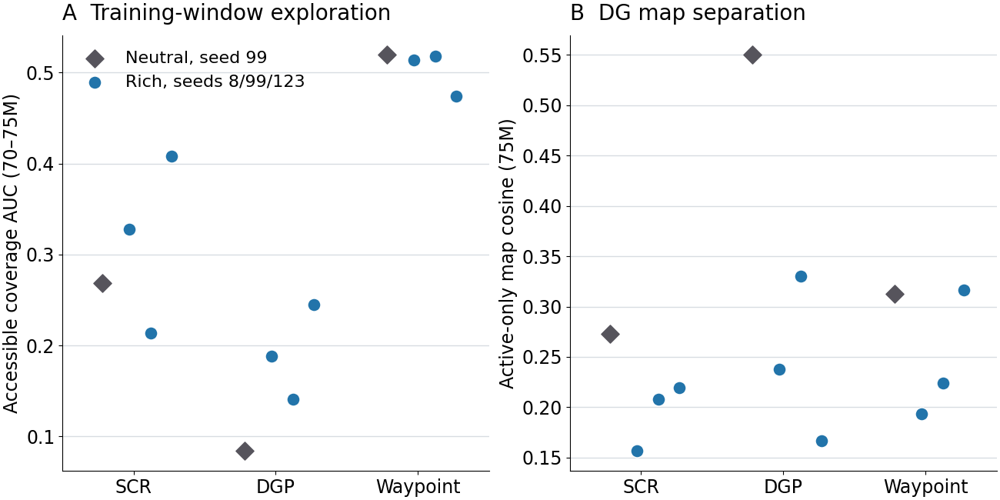
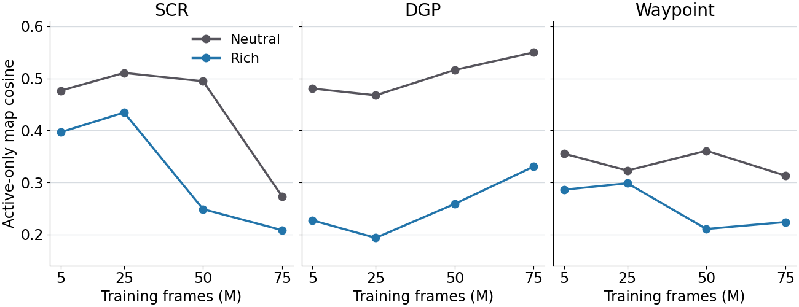

# Easy landmark maze: production analysis at a common 75M frames

**Analysis date:** 6 October 2026. **Question:** Does making visual landmarks easier to distinguish solve the learned-landmark control problem, and what would prescribed landmarks test next?

## Result in brief

Rich visual cues reliably changed the DG representation, but they did not produce a consistent gain in exploration or goal-directed control. At the matched seed-99 age, online accessible-coverage AUC fell for SCR (0.268 to 0.214), rose for DGP (0.084 to 0.141), and was unchanged for Waypoint (0.519 to 0.518). The rich condition reduced online active-only field overlap in all three families, yet online target-action sensitivity remained small (0.009, 0.009, and 0.077 respectively). A stronger causal claim awaits the matched-command panel below. Prescribed landmark identities are a useful next experiment because this batch manipulates *visual evidence*, not the identity or reachability of an instructed destination.

## Design and scope

The fixed 11-by-11 entity maze has a 9-by-9 interior with 74 traversable cells. Rich rendering supplies ten decals and ten colored wall faces. Neutral rendering reserves the same sites but removes their distinctive appearance. Maze geometry, cue layout seed, action set, and physical reward are held fixed. Each controller family has its own representation and learning rules, so only the within-family rich-versus-neutral contrast isolates the cue manipulation. SCR and DGP use 16 DG units; Waypoint uses 64, DDQN, and HER. The fixed ImageNet ResNet-18 visual trunk feeds a learned DG projection.

The production design contains rich seeds 8, 99, and 123 for each family and one neutral seed 99 for each family. All twelve runs retained the exact 75,005,952-frame checkpoint. The six rich SCR/DGP runs reached about 100M frames; the three rich Waypoint and three neutral runs timed out before the intended 100M endpoint. Accordingly, **75M is the common comparison age**. The neutral cue effect has only one training seed per family; rich-seed ranges describe variability but are not confidence intervals for that effect. The 5M, 25M, 50M, and 75M snapshots are repeated observations of the same seed, not four independent replications.

The earlier [2M qualification](easy_landmark_maze_qualification_analysis_20260924.md) established a working level and evaluation protocol but had only two frozen episodes per cell. Its apparent cue benefits for SCR and Waypoint were early, small-sample signals; the production comparison at a shared 75M checkpoint is the basis for the conclusions here.

## Online behavior at 70–75M

The table uses the canonical synchronized TensorBoard window. Coverage AUC is normalized accessible-cell coverage through an episode. Grounded controllability is the online graph counter, not a matched-command causal estimate.

| Family | Neutral seed 99 coverage AUC | Rich seed 99 | Rich seeds 8/99/123 range | Neutral to rich seed-99 grounded controllability | Neutral to rich seed-99 target-action sensitivity |
| --- | ---: | ---: | ---: | ---: | ---: |
| SCR | 0.268 | 0.214 | 0.214–0.408 | 0.037 → 0.031 | 0.025 → 0.009 |
| DGP | 0.084 | 0.141 | 0.141–0.245 | 0.003 → 0.026 | 0.011 → 0.009 |
| Waypoint | 0.519 | 0.518 | 0.474–0.518 | 0.033 → 0.024 | 0.092 → 0.077 |

DGP's option-success counter also rises from 0.551 to 0.617 at seed 99, while SCR rises from 0.384 to 0.422 and Waypoint falls from 0.249 to 0.221. These target-hit rates do not by themselves establish that commanding a different target changes arrival. Waypoint explores most in both cue modes while its graph reachability stays near 0.007, a separation between physical coverage and usable goal topology.

## Online DG fields and graphs at 75M

The spatial snapshots each retain 100,000 behavior samples. Active-only cosine measures average overlap among active DG maps (smaller means more distinct maps); mono-field fraction uses field-eligible units as denominator. Distinct peak bins count locations, not unit identities. “Cue-site peaks” counts reserved cue sites assigned a DG peak; neutral sites are physical reservations, not visible cues. Graph values are descriptive saved counters.

| Family | Cue | Active-only cosine | Mono-field fraction | Distinct peak bins | Cue-site peaks | Reliable edges | Reachable node pairs |
| --- | --- | ---: | ---: | ---: | ---: | ---: | ---: |
| SCR | Neutral 99 | 0.273 | 0.062 | 12 | 10 | 70 | 1.000 |
| SCR | Rich 99 | 0.208 | 0.188 | 15 | 7 | 88 | 0.938 |
| DGP | Neutral 99 | 0.550 | 0.312 | 10 | 11 | 158 | 0.938 |
| DGP | Rich 99 | 0.330 | 0.778 | 6 | 5 | 186 | 1.000 |
| Waypoint | Neutral 99 | 0.313 | 0.444 | 29 | 13 | 21 | 0.007 |
| Waypoint | Rich 99 | 0.224 | 0.469 | 34 | 15 | 25 | 0.009 |

At each of 5M, 25M, 50M, and 75M, rich seed 99 has lower active-only cosine than neutral seed 99 in every family. That consistency supports a representation effect, but does not establish spatially broader or more useful goal identities. DGP is especially diagnostic: its seed-99 mono-field fraction rises from 0.312 to 0.778 while distinct peak bins fall from ten to six and cue-site peak assignments fall from eleven to five. Rich DGP seeds 8, 99, and 123 each have only six distinct online peak bins at 75M. The richer input can therefore yield sharper but spatially concentrated DG activity. DGP's reliable graph is almost fully reachable in both cue modes, yet its seed-99 target-action sensitivity is 0.011 neutral and 0.009 rich. Graph connectivity is therefore insufficient evidence of control. Waypoint's 64-unit capacity and graph design prevent direct cross-family comparison of peak counts or graph reachability.

## Frozen 75M checkpoint probes

The geometry-correct evaluator sampled 10,000 stochastic-policy decisions at the exact 75,005,952-frame checkpoint. These are policy-driven maps; differences in occupancy and path choice can change the measured fields, so they are not a fixed-trajectory drift test. The active-only and pre-threshold metrics are reported with silent units and spatial information to avoid inferring diversity from DG density alone.

| Family | Cue/seed | Traversable cells visited | Silent DG units | Active-unit spatial information (bits) | Active-only cosine | Active peak bins | Mono-field fraction | Pre-threshold cosine / peak bins |
| --- | --- | ---: | ---: | ---: | ---: | ---: | ---: | ---: |
| SCR | Neutral 99 | 60/81 | 0/16 | 0.100 | 0.210 | 13 | 0.063 | 0.006 / 16 |
| SCR | Rich 99 | 49/81 | 0/16 | 0.098 | 0.188 | 14 | 0.250 | -0.011 / 13 |
| DGP | Neutral 99 | 17/81 | 0/16 | 0.021 | 0.465 | 8 | 0.250 | -0.035 / 9 |
| DGP | Rich 99 | 28/81 | 0/16 | 0.087 | 0.309 | 6 | 0.857 | 0.227 / 13 |
| Waypoint | Neutral 99 | 74/81 | 27/64 | 0.056 | 0.150 | 24 | 0.226 | 0.130 / 23 |
| Waypoint | Rich 99 | 74/81 | 2/64 | 0.035 | 0.097 | 38 | 0.205 | 0.150 / 28 |

The evaluator's `visited_cell_fraction` uses all 81 interior grid bins. The 74 traversable-cell denominator is appropriate when interpreting Waypoint's 74/81 as full accessible-cell visitation; the other counts should be read with the same distinction. Rich Waypoint's frozen probe activates many more DG units at seed 99, but this does not show that the goal-conditioned controller uses their identities. Rich DGP's frozen maps have less overlap and higher spatial information at seed 99 while still concentrating active peaks in six bins. Its pre-threshold maps have 13 peak bins versus nine in neutral, whereas its active maps have six versus eight. That reversal points to a possible bottleneck between visual evidence and sparse DG activity; policy-dependent occupancy prevents attributing it to the threshold alone. The nine rich frozen maps show substantial seed variation, including SCR visited fractions of 0.457–0.914 and DGP 0.346–0.753, so one rollout should not be treated as a stable population value.

## Matched-command intervention and heldout coverage

The exact-start intervention holds the checkpoint policy and graph fixed, changes only the commanded target for matched starts, and measures paired arrival lift and initial-action distribution change. One-source preflights passed for rich seed 99 in all three families (five starts, 20 paired target comparisons each, no censoring). Their arrival lifts were -0.117 for SCR, -0.050 for DGP, and -0.033 for Waypoint; initial-action total variation was 0.021, 0.032, and 0.330. These one-source samples establish evaluator integrity and a possible failure signal, not the family-level conclusion. A four-source panel is being qualified because the evaluator's repeated fresh DMLab engines overflowed on the originally planned 16-source panel. Full-panel results will replace this provisional statement once verified.

The 12 frozen jobs also include 20 complete policy episodes and 20 matched-reset uniform-random episodes per checkpoint. Their episode results are being collected here after job completion. The field-map values above are available because the evaluator writes them before those episodes finish.

## What this says about easier visuals and prescribed landmarks

The cue intervention tests whether *learnable visual distinctiveness* is the missing ingredient. It demonstrably affects DG maps, sometimes physical exploration, and some graph counters. The signs differ by controller and the online action sensitivity stays small. Thus these results do not support the simple claim that easier visuals alone repair control. They also do not show that visual ambiguity is irrelevant: DGP gains some coverage, and the neutral comparison has one seed.

Prescribed landmarks would test a different causal link. A clean next study would cross rich versus neutral appearance with learned versus prescribed landmark identities, using the same maze, action set, controller family, training budget, and target-command schedule in each cell. Prescribed identities should label a fixed set of reachable regions; the matched-capacity learned-identity arm should have the same number of possible goals. Use paired training seeds and more than one cue layout, and compare at a common checkpoint. Evaluate image-based landmark recognition, target-dependent initial actions, and **command-caused arrival** from identical starts. Retain every attempted target and failure, and report physically unreachable targets separately from failed reachable commands. A separate privileged-identity probe can inject the true region ID at evaluation as an upper bound on what repairing perception alone could achieve; it must be labeled as an oracle, not as a deployable visual policy. If prescribed identities improve arrival while matched learned identities do not, identity stability or target selection is implicated. If both identities are recognized but neither changes arrival, the worker's goal-conditioning and credit assignment are implicated. If target arrival improves only after retraining the worker, the representation and controller must be studied jointly. This is a proposed experiment, not a result of the present batch.

## Provenance, limitations, and reusable lesson

- Original rich and neutral StudySpecs: [rich](../../hpc_runs/studies/easy_landmark_maze_rich.study.json) and [neutral](../../hpc_runs/studies/easy_landmark_maze_control.study.json), schema `intrmotiv/study/v1`, workflow `1.12.0`, SHA-256 `e7e04dcbefbf8c28a28ccfc1fae0ddde5b4a46dd7987cfe7434ec5c61af0ced0` and `50274cebfb701d5e52c9c9682ea322c74afb13fa0add7e6a7e635aac8b0c835f`.
- The 75M analysis-only specs preserve the training rows: [rich](../results/easy_landmark_maze_production_20261006/specs/easy_landmark_maze_rich_75m_analysis.study.json) SHA-256 `56e7950aaac7380907322361c1e6bd42cc8817757f40d093d47518731a30b380`; [neutral](../results/easy_landmark_maze_production_20261006/specs/easy_landmark_maze_control_75m_analysis.study.json) SHA-256 `b8c3305cc8e6257567508ff9daf4e178a63ec4a11df62194aefcce55c3cdf5f9`. Pinned 1.12 submission audits passed.
- Tables derive from the canonical [online](../results/easy_landmark_maze_production_20261006/rich_online_70_75m/per_run.csv), [spatial](../results/easy_landmark_maze_production_20261006/rich_spatial/per_snapshot.csv), and [frozen-map](../results/easy_landmark_maze_production_20261006/rich_frozen/evaluation/summary/derived_place_field_metrics.csv) exports, with corresponding `control_*` exports beside them. Training state is recorded in [job status](../results/easy_landmark_maze_production_20261006/training_job_status.psv). Raw NPZs, policy rollouts, TensorBoard histories, caches, and Slurm logs remain in `/work/classic/fr_xl1014-easy-landmark-maze/IntrMotiv/SF_hipposlam/train_dir/analysis/easy_landmark_maze_production_20261006/` on NEMO2.
- This analysis used the pinned 1.12 collector/auditor for original 1.12 submission records and the geometry-correct 1.14 evaluator for new 75M probes. The newer auditor renders a changed default command and cannot audit those historical submissions byte for byte. The [standardized workflow](../../04_implementation/standardized_study_workflow.md) records the version-specific shortcut.

The reusable analysis pattern is to anchor every comparison to an exact shared checkpoint, keep online and frozen-policy measurements distinct, and move from representation metrics to matched commands before claiming control. The canonical collectors and manifests avoided re-parsing training logs; the unsharded intervention evaluator remains the bottleneck for a broad source panel.
