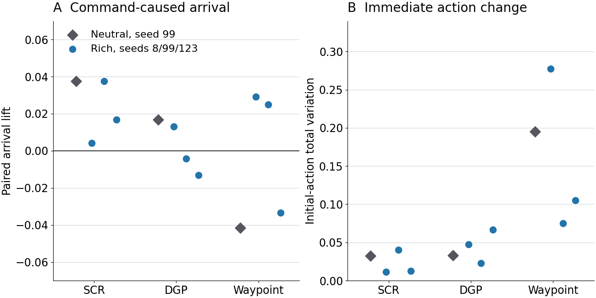

# Easy landmark maze: production analysis at a common 75M frames

**Analysis date:** 6 October 2026. **Question:** Does making visual landmarks easier to distinguish solve the learned-landmark control problem, and what would prescribed landmarks test next?

## Result in brief

Rich visual cues consistently reduced active-only DG map overlap in the matched seed-99 comparisons, but they did not produce a consistent gain in exploration or command-caused arrival. At 70–75M training frames, online accessible-coverage AUC fell for SCR (0.268 to 0.214), rose for DGP (0.084 to 0.141), and was unchanged for Waypoint (0.519 to 0.518). Frozen complete episodes gave a different cue direction for SCR and Waypoint, and rich DGP remained below uniform-random coverage for all three training seeds. In the bounded matched-command panel, every per-run paired arrival lift lay between -0.042 and +0.038, despite visibly altered DG maps. Prescribed landmark identities are a useful next experiment because this batch manipulates *visual evidence*, not the identity or reachability of an instructed destination.

## Design and scope

The fixed 11-by-11 entity maze has a 9-by-9 interior with 74 traversable cells. Rich rendering supplies ten decals and ten colored wall faces. Neutral rendering reserves the same sites but removes their distinctive appearance. Maze geometry, cue layout seed, action set, and physical reward are held fixed. Each controller family has its own representation and learning rules, so only the within-family rich-versus-neutral contrast isolates the cue manipulation. SCR and DGP use 16 DG units; Waypoint uses 64, DDQN, and HER. The fixed ImageNet ResNet-18 visual trunk feeds a learned DG projection.

The production design contains rich seeds 8, 99, and 123 for each family and one neutral seed 99 for each family. All twelve runs retained the exact 75,005,952-frame checkpoint. The six rich SCR/DGP runs reached about 100M frames; the three rich Waypoint and three neutral runs timed out before the intended 100M endpoint. Accordingly, **75M is the common comparison age**. The neutral cue effect has only one training seed per family; rich-seed ranges describe variability but are not confidence intervals for that effect. The 5M, 25M, 50M, and 75M snapshots are repeated observations of the same seed, not four independent replications.

The earlier [2M qualification](easy_landmark_maze_qualification_analysis_20260924.md) established a working level and evaluation protocol but had only two frozen episodes per cell. Its apparent cue benefits for SCR and Waypoint were early, small-sample signals; the production comparison at a shared 75M checkpoint is the basis for the conclusions here.

## Online behavior at 70–75M

The table uses the canonical synchronized TensorBoard window. Coverage AUC is normalized accessible-cell coverage through an episode. Grounded controllability is the online graph counter, not a matched-command causal estimate.

| Family | Neutral seed 99 coverage AUC | Rich seed 99 | Rich seeds 8/99/123 range | Neutral to rich seed-99 grounded controllability | Neutral to rich seed-99 target-action sensitivity |
| --- | ---: | ---: | ---: | ---: | ---: |
| SCR | 0.268 | 0.214 | 0.214–0.408 | 0.037 → 0.031 | 0.025 → 0.009 |
| DGP | 0.084 | 0.141 | 0.141–0.245 | 0.003 → 0.026 | 0.011 → 0.009 |
| Waypoint | 0.519 | 0.518 | 0.474–0.518 | 0.033 → 0.024 | 0.092 → 0.077 |

DGP's option-success counter also rises from 0.551 to 0.617 at seed 99, while SCR rises from 0.384 to 0.422 and Waypoint falls from 0.249 to 0.221. These target-hit rates do not by themselves establish that commanding a different target changes arrival. Across all three rich seeds, target-action sensitivity is 0.009–0.015 for SCR, about 0.009 for DGP, and 0.077–0.098 for Waypoint. Waypoint explores most in both cue modes while its graph reachability stays near 0.007, a separation between physical coverage and usable goal topology.

## Online DG fields and graphs at 75M

The spatial snapshots each retain 100,000 behavior samples. Active-only cosine measures average overlap among active DG maps (smaller means more distinct maps); mono-field fraction uses field-eligible units as denominator. Distinct peak bins count locations, not unit identities. “Cue-site peaks” counts reserved cue sites assigned a DG peak; neutral sites are physical reservations, not visible cues. Graph values are descriptive saved counters.

| Family | Cue | Active-only cosine | Mono-field fraction | Distinct peak bins | Cue-site peaks | Reliable edges | Reachable node pairs |
| --- | --- | ---: | ---: | ---: | ---: | ---: | ---: |
| SCR | Neutral 99 | 0.273 | 0.062 | 12 | 10 | 70 | 1.000 |
| SCR | Rich 99 | 0.208 | 0.188 | 15 | 7 | 88 | 0.938 |
| DGP | Neutral 99 | 0.550 | 0.312 | 10 | 11 | 158 | 0.938 |
| DGP | Rich 99 | 0.330 | 0.778 | 6 | 5 | 186 | 1.000 |
| Waypoint | Neutral 99 | 0.313 | 0.444 | 29 | 13 | 21 | 0.007 |
| Waypoint | Rich 99 | 0.224 | 0.469 | 34 | 15 | 25 | 0.009 |

At each of 5M, 25M, 50M, and 75M, rich seed 99 has lower active-only cosine than neutral seed 99 in every family. That consistency supports a representation effect, but does not establish spatially broader or more useful goal identities. DGP is especially diagnostic: its seed-99 mono-field fraction rises from 0.312 to 0.778 while distinct peak bins fall from ten to six and cue-site peak assignments fall from eleven to five. Rich DGP seeds 8, 99, and 123 each have only six distinct online peak bins at 75M. The richer input can therefore yield sharper but spatially concentrated DG activity. DGP's reliable graph is almost fully reachable in both cue modes, yet its seed-99 target-action sensitivity is 0.011 neutral and 0.009 rich. Graph connectivity is therefore insufficient evidence of control. Waypoint's 64-unit capacity and graph design prevent direct cross-family comparison of peak counts or graph reachability.

The cue-site peak decline is not explained just by failing to pass the reserved sites in the online snapshot: DGP visits 90% of them in both modes, and SCR visits all of them in both. A peak near a site still does not prove that its decal or wall color caused the field.

## Place-field and trajectory atlas at 75M

The [matched seed-99 online atlas](../results/easy_landmark_maze_production_20261006/online_atlas_75m/README.md) renders the retained 100,000-sample windows at the 75M target, not fresh frozen-policy episodes. It shows all DG units, occupancy, and trajectories segmented at stream or episode boundaries; colors identify fragments, not elapsed time. Each field is normalized by its own peak, so compare **shape**, not absolute firing strength. Gray cells were unvisited; black cells are walls. Cue markers show reserved physical sites in both modes, although the neutral sites have no distinctive rendering. A field peak near a marker is not evidence that the cue caused it. The numerical analysis above and the frozen probes below cover all units and report silence, spatial information, and peak diversity.

| Family | Cue/seed | Online visited accessible cells | Stationary steps | Mean physical step distance |
| --- | --- | ---: | ---: | ---: |
| SCR | Neutral 99 | 74/74 | 16.4% | 13.16 |
| SCR | Rich 99 | 73/74 | 13.4% | 12.95 |
| DGP | Neutral 99 | 59/74 | 97.5% | 0.28 |
| DGP | Rich 99 | 57/74 | 1.0% | 15.79 |
| Waypoint | Neutral 99 | 74/74 | 8.8% | 12.69 |
| Waypoint | Rich 99 | 74/74 | 19.2% | 10.08 |

The stationary fraction counts within-fragment transitions with displacement at most one DMLab unit; mean distance uses those same transitions. Visited cells pool the full saved window and therefore can be high even if the policy later spends most steps in one area. The neutral DGP trajectory is almost stationary despite visiting 59 cells across fragments. Rich DGP moves but repeatedly occupies the upper maze; its online active DG peaks occupy only six distinct bins, compared with ten for neutral. Across the three rich DGP seeds, stationary fractions are 0.3–1.0%, yet visited cells range from 57 to 74 and all three have only six distinct active peak bins. More motion and visually sharper fields therefore do not imply spatially distributed destinations or command control. SCR and Waypoint visit nearly all accessible cells in these online windows; their frozen complete-episode results below give a stricter exploration comparison.

The [full atlas index](../results/easy_landmark_maze_production_20261006/online_atlas_75m/README.md) links all six occupancy/trajectory overviews and every DG field page, including all 64 Waypoint units. Inspect pages at full size for individual cue markers and field shapes.

## Frozen 75M checkpoint probes

The geometry-correct evaluator sampled 10,000 stochastic-policy decisions at the exact 75,005,952-frame checkpoint. These are policy-driven maps; differences in occupancy and path choice can change the measured fields, so they are not a fixed-trajectory drift test. The active-only and pre-threshold metrics are reported with silent units and spatial information to avoid inferring diversity from DG density alone.

| Family | Cue/seed | Interior bins visited | Silent DG units | Active-unit spatial information (bits) | Active-only cosine | Active peak bins | Mono-field fraction | Pre-threshold cosine / peak bins |
| --- | --- | ---: | ---: | ---: | ---: | ---: | ---: | ---: |
| SCR | Neutral 99 | 60/81 | 0/16 | 0.100 | 0.210 | 13 | 0.063 | 0.006 / 16 |
| SCR | Rich 99 | 49/81 | 0/16 | 0.098 | 0.188 | 14 | 0.250 | -0.011 / 13 |
| DGP | Neutral 99 | 17/81 | 0/16 | 0.021 | 0.465 | 8 | 0.250 | -0.035 / 9 |
| DGP | Rich 99 | 28/81 | 0/16 | 0.087 | 0.309 | 6 | 0.857 | 0.227 / 13 |
| Waypoint | Neutral 99 | 74/81 | 27/64 | 0.056 | 0.150 | 24 | 0.226 | 0.130 / 23 |
| Waypoint | Rich 99 | 74/81 | 2/64 | 0.035 | 0.097 | 38 | 0.205 | 0.150 / 28 |

The evaluator's `visited_cell_fraction` uses all 81 interior grid bins. The 74 traversable-cell denominator is appropriate when interpreting Waypoint's 74/81 as full accessible-cell visitation; the other counts should be read with the same distinction. Rich Waypoint's frozen probe activates many more DG units at seed 99, but this does not show that the goal-conditioned controller uses their identities. Rich DGP's frozen maps have less overlap and higher spatial information at seed 99 while still concentrating active peaks in six bins. Its pre-threshold maps have 13 peak bins versus nine in neutral, whereas its active maps have six versus eight. Across all three rich DGP seeds, pre-threshold maps have 12–13 peak bins but active maps have only 6–8. That reversal points to a possible bottleneck between visual evidence and sparse DG activity; policy-dependent occupancy prevents attributing it to the threshold alone. The nine rich frozen maps show substantial seed variation, including SCR visited fractions of 0.457–0.914 and DGP 0.346–0.753, so one rollout should not be treated as a stable population value.

## Frozen complete-episode exploration

At the same checkpoint, the evaluator ran twenty complete frozen-policy episodes and twenty uniform-random episodes with the same reset and action seed schedule for each of the twelve runs. All twelve random baselines are byte-identical, as expected for the fixed maze and action protocol. The table gives the paired seed-99 cue contrast. It is conditional on one trained checkpoint per cue and family; the twenty episode starts measure rollout variation, not training-seed uncertainty.

| Family | Neutral policy coverage AUC | Rich policy coverage AUC | Rich minus neutral | Uniform-random AUC | Rich policy minus random |
| --- | ---: | ---: | ---: | ---: | ---: |
| SCR | 0.185 | 0.241 | +0.056 | 0.307 | -0.066 |
| DGP | 0.058 | 0.141 | +0.084 | 0.307 | -0.166 |
| Waypoint | 0.568 | 0.355 | -0.213 | 0.307 | +0.048 |

The frozen episode cue directions differ from the 70–75M training-window directions for SCR and Waypoint. The training scalars average evolving training episodes; this panel holds one checkpoint fixed and evaluates fresh complete episodes. Rich cues improve DGP's seed-99 frozen exploration but leave it below uniform random, while the rich Waypoint policy remains above random despite losing much of neutral Waypoint's coverage. Across the three rich seeds, frozen policy AUC ranges are 0.241–0.514 for SCR, 0.141–0.270 for DGP, and 0.355–0.583 for Waypoint. All rich DGP policies fall below uniform random; all rich Waypoint policies exceed it; SCR is mixed.

## Matched-command intervention

The exact-start intervention holds the checkpoint policy and graph fixed, changes only the commanded target for matched starts, and measures paired arrival lift and initial-action distribution change. All twelve ordinary jobs exited zero. Every retained trial passed exact-start verification, and the policy and graph remained frozen. The trial-level audit reproduced the evaluator's arrival lift and action variation for all twelve rows: 952 paired target comparisons in total, zero censored trials. These comparisons share starts and source units within a run; they are not 952 independent training replicates.

| Family | Neutral seed-99 arrival lift | Rich seed-99 lift | Rich three-seed lift range | Initial-action variation: neutral → rich seed 99 | Sources tested |
| --- | ---: | ---: | ---: | ---: | ---: |
| SCR | +0.038 | +0.038 | +0.004 to +0.038 | 0.032 → 0.040 | 4/16 |
| DGP | +0.017 | -0.004 | -0.013 to +0.013 | 0.033 → 0.023 | 4/16 |
| Waypoint | -0.042 | +0.025 | -0.033 to +0.029 | 0.195 → 0.075 | 4/64 |

Most rows have five starts for each of four sources and 80 paired target comparisons. Rich DGP seeds 8 and 123 each yielded four starts for one source, so each has 19 starts and 76 comparisons; both missing repeats are recorded in the [per-run command table](../results/easy_landmark_maze_production_20261006/four_source_interventions_per_run.csv). All rich SCR lifts are small and positive, and the seed-99 rich and neutral aggregates are equal. Rich DGP lifts straddle zero even though its saved reliable graph is nearly fully reachable. Waypoint's commands change initial action distributions more than those of SCR/DGP, yet its arrival lift is small and inconsistent across seeds. Thus the observed obstacle is not just distinguishing images; the learned targets are not reliably executed in these sampled source panels.

One-source preflights passed for rich seed 99 in all three families, but their lifts (-0.117 SCR, -0.050 DGP, -0.033 Waypoint) did not represent the four-source estimates. The four-source DGP pilot passed and its independent production rerun produced byte-identical summary and trial CSV files. The original 16-source plan was not launched because historical full panels overflowed the evaluator after many fresh DMLab constructions. The four-source results cover 25% of supported source units for SCR/DGP and 6.25% for Waypoint, so they do not certify the untested goals.

The paired command contrast is causal *within one frozen checkpoint*: compared commands begin at exactly the same observation and recurrent state. Each checkpoint supplies its own learned source units and graph-supported targets, however. Rich and neutral panels therefore do not share prescribed physical destinations or identical DG identities; a difference between their aggregate lifts is descriptive, not an isolated causal cue effect on control.

## What this says about easier visuals and prescribed landmarks

The cue intervention tests whether *learnable visual distinctiveness* is the missing ingredient. It affects DG maps and sometimes physical exploration, but the bounded command-caused arrival lifts remain small and differ in sign across runs. Thus this batch does not support the claim that easier visuals alone repair control. It does not show visual ambiguity is irrelevant: rich DGP improves frozen coverage at seed 99 and all three rich DGP seeds have less overlapping online maps. The neutral cue comparison still has one training seed per family, and the command panel samples only four learned sources per run.

The failure points differ by controller. DGP has an almost fully reachable saved graph yet little target-dependent initial action change and no consistent matched arrival lift. Waypoint often explores more than random and changes its initial action distribution more when commanded, but its saved graph is sparse and its sampled arrival lifts remain near zero. Prescribing stable landmark IDs could address recognition or target aliasing, but these results give no basis to assume IDs alone will repair the worker's command response or route execution.

Prescribed landmarks would test a different causal link. A clean next study would cross rich versus neutral appearance with learned versus prescribed landmark identities, using the same maze, action set, controller family, training budget, and target-command schedule in each cell. Prescribed identities should label a fixed set of reachable regions; the matched-capacity learned-identity arm should have the same number of possible goals. Use paired training seeds and more than one cue layout, and compare at a common checkpoint. Evaluate image-based landmark recognition, target-dependent initial actions, and **command-caused arrival** from identical starts. Retain every attempted target and failure, and report physically unreachable targets separately from failed reachable commands. A separate privileged-identity probe can inject the true region ID at evaluation as an upper bound on what repairing perception alone could achieve; it must be labeled as an oracle, not as a deployable visual policy. If prescribed identities improve arrival while matched learned identities do not, identity stability or target selection is implicated. If both identities are recognized but neither changes arrival, the worker's goal-conditioning and credit assignment are implicated. If target arrival improves only after retraining the worker, the representation and controller must be studied jointly. This is a proposed experiment, not a result of the present batch.

## Provenance, limitations, and reusable lesson

- Original rich and neutral StudySpecs: [rich](../../hpc_runs/studies/easy_landmark_maze_rich.study.json) and [neutral](../../hpc_runs/studies/easy_landmark_maze_control.study.json), schema `intrmotiv/study/v1`, workflow `1.12.0`, generated StudySpec SHA-256 `e7e04dcbefbf8c28a28ccfc1fae0ddde5b4a46dd7987cfe7434ec5c61af0ced0` and `50274cebfb701d5e52c9c9682ea322c74afb13fa0add7e6a7e635aac8b0c835f`.
- The 75M analysis-only specs preserve the training rows: [rich](../results/easy_landmark_maze_production_20261006/specs/easy_landmark_maze_rich_75m_analysis.study.json) generated StudySpec SHA-256 `56e7950aaac7380907322361c1e6bd42cc8817757f40d093d47518731a30b380`; [neutral](../results/easy_landmark_maze_production_20261006/specs/easy_landmark_maze_control_75m_analysis.study.json) `b8c3305cc8e6257567508ff9daf4e178a63ec4a11df62194aefcce55c3cdf5f9`. Pinned 1.12 submission audits passed.
- The bounded intervention specs are [rich](../results/easy_landmark_maze_production_20261006/specs/easy_landmark_maze_rich_75m_four_source.study.json) generated StudySpec SHA-256 `7b4d89b6cbb1320dec3a458fd7a1acf07c25bf5395779551047970a447814f89` and [neutral](../results/easy_landmark_maze_production_20261006/specs/easy_landmark_maze_control_75m_four_source.study.json) `2deef46769bc4f0e356236269a980539a9da4edc6383efa34ac7070eba0990b0`. Their [rich](../results/easy_landmark_maze_production_20261006/rich_four_source/interventions/submission_manifest_20261006T011204Z.tsv) and [neutral](../results/easy_landmark_maze_production_20261006/control_four_source/interventions/submission_manifest_20261006T011228Z.tsv) ordinary-job records preserve the exact row and checkpoint selection.
- Tables derive from the canonical [online](../results/easy_landmark_maze_production_20261006/rich_online_70_75m/per_run.csv), [spatial](../results/easy_landmark_maze_production_20261006/rich_spatial/per_snapshot.csv), and [frozen-map](../results/easy_landmark_maze_production_20261006/rich_frozen/evaluation/summary/derived_place_field_metrics.csv) exports, with corresponding `control_*` exports beside them. The 75M atlas uses the canonical `segmented-atlas/v1` renderer from the verified workflow 1.14 source on NEMO2, applied to the six exact seed-99 online snapshot NPZs, without new environment rollouts. Training state is recorded in [job status](../results/easy_landmark_maze_production_20261006/training_job_status.psv). Raw NPZs, policy rollouts, TensorBoard histories, caches, and Slurm logs remain in `/work/classic/fr_xl1014-easy-landmark-maze/IntrMotiv/SF_hipposlam/train_dir/analysis/easy_landmark_maze_production_20261006/` on NEMO2.
- The [frozen per-run](../results/easy_landmark_maze_production_20261006/frozen_coverage_per_run.csv), [paired episode](../results/easy_landmark_maze_production_20261006/frozen_coverage_per_episode.csv), and [four-source command](../results/easy_landmark_maze_production_20261006/four_source_interventions_per_run.csv) tables are generated by [the checked adapter](../results/easy_landmark_maze_production_20261006/summarize_frozen_evaluation.py). It checks the geometry, checkpoint, episode seeds and counts, frozen-state and exact-start certificates, and recomputes lift and action variation from retained trials. [Figure source](../results/easy_landmark_maze_production_20261006/render_production_figures.py) uses those tables and canonical online/spatial CSVs; all figures use a verified scalable font and were inspected at report width.
- This analysis used the pinned 1.12 collector/auditor for original 1.12 submission records and the geometry-correct 1.14 evaluator for new 75M probes. The newer auditor renders a changed default command and cannot audit those historical submissions byte for byte. The [standardized workflow](../../04_implementation/standardized_study_workflow.md) records the version-specific shortcut.

The reusable analysis pattern is to anchor every comparison to an exact shared checkpoint, keep online and frozen-policy measurements distinct, and move from representation metrics to matched commands before claiming control. The canonical StudySpec audits, online/spatial collectors, saved NPZs, and evaluator manifests were authoritative; they avoided re-parsing Slurm logs or hand-maintaining run lists. A first atlas render used the older live checkout and Python 3.8, which cannot import the current typed package; the verified 1.14 source with the existing `SFgit` Python 3.10 environment rendered the selected snapshots without new rollouts. The slow parts were twenty complete policy plus twenty repeated random episodes per row and fresh-engine command replays. Next time, qualify a declared source bound before intervention submission, retain every missing repeat, and use a validated shared-random baseline and process-sharded full-source evaluator when those canonical improvements exist. The current bounded data support the conclusions above without implying those missing mechanisms have already been tested.
