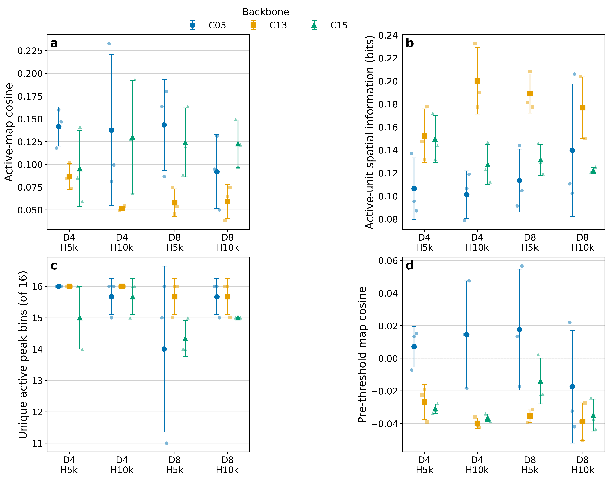

# Graph-Stabilized Recruitment: Aligned 75M Telemetry

Date: 2026-09-03

## Status

Complete. All 36 Graph-Stabilized Recruitment runs were evaluated with the
manifest-driven place-field package. The synchronized online analysis uses the
fixed 65M--75M frame window, and the spatial analysis uses the retained
checkpoint nearest the shared 75M target for every run.

The production rollouts were ordinary Slurm jobs `7978570`--`7978605`. All 36
completed successfully and produced one `place_fields.npz`; no checkpoint,
runtime, or memory failures were found.

## Alignment and protocol

The runs save checkpoints asynchronously, so there is no exact retained frame
number common to all 36 runs. The largest standard telemetry target reached by
all runs was 75M. `select_checkpoints(run_dir)` selected the nearest retained
milestone for each run:

- common target: 75,000,000 frames;
- actual retained checkpoints: 73,039,872--77,004,800 frames;
- maximum absolute offset from target: 2,004,800 frames;
- 10,000 stochastic policy decisions per checkpoint;
- 10,001 occupancy samples per artifact because the endpoint is inclusive;
- 12 conditions: three backbones x two redundancy thresholds x two half-lives;
- seeds 8, 99, and 123 for every condition.

All raw rollouts, logs, caches, and full plot sets remain under:

```text
/work/classic/fr_xl1014-train/IntrMotiv/SF_hipposlam/train_dir/analysis/
graph_stabilized_recruitment_place_fields_20260903_aligned/
```

## Main result

The DG representations are active and spatially diverse throughout the batch,
including the 31 runs that had made no recruitment assignment by 75M.

- Every one of the 576 evaluated DG units was active: 16/16 per run and zero
  silent units.
- Condition-mean active-only map cosine ranges from 0.051 to 0.143. The low
  values are not an artifact of silent zero vectors because silent units are
  excluded and none were present.
- Condition-mean unique active peak bins range from 14.0 to 16.0 of 16 units.
- Continuous pre-threshold map cosine ranges from -0.040 to 0.018, confirming
  that the diversity is present before the hard DG threshold.
- C13 D4 H10k has the strongest spatial selectivity in this batch at 75M:
  active-unit SI 0.200 +/- 0.029 bits, active-map cosine 0.051 +/- 0.002, and
  16.0 +/- 0.0 unique peak bins. This is a descriptive result, not a selected
  winner, because coverage is comparatively low and `n=3`.
- Within C05, D8 H10k is the strongest spatial cell on average: SI
  0.140 +/- 0.058 bits and active-map cosine 0.092 +/- 0.041. Its uncertainty is
  large and its assignment count is dominated by one seed.



Points are individual seeds. Large symbols and whiskers are condition mean +/-
sample SD (`n=3`). Lower cosine means less redundant spatial maps. The dashed
line in panel c is the maximum of 16 unique peaks; the dashed line in panel d
is zero pre-threshold cosine.

## Joint online and spatial summary

Online metrics are means over the same fixed 65M--75M window. Spatial metrics
are means over the three aligned 75M rollouts. Uncertainty is sample SD over
seeds.

| Backbone | D | H | Coverage AUC | Option success | Assignments | Active SI (bits) | Active cosine | Peak bins | Pre-threshold cosine |
| --- | --: | --: | ---: | ---: | ---: | ---: | ---: | ---: | ---: |
| C05 | 4 | 5k | 49.3 +/- 12.6 | 0.226 +/- 0.116 | 0.7 +/- 1.2 | 0.106 +/- 0.027 | 0.141 +/- 0.021 | 16.0 +/- 0.0 | 0.007 +/- 0.012 |
| C05 | 4 | 10k | 51.9 +/- 16.8 | 0.115 +/- 0.028 | 1.0 +/- 1.0 | 0.101 +/- 0.021 | 0.138 +/- 0.083 | 15.7 +/- 0.6 | 0.015 +/- 0.033 |
| C05 | 8 | 5k | 44.3 +/- 10.1 | 0.340 +/- 0.080 | 1.0 +/- 1.7 | 0.113 +/- 0.027 | 0.143 +/- 0.050 | 14.0 +/- 2.6 | 0.018 +/- 0.037 |
| C05 | 8 | 10k | 59.0 +/- 19.2 | 0.208 +/- 0.074 | 5.0 +/- 8.7 | 0.140 +/- 0.058 | 0.092 +/- 0.041 | 15.7 +/- 0.6 | -0.017 +/- 0.035 |
| C13 | 4 | 5k | 45.0 +/- 21.5 | 0.566 +/- 0.022 | 0.0 +/- 0.0 | 0.152 +/- 0.023 | 0.086 +/- 0.014 | 16.0 +/- 0.0 | -0.027 +/- 0.011 |
| C13 | 4 | 10k | 24.4 +/- 7.3 | 0.600 +/- 0.081 | 0.0 +/- 0.0 | 0.200 +/- 0.029 | 0.051 +/- 0.002 | 16.0 +/- 0.0 | -0.040 +/- 0.003 |
| C13 | 8 | 5k | 32.9 +/- 3.2 | 0.437 +/- 0.051 | 0.0 +/- 0.0 | 0.189 +/- 0.017 | 0.058 +/- 0.015 | 15.7 +/- 0.6 | -0.036 +/- 0.004 |
| C13 | 8 | 10k | 30.1 +/- 5.1 | 0.679 +/- 0.095 | 0.0 +/- 0.0 | 0.177 +/- 0.027 | 0.059 +/- 0.019 | 15.7 +/- 0.6 | -0.039 +/- 0.012 |
| C15 | 4 | 5k | 55.4 +/- 5.6 | 0.406 +/- 0.020 | 0.0 +/- 0.0 | 0.149 +/- 0.021 | 0.095 +/- 0.042 | 15.0 +/- 1.0 | -0.031 +/- 0.003 |
| C15 | 4 | 10k | 62.7 +/- 12.5 | 0.411 +/- 0.023 | 0.0 +/- 0.0 | 0.127 +/- 0.018 | 0.130 +/- 0.062 | 15.7 +/- 0.6 | -0.037 +/- 0.002 |
| C15 | 8 | 5k | 60.7 +/- 14.9 | 0.416 +/- 0.020 | 0.0 +/- 0.0 | 0.131 +/- 0.013 | 0.124 +/- 0.038 | 14.3 +/- 0.6 | -0.014 +/- 0.014 |
| C15 | 8 | 10k | 60.2 +/- 6.0 | 0.417 +/- 0.011 | 0.0 +/- 0.0 | 0.122 +/- 0.003 | 0.123 +/- 0.026 | 15.0 +/- 0.0 | -0.035 +/- 0.010 |

## Recruitment interpretation

At the synchronized 75M readout, five of 36 runs had recruited and all five
were C05. C13 and C15 had zero assignments. C15 D8 nevertheless had nonzero
eligible-vertex counts, confirming that graph eligibility alone does not cause
recruitment; the separate silent-endpoint proposal must also occur.

Recruitment count does not track better spatial fields within the 12 C05 runs:

- the seed with 15 assignments and six repeats (C05 D8 H10k seed 8) retained
  16 unique peaks and active-map cosine 0.095;
- C05 D8 H5k seed 123 had three assignments but only 11 unique peaks and
  active-map cosine 0.180;
- descriptive Spearman correlations across the 12 C05 runs were -0.004 for
  assignments versus active-unit SI, 0.164 versus active-map cosine, and
  -0.136 versus unique peak count.

These mixed cases argue against interpreting assignment count itself as a
quality metric. Recruitment may repair some silent proposals without producing
a monotonic population-level diversity benefit.

## Limitations

- Three seeds estimate variability but do not provide a high-powered
  significance test. The saved paired-effect table reports within-seed D,
  half-life, and interaction contrasts without claiming significance.
- The aligned checkpoints are nearest retained milestones, not identical frame
  numbers; the maximum offset is 2.00M frames around the 75M target.
- Occupancy differs across learned policies. A 10k policy-driven rollout is not
  a fixed-observation-panel drift test.
- This is one aligned checkpoint per run, so temporal map stability is not
  identifiable here. A five-checkpoint trajectory would answer a different
  question.
- No contemporaneous legacy-control rollouts are included in this batch-only
  analysis, so the results do not estimate a causal benefit of graph mode over
  legacy recruitment.

## Lightweight artifacts

- [Per-run spatial metrics](assets/graph_stabilized_recruitment_place_fields_20260903/derived_place_field_metrics.csv)
- [Condition spatial summary](assets/graph_stabilized_recruitment_place_fields_20260903/place_field_condition_summary.csv)
- [Paired spatial factor effects](assets/graph_stabilized_recruitment_place_fields_20260903/place_field_paired_factor_effects.csv)
- [Standard place-field summary](assets/graph_stabilized_recruitment_place_fields_20260903/place_field_summary.csv)
- [Aligned overview PNG](assets/graph_stabilized_recruitment_place_fields_20260903/aligned_75m_place_field_overview.png)
- [Aligned overview PDF](assets/graph_stabilized_recruitment_place_fields_20260903/aligned_75m_place_field_overview.pdf)
- [Synchronized online telemetry](results/graph_stabilized_recruitment_20260903/aligned_65m_75m/)
- [Aligned manifest builder](build_graph_stabilized_place_field_manifest.py)
- [Spatial analysis and plotting source](analyze_graph_stabilized_place_fields.py)
- [Online analysis source](analyze_graph_stabilized_recruitment.py)

