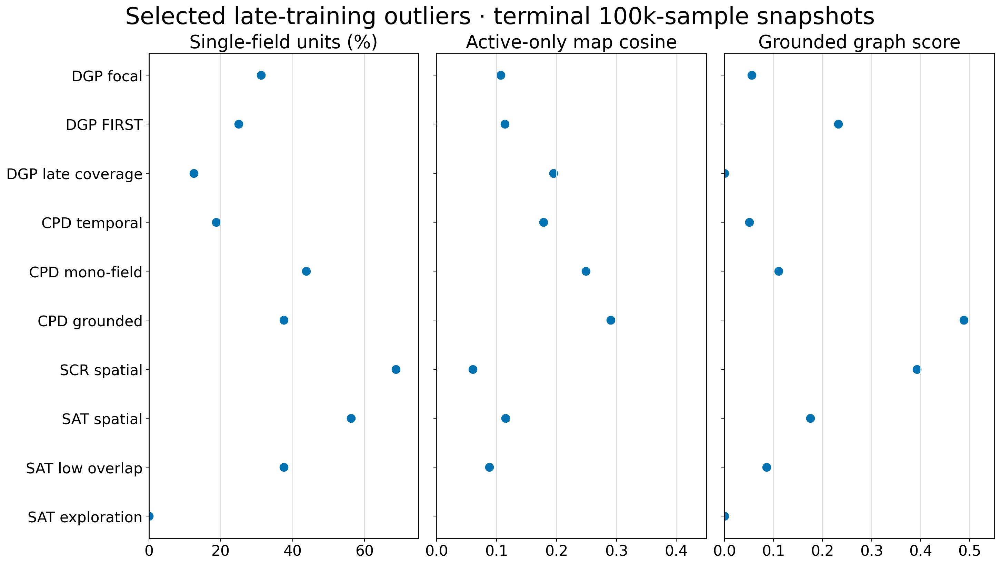
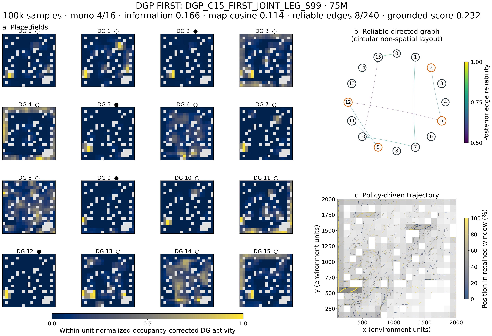
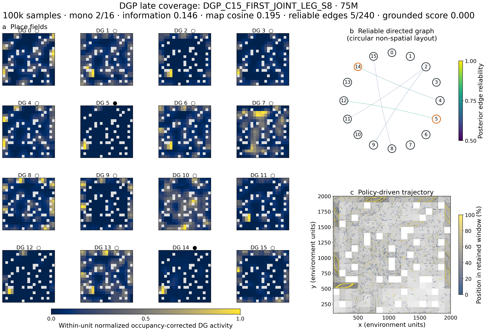
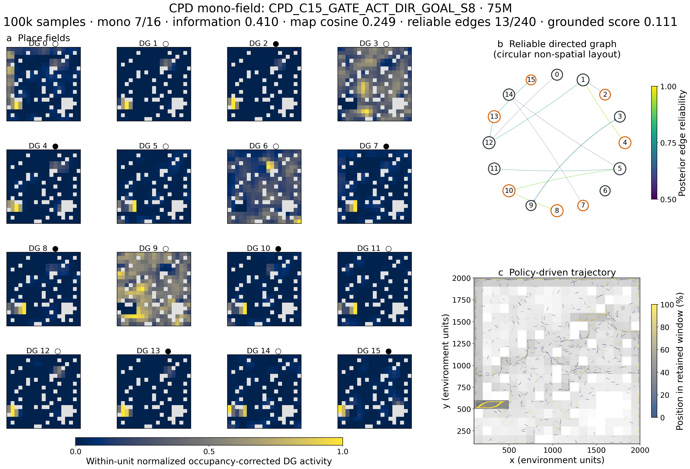
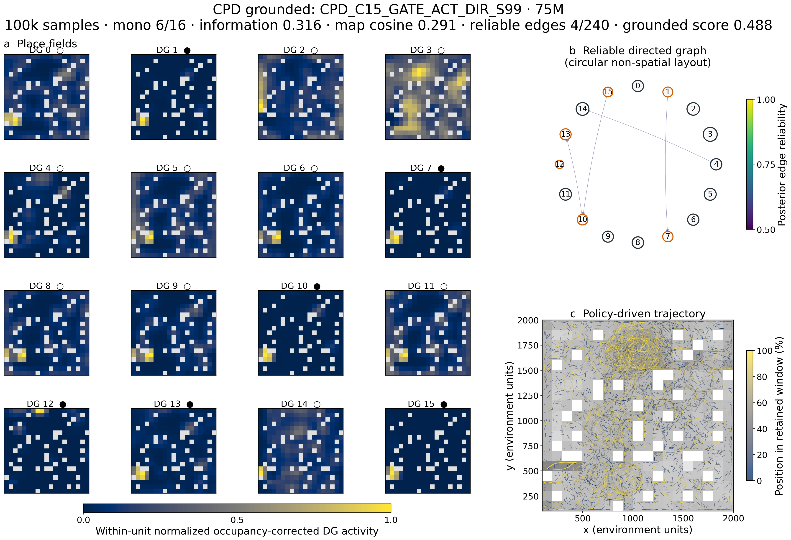
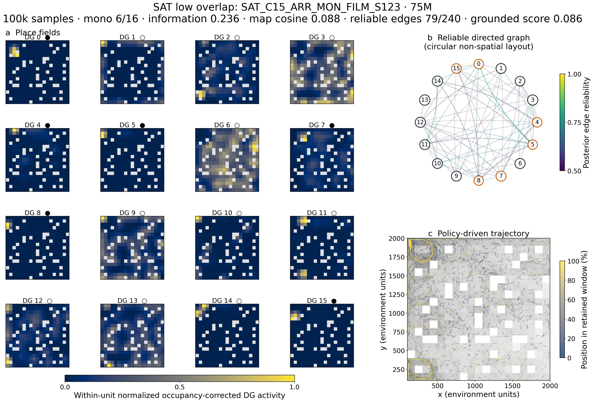
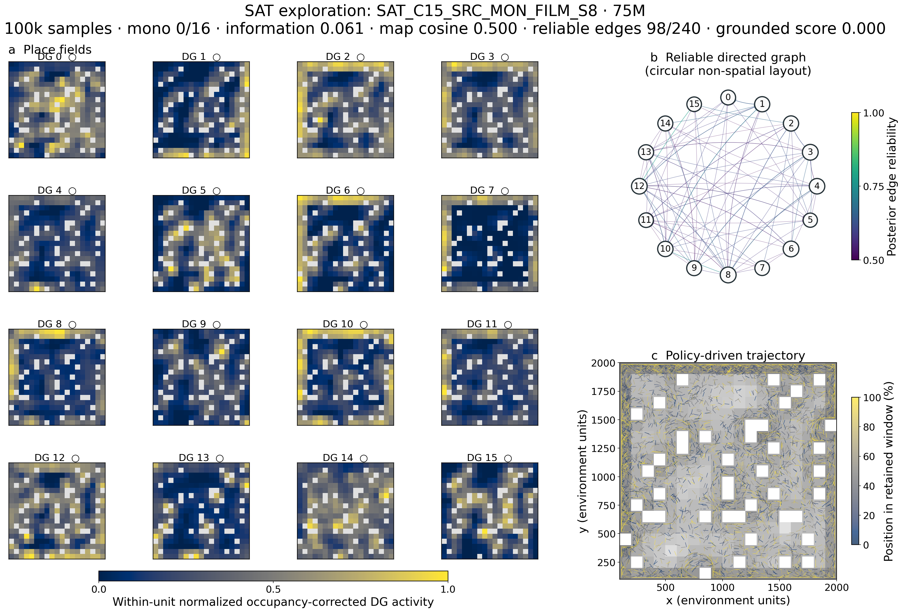

# Place fields, reliable graphs, and trajectories of selected outliers

Each page shows one run at its 75M checkpoint using the canonical retained
100,000-sample online-spatial snapshot:

- **Place fields:** occupancy-normalized, smoothed DG maps, normalized to each
  unit's own peak for shape comparison. White bins were unvisited. `●` marks a
  unit meeting the established single-field criterion, `○` another eligible
  unit, and `×` an ineligible unit.
- **Graph:** reliable directed controllability edges in a circular,
  **non-spatial** layout. Edge color encodes posterior reliability; node size
  encodes visits; orange borders identify single-field units.
- **Trajectory:** raw retained positions. Every tenth contiguous segment is
  drawn over log occupancy and colored from early (blue) to late (yellow).

These are policy-driven online windows. They show what each policy experienced
and represented; they are not fixed-trajectory stability tests or causal
target interventions.

## DGP runs

### Focal: HIT–JOINT–legacy, seed 123

### FIRST–JOINT–legacy, seed 99

### FIRST–JOINT–legacy, seed 8

## CA3 feedback / predictive-DG runs

### Gated CA3 history with BPTT, seed 99

### Gated action history with directional goal predictor, seed 8

### Gated action history with direct gradients, seed 99

## Earlier spatial and exploration outliers

### Source-credit/retirement: ARR–DIRS, seed 123

### Saturday: ARR–DIRO–FiLM, seed 8

### Saturday: ARR–monitor–FiLM, seed 123

### Saturday: SRC–monitor–FiLM, seed 8

The contrast in the final two pages is especially useful: the exploration
winner traverses nearly the entire arena but has zero classified single-field
units and highly overlapping maps. Broad coverage alone does not yield a
spatially differentiated code.

`DPR_C05_PRED_LEG_S99`, the older high-coverage winner, is absent because that
study predates the canonical 100k-sample milestone snapshot format. It has no
directly comparable saved place-field, graph, and trajectory triplet. The
existing scalar evidence remains in the main outlier audit.

## Reproducibility

- [Renderer](plot_selected_outlier_spatial_gallery.py)
- [Per-run summary](assets/late_outlier_spatial_gallery_20260908/selected_outlier_spatial_summary.csv)
- [Gallery manifest](assets/late_outlier_spatial_gallery_20260908/gallery_manifest.json)
- Editable vector PDFs accompany every PNG; start with the
  [vector overview](assets/late_outlier_spatial_gallery_20260908/selected_outliers_overview.pdf).
