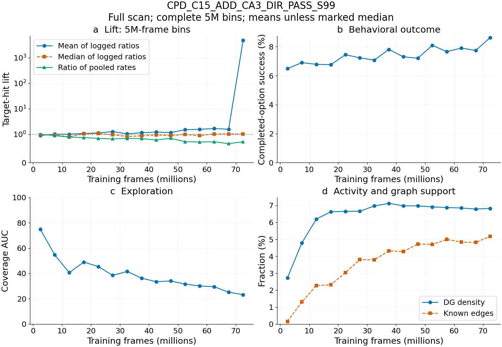
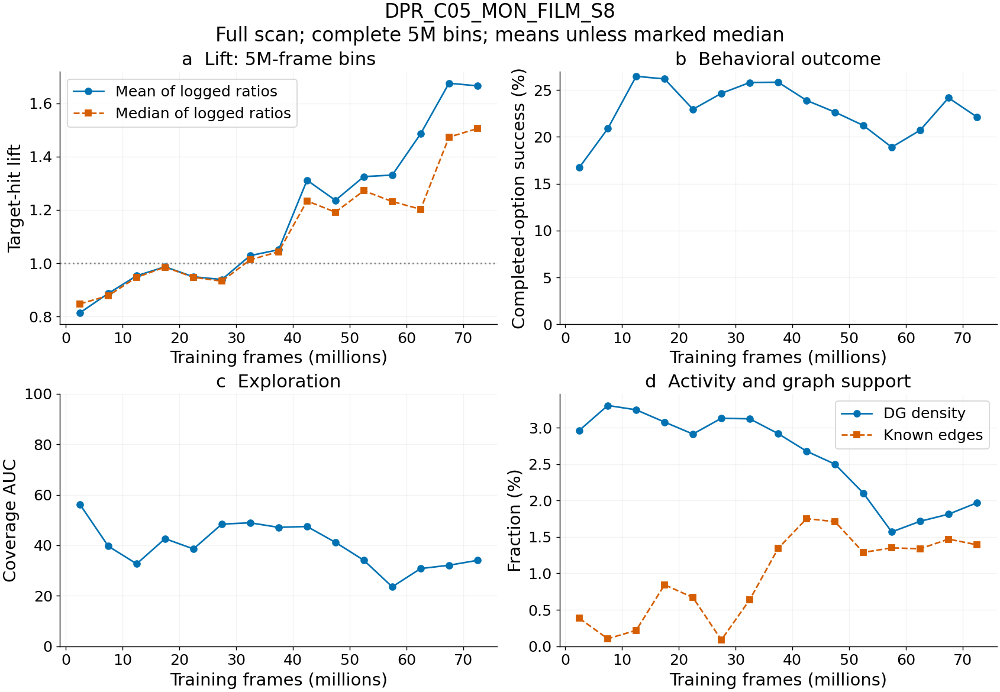

# Late target-hit-lift jumps: what survives scrutiny?

The user's observation is correct: several runs have spectacular lift jumps in
the second half of training. Most inspected jumps are caused by zero shuffled
activations and averaging unstable ratios. One smaller, sustained exception is
**DPR_C05_MON_FILM_S8**. It deserves follow-up as a possible selective local
solution, but its coverage declines and its absolute option success does not
improve with the late lift rise. No inspected run establishes broadly useful
goal control.

## Search and evidence

Screened **543 runs with this metric across 11 W&B projects**, including old
trials and incomplete runs; **371 reached over 40M frames**. Requested 1,000
sampled history points per run, using each run's observed midpoint to screen
the latter half. Ranked both large spikes and sustained terminal medians.
Then retrieved **10 complete W&B histories** without sampling, retaining
missing values and raw metrics. This is full logged history, not every learner
minibatch. The screen is exploratory, not an exhaustive proof that no other
short-lived increase exists. Sampled maxima demonstrably miss some extremes.

The complete scan covers three DPR C13 variants, DPR C05 FiLM seed 8, two CPD
variants, GSR C05 D4 H10K seed 99, SAT ARR MON FiLM seed 99, SCR ARR DIRO seed
123, and corrected-core C10 HER64 seed 99. Detailed identities, configurations,
W&B links, and available canonical RunSpecs are in
[selected provenance](results/late_lift_audit_20260908/selected_run_provenance.json).
Study schema, workflow version, and study SHA-256 are preserved there and in
[collection provenance](results/late_lift_audit_20260908/provenance.json).
Historical identities without canonical matches remain explicitly unmatched;
their metadata comes from W&B configuration rather than inferred factors.

## Why the metric can jump

The learner computes target DG activation rate divided by shuffled DG
activation rate, flooring the latter at `1e-6`. The shuffled target is a
one-position roll, with separate valid-target masks. This is a within-batch
activation diagnostic, not a paired behavioral intervention.

Two distinctions matter:

- A mean of per-row ratios is not the ratio of pooled rates. Even a median of
  ratios can disagree with pooled rates when support and context vary.
- `target_hit_rate` is a recorded behavioral target-hit event frequency; it
  is not the DG-activation numerator of `target_hit_lift`. The missing legacy
  activation denominator cannot be reconstructed by dividing that event rate
  by lift.

Where explicit counters exist, the audit sums target numerator/count and
shuffled numerator/count separately, then divides the two rates. These are
pooled logged samples, not independent trials; no binomial confidence
interval or causal interpretation is attached. The CPD logged ratios are
reproduced from their counters to relative error below `1.2e-7`.

### Directly verified denominator explosions

| Run | Frames | Target activations / valid rows | Shuffled activations / valid rows | Logged lift |
|---|---:|---:|---:|---:|
| CPD_C15_ADD_CA3_DIR_PASS_S99 | 72.122M | 32 / 86 | 0 / 52 | 372,093 |
| CPD_C15_GATE_ACT_BPTT_PASS_S8 | 70.943M | 26 / 201 | 0 / 171 | 129,353 |
| SAT_C15_ARR_MON_FILM_S99 | 64.750M | 1 / 314 | 0 / 308 | 3,184.7 |
| SCR_C15_ARR_DIRO_S123 | 51.610M | 1 / 750 | 0 / 740 | 1,333.3 |
| SCR_C15_ARR_DIRO_S123 | 56.263M | 1 / 760 | 0 / 750 | 1,315.8 |

These values do not indicate thousands-fold behavioral improvement. They
describe finite logged batches with zero baseline events, assigned a finite
ratio by a numerical floor. Smoothing can spread their visual effect across
a much longer section of the curve.

For **CPD ADD_CA3_DIR_PASS seed 99**, the 65–75M mean logged lift is **2,363.6**,
but pooled rates are **0.04380 / 0.06241 = 0.702**. Two extreme rows contribute
99.93% of the ratio sum. Relative to 25–35M, pooled lift declines **0.846 →
0.702**, coverage declines **40.0 → 24.2**, while option success rises only
**7.15% → 8.19%**. This is not a late target-control breakthrough.

For **CPD GATE_ACT_BPTT_PASS seed 8**, the 65–75M mean is **606.0**, the median
is **1.290**, yet pooled lift is **0.763**. At 25–35M pooled lift was **0.794**.
Thus even an increasing median is insufficient to establish an aggregate
advantage. These PASS variants must also be interpreted under their actual
training command mode, not as clean paired goal interventions.

The older **SAT ARR_MON_FILM seed 99** finishes with pooled lift **1.004**;
**SCR ARR_DIRO seed 123** finishes at **1.005**. Their conspicuous spikes occur
earlier in the second half, without a durable lift improvement. The latter is
also the high-mono-field run previously shown in the spatial gallery: its
spatial specialization and these ratio spikes should not be conflated.

### Legacy C13 and corrected-core spikes

The three fully scanned DPR C13 examples are already spiky in the first half.
The late increases in smoothed means are not the onset of a new learned phase.
At 65–75M:

| Run | Mean lift | Median lift | Option success | Share of ratio sum from rows above 100 |
|---|---:|---:|---:|---:|
| DPR_C13_MON_LEG_S99 | 77.95 | 0 | 3.01% | 99.44% |
| DPR_C13_DIR_FILM_S123 | 62.79 | 0.682 | 3.91% | 99.19% |
| DPR_C13_PRED_FILM_S123 | 56.52 | 0 | 1.05% | 99.48% |

Their activation counters were not logged, so exact pooled lift is unavailable.
The denominator-floor explanation is consistent with the legacy implementation
and extreme sparse-event behavior, rather than directly reconstructed for each
row. MON seed 99 and PRED FiLM seed 123 have zero mean known-edge fraction in
this window. The earlier report's representation/support-failure assessment
remains consistent with these complete histories.

Corrected-core **C10 DIRECT_IMMEDIATE_HER64 seed 99** has full-history spikes
of **4,401 at 66.421M** and **6,357 at 66.847M**, but finishes with a last-10M
mean lift of **0.976** and median **0.997**. This is another transient spike,
and the previously documented HER correctness problem independently prevents
using this run as evidence for that training design.

## The sustained candidate: DPR C05 monitor-only FiLM seed 8

This run had the highest sampled terminal median among the 371 runs above
40M. Its exact history confirms a sustained rise beginning around **40M**.
Unlike C13, it has no rows above lift 100; its complete-run maximum is about
6.18. Compare equal 10M windows:

| Metric | 25–35M | 65–75M |
|---|---:|---:|
| Mean logged lift | 0.984 | 1.670 |
| Median logged lift | 0.966 | 1.489 |
| Fraction of logged rows above lift 2 | 0% | 19.0% |
| Behavioral hit events / transition | 0.0392 | 0.0364 |
| Completed-option success | 25.2% | 23.1% |
| Coverage AUC | 48.6 | 33.1 |
| DG density | 3.12% | 1.89% |
| Silent-unit fraction | 0 | 0 |
| Known-edge fraction | 0.36% | 1.43% |
| Raw-logit action sensitivity | 0.0419 | 0.0640 |

This is the best candidate for **increasing target selectivity with narrowing
experience**, not an increase in broad behavioral success. Its representation
becomes sparser without units becoming silent, and action sensitivity increases.
The graph expands slightly but remains very sparse. Lower coverage is compatible
with confinement; it does not by itself prove the geometry of the trajectories.
No new place-field rollout was launched for this audit.

Crucially, this is **MON**, with **zero recruitment replacements** throughout.
The increase cannot be attributed to directional/predictive recruitment. The
same C05 MON FiLM condition's seeds 99 and 123 have terminal 70–75M mean lifts
of **1.004 and 0.789**, compared with **1.665** for seed 8 in the existing
terminal table. This is a seed-specific outcome, not replicated FiLM success.

Legacy counters are missing here too. Therefore we cannot yet determine whether
the numerator increased relative to a well-supported baseline, the baseline
declined, or varying supports biased the ratios. The CPD example above shows
why the sustained median alone cannot settle that question. The result is more
interesting than an isolated zero-denominator spike, but still provisional.

The additional **GSR_C05_D4_H10K_S99** check is less convincing: mean lift grows
from **1.006 at 45–55M** to **1.315 at 65–75M**, while option success falls from
**25.7% to 9.06%**. At 85–100M its mean reaches **2.07**, but median is **0.998**
and option success **8.57%**. Its higher mean is not a sustained typical-row
advantage and does not corroborate the DPR C05 candidate.

## What to retain and what to do next

1. Keep the C05 monitor-only FiLM seed-8 checkpoint as a targeted scientific
   candidate, with a pre-rise checkpoint around 25–35M and a late checkpoint.
   A small frozen evaluation that logs well-supported activation counts is
   justified for this particular candidate because the relevant legacy data
   are missing. A broad expensive intervention sweep is not justified by the
   giant spikes.
2. The user's local-solution intuition remains plausible for the C05 trajectory
   of metrics: less coverage, sparser activity, increasing sensitivity and
   relative selectivity, without improved absolute success. It does not establish
   an encoder–decoder equilibrium or causal local control.
3. Do not retain recruitment, CA3 feedback, or HER mechanisms because of a large
   lift curve alone. The strongest verified explosions occur without pooled
   advantage, and the sustained C05 case has no recruitment events.
4. Use pooled activation rates plus their separate numerators/denominators for
   learning-curve interpretation. Keep option success, event frequency, coverage,
   and field diversity separate. Log/plot zero-baseline windows as unsupported
   ratios rather than visually enormous gains; this audit changes no training
   code or historical data.

## Artifacts, checks, and reusable experience

- [All-run screen](results/late_lift_audit_20260908/screen.csv), cached sampled
  curves, ten full-history caches, [5M windows](results/late_lift_audit_20260908/detail_5m_windows.csv),
  and [full-scan summaries](results/late_lift_audit_20260908/detail_summary.csv).
- Editable sources: [collector](audit_late_lift_20260908.py) and
  [renderer](plot_late_lift_20260908.py). Figures are PNG and embedded-font PDF.
- Figure lines use complete 5M bins; a single logged row just beyond the nominal
  terminal checkpoint is not plotted as an entire new 5M bin. Window CSVs retain
  that partial bin for transparency. Display previews were inspected at 1040px.
- Full `scan_history` rather than sampled history was decisive: it found extrema
  absent from the screen. Scanning without requiring the intersection of all
  keys preserves asynchronously logged metrics. NaN-only startup records are
  excluded from lift summaries.
- Broad W&B inventory retrieval was slow; reuse this screen/inventory and fetch
  only selected histories next time. `--detail RUN_ID ...` reuses existing full
  caches. Local cached terminal tables were the fastest initial shortlist.
- Authoritative metric semantics: learner activation calculation, explicit
  counters where present, and the metric reference. A recorded behavioral hit
  rate must never be used to reverse-engineer a missing activation denominator.

Related reports: [DPR interim](directional_predictive_recruitment_interim_20260904.md),
[late spatial outliers](late_training_outliers_20260908.md), and
[spatial gallery](late_outlier_spatial_gallery_20260908.md).
