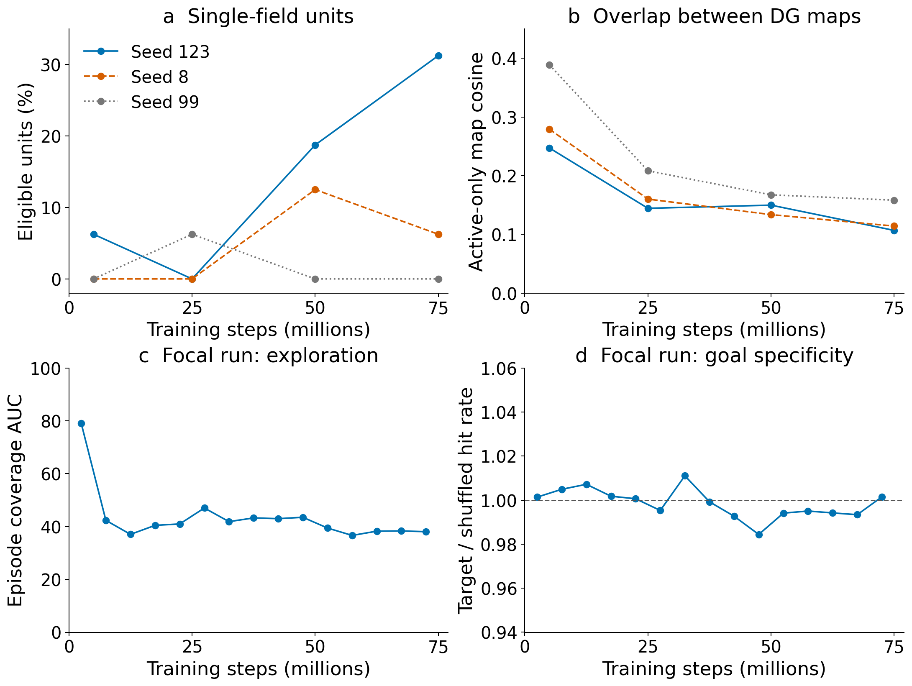
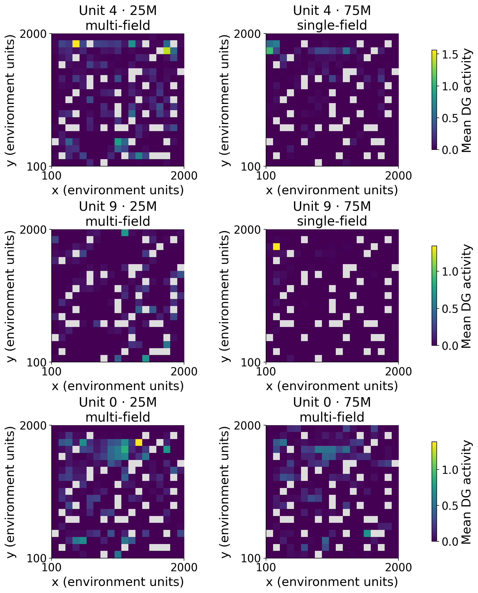
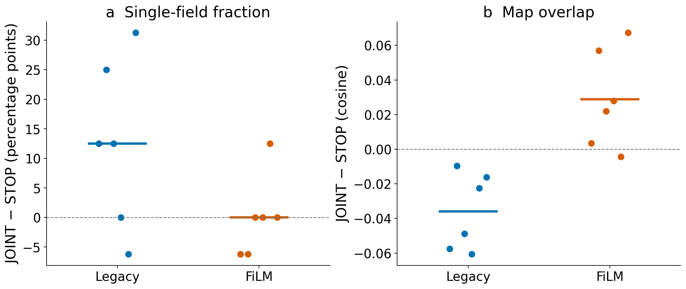

# Late-training outliers: partial successes worth preserving

See the [75M place-field, graph, and trajectory gallery](late_outlier_spatial_gallery_20260908.md)
for the selected runs discussed below.

Date: 2026-09-08. Focal run:
`00_DGP_C15_HIT_JOINT_LEG_S123_20260906_230235_239727`.

The focal run shows a real late improvement in its **thresholded spatial
representation**. Its five final single-field units, however, concentrate in
one corner, and its commanded-hit rate remains equal to shuffled goals.
The useful discovery is that specialization can emerge under the existing
objective, especially with JOINT gradients and legacy goal conditioning.
These data support retaining that possibility and testing its generality.

The earlier [23M audit](dgp_interim_failure_audit_20260907.md) was too pessimistic
about the possibility of later representation learning. Its concern about
command specificity survives the completed study; its prediction that more
training would only repeat an uninformative equilibrium needs qualification.

## What happened in the focal run

I refreshed all 24 DGP runs and all 81 CA3-feedback/predictive-DG (CPD) runs;
both studies finished at 75M. The canonical spatial collector validated all
96 DGP and 324 CPD milestone snapshots, with no missing snapshots. The table
below uses the **100,000 behavior-sample snapshots**, not the shorter W&B
monitoring window.

| Focal run | 5M | 25M | 50M | 75M |
|---|---:|---:|---:|---:|
| Single-field units / 16 eligible units | 1 | 0 | 3 | **5** |
| Active-only map cosine; lower means less overlap | 0.247 | 0.145 | 0.150 | **0.107** |
| Mean spatial information | 0.065 | 0.118 | 0.151 | **0.172** |
| Distinct peak bins across active units | 16 | 16 | 13 | 15 |
| Visited grid-bin fraction | 88.1% | 87.8% | 87.0% | 87.5% |
| Silent units | 0 | 0 | 0 | 0 |

The changes after 25M are not explained by silence or a smaller observed map.
The 10k-sample W&B series also supports persistence: single-field fraction
averages 13.1%, 26.3%, and 25.0% over 45–55M, 55–65M, and 65–75M;
the final 70–75M average is 31.25%. These dependent monitoring observations
are evidence of persistence, not additional experimental replicates.

Top panels: canonical 100k-sample snapshots for the three HIT–JOINT–LEG seeds.
Bottom panels: seed 123 only, unsampled W&B history aggregated into 5M-step
windows. Hit lift is the ratio of target and shuffled rates calculated from
summed numerators and event counts. No smoothing or uncertainty bands are used.

The same configuration's seed 8 finishes with one single-field unit and
seed 99 with none. Thus seed 123 is an outlier, rather than evidence that the
configuration reliably produces five fields.

The actual maps make the achievement more specific. Units **4, 9, 10, 11,
and 14** meet the operational single-field criterion at 75M. Their raw
occupancy-normalized peak coordinates lie within **x = 150–450,
y = 1750–1950**, in a map spanning 100–2000 on both axes. They differentiate
a small corner region. Fifteen unique peak bins across the population do not
mean fifteen clean, well-distributed place fields.

Examples are the first two final single-field unit indices, plus the first
remaining multi-field unit. They were selected to display the change and its
limit, not as random representative units. Each row shares its color scale
between checkpoints. Gray bins were unvisited. Maps show unsmoothed,
occupancy-normalized thresholded activity; the established field classifier
uses occupancy-aware smoothing and multilevel dominant-component mass.
These are policy-driven samples. Pre-threshold maps and fixed-trajectory
stability cannot be inferred from these artifacts.

Behavior does not show a matching breakthrough. At 65–75M:

- Option completion is **55.5%**, second highest in the DGP batch.
- Target/shuffled hit lift is **0.9973**, essentially one.
- Action sensitivity rises from about 0.0022 at 20–25M to 0.0079 at 65–75M.
- Episode coverage AUC falls from 41.0 to 38.2 across those windows.

HIT rewards an eventual target occurrence, so completion can improve without
the command selecting the outcome. The graph's final grounded-controllability
score rises to 0.0555, but this score multiplies prospective success by the
fraction of reliable edges with qualifying spatial endpoints. It contains no
shuffled-goal correction. Better field classification can increase it without
establishing causal goal control. Here the mean peak separation of its valid
reliable edges is only about 253 environment units, consistent with the local
cluster.

## A result that survives looking beyond the winning seed

Using all six matched outcome-by-seed comparisons at the canonical 75M
snapshot, the JOINT-minus-STOP effects depend strongly on the goal interface:

| Goal input | Single-field fraction | Active-only map cosine | Spatial information |
|---|---:|---:|---:|
| Legacy | **+12.5 percentage points** | **−0.0359** | +0.0219 |
| FiLM | 0.0 percentage points | +0.0289 | +0.0015 |

With legacy input, map cosine improves in **all six** pairs. Single-field
fraction improves in four, ties in one, and declines in one. The separate
65–75M short-window analysis gives the same direction: +11.1 percentage
points, with improvement in five of six pairs. FiLM's corresponding mean
change is only +0.2 points in that monitoring analysis.

Each point is one seed/outcome pair; horizontal lines are their means.
These six pairs contain only three distinct seeds and two outcome definitions.
This is an exploratory interaction, not a confirmatory significance claim.

The most economical interpretation is that **the policy-to-representation
gradient can help spatial differentiation, but its effect depends on how
the goal reaches the decoder**. A possible explanation is that legacy input
creates a different demand on DG features, whereas FiLM can express more
target dependence within the decoder. That mechanism is a hypothesis:
action sensitivity, gradient norms, and these factorial comparisons do not
identify the exact gradient computation responsible.

No recruitment explanation is needed for DGP: its declared monitor setting
allows zero replacements per rollout. The frozen ResNet trunk remains fixed;
JOINT changes gradients reaching the DG projection. The focal PPO/encoder
gradient-norm ratio rises from about 1.30 at 20–25M to 2.81 at 70–75M, but
the mean gradient cosine remains slightly negative. A larger gradient is
therefore not itself an explanation or a proposed tuning target.

## Other outliers and what each teaches us

I also screened existing completed-study artifacts for DPR (54 runs), Saturday
(36), graph-stabilized recruitment (36), and source-credit/retirement (30).
Together with refreshed DGP/CPD, that is 261 completed runs, with different
available diagnostics. Canceled edge-exploration runs are not terminal
comparators. The newest CA3-memory study's 50 runs were still training at
retrieval, so their current peaks are not included as end-of-training winners.

These are selected examples, not interchangeable rankings. Spatial values
below are terminal 100k-sample measurements. Coverage values marked 65–75M
are means over that training window.

| Run | Exceptional result | Useful interpretation / limitation |
|---|---|---|
| **DGP_C15_FIRST_JOINT_LEG_S99** | 25% single-field; cosine 0.114; information 0.166 | Another JOINT–legacy spatial success, despite changing HIT to FIRST. First-outcome lift is only 0.929 at 65–75M. |
| **DGP_C15_FIRST_JOINT_LEG_S8** | Coverage AUC **37.3 → 53.5** from 45–55M to 65–75M; 12.5% final single-field | A real late exploration recovery. Matched FIRST–STOP–LEG seed 8 ends at 54.6, so the coverage recovery cannot be credited uniquely to JOINT. |
| **CPD_C15_GATE_CA3_BPTT_S99** | Highest terminal CPD spatial information: **0.541**; cosine 0.178; 13 peak bins; 18.75% single-field | Temporal CA3 feedback with BPTT is a representation candidate. It has **no auxiliary transition predictor**. Information rises 0.420 → 0.508 → 0.541 at 25/50/75M, but FIRST lift remains 0.877 at 65–75M. |
| **CPD_C15_GATE_ACT_DIR_GOAL_S8** | **43.75%** single-field; information 0.409 | High field count comes with only **8 distinct peaks** and cosine 0.249. Specialization and population diversity must be assessed together. FIRST lift is 0.818. |
| **CPD_C15_GATE_ACT_DIR_S99** | Grounded score **0.488**, 37.5% single-field | A striking graph-score outlier, but just **7 peaks** and cosine 0.291. The composite score can reward a small set of qualifying endpoints; it does not establish a distributed control map. |
| **SCR_C15_ARR_DIRS_S123** | **68.75%** single-field; cosine **0.0605**; information 0.242; 13 peaks | Strong older terminal representation candidate under arrival credit. Its available artifact establishes an endpoint, not when improvement happened or why this seed won. |
| **SAT_C15_ARR_DIRO_FILM_S8** | **50%** single-field; cosine **0.0649**; information 0.246; 15 peaks; coverage 63.3 at 65–75M | A valuable example combining spatial differentiation with decent exploration. **Zero replacements**: do not credit the DIRO label for the outcome. |
| **SAT_C15_ARR_MON_FILM_S123** | Information **0.251**, cosine **0.0345**, 16 peaks; 20% single-field | Clean spatial differentiation also occurs under a monitor baseline. FiLM is not universally bad; the negative result is its interaction with JOINT in DGP. |
| **DPR_C05_PRED_LEG_S99** | Coverage **95.7** at 65–75M | Excellent exploration; it was already at 84.8 by 5–15M. This is a sustained winner, not a late breakthrough. Its one replacement is a confound, and the older hit-lift measure is not equivalent to current shuffled-count evaluation. |
| **SAT_C15_SRC_MON_FILM_S8** | Coverage **94.1** at 65–75M | Another sustained exploration winner, already at 90.1 by 5–15M. Terminal map cosine is 0.286 and 65–75M hit lift only 1.009: useful as an exploration reference. |

The other strong late conditioning example is
`SAT_C15_SRC_DIRO_FILM_S99`: action sensitivity increases **0.0218 → 0.0395**
from 45–55M to 65–75M, while coverage stays near 75 and hit lift changes only
1.0017 → 1.0060. The policy increasingly uses the command, but useful outcome
selection does not follow. In older GSR, `GSR_C15_D8_H5K_S123` reaches coverage
78.0 with zero recruitment; its legacy lift of 0.932 is another reason to keep
exploration and control interpretations separate.

## Inspirations worth pursuing

1. **Keep a simple JOINT + legacy + arrival-credit baseline.** The matched
   representation effects justify taking it seriously, despite weak control.
   Do not discard it based on the 23M audit or choose FiLM solely because it
   produces greater action sensitivity. The existing factorial study already
   supplies the minimal comparison; replicate that contrast before adding
   several mechanisms at once.

2. **Ask why useful identities concentrate in one region.** The focal result
   suggests that the objective can sharpen identities but does not guarantee
   that they cover distinct recurring situations. General hypotheses include
   uneven learning exposure and several identities exploiting the same
   predictable outcome family. Test this with occupancy/exposure-matched
   trajectories and unit-level identity persistence. A spatial-distance bonus
   would repair a symptom in this environment without resolving that general
   question.

3. **Keep temporal context separate from the auxiliary predictor.** The CPD
   information winner uses CA3 gating and BPTT without the predictor. That
   makes temporal context a bounded, measurable candidate; it does not justify
   combining feedback, prediction, recruitment, and goal changes. Compare
   the matched plain-feedback cells and their other seeds, rather than only
   the exceptional seed 99.

4. **Use the best representations as diagnostic checkpoints.** For the focal
   run, FIRST–JOINT–LEG seed 99, and the older ARR winners, hold the checkpoint
   fixed and compare real, shuffled, and fixed commands from matched source
   states using the established intervention evaluator. This separates a
   representation that is becoming useful from a worker unable to exploit it.
   It also tests whether the five corner identities are behaviorally distinct.
   These rollouts were not launched as part of this analysis.

5. **Allow the declared horizon to answer representation questions.** An early
   flat control curve did not imply a frozen representation. Conversely, these
   75M results provide no evidence that extending the same runs indefinitely
   would solve command specificity. Evaluate the representation and control
   on their own timescales.

## Evidence, reproducibility, and limits

- DGP [canonical snapshots](results/late_outliers_20260908/dgp_snapshots/per_snapshot.csv)
  and [provenance](results/late_outliers_20260908/dgp_snapshots/analysis_manifest.json).
- CPD [canonical snapshots](results/late_outliers_20260908/cpd_snapshots/per_snapshot.csv)
  and [provenance](results/late_outliers_20260908/cpd_snapshots/analysis_manifest.json).
- [W&B window metrics](results/late_outliers_20260908/window_metrics.csv),
  [unsampled-history checks](results/late_outliers_20260908/full_history_verification.json),
  and [75M paired effects](results/late_outliers_20260908/snapshot_paired_effects.csv).
- [Plotting source](plot_late_outliers_20260908.py) and
  [figure provenance](results/late_outliers_20260908/figure_manifest.json).
- Older spatial and online results:
  [Saturday](results/recent_batches_audit_20260906/saturday_terminal_per_run.csv),
  [source-credit](results/recent_batches_audit_20260906/source_credit_terminal_spatial_per_run.csv),
  [DPR/Saturday histories](results/late_learning_audit_20260907/per_run_window.csv),
  [GSR](results/graph_stabilized_recruitment_20260903/aligned_65m_75m/per_run_latest_10m.csv).

The refreshed studies use schema `intrmotiv/study/v1`, declared study workflow
`1.4.1`, collected using workflow `1.5.0`. DGP SHA-256:
`2e3104c975188e7cddeb71bce8816c0f4f0d6eb96688c44e0ea2b7560b5447b5`.
CPD SHA-256:
`c11ca69dfbd8e0fdf662e3e01b918aa070e02b03e7aba6f4de198628fc1ee3b9`.

W&B histories were requested at 10,000 rows/run and retained locally compressed;
the four selected DGP/CPD examples were checked with unsampled `scan_history`.
Spatial logging has 75 observations per run. Some multi-metric behavioral
histories omit rows lacking one requested metric, so saved metric/window row
counts matter. Four selected runs' core-behavior scans include slightly more
rows than the broad diagnostic request. The focal figure uses the unsampled
core history. No inferential test treats repeated logs as independent samples.
Endpoint selection among many runs is exploratory and optimistic by design.

Online maps are occupancy-normalized but remain dependent on policy,
orientation, and the retained observations. Similar total coverage does not
guarantee identical sampling. Neither online field labels nor the current
grounded graph score prove stable place cells or causal control.

## Reusable lessons from this task

The authoritative route was StudySpec identities → cached history screening →
terminal-window comparisons → canonical `collect-spatial --require-complete`
→ selected map inspection. The 100k snapshots prevented a short-window claim,
and inspecting the maps exposed the corner concentration that scalar peak
counts missed. Preserve both successes in the next audit.

Avoid broad searches through cached JSON: they can print huge graph buffers.
Read manifests and metric columns first. Use NEMO2's documented
`/home/fr/fr_xl1014/.conda/envs/SFgit/bin/python`: base Python lacked NumPy,
and `dmlab0` was Python 3.8 and incompatible with the workflow. Keep extracted
maps' axis contract explicit: cached `rate_maps` are `(y, x, unit)`.
The first figure attempt assumed `(unit, y, x)` and failed; the corrected
figures were rendered and visually inspected. No training or implementation
changes were made.
