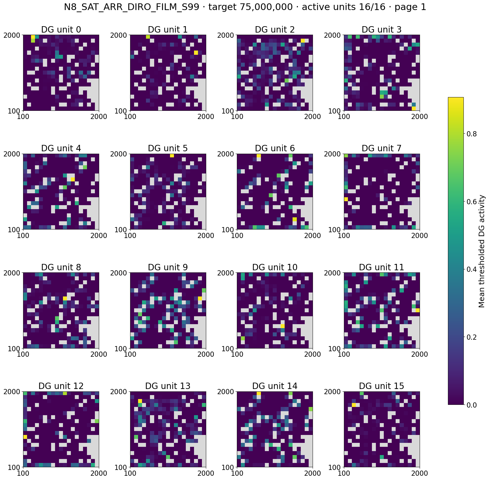

# Navigation8 algorithm screen: interim analysis (5M–75M)

## Scope and status

This is an interim analysis of `navigation8_algorithm_screen_20260909` (StudySpec SHA-256 `c435ddac609945336d1e42ca16ed0bcc8fd2d46be13eef167a0085b39b682094`). It covers every one of the six configurations and seeds 8, 99, and 123: 18 runs and 54 validated cached online-spatial snapshots at 5M, 25M, and 75M environment frames. All snapshots use the same navigation8 interface, frame repeat 4, 100,000 retained behavior decisions, and 19×19 spatial grid.

The runs did not reach the planned 150M or 300M milestones. Consequently, this report is **not** a terminal comparison, does not include the planned 10k-decision offline checkpoint rollouts, and does not include the planned persistent-goal matched-command intervention for the W-ref pair. Its evidence is the completed online snapshot contract: occupancy-corrected thresholded DG maps, cached graph payloads where present, and segmented policy trajectories.

The canonical collector and the raw snapshots remain in the NEMO2 workspace:

`/work/classic/fr_xl1014-train/IntrMotiv/SF_hipposlam/train_dir/analysis/navigation8_algorithm_screen_interim_20260916/online_spatial`

The lightweight standardized tables copied into the vault are under [data/navigation8_algorithm_screen_interim_20260916](data/navigation8_algorithm_screen_interim_20260916/online_spatial/). The report adapter [analyze_navigation8_algorithm_screen_interim_20260916.py](analyze_navigation8_algorithm_screen_interim_20260916.py) only renders figures from these canonical tables; it does not rediscover runs or redefine metrics.

## Configuration key

| Label | Configuration | Controller payload |
| --- | --- | --- |
| SCR | Arrival-direction recruitment with a silent endpoint gate | Graph |
| SAT | Arrival-direction recruitment with open endpoint gate and target-ID FiLM | Graph |
| DGP | Legacy hit-triggered, joint-gradient configuration | Graph |
| CPD | CA3-gated BPTT configuration | Graph |
| W-ref stop | Frozen shared reference, stop-gradient routing | No graph payload |
| W-ref joint | Frozen shared reference, joint-gradient routing | No graph payload |

## Place fields and behavior

The canonical map output below is a representative seed-99 75M contact sheet
for SAT, the lowest-overlap configuration on the three-seed summary. Each panel
is an occupancy-corrected thresholded DG map; gray cells were not visited.
Individual unit maps show why an aggregate overlap score is not sufficient to
declare distinct landmarks.

At 75M, no configuration has silent DG units in the retained window. SAT has the lowest mean active-only map cosine (0.209), followed by W-ref joint (0.213) and SCR (0.245); lower cosine denotes less overlap among active thresholded maps. The seed variation remains material, especially for SCR, so this is a descriptive ranking rather than a winner declaration. SAT's mean mono-field fraction is 6.2%; SCR's is 18.8%; W-ref stop's is 14.6%. These values describe thresholded, policy-driven maps, not a fixed-trajectory representation test.

The seed-99 trajectory panel makes the time course visible without pooling unequal policy histories. SAT remains low-overlap at all three completed milestones. CPD becomes less stationary by 25M but has more map overlap. W-ref joint shows much higher seed-99 stationarity at 25M and 75M than W-ref stop; that behavioral difference must be separated from any representation claim.

Canonical seed-99 contact sheets and segmented occupancy/trajectory panels are being rendered in the workspace analysis directory for every configuration at 5M, 25M, and 75M. They retain map-level context behind the aggregate figures. The offline evaluator remains the appropriate next step for pre-threshold maps and comparable 10k-decision rollouts.

## Graph diagnostics

The graph payload supports a structural comparison for SCR, SAT, DGP, and CPD only. DGP has the highest reliable global efficiency by 25M and remains near 0.87 at 75M, with all seeds reporting full reachable-pair coverage. SAT and SCR have high reachability but lower efficiency. CPD has low efficiency despite a relatively high prospective success fraction. Importantly, grounded controllability is zero for DGP and CPD at all completed milestones; SCR reaches only 0.048 ± 0.082 at 75M, and SAT is zero. A connected or successful observational graph therefore does not establish intentional, command-conditioned landmark control.

The W-ref configurations are omitted from this graph figure because their saved snapshots have no graph payload. That absence is a configuration property, not a measured zero.

## Interpretation and next evidence

The completed evidence supports an exploratory distinction: SAT is the most consistently low-overlap field configuration in these cached windows, while DGP has the most globally connected graph. Neither pattern establishes a working intrinsic controller: low map cosine alone does not imply distinct usable landmarks, and graph connectivity without grounded controllability does not show that commands control outcomes.

The next decisive evaluation is a common 75M checkpoint protocol: 10k-decision manifest-driven place-field rollouts (including pre-threshold maps) plus matched-command interventions for the goal-conditioned W-ref pair. Those runs should be submitted as ordinary NEMO2 jobs only after the canonical print-only manifest review. A final claim also requires the missing 150M/300M evidence or a clearly documented decision to treat this batch as a 75M-stopped interim study.

## Provenance and limitations

- The spatial collector completed with `--require-complete --include-details`; [analysis manifest](data/navigation8_algorithm_screen_interim_20260916/online_spatial/analysis_manifest.json), [per-snapshot table](data/navigation8_algorithm_screen_interim_20260916/online_spatial/per_snapshot.csv), [per-unit table](data/navigation8_algorithm_screen_interim_20260916/online_spatial/per_unit.csv), and [snapshot inventory](data/navigation8_algorithm_screen_interim_20260916/online_spatial/snapshot_inventory.csv) preserve the source mapping.
- Active-only map cosine excludes silent units. Silence is reported separately and was zero here.
- The spatial-information score is amplitude-weighted under the established contract; it is not normalized bits per activation.
- The cached trajectories are each policy's own behavior; common frames and retained-window length do not make them a fixed-trajectory field-stability test.
- Means are unweighted over three seeds. Figures show the individual seeds; no hypothesis tests or significance claims are made.
