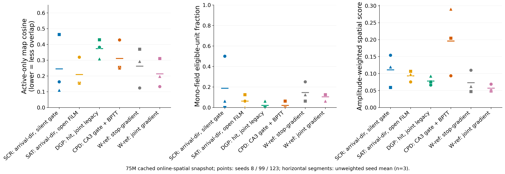
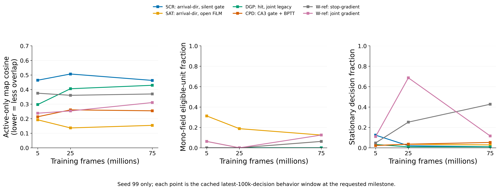
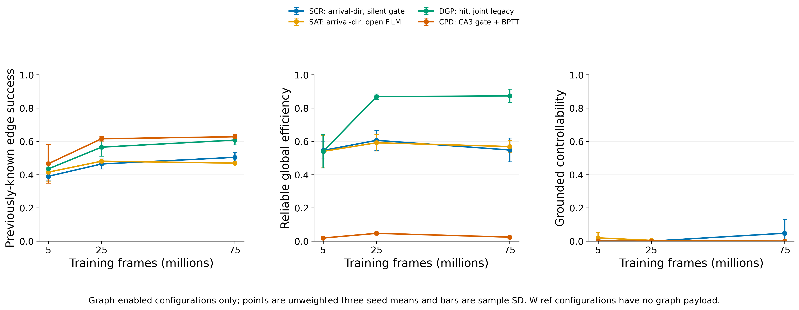

# Navigation8 algorithm screen: 5M–75M interim analysis

## Architecture factorization

| Factor | Levels | Interpretation |
| --- | --- | --- |
| Environment/action regime | Navigation8, repeat 4 | Shared across all six screen families; differs from older five-action/repeat-8 evidence |
| Architecture family | SCR, SAT, DGP, CPD, W-ref stop, W-ref joint | These are bundled architectures, not one-factor levels |
| Representation | Family-specific DG credit/recruitment/routing | F16 for the screened historical families |
| Goal / controller | Family-specific DG-ID/reference goal with PPO | No stored DDQN/HER in this screen |
| Graph | Present for SCR/SAT/DGP/CPD; absent for W-ref snapshots | Graph metrics are therefore not comparable for every family |
| Evidence | Matched 5M/25M/75M online spatial snapshots | No terminal 300M or matched frozen intervention yet |

Cross-report context: [[README|factorized experiment synthesis]].


## 1. Decision status

The six-configuration Navigation8 screen does **not** yet identify a working
intrinsic landmark controller. At 75M, SAT has the lowest active-map overlap,
DGP has the strongest connected graph, and neither pattern establishes
command-conditioned control. This is an interim result, not a terminal ranking.

## 2. Scope and design

| Item | Value |
| --- | --- |
| Study | `navigation8_algorithm_screen_20260909` |
| StudySpec SHA-256 | `c435ddac609945336d1e42ca16ed0bcc8fd2d46be13eef167a0085b39b682094` |
| Matrix | Six configurations × seeds 8, 99, 123 = 18 runs |
| Completed common artifacts | 5M, 25M, 75M snapshots = 54 validated artifacts |
| Snapshot protocol | Navigation8, repeat 4, 19×19 grid, 100,000 retained decisions |

The 150M and 300M milestones were not reached. This report therefore excludes
terminal checkpoints, 10k-decision offline rollouts, pre-threshold offline
maps, fixed-observation stability, and the planned matched-command intervention.

| Label | Configuration | Cached graph payload |
| --- | --- | --- |
| SCR | Arrival-direction recruitment; silent endpoint gate | Yes |
| SAT | Arrival-direction recruitment; open endpoint gate; target-ID FiLM | Yes |
| DGP | Legacy hit-triggered, joint-gradient configuration | Yes |
| CPD | CA3-gated BPTT configuration | Yes |
| W-ref stop | Frozen shared reference; stop-gradient routing | No |
| W-ref joint | Frozen shared reference; joint-gradient routing | No |

## 3. Evidence and interpretation boundaries

The canonical `collect-spatial --require-complete --include-details` collector
validated every snapshot and computed occupancy-corrected thresholded DG maps,
activity/silence, spatial scores, active-only cosine, field components,
segmented trajectories, and available graph diagnostics. It is the source of
the [per-snapshot table](data/navigation8_algorithm_screen_interim_20260916/online_spatial/per_snapshot.csv),
[per-unit table](data/navigation8_algorithm_screen_interim_20260916/online_spatial/per_unit.csv),
and [snapshot inventory](data/navigation8_algorithm_screen_interim_20260916/online_spatial/snapshot_inventory.csv).

These are policy-driven behavior windows. They show representation and movement
under each policy but do not test fields on a common observation sequence.
Active-only cosine excludes silent units; silence is reported separately. The
spatial-information score is amplitude-weighted, not normalized bits per
activation. All condition summaries retain the individual seeds; no statistical
significance claims are made from $n=3$.

## 4. Results

### 4.1 Place fields at 75M



Every configuration has zero silent DG units at 75M. SAT has the lowest mean
active-only map cosine (0.209), followed by W-ref joint (0.213) and SCR (0.245);
lower cosine means less overlap among active thresholded maps. Seed variation is
material, particularly for SCR. SAT's mean mono-field fraction is 6.2%, SCR's
is 18.8%, W-ref stop's is 14.6%, and W-ref joint's is 10.4%. None of those
descriptive values proves that a configuration provides usable landmark goals.

### 4.2 Longitudinal trajectory seed and all-seed endpoints



Seed 99 is the StudySpec's prespecified **trajectory** seed, so it provides a
single coherent 5M → 25M → 75M sequence. It was never intended to be the only
replicate: seeds 8, 99, and 123 all receive a matched 75M endpoint panel.
SAT stays low-overlap across the seed-99 milestones. W-ref joint is highly
stationary at 25M and 75M in seed 99; this is a behavior observation, not a
claim that the run stalled.

### 4.3 Graph diagnostics



DGP has the highest reliable global efficiency by 25M and remains near 0.87 at
75M, with full reachable-pair coverage in all three seeds. SAT and SCR have
lower efficiency despite high reachability; CPD has relatively high
previously-known-edge success but low global efficiency. Grounded
controllability is zero for DGP and CPD at all completed milestones, 0.048 ±
0.082 for SCR at 75M, and zero for SAT. Thus graph structure does not establish
intentional, command-conditioned arrival. W-ref configurations are absent from
this comparison because their snapshots contain no graph payload.

## 5. Visual atlas

The atlas contains a matched place-field contact sheet and segmented
trajectory/occupancy panel for all 18 configuration–seed pairs at 75M:

`06_experiments/data/navigation8_algorithm_screen_interim_20260916/canonical_panels/all_seed_75m/figures/`

Each configuration/seed directory has:

```text
N8_<CONFIGURATION>_S<8|99|123>/
  target_000075000000_policy_00_place_fields_page01.png
  target_000075000000_policy_00_trajectory.png
```

The original seed-99 atlas also contains the 5M and 25M panels, under
`canonical_panels/figures/`. The place-field contact sheets show all 16 DG
units, with gray cells indicating unvisited locations. The trajectory images
show the retained actual behavior paths and occupancy; they are not scalar-only
trajectory summaries.

Open the clickable [75M visual atlas](data/navigation8_algorithm_screen_interim_20260916/visual_atlas_75m.md) to compare all configurations and seeds directly.

## 6. Conclusion and required next evidence

The present data separate field overlap from graph connectivity: SAT is the
best low-overlap candidate in these online windows, while DGP is the best graph
connectivity candidate. Neither is a demonstrated controller. The next
decisive test is a matched 75M checkpoint protocol: 10k-decision offline
place-field rollouts with pre-threshold maps, then frozen matched-command
interventions for W-ref stop versus joint. Any final comparison must also either
recover the 150M/300M milestones or explicitly retain this 75M-stopped scope.

## 7. Reproducibility

- Figure adapter: [analyze_navigation8_algorithm_screen_interim_20260916.py](analyze_navigation8_algorithm_screen_interim_20260916.py)
- Figure metadata: [figure_metadata.json](data/navigation8_algorithm_screen_interim_20260916/figure_metadata.json)
- Workspace analysis root: `/work/classic/fr_xl1014-train/IntrMotiv/SF_hipposlam/train_dir/analysis/navigation8_algorithm_screen_interim_20260916/`
- The TensorBoard `collect-online --latest-common` output is not used here: its
  collector has not emitted completed tables.
