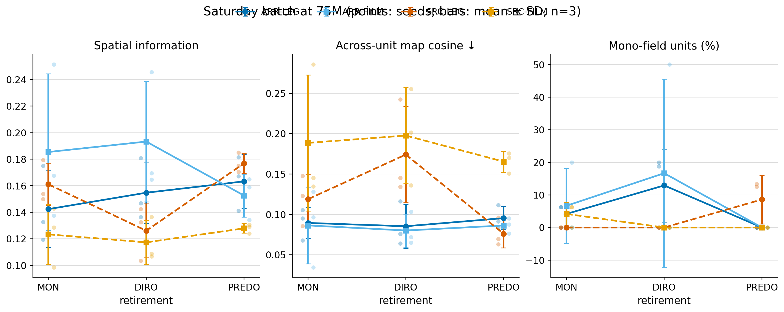
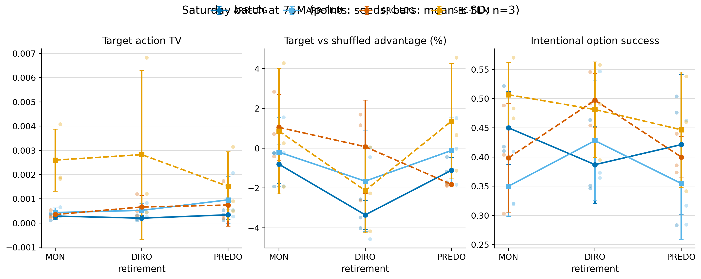
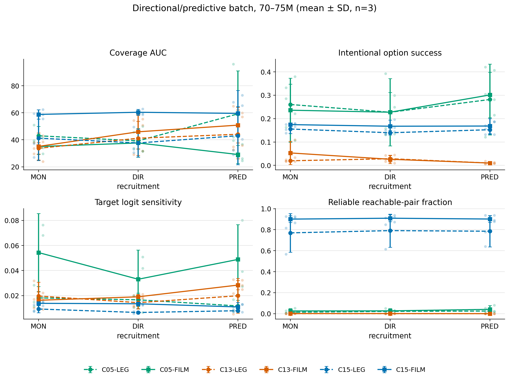
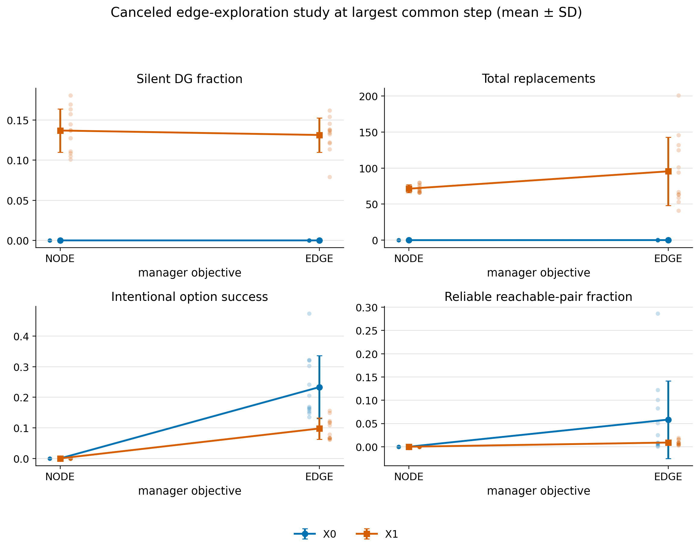

# Recent IntrMotiv batches: design audit

**Date:** 2026-09-06  
**Scope:** graph-stabilized recruitment through the completed Saturday batch  
**Purpose:** distinguish useful mechanisms from graph/telemetry false positives
and identify the smallest principled improvement to intrinsic control.

## Executive conclusion

The latest batches do not show target-dependent navigation. They show a
repeatable dissociation:

- C15 readily produces a dense, apparently navigable graph, but commanded and
  shuffled targets are reached at the same rate.
- C05 produces the clearest target-dependent policy response, but its graph is
  sparse and strongly concentrated into a few destinations.
- C13/X1 temporal exclusion silences landmarks and can trigger destructive
  recruitment churn.

The central failure is therefore not insufficient graph machinery. The current
worker is rewarded for eventually hitting the commanded DG identity but is not
penalized for reaching other identities first. A broad landmark can be reached
from many sources, become a common sink, and make the graph look connected even
when the command has little causal effect on action or outcome. Recruitment is
too sparse and self-referential to repair that failure after the fact.

The next change should be one chance-centered, first-outcome controllability
objective. Hold representation, normalization, retirement, geometry, and graph
planning fixed. Sample targets evenly and make the first distinct landmark
outcome informative: reward the commanded outcome and mildly penalize a wrong
landmark outcome. This directly optimizes command specificity, supplies a
learning signal on failed choices, and transfers unchanged to physical, web,
and abstract state graphs.

## Evidence included

| Study | Status and aligned evidence | Valid use |
|---|---|---|
| Graph-stabilized recruitment | 36 complete runs; existing 75M online and fixed-checkpoint spatial reports | Representation and recruitment-opportunity diagnosis |
| Controllability/edge exploration | 48 deliberately canceled runs; newly aligned to the largest common step, 31,621,120, using 26.62--31.62M | Early mechanism diagnosis only |
| Directional/predictive recruitment | 54/54 finished; newly analyzed over 70--75M | Final base, FiLM, and retirement-activity comparison |
| Source-credit/retirement | 30/30 finished; terminal 100k-decision spatial/graph telemetry at 75M | Strong ARR--SRC representation comparison; retirement not exercised |
| Encoder/controller update contract | 8/10 completed; two replacement crashes | Engineering diagnosis only |
| Normalization audit | real-feature gradient audit and three 5M cells | Normalization decision only |
| Saturday batch | 36/36 finished; 70--75M online window and synchronized 75M online spatial snapshot | Best current test of ARR/SRC, FiLM, and corrected one-forward contract |

The completed StudySpec hashes are preserved in the analysis metadata:

- DPR: `72b0ac2d04ad7a297a674f96d4f32c85d48dcf89a9fc62abb7243adb22ea53aa`
- source-credit: `aa34bb2ef868df37dbafc38e7c4b8dc5c9cc684e5f8dba5e05a586d068ad8a0d`
- edge exploration: `4b940a37e09bdabc7efd8bbedc21053194b5288543fb22d32d0c9bc1323e9734`
- Saturday: `dcbce502053cfd14ec5ce12c88d2fa06c42f4a97367896954eccd0fe0f8831cb`

All uncertainty bars below are standard deviations across three seeds, not
confidence intervals. The canceled edge study pools head and geometry cells in
its display and is explicitly diagnostic.

## 1. Completed Saturday batch



### Source credit is rejected

Across 18 matched `SRC - ARR` pairs:

| Outcome | Mean change | Pair signs | Interpretation |
|---|---:|---:|---|
| Coverage AUC | `+9.75` | 14 positive / 4 negative | SRC explores more |
| Option success | `+0.0566` | 11 / 7 | Online options look easier |
| Action-probability TV | `+0.000992` | 14 / 4 | Commands perturb the policy more |
| Spatial information | `-0.0265` | 6 / 12 | Worse landmark specificity |
| Across-unit map cosine | `+0.0663` | 15 / 3 | DG maps overlap much more |
| Mono-field fraction | `-0.0461` | 3 / 6, 9 ties | Fewer clean single fields |
| Grounded controllability | `-0.0117` | 2 / 6, 10 ties | More graph does not become grounded control |

Removing the one run affected by replacement and its matched ARR pair leaves
the conclusion unchanged: spatial information `-0.0283`, map cosine `+0.0695`,
and grounded controllability `-0.0124` over 17 pairs.

The preceding source-credit study independently agrees. Across its 15 matched
terminal telemetry pairs, SRC changed spatial information by `-0.0362`, map
cosine by `+0.0982` (worse in 14/15 pairs), mono-field fraction by `-0.0472`,
and grounded controllability by `-0.0267`, despite raising graph reachable-pair
fraction by `+0.0764`.

This is precisely the false-positive graph mechanism under investigation:
source credit can improve exploration and apparent graph connectivity while
making landmark identities less distinct. Retain ARR.

### FiLM is a useful interface, not a control solution

Across all 18 matched `FILM - LEG` pairs, FiLM increased coverage AUC by
`12.23` (15/18 pairs) and action-probability TV by `0.00104` (14/18). In the
older DPR C15 cells specifically it also increased coverage by `18.95`, option
success by `0.0208`, reachable pairs by `0.122`, and SCC size by `2.25`, while
reducing top-three incoming concentration by `0.046`.

However, Saturday FiLM did not improve option success overall (`+0.0022`), did
not improve spatial information (`-0.0041`), and made map cosine higher by
`0.0275`. It made action distributions more target-sensitive without making
outcomes target-specific. FiLM should be retained as a compact target interface
and crossed with the next control objective, but not described as solving
controllability.

### The current graph is a false positive for control



Over the final 5M-step windows, pooled across all 36 runs:

```text
commanded target hit rate = 0.015326  (143,021 target events)
matched shuffled hit rate = 0.015411
commanded / shuffled       = 0.9945
```

The mean reliable reachable-pair fraction was `0.925`, yet mean grounded
controllability was only `0.0061`; most cells were exactly zero. A graph can
therefore be nearly fully connected while the commanded target performs no
better than its matched shuffle. Reliable reachability is a graph-consistency
metric, not evidence of causal control.

### Retirement was not tested successfully

The earlier 30-run source-credit study made **zero replacements**. The Saturday
study made exactly **one replacement in 36 runs**. Logged candidate endpoint
events were also extremely rare. Consequently, differences among MON, DIRO,
and PREDO mostly measure ordinary training variability, not retirement effects.
The open activity gate did not repair the deeper bottleneck: replacement still
depends on a special exact-`L` candidate endpoint.

The only Saturday replacement, in `SRC-PREDO-LEG-S8` at 13.76M steps, exposed a
new persistent synchronization failure:

```text
replacement total              1
dropped rollouts               8,601
dropped decisions              550,464
deferred updates               2
stale rollouts continued until 75M
```

The learner's weight/statistics generation remained internally consistent at
one, but each later update continued to receive roughly 3--20% generation-zero
samples. This is not a normal one-time in-flight queue flush. The actor-side
generation label is evidently not being republished or consumed consistently.
Retirement must remain disabled until a forced replacement test proves that
cumulative drops stop increasing after bounded queue drainage.

## 2. Final directional/predictive recruitment result



The final 70--75M base means expose three different failure modes:

| Base | Silent DG | Option success | Target-logit sensitivity | Reachable pairs | SCC | Top-3 incoming share |
|---|---:|---:|---:|---:|---:|---:|
| C05 | `0.000` | `0.256` | `0.0305` | `0.0256` | `1.33` | `0.896` |
| C13 | `0.288` | `0.0245` | `0.0196` | `0.00036` | `1.00` | not meaningful on an empty graph |
| C15 | `0.000` | `0.160` | `0.0103` | `0.843` | `13.34` | `0.489` |

- C05 has the strongest policy response and target-event rate but does not
  produce a usable graph; the few edges funnel into common destinations.
- C15 produces the best-looking topology but the weakest policy response.
- C13's temporal-exclusion loss produces silent landmarks and almost no graph.

PRED made 15 replacements across the six C13 cells and reduced option success
relative to matched MON in all six pairs (`-0.0265` on average). Reachability
remained effectively zero. DIR made only one C05 replacement and none in C13 or
C15. Thus PRED can detect contextual inconsistency in a collapsed system, but
replacement does not repair the representation and can make behavior worse.

## 3. Canceled edge-exploration study



At the largest common step, 31.62M, the `X1 - X0` temporal-exclusion effect was:

| Outcome | Mean change |
|---|---:|
| Silent DG fraction | `+0.134` |
| Usage entropy | `-0.187` |
| Option success | `-0.0677` |
| Target-logit sensitivity | `-0.0172` |
| Reachable pairs | `-0.0247` |
| Total replacements per run | `+83.42` |
| Repeat replacements per run | `+67.71` |

This decisively rejects X1 temporal exclusion plus recruitment as currently
implemented.

The manager comparison cannot identify an edge-UCB benefit. NODE spent `99.3%`
of decisions in free exploration and issued no goal options, while EDGE spent
`88.6%` probing, `10.8%` in goal mode, and almost none free. EDGE therefore had
nonzero option success by construction, but its reachable-pair fraction was
still only `0.0337`, its goal-loop fraction was `0.468`, and top-three incoming
share was `0.713`.

Other early effects do not justify added machinery:

- Separate exploration heads reduced option success by `0.0259` and reachable
  pairs by `0.0197` relative to the shared head.
- Geometry reduced goal-loop fraction by `0.121`, but also reduced option
  success by `0.0342` and reachable pairs by `0.0156`.

These ideas can be revisited after causal direct control exists. They should
not be part of the next batch.

## 4. Engineering decisions already settled

### Keep legacy BatchNorm semantics

Fixed-running-stat normalization changed the DG gradient direction, aligned
row gradients with the large common feature mean, and collapsed the graph. In
the 5M audit, legacy BatchNorm had all 16 units active, spatial information
`0.0692`, and 123 reliable edges; post-step running normalization had spatial
information `0.0218` and 21 edges, while input-centered running normalization
had 13 active units, spatial information `0.0072`, and 18 edges. This is
infrastructure, not the research question. Keep the working legacy behavior.

### Keep the explicit one-forward update contract

The Saturday batch shows that one DG forward, explicit CA3 stop-gradient into
the controller, and legacy BatchNorm can train stably. Mean credited-row replay
match was `0.982`, behavior-target replay mismatch remained zero, all 36 runs
finished, and all DG units were active at the terminal spatial snapshot. This
clean separation is useful and should remain.

### Keep immediate behavior targets and directed empirical edges

These are correct bookkeeping choices. They prevent retrospective condition
changes and reverse-edge inference. The failure is not their implementation;
it is that a hit-only objective and broad identities make the empirical edge
data non-discriminative.

## 5. Root-cause model

The batches support the following causal chain:

```text
temporal/usage DG objective
  -> a DG row can represent several unrelated states
  -> that row is easy to encounter from many sources
  -> hit-only PPO rewards it when commanded but gives no negative evidence
     when it is encountered under other commands
  -> command-independent policies can receive many apparent successes
  -> intentional counts turn those events into reliable-looking edges
  -> the manager repeatedly selects easy sinks
  -> reachability and SCC increase without commanded-vs-shuffled advantage
```

The graph and retirement rules currently consume identities produced by the
same representation and outcomes produced by the same controller. They cannot
independently certify that either is meaningful. Adding more graph thresholds,
connectivity bonuses, context tables, or endpoint gates increases complexity
without breaking this loop.

## 6. A minimal intrinsic-control principle

Use the **first distinct outcome after a commanded source** as the unit of
control.

At an exclusive source landmark `j`, choose one alternative target `g`
uniformly or by least-tested count. Let `Y` be the first distinct exclusive DG
landmark onset before the deadline. With `F=16`, use:

```text
R_specific(j, g, Y) = +1          if Y == g
                      -1 / 15     if Y is another landmark
                       0          if no landmark occurs before timeout
```

This has four useful properties:

1. If the first outcome is independent of the command, expected reward is zero
   under balanced commands, regardless of which sink dominates.
2. A wrong landmark provides immediate negative evidence rather than allowing
   a long option to wander until the target fires by chance.
3. The observed matrix `P(Y | source, command)` is directly the controlled
   transition object needed for a graph.
4. The definition does not use distance, coordinates, action embeddings,
   learned predictors, or domain-specific tuning.

This is a simple proxy for maximizing command--outcome mutual information. It
does not require a new network. It changes only option termination, reward, and
the experiment schedule.

### Graph role during this stage

The graph should be an observer, not the curriculum controller:

- command the least-tested target for the current source, with deterministic
  tie-breaking;
- count every completed attempt for `(source, commanded target)`;
- mark success only when the first distinct outcome equals the command;
- record a wrong `Y` as the observed passive transition, but never promote
  `source -> commanded target` from it;
- do not route, compute connectivity gain, or prefer already reliable targets
  during direct-control learning.

This is the minimal useful form of edge exploration: perform balanced
interventions on unknown directed pairs. A passive graph may propose feasible
pairs later, but only deliberate attempts should establish routing edges.

## 7. Recommended next batch

Run a 12-run C15 study:

| Factor | Levels |
|---|---|
| Worker objective | current hit-only; chance-centered first outcome |
| Goal interface | LEG; FiLM |
| Seeds | 8, 99, 123 |

Fixed settings:

- ARR encoder credit;
- legacy BatchNorm;
- corrected one-forward DG/controller contract;
- MON retirement, with replacement disabled;
- immediate targets and the current `ceil(1.2 Tctrl) + 2` deadline;
- balanced least-tested direct target commands;
- no temporal exclusion, source credit, edge UCB, connectivity gain, geometry,
  separate exploration head, dense shaping, HER, or learned predictor.

Primary outputs:

- the full first-outcome confusion tensor by source and command;
- commanded versus source/context-matched shuffled success;
- target action-probability TV;
- off-target first-outcome and timeout rates;
- per-source target attempt coverage;
- empirical reliability calibration;
- the existing spatial and grounded graph suite.

The new objective should advance only if it beats hit-only on commanded versus
matched-shuffled success in at least two seeds and has a three-seed mean ratio
of at least `1.25`, while retaining at least 80% of coverage. Graph reachability
is secondary until endpoints are spatially valid.

## 8. What follows if the minimal test works

If first-outcome control improves causal target success but C15 fields remain
broad, reuse the same centered outcome error as an explicit DG-side objective:
encourage the commanded row on correct outcomes and penalize a row when it is
the wrong first outcome under another command. The corrected differentiable
CA3 encoder view now permits that gradient without reconnecting PPO to DG. This
would implement policy-aware landmark refinement with one principle rather
than a separate PRED network or recurrent DG feedback.

Only after that representation-control loop works should retirement return.
Its redesign should separate:

1. **when to retire:** periodic, balanced controllability evidence, independent
   of a special endpoint;
2. **what to recruit from:** a buffered high-residual observation not explained
   by surviving rows;
3. **how to recover:** a bounded actor-generation synchronization handshake
   whose stale counter provably returns to zero.

The first later exploration rule should likewise be least-tested directed-pair
coverage, not connectivity-gain UCB. Connectivity is a planning utility after
edges are trustworthy, not an intrinsic criterion for learning trustworthy
edges.

## Artifacts

- Saturday analyzer: `06_experiments/analyze_recent_batches_20260906.py`
- DPR final analyzer: `06_experiments/analyze_dpr_final_20260906.py`
- source-credit spatial analyzer:
  `06_experiments/analyze_source_credit_spatial_20260906.py`
- canceled edge aligned analyzer:
  `06_experiments/analyze_edge_exploration_aligned_20260906.py`
- machine-readable tables and scalable figures:
  `06_experiments/results/recent_batches_audit_20260906/`
- metric interpretation: `04_implementation/IntrMotiv_metrics_guidebook.md`
