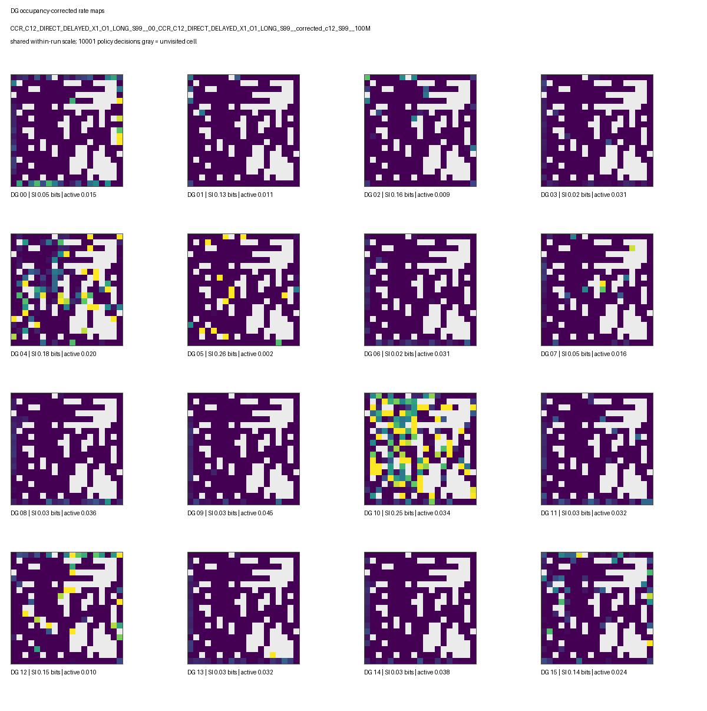
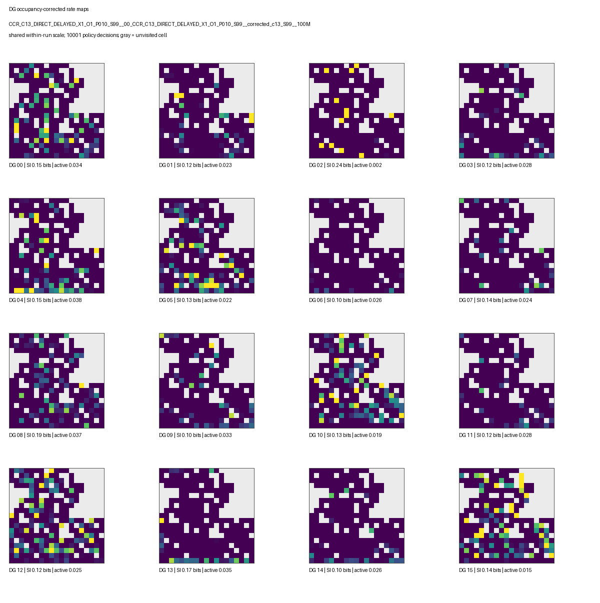
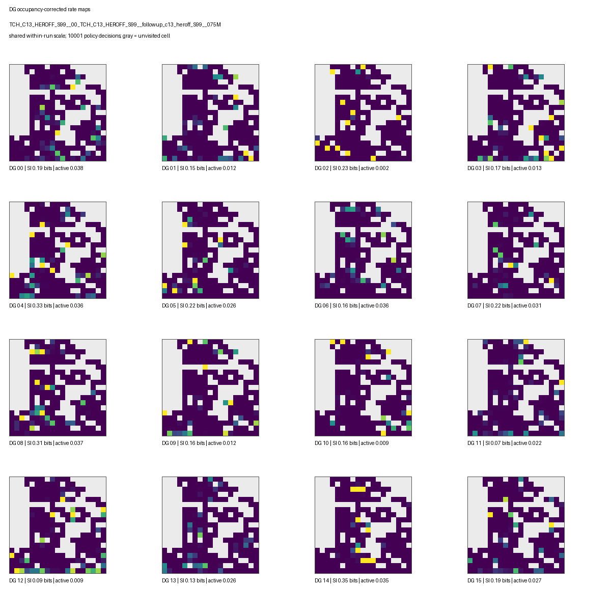
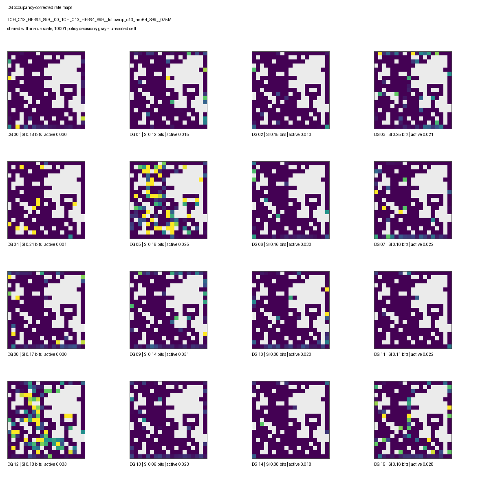
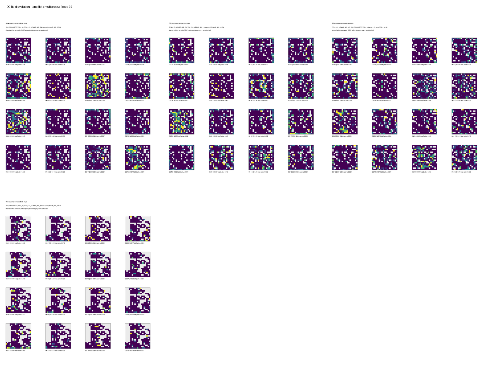
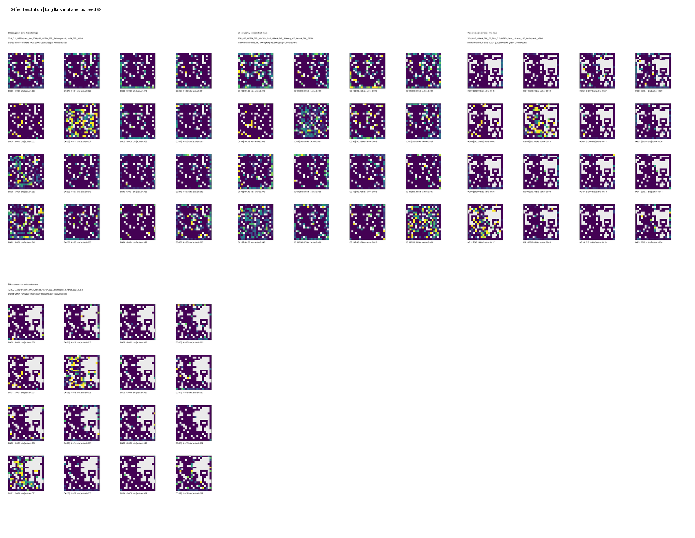
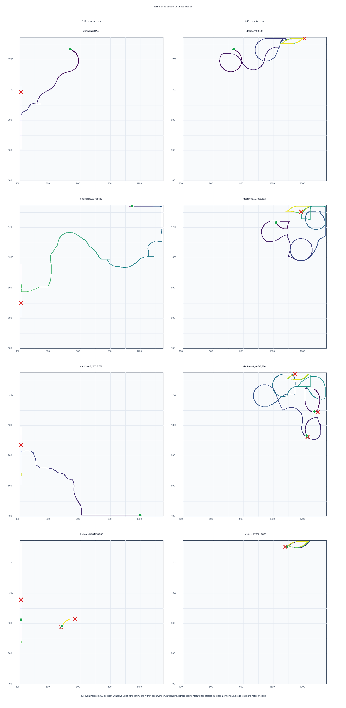
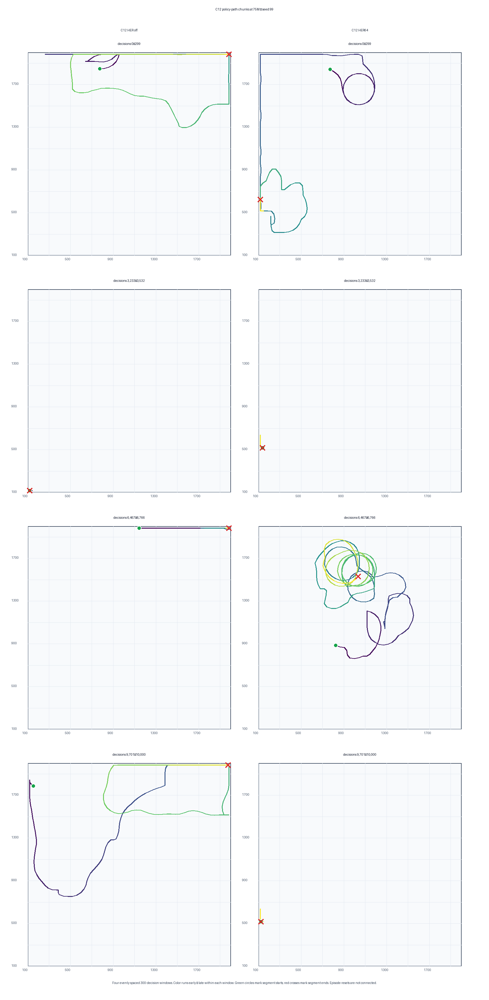
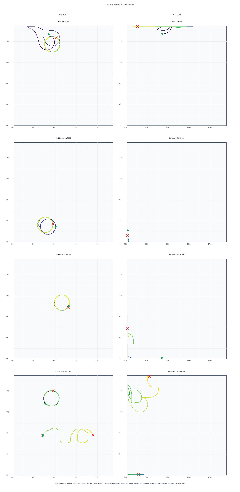

# Target-Control HER: Provisional Place-Field Telemetry

**Status:** corrected-core C12/C13 terminal telemetry is complete; the HER
follow-up is a seed-99 trajectory through 75M frames only. This is a DG
representation-health readout, not a decision on whether to retain HER.

**Telemetry root:**
`/work/classic/fr_xl1014-train/IntrMotiv/SF_hipposlam/train_dir/analysis/target_control_her_20260902_place_fields/`

## What was evaluated

Each artifact is a stochastic 10,000-decision DMLab rollout on the same 19 x
19 spatial grid. The evaluator records thresholded DG activity and continuous
pre-threshold logits, then measures activity, spatial information, active-only
map cosine, and peak diversity.

| Set | Conditions | Checkpoints | Replication | Status |
| --- | --- | --- | --- | --- |
| Corrected core | C12, C13 | seed 99: 5, 25, 50, 75, 100M; seeds 8/123: terminal | 3 terminal seeds | Complete |
| HER follow-up | C12 HER-off/HER64; C13 HER-off/HER64 | seed 99: 5, 25, 50, 75M | 1 seed | Provisional |

No rollout failed. The safe checkpoint loader in `place_fields.py` was updated
for the PyTorch 2.6 NumPy-metadata restriction; the focused evaluator test
passes, and the Slurm preflight and all 30 production rollouts exited cleanly.

## Representative maps and trajectories

Each panel is one DG unit. Gray cells were not visited during the 10k-decision
probe; brighter colors indicate greater occupancy-corrected thresholded DG
activity.

### Corrected-core terminal maps, seed 99

### C13 HER comparison at 75M, seed 99

The field-evolution sheets place the seed-99 checkpoint maps in temporal order.
The corrected-core sheets contain 5/25/50/75/100M; the follow-up sheets contain
5/25/50/75M.

### Short physical policy-path chunks

These figures avoid overplotting the entire 10k rollout. Each row shows one
300-decision window, with four windows evenly spaced across the rollout. Color
runs from early to late within the window. Green circles and red crosses mark
continuous-segment starts and ends; episode resets and position jumps above
150 units are not connected.

Qualitatively, these sampled windows contain frequent wall following,
repetitive circles, and occasionally almost no displacement. C13 and HER64 do
not remove those patterns consistently. This supports a locomotion/control
pathology, but four windows from one stochastic seed are diagnostic examples,
not a frequency estimate.

## Corrected-core terminal result

Mean ± sample SD over terminal seeds 8, 99, and 123. Lower map cosine means
less redundant DG maps; higher peak entropy and more unique peak bins mean
more spatially distributed peak locations.

| Metric | C12 | C13 | Provisional reading |
| --- | ---: | ---: | --- |
| Active / silent DG units | 16 / 0 | 16 / 0 | Neither condition is collapsing or silent. |
| Mean spatial information (bits) | 0.103 ± 0.017 | **0.151 ± 0.018** | C13 has more spatially informative DG activity. |
| Mean active fraction | 0.0264 ± 0.0019 | 0.0235 ± 0.0027 | Both are sparse; C13 is slightly sparser. |
| Active-only map cosine | 0.128 ± 0.028 | **0.076 ± 0.003** | C13 has less redundant thresholded maps. |
| Unique active peak bins | **15.0 ± 0.0** | 14.7 ± 0.6 | Both have broadly distributed peaks. |
| Active peak entropy | **0.969 ± 0.000** | 0.958 ± 0.018 | Both are high. |
| Pre-threshold map cosine | 0.027 ± 0.021 | **−0.005 ± 0.018** | Continuous logits corroborate C13's lower redundancy. |
| Visited grid cells | 277 ± 24 | 251 ± 8 | Rollout occupancy differs, so this is not a fixed-trajectory comparison. |

The seed-99 map-to-terminal stability trend also favors C12: its mean shared-
occupancy map correlation rises from 0.233 at 6M to 0.618 at 74M, versus
0.085 to 0.399 for C13. This does **not** make C12 the better representation
overall: C13's terminal maps are less redundant and have higher spatial
information. It means that C12's seed-99 maps settle closer to its own final
maps earlier in training.

## HER follow-up at 75M: seed 99 only

This is the most recent common checkpoint for all four follow-up conditions.
It is a paired within-seed snapshot, not a replicated HER effect.

| Backbone | HER | SI (bits) | Active cosine | Unique peaks / entropy | Pre-threshold cosine | Visited cells |
| --- | --- | ---: | ---: | ---: | ---: | ---: |
| C12 | off | 0.119 | **0.096** | **15 / 0.969** | **0.019** | 252 |
| C12 | HER64 | **0.137** | 0.134 | 13 / 0.875 | 0.059 | **282** |
| C13 | off | **0.196** | **0.033** | **16 / 1.000** | **−0.031** | 212 |
| C13 | HER64 | 0.149 | 0.079 | 15 / 0.969 | −0.009 | **235** |

Within C12, HER64 raises spatial information (+0.018 bits) and the probe's
visited-cell count, but it makes maps more similar and reduces peak spread.
Within C13, HER64 increases the probe's visited cells but lowers spatial
information by 0.047 bits and again makes maps more similar. The
pre-threshold metrics move in the same direction as the thresholded metrics,
so this is not merely a thresholding artifact.

The seed-99 trajectory offers no consistent HER representation benefit:

| Comparison | 5M → 75M spatial-information pattern | 75M diversity reading |
| --- | --- | --- |
| C12 HER64 vs off | HER starts lower, overtakes by 25M, and ends higher (0.137 vs 0.119). | HER64 is more redundant and has fewer peak bins. |
| C13 HER64 vs off | HER is similar early, then ends lower (0.149 vs 0.196). | HER64 is more redundant and has fewer peak bins. |

## Interpretation

1. **The current target-control problem is not explained by DG silence.** All
   16 units are active in every terminal corrected-core run and every 75M HER
   snapshot. Peak allocation is broad rather than collapsed.
2. **C13 has the healthier terminal DG representation by information and
   redundancy, while C12 stabilizes sooner in the seed-99 trajectory.** This
   is compatible with the earlier behavioral diagnosis: target-conditioned
   worker control can remain weak even when the landmark representation is
   non-collapsed and spatially differentiated.
3. **There is no provisional DG-representation case for HER64.** At 75M it
   does not improve map diversity in either backbone; C13 also loses spatial
   information. This is not a reason to stop the behavioral HER experiment,
   because HER was introduced to improve target-conditioned control rather
   than place fields.
4. **Do not compare C12 and C13 to estimate HER.** The valid HER contrast is
   on versus off within each backbone and seed. The final decision remains the
   specified target-control terminal analysis, not these DG metrics.

The thresholded and continuous-logit maps were visually inspected. They show
sparse, distributed, occupancy-dependent response structure rather than an
all-silent or single-unit collapse. They are not, by themselves, proof of
compact canonical place fields or intentional target reaching.

## Next telemetry step

When the HER jobs have genuine 100M checkpoints, evaluate seed 99 at 100M and
terminal checkpoints for seeds 8 and 123 (12 rows total), rerun the terminal
three-seed aggregation, and update this report. Pair that result with the
pre-registered behavioral metrics: target-hit lift, action sensitivity,
target-only option success, and C13 coverage guards.

## Artifacts

- Corrected-core derived metrics:
  `corrected_core/summary/derived_place_field_metrics.csv`
- Corrected-core terminal aggregate:
  `corrected_core/summary/terminal_three_seed_aggregate.csv`
- Corrected-core trajectories and stability:
  `corrected_core/trajectories/` and `corrected_core/stability/`
- HER seed-99 trajectory metrics and sheets:
  `followup/summary/derived_place_field_metrics.csv` and
  `followup/trajectories/`

Method and interpretation contract:
[[../04_implementation/reusable_place_field_telemetry|Reusable DG Place-Field Telemetry]].
