# Thresholded Rotation Toy Experiment

Date: 2026-06-09

## Table Of Contents

- [[#Question|Question]]
- [[#Mechanism|Mechanism]]
- [[#Latent Distribution|Latent Distribution]]
- [[#Experiment Settings|Experiment Settings]]
- [[#Results|Results]]
  - [[#Latent Families|Latent Families]]
  - [[#Temporal Density|Temporal Density]]
  - [[#Population Activity And Silent Bins|Population Activity And Silent Bins]]
  - [[#Alignment To Latent Variables|Alignment To Latent Variables]]
  - [[#Weight Alignment To Latent Directions|Weight Alignment To Latent Directions]]
  - [[#Sparsity Beyond Nonzero Density|Sparsity Beyond Nonzero Density]]
- [[#Interpretation|Interpretation]]
- [[#Current Conclusion|Current Conclusion]]
- [[#Reproduction|Reproduction]]

## Question

This toy experiment tests a narrow mechanism from the DG projection: fixed-norm linear features, batch normalization, thresholding, and local row rotations.

The current question is:

> Does punishing rotation make learned DG features denser across time than encouraging rotation?

This version intentionally excludes reconstruction, CA3 sequence dynamics, policy learning, and temporal-distance labels.

## Mechanism

Each input is generated from latent causes and then normalized:

$$
x_t = \frac{\sum_c s_c(t) v_c + \epsilon_t}{\left\|\sum_c s_c(t) v_c + \epsilon_t\right\|_2}
$$

The DG-like projection uses fixed-norm rows:

$$
\|w_i\|_2 = 1
$$

The pre-threshold activity is:

$$
y_i(t) = w_i^\top x_t
$$

Batch normalization is applied independently per DG channel over the minibatch:

$$
z_i(t) = \frac{y_i(t) - \mu_i}{\sigma_i + \epsilon}
$$

The thresholded DG activation is:

$$
h_i(t) = \max(0, z_i(t) - \theta)
$$

Only active units rotate. The tangent component of the input relative to row \(w_i\) is:

$$
\Delta_i(t) = h_i(t)\left(x_t - (w_i^\top x_t)w_i\right)
$$

The two learning conditions differ only by sign:

$$
w_i \leftarrow \operatorname{norm}(w_i + \eta \Delta_i) \quad \text{encourage}
$$

$$
w_i \leftarrow \operatorname{norm}(w_i - \eta \Delta_i) \quad \text{punish}
$$

There is also a no-learning control.

## Latent Distribution

The first version used Bernoulli latent causes. The current report focuses on a generalized-Gaussian family so sparsity can be controlled parametrically.

For each latent cause:

$$
g_c(t) \sim \operatorname{GG}(\beta)
$$

with density proportional to:

$$
p(g) \propto \exp(-|g|^\beta)
$$

The sampled latent value is:

$$
s_c(t) = p_c(t)|g_c(t)|
$$

where \(p_c(t)\) is a time-varying scale envelope. Lower \(\beta\) gives a sharper peak near zero and heavier tails; \(\beta=1\) is Laplace-like; \(\beta=2\) is Gaussian-like.

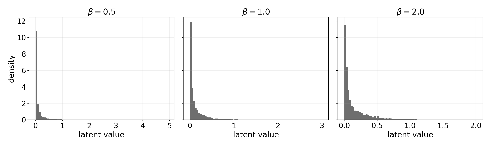

For \(\beta=0.5\), the latent schedules and sampled latent values look like:

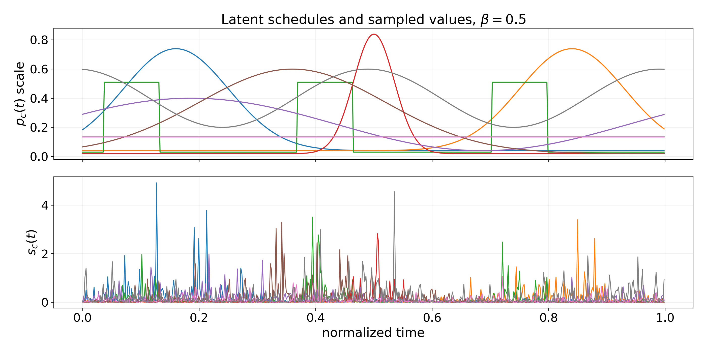

## Experiment Settings

The compact sweeps used:

- latent causes: \(8\)
- observation dimension: \(24\)
- DG units: \(8\)
- seeds: \(10\)
- epochs: \(60\)
- thresholds: \(\theta \in \{0.5, 1.0, 1.5, 2.0, 2.43\}\)
- scheduled generalized-Gaussian shapes: \(\beta \in \{0.5, 1.0, 2.0\}\)
- i.i.d. generalized-Gaussian shapes: \(\beta \in \{0.5, 1.0, 2.0, 4.0, 8.0, 16.0\}\)

The main metric is mean unit temporal density:

$$
D = \frac{1}{N}\sum_i \frac{1}{T}\sum_t \mathbf{1}[h_i(t) > 0]
$$

This asks how much of time each DG unit is active.

The report also tracks Hoyer sparsity of the activation time series:

$$
S_{\operatorname{Hoyer}}(a) =
\frac{\sqrt{T} - \|a\|_1 / \|a\|_2}{\sqrt{T} - 1}
$$

where \(S_{\operatorname{Hoyer}}=0\) means dense/even activity and \(S_{\operatorname{Hoyer}}=1\) means maximally sparse activity.

Finally, lifetime kurtosis is measured as:

$$
\kappa(a) = \frac{\mathbb{E}[(a-\bar{a})^4]}{\mathbb{E}[(a-\bar{a})^2]^2}
$$

This captures heavy-tailed activity even when the nonzero fraction is similar.

## Results

### Latent Families

The scheduled generalized-Gaussian family keeps explicit time-varying scale envelopes:

$$
s_c(t) = p_c(t)|g_c(t)|
$$


The i.i.d. family removes the designed temporal envelopes:

$$
s_c(t) = |g_c(t)|,\quad g_c(t) \sim \operatorname{GG}(\beta)
$$

The full i.i.d. sweep concatenates sparse/heavy-tailed and dense/light-tailed regimes in one comparison:

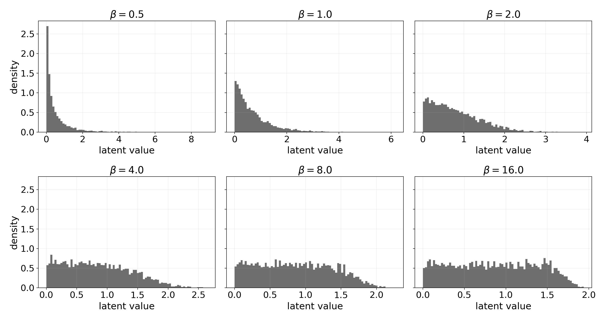

For \(\beta=0.5\), the i.i.d. latent values have no designed temporal fields:

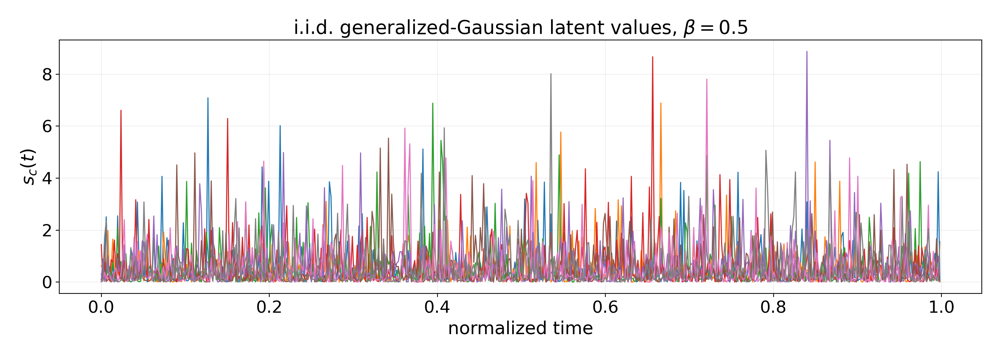

### Temporal Density

The scheduled setting shows the cleanest result: punishment is less temporally dense than encouragement across \(\beta \in \{0.5,1.0,2.0\}\).

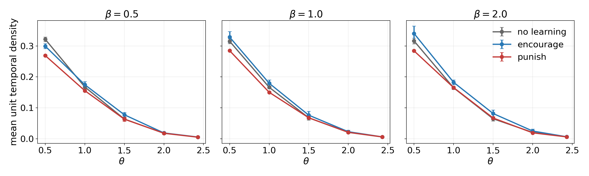

The i.i.d. all-\(\beta\) sweep shows the important qualification. Punishment is less dense at low thresholds and for sparse/heavy-tailed latents. For dense/light-tailed latents with large \(\beta\), punishment can become slightly denser at higher thresholds.

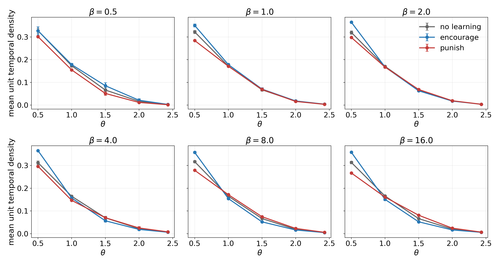

### Population Activity And Silent Bins

Population activity follows the same pattern as unit-wise temporal density.

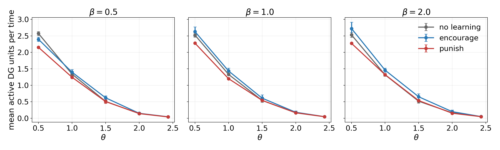

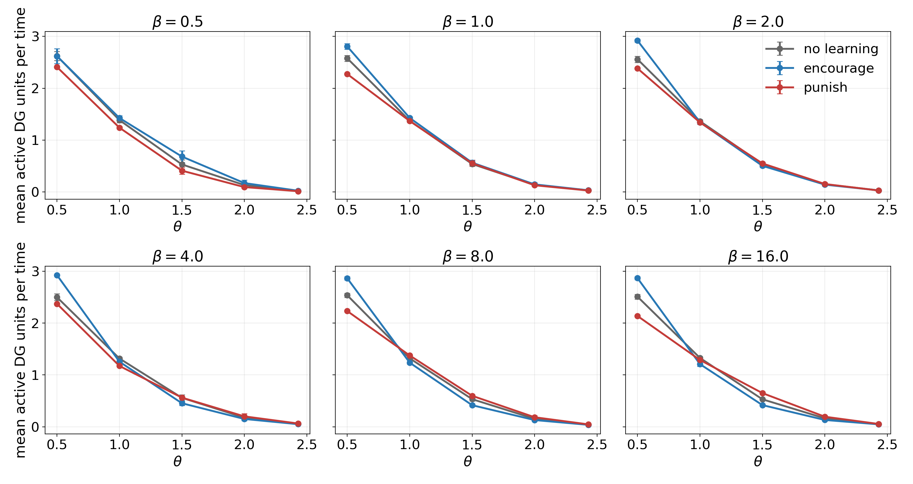

Silent-bin analysis shows why the high-threshold large-\(\beta\) reversal should be interpreted carefully. Punishment often creates many silent time bins even when its mean nonzero density is slightly higher at high thresholds.

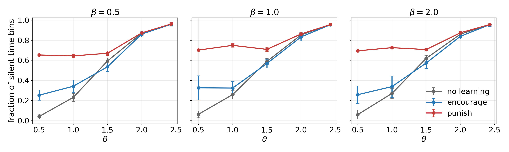

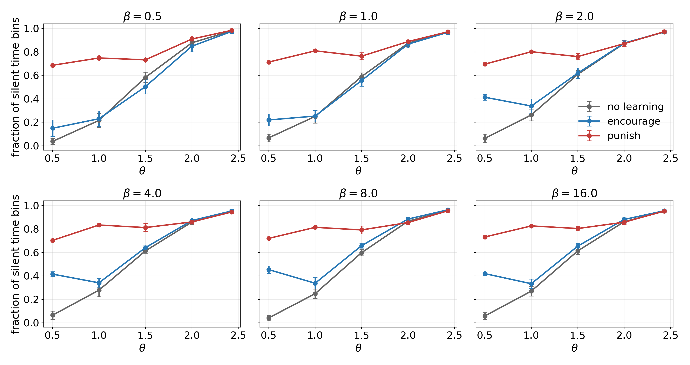

### Alignment To Latent Variables

Activity-based alignment asks whether each learned unit's activity time series correlates with any latent value time series. In the scheduled setting, encouragement aligns more strongly than punishment.

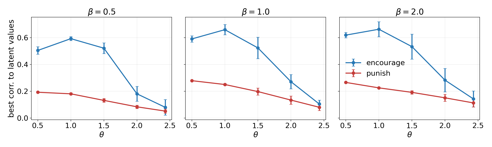

In the i.i.d. setting, this metric is weaker semantically because the latent coordinates have no designed temporal fields. Even so, encouragement usually has higher activity-to-latent correlation, while dense large-\(\beta\) high-threshold cases can narrow or reverse the gap.

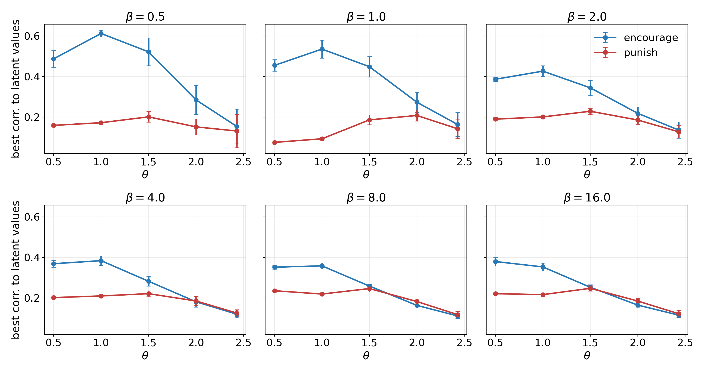

### Weight Alignment To Latent Directions

The direct weight-alignment metric compares learned DG rows to the true latent mixing directions:

$$
A_w = \frac{1}{N}\sum_i \max_c |w_i^\top v_c|
$$

where both \(w_i\) and \(v_c\) are unit vectors.

This is less ambiguous than activity correlation. Across both scheduled and i.i.d. sweeps, encouragement gives stronger weight-to-latent alignment than punishment, including dense large-\(\beta\) regimes where punishment can become slightly denser by nonzero activity.

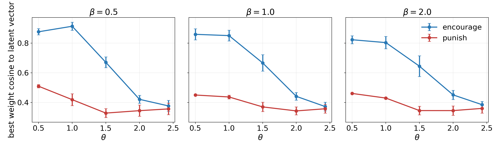

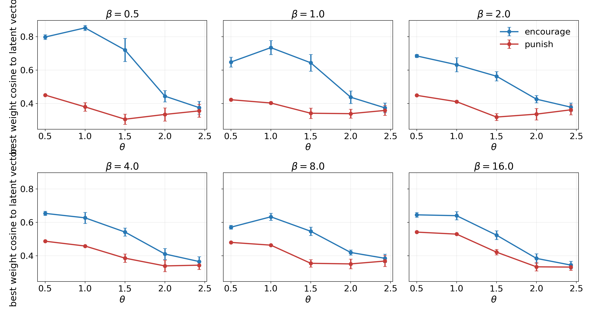

The max-cosine metric only asks whether each row has one strong latent match. To see whether the full alignment matrix is concentrated or diffuse, define:

$$
C_{ic}=|w_i^\top v_c|
$$

Row-normalized entropy measures whether one DG row points mostly to one latent direction or spreads across many:

$$
H_{\operatorname{row}} =
\frac{1}{N}\sum_i
\frac{-\sum_c p_{ic}\log p_{ic}}{\log K},
\quad
p_{ic}=\frac{C_{ic}}{\sum_{c'} C_{ic'}}
$$

Column-normalized entropy measures whether one latent direction is captured by a small number of DG rows or spread across many:

$$
H_{\operatorname{col}} =
\frac{1}{K}\sum_c
\frac{-\sum_i q_{ic}\log q_{ic}}{\log N},
\quad
q_{ic}=\frac{C_{ic}}{\sum_{i'} C_{i'c}}
$$

Lower entropy means more concentrated alignment. Encouragement generally lowers both row and column entropy relative to punishment, especially at lower thresholds. Punishment therefore does not merely align weakly; its weight directions are also more diffusely spread across latent directions and DG rows.

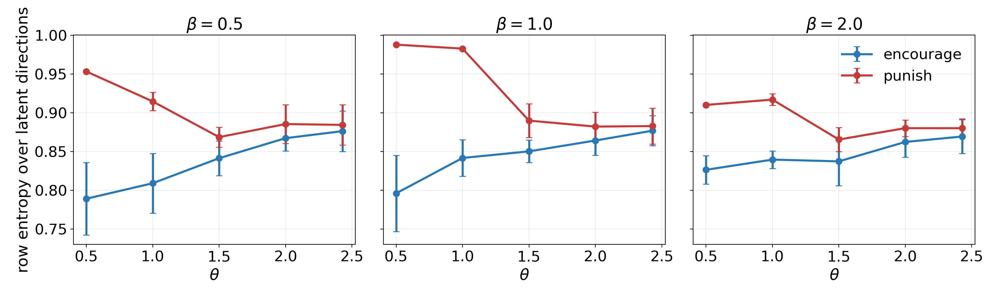

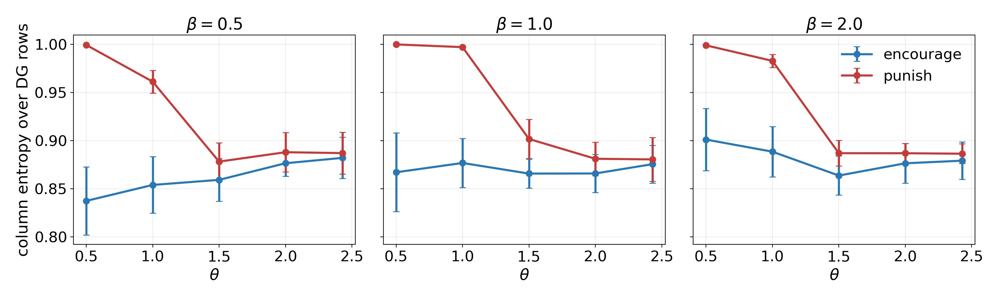

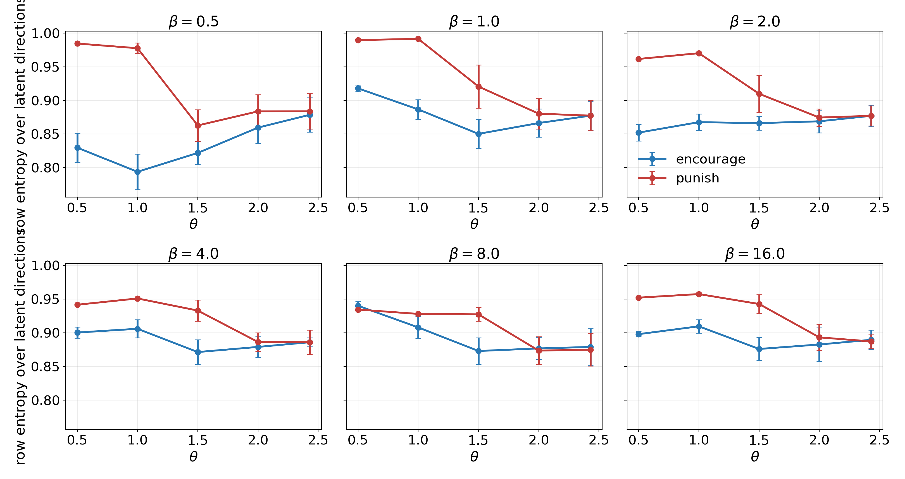

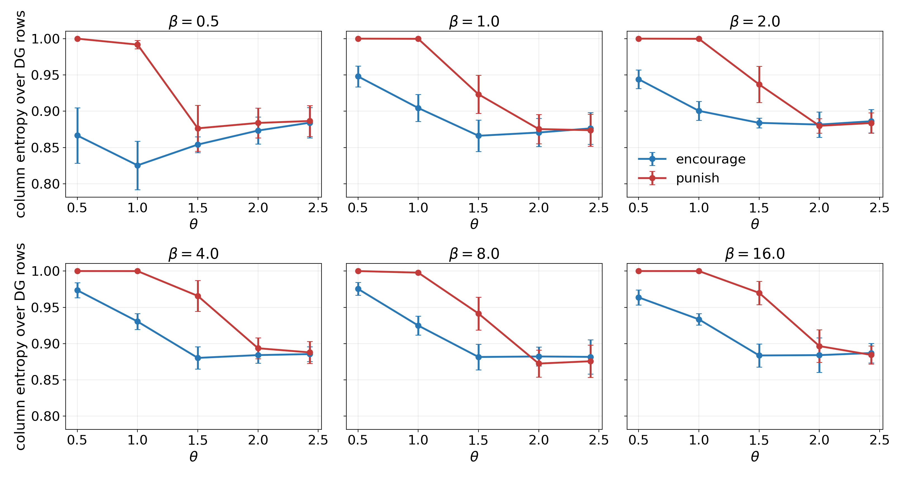

### Sparsity Beyond Nonzero Density

The density metric counts nonzero timepoints. Hoyer sparsity and kurtosis ask whether activation amplitudes are concentrated into rare large events.

In the scheduled setting, punishment generally has higher lifetime sparsity than encouragement at low and intermediate thresholds, consistent with its lower nonzero density.

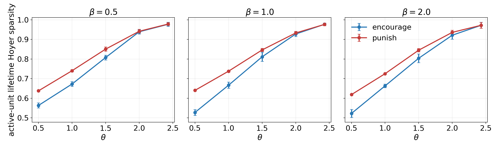

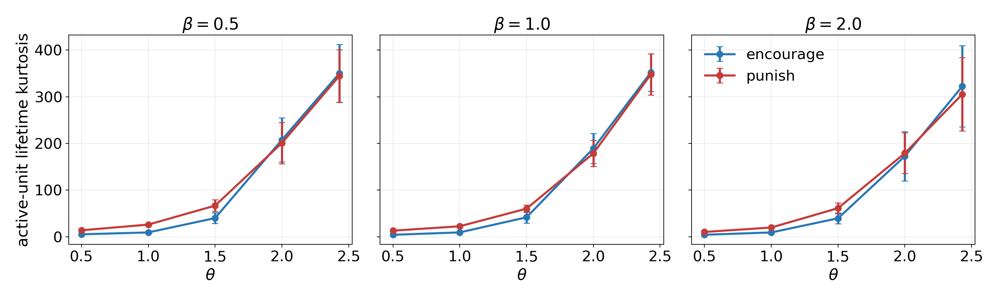

Across the i.i.d. beta sweep, punishment is usually more Hoyer-sparse at low thresholds. At high thresholds in dense large-\(\beta\) regimes, the nonzero-density reversal does not imply a simple loss of sparsity; Hoyer and kurtosis differences are smaller and can reverse. This supports interpreting the reversal as a batchnorm tail-selection effect.

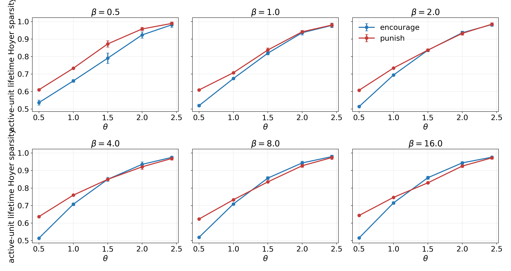

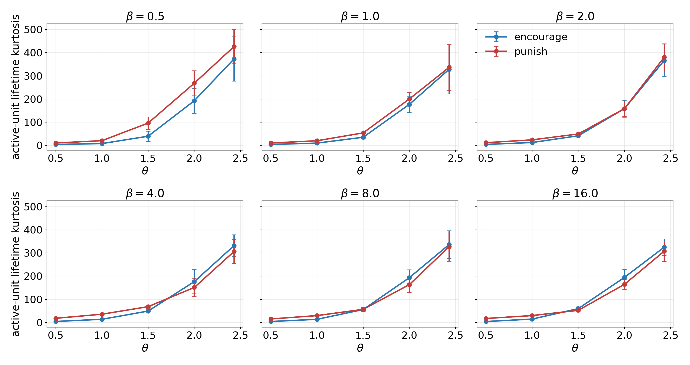

## Interpretation

Under this stripped-down mechanism, punishing rotation behaves like active repulsion:

$$
w_i \leftarrow \operatorname{norm}(w_i - \eta h_i(t)(x_t - y_i(t)w_i))
$$

Since only already-active rows are updated, punishment pushes rows away from the inputs that made them cross threshold. Encouraging rotation does the opposite:

$$
w_i \leftarrow \operatorname{norm}(w_i + \eta h_i(t)(x_t - y_i(t)w_i))
$$

This explains why encouragement tends to improve weight alignment to latent directions. Punishment can still produce high-threshold activity because batchnorm recenters and rescales each row's projection distribution, so upper-tail samples continue to cross threshold even without stable latent alignment.

## Current Conclusion

Punishing rotation alone does not generally make features denser. In scheduled and sparse/heavy-tailed i.i.d. latents, it makes activity less dense and more sparse. In dense/light-tailed i.i.d. latents with high threshold, punishment can leave a slightly denser surviving set of threshold crossings, but this does not coincide with better weight alignment to the ground-truth latent directions.

This does not rule out the original model producing better DG representations under punishment. It suggests that the improvement likely depends on additional ingredients not present here, such as CA3 timing, rollout sampling, delayed labels, extra encoder losses, policy feedback, or the precise interaction between batchnorm statistics and recurrent state masks.

## Reproduction

The experiment script is:

```bash
python3 06_experiments/threshold_rotation_toy.py
```

The generalized-Gaussian sweeps in this report were produced with:

```bash
python3 06_experiments/threshold_rotation_toy.py \
  --latent-mode generalized_gaussian \
  --gg-beta 0.5 \
  --out-dir 06_experiments/results/threshold_rotation_toy_gg_beta_0p5 \
  --n-units 8 \
  --seeds 10 \
  --epochs 60 \
  --theta 0.5,1,1.5,2,2.43 \
  --no-plots
```

and the same command for \(\beta=1.0\) and \(\beta=2.0\).

The i.i.d. generalized-Gaussian variant was produced by replacing:

```bash
--latent-mode generalized_gaussian
```

with:

```bash
--latent-mode iid_generalized_gaussian
```

Report figures were regenerated with:

```bash
python3 06_experiments/plot_threshold_rotation_report.py --font-size 17
```

Aggregate CSVs:

- [beta 0.5](results/threshold_rotation_toy_gg_beta_0p5/aggregate.csv)
- [beta 1.0](results/threshold_rotation_toy_gg_beta_1p0/aggregate.csv)
- [beta 2.0](results/threshold_rotation_toy_gg_beta_2p0/aggregate.csv)

I.I.D. aggregate CSVs:

- [iid beta 0.5](results/threshold_rotation_toy_iid_gg_beta_0p5/aggregate.csv)
- [iid beta 1.0](results/threshold_rotation_toy_iid_gg_beta_1p0/aggregate.csv)
- [iid beta 2.0](results/threshold_rotation_toy_iid_gg_beta_2p0/aggregate.csv)

Dense i.i.d. aggregate CSVs:

- [iid beta 4.0](results/threshold_rotation_toy_iid_gg_beta_4p0/aggregate.csv)
- [iid beta 8.0](results/threshold_rotation_toy_iid_gg_beta_8p0/aggregate.csv)
- [iid beta 16.0](results/threshold_rotation_toy_iid_gg_beta_16p0/aggregate.csv)
